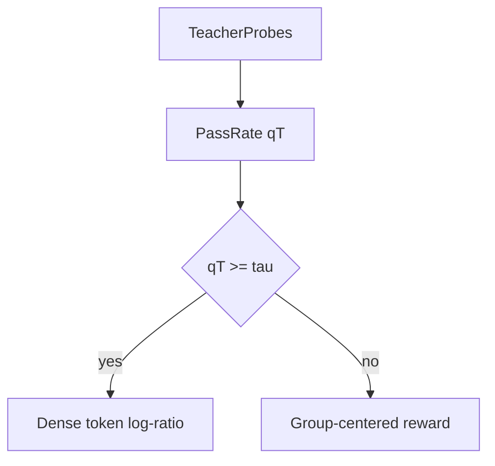

# 正误样例

## 公式

错误（Preview 仍是 LaTeX 源码）：在 `.md` 正文里写 `\begin{equation}...\end{equation}`，或把 `\frac` 放在美元符号外面。

正确：

独立公式上下空行，`$$` 单独成行：

$$
q_T(x)=\frac{1}{K_T}\sum_k r(x,\hat y_k)
$$

行内：学生策略为 $\pi_\theta$，教师为 $\pi_T$。

## 方法图

错误 1：只有 ASCII 树，Preview 出不了图。

错误 2：Mermaid 节点里写 `$q_T$` 或 `\frac`，整图渲染失败。

正确：节点纯文本，公式写在图下。

当 $q_T(x)\ge\tau$ 时走 OPD，否则走 GRPO：

$$
\hat A_t = g(x)\,\hat A^{\mathrm{OPD}}_t + \bigl(1-g(x)\bigr)\,\hat A^{\mathrm{GRPO}}_t.
$$
