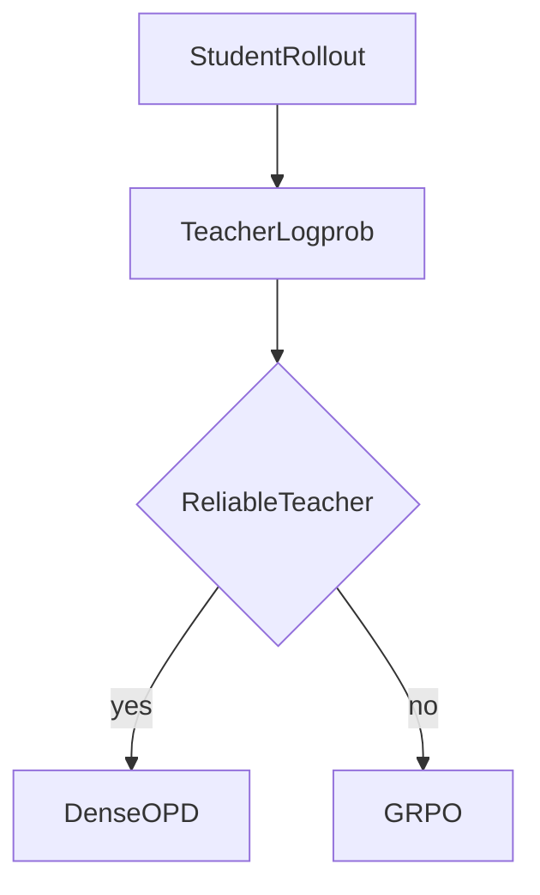
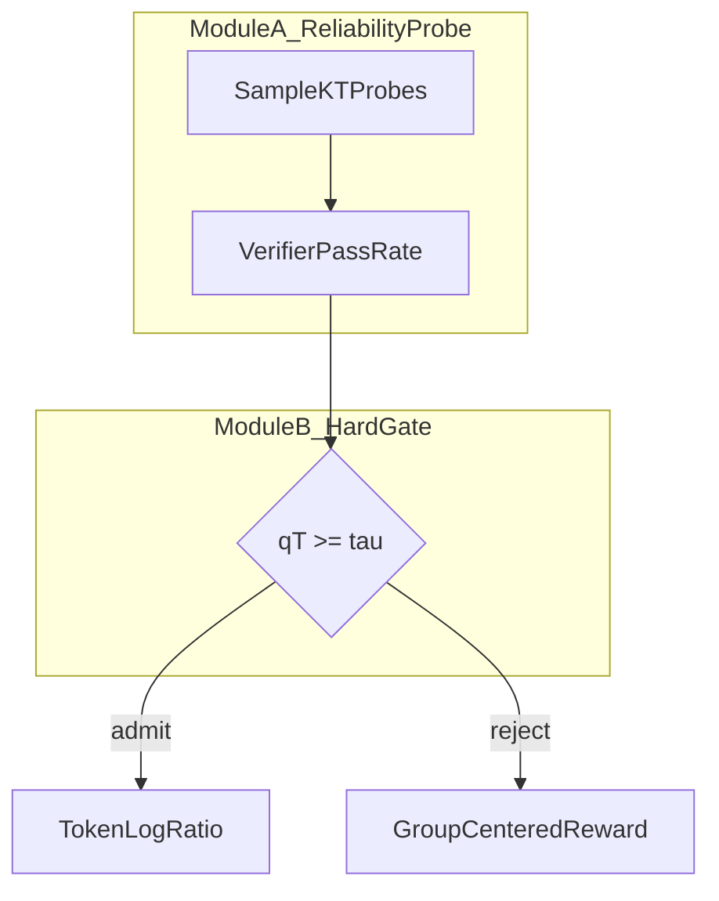

# Markdown Preview：公式与 Mermaid

Cursor 打开 `.md` 的 Preview 走 GitHub 风格 Markdown + KaTeX + Mermaid。
目标：Preview 里看到排版公式和流程图，而不是 `\frac` 源码或 `flowchart TD` 文本。

## 1. 公式

### 只用这两种

行内：

```markdown
学生策略为 $\pi_\theta$，教师为 $\pi_T$。
```

独立成段（`$$` 必须单独成行，上下空行）：

```markdown
反向 KL 目标为

$$
\min_\theta D_{\mathrm{KL}}(\pi_\theta \| \pi_T)
= \mathbb{E}_{x \sim \pi_\theta}\left[\log\frac{\pi_\theta(x)}{\pi_T(x)}\right].
$$
```

多行对齐：仍包在 `$$` 里，用 `aligned`，不要单独 `\begin{align}`：

```markdown
$$
\begin{aligned}
\rho_t &= \frac{\pi_T(y_t \mid h_t)}{\pi_\theta(y_t \mid h_t)}, \\
r_t &= \log(\alpha \rho_t + 1 - \alpha).
\end{aligned}
$$
```

### Preview 会失败的写法（禁止出现在组会 `.md`）

| 禁止 | 原因 |
|---|---|
| `\begin{equation} ... \end{equation}` | 这是 TeX，KaTeX 在 md 里不当环境解析 |
| `\[ ... \]` 或 `\( ... \)` | Cursor Preview 经常当普通文本 |
| 代码块里的公式当「给读者看的公式」 | 代码块不渲染数学 |
| 把 `\frac{a}{b}` 写在美元符号外面 | 显示成源码 |
| HTML `` 公式、Unicode 假分数替代关键推导 | 和论文对不上 |

### 易踩坑

- 行内公式不要用中文标点当美元：写 `$q_T$`，不要 `$q_T。$`。
- 下划线在美元内是下标：`$\pi_\theta$`。在美元外要写成 `π_θ` 或加反斜杠，否则变斜体。
- 表格单元格里可以用 `$R$`，但不要在一个格子里塞超长 `aligned`。
- `|` 在公式里写成 `\|` 或 `\mid`，避免和 Markdown 表格冲突。
- 注释论文编号写在公式后：`（论文 Eq. 4）`，不要 `\tag{4}`（Preview 常忽略）。

## 2. Mermaid（方法图强制）

必须是独立围栏，围栏前空一行：

````markdown

````

### 节点里禁止

- `$...$`、`\frac`、`\\` 换行
- 未加引号的括号、逗号、冒号（用 `["gate: qT >= tau"]` 这种双引号标签）
- 节点 id 叫 `end`、`subgraph`、`graph`
- HTML `<br/>` 可以，但优先短标签；细节写在图下的公式里

公式放在 **图正下方的 `$$` 块**，用文字把节点和符号对应起来。

### 推荐三张图（第 2–3 节）

1. `flowchart TD`：顶层 2–4 个模块，箭头写清数据（rollout / logprob / reward）。
2. `flowchart TD` + `subgraph`：每个模块内部的小步骤（对应「tree 展开」）。
3. `sequenceDiagram`（可选但推荐）：一个训练 step 里 Student / Teacher / Verifier / Loss 的时序。

禁止 PlantUML。ASCII 树可以保留，但不能代替 Mermaid。

### 能稳定渲染的标签风格



希腊字母在节点里写成 `tau`、`piT`、`KL`，不要写 `τ` 和 `π` 也行，但不要写 `$\\tau$`。

## 3. 交付前自检

- [ ] Preview 打开后，正文公式是排版而不是反斜杠源码
- [ ] 至少一块 `mermaid` 在 Preview 里是图，不是代码
- [ ] 方法树能从左到右读出模块输入/输出
- [ ] `python3 scripts/check_briefing_md.py <file.md>` 退出码 0
