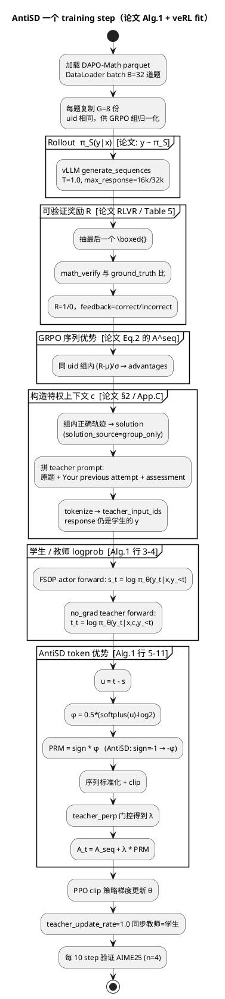
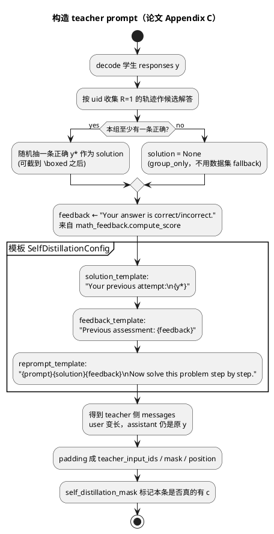
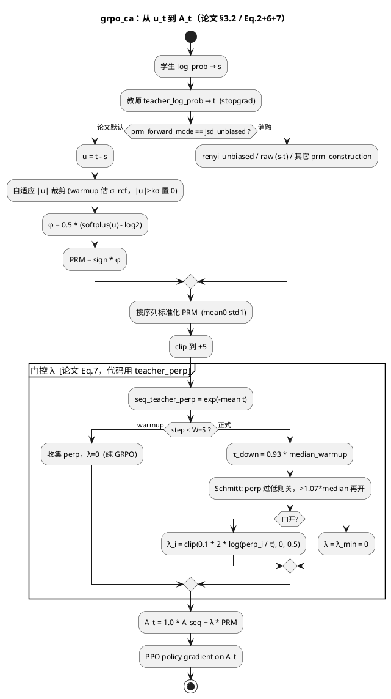
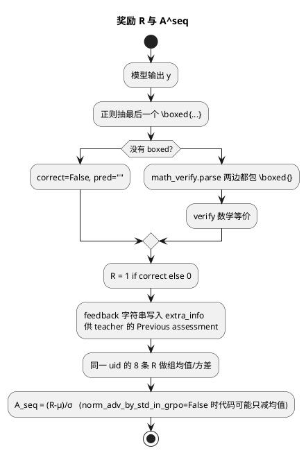
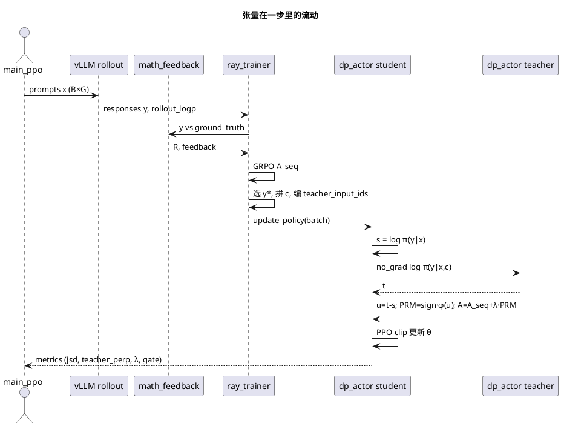

# AntiSD：论文公式 ↔ 代码执行流程

对照来源：arXiv HTML [2605.11609v1](https://arxiv.org/html/2605.11609v1)（工作区 **没有** `text_xx` latex）。  
代码根：`algorithm/AntiSD`。核心改动见 `NOTICE`。

---

## 1. 论文章节 ↔ 文件

| 论文 | 代码落点 |
|---|---|
| §2 GRPO \(A_i^{\mathrm{seq}}=(R_i-\mu_R)/\sigma_R\) | `verl/trainer/config/sdpo.yaml`：`adv_estimator: grpo`；奖励 `verl/utils/reward_score/math_feedback/__init__.py` |
| §2 自蒸馏 \(\pi_T=\pi_\theta(\cdot\mid x,c,y_{<t})\) | `ray_trainer.py` `_maybe_build_self_distillation_batch` 拼 \(c\)；`dp_actor.py` 对 `teacher_input_ids` 再 forward |
| §2 Eq.(2) \(A_{i,t}=A_i^{\mathrm{seq}}+\lambda\delta_t\) | `dp_actor.py` `grpo_ca` Step 5：`A = orm_weight * A_seq + ca_lambda * PRM` |
| §3.1 \(s_t,t_t,u_t=\mathrm{PMI}(y_t;c\mid x,y_{<t})\) | `log_prob` / `teacher_log_prob`；`u_t = teacher_log_prob - log_prob` |
| §3.1 默认 SD \(\delta_t=+u_t\) | `PRM_RENYI_SIGN=+1`（`sd.sh`） |
| §3.2 Eq.(6) \(A^{\mathrm{AntiSD}}=-\varphi(u)\)，\(\varphi=\frac12(\mathrm{softplus}(u)-\log 2)\) | `prm_forward_mode=jsd_unbiased` 且 `prm_renyi_sign=-1` |
| §3.2 Eq.(7) 熵门 + Schmitt | `ca_lambda_mode=teacher_perp` + hysteresis（实现是 **perplexity 代理**，见 §4） |
| Alg.1 一步更新 | `RayPPOTrainer.fit` + `DataParallelPPOActor.update_policy` |
| App.C teacher 模板 | `SelfDistillationConfig.reprompt_template` / `solution_template` / `feedback_template` |
| App.B Table 5 | `recipe/antisd/_launchers/launch_short.sh`（有步数/长度偏差，见 02 文档） |

三种方法只差几个旋钮：

| | GRPO | SD | AntiSD |
|---|---|---|---|
| `loss_mode` | `grpo_ca` | `grpo_ca` | `grpo_ca` |
| `ca_lambda` / 门 | `ca_lambda=0` | 门关（ratio=0） | warmup 后 \(\lambda\in[0,0.5]\) |
| `prm_renyi_sign` | 无用 | `+1.0` | **`-1.0`** |
| `prm_forward_mode` | 无用 | `jsd_unbiased` | `jsd_unbiased` |

---

## 2. 总训练循环（对应 Alg.1 外层 + `fit()`）



入口链：

```text
recipe/antisd/run/*/antisd.sh
  → _launchers/launch_short.sh | launch_long.sh
    → python -m verl.trainer.main_ppo --config-name sdpo ...
      → RayPPOTrainer.fit()          # ray_trainer.py
        → generate / reward / _maybe_build_self_distillation_batch
        → actor.update_policy()      # dp_actor.py  loss_mode=grpo_ca
```

---

## 3. 特权上下文 \(c\) 怎么拼（App.C ↔ `_maybe_build_self_distillation_batch`）

论文：\(c=\) 组内正确解答（若有）否则数据集解答 + 二进制对错反馈。  
脚本：`solution_source=group_only`（组内没有正确解则 **没有** solution，只留 feedback）、`include_environment_feedback=true`、`dont_reprompt_on_self_success=true`。



模板原文在 `verl/workers/config/actor.py`（与论文 App.C 颜色块一致）：

- `Your previous attempt:` + 同伴正确解答（**不是**当前这条 y）
- `Previous assessment:` + **当前** y 的对错
- 再要求 `Now solve this problem step by step.`
- 教师只 **重算** 学生原回复 \(y\) 的 token logprob，不重新生成

这是 \(u_t=\log\frac{\pi(y_t\mid x,c,y_{<t})}{\pi(y_t\mid x,y_{<t})}\) 能写成 PMI 的前提：同一 \(y\)，只改条件里的 \(c\)。

---

## 4. Token 信号：从 PMI 到 JSD 反号

### 4.1 公式

论文：

\[
s_t=\log\pi_S(y_t\mid x,y_{<t}),\quad
t_t=\log\pi_T(y_t\mid x,c,y_{<t}),\quad
u_t=t_t-s_t=\mathrm{PMI}(y_t;c\mid x,y_{<t})
\]

默认 SD（下降 KL）：\(\delta_t=+u_t\)（奖励捷径词、惩罚 Wait/Let/Maybe）。

AntiSD（上升 JSD）：

\[
\varphi(u)=\tfrac12\bigl(\mathrm{softplus}(u)-\log 2\bigr),\qquad
A_t^{\mathrm{AntiSD}}=-\varphi(u_t)
\]

\(\varphi(u)\ge -\frac12\log 2\)，审议侧优势被封顶在 \(\frac12\log 2\)。

### 4.2 代码（`dp_actor.py` `jsd_unbiased`）

```text
u_t        = (teacher_log_prob - log_prob) * response_mask
jsd_raw    = softplus(clamp(u, ±log_clip)) - log(2)
PRM_t      = 0.5 * prm_jsd_sign * jsd_raw * mask
```

即 `PRM_t = prm_jsd_sign * φ(u)`。

- `prm_renyi_sign = -1` → `PRM = -φ(u)` = 论文 \(A^{\mathrm{AntiSD}}\)
- `prm_renyi_sign = +1` → `PRM = +φ(u)`，与下降 JSD / 默认 SD 同号

注释写明：`jsd_unbiased` **忽略** `prm_construction`，\(u=t-s\) 写死。要翻方向只能改 sign。



合成方式 `ca_mode=additive` 对应论文「we adopt the additive form」。消融里 multiplicative 会掉点（Table 3）。

---

## 5. 门控：论文熵 vs 代码困惑度（实现差距）

论文 Eq.(7) / Alg.1 行 8–10：

- \(H=\) 教师 **逐 token 熵** 的 batch 中位数
- \(H<\tau_{\mathrm{down}}=0.93 H_{\mathrm{warm}}\) → 关门，\(\lambda=0\)
- \(H\ge H_{\mathrm{warm}}\) → 开门，\(\lambda=\lambda_{\max}\)
- 中间保持

代码默认 **不是** `entropy_gate_mode`（那条路径存在但 launcher 没用），而是：

- `ca_lambda_mode=teacher_perp`
- \(H\) 的代理：\(\mathrm{perp}=\exp(-\overline{t_t})\)（序列平均 NLL 的指数）
- 开门后 \(\lambda\) **连续**：`ca_lambda * alpha * log(perp/target)`，再 clip 到 \([0,0.5]\)
- 关门：整批 \(\lambda=\lambda_{\min}=0\)
- 再激活阈值：`1.07 * warmup_median`（论文写回到 \(H_{\mathrm{warm}}\)）

| | 论文 | 代码（canonical launcher） |
|---|---|---|
| 质量指标 | token entropy \(H[\pi_T]\) | teacher perplexity |
| \(\lambda\) | 二值 \(\{0,\lambda_{\max}\}\) | 连续，再加硬门 |
| \(\tau_{\mathrm{down}}\) | \(0.93 H_{\mathrm{warm}}\) | `0.93 * median_perp` |
| 再开 | \(H_{\mathrm{warm}}\) | `1.07 * median_perp` |
| warmup | 5 step，\(\lambda=0\) | 相同；Olmo-Think=10 |

方向一致（教师变「过自信 / 熵崩」就关掉反蒸馏），数值不是逐符号翻译。若要更贴 Alg.1，需改用 `entropy_gate_mode=hysteresis` 并关掉连续 \(\lambda\)——仓库当消融留着，主脚本没用。

---

## 6. 奖励与 GRPO（论文 §2）



`math_feedback.compute_score` 与论文「binary correctness feedback」一致。截断时不把「truncated」写进 feedback，避免长度正反馈（代码注释写明）。

---

## 7. 逐步数据流（一张图看完）



---

## 8. 论文实验设置 ↔ 启动脚本旋钮

| 论文 | Hydra / env |
|---|---|
| AntiSD | `PRM_RENYI_SIGN=-1`，`PRM_FORWARD_MODE=jsd_unbiased` |
| 默认 SD | `PRM_RENYI_SIGN=+1`，`TP_TARGET_RATIO=0`（关门控） |
| GRPO | `ccir.ca_lambda=0` |
| \(\lambda_{\max}=0.5\) | `LAMBDA_MAX=0.5`，`ca_lambda=0.1`，`perp_alpha=2.0`（乘起来再 clip） |
| additive | `CA_MODE=additive` |
| 教师=自己 | `teacher_update_rate=1.0` |
| \(c=\) 组内解+反馈 | `solution_source=group_only`，`include_environment_feedback=true` |
| 不把 GT 泄漏进反馈 | `provide_ground_truth_in_feedback=false` |
| 长度 mask | Qwen/Olmo-IT：`LEN_MASK=12000` |
| 硬件 8×H20 | `N_GPUS_PER_NODE` 自动 `nvidia-smi` |

---

## 9. 和论文不完全对齐、但读代码必须知道的点

1. **步数**：论文 200；脚本 `total_epochs=1` ≈ 531。加 `trainer.total_training_steps=200`。  
2. **训练长度**：论文 32K；short launcher 16k response。  
3. **门控变量**：熵 vs 困惑度；二值 \(\lambda\) vs 连续 \(\lambda\)。  
4. **PRM 标准化**：论文 Alg.1 用原始 \(-\varphi(u)\)；代码先 per-sequence 标准化再注入。尺度被 \(\lambda\) 吸收，符号仍对。  
5. **Qwen3-30B-A3B / 代码 RL / avg@32**：论文有，recipe 不全。  
6. **`entropy_gate_mode`、`renyi_unbiased`、CCIR cross-problem**：实现里有，canonical AntiSD **关掉**（`ccir.enabled=False`，`si_mode=none`）。  
7. 包名仍是 `verl`，实验目录仍叫 `sdpo_ent_ckpt`，W&B project 默认 `SDPO`。

---

## 10. 读代码的最短路径

1. `recipe/antisd/run/qwen3-8b/antisd.sh` — 只设模型。  
2. `_launchers/launch_short.sh` 里搜 `grpo_ca`、`jsd_unbiased`、`prm_renyi_sign`。  
3. `ray_trainer.py`：`_maybe_build_self_distillation_batch`、`fit()` 里 `self_distillation` 那一段。  
4. `dp_actor.py`：`elif prm_forward_mode == "jsd_unbiased"` 和 `elif ca_lambda_mode == "teacher_perp"`。  
5. `math_feedback/__init__.py` — 和 App.C 的 assessment 字符串对上。

读完这五处，就等于走完 Algorithm 1。
