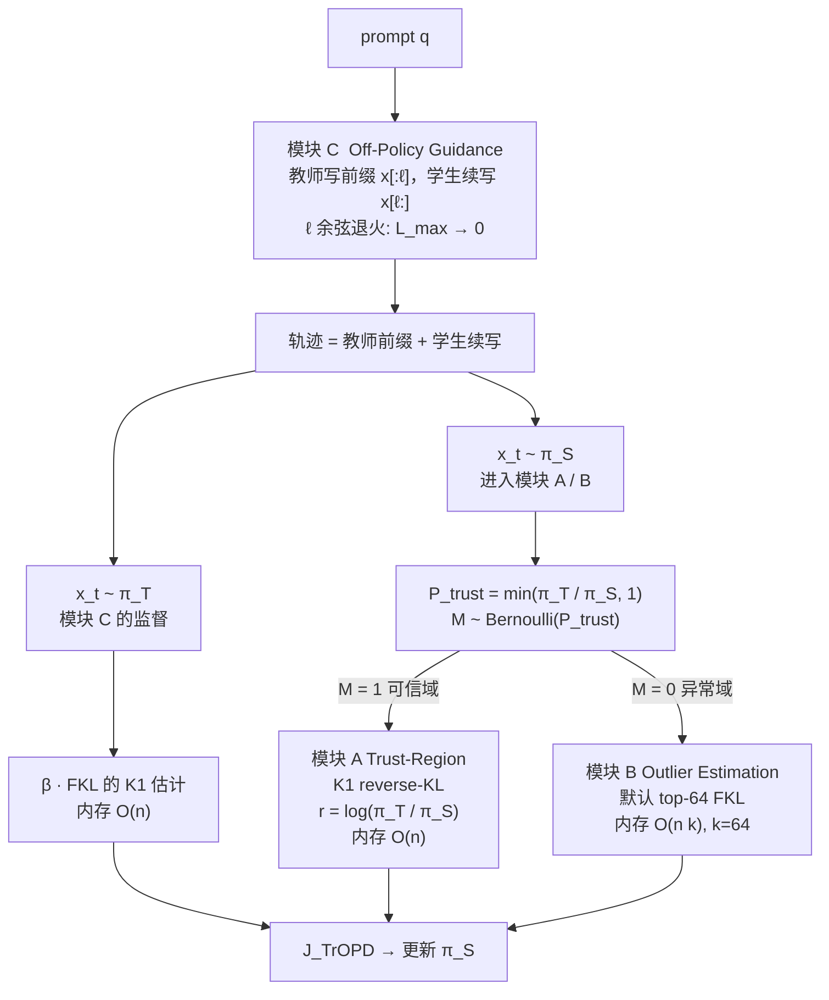

# 组会汇报：Trust Region On-Policy Distillation (TrOPD)

论文：Xing, Wang, Gao, Li, Tang. *Trust Region On-Policy Distillation*. arXiv:2606.01249v3, 2026-06-17.
投稿样式：COLM 2026；单位：Samsung Research Beijing / Oxford / Peking University
代码：[github.com/Xingrun-Xing2/TrOPD](https://github.com/Xingrun-Xing2/TrOPD)（veRL fork；HuggingFace 权重尚未发布）
汇报定位：博士后组会精讲（问题 → 树状方法 → 带公式的走查 → 实验 → 复现清单）
文中 **【注解】** 是组会追问的展开（$K_1$ / FKL / SoG / 内存复杂度 / 余弦退火 / 消融缺口 / 纯 OPD vs RLVR+OPD），不影响正文叙事。

---

# 1. 任务、问题、动机、现有方法局限，以及一个例子

## 1.1 这篇 paper 在做什么

这不是一篇新网络结构论文，也不是新的 RL 算法家族。它做的是 **长思维链推理模型的 On-Policy Distillation（OPD）后训练**：把强教师的推理能力，蒸馏进小学生模型。

- 输入：一道题的 prompt $q$（数学 / 代码 / 科学）。
- 学生 $\pi_S$ 自己采样一条长 CoT 轨迹 $x\sim\pi_S(\cdot\mid q)$。
- 教师 $\pi_T$ 不给最终对错，而是给 **token 级密度比** $\log\pi_T(x_t\mid q,x_{<t})/\pi_S(x_t\mid q,x_{<t})$ 作为监督。
- 目标：稳定地把 4B–7B 级推理教师压进 1.5B–1.7B 学生，并在 AIME / AMC / LiveCodeBench / GPQA / IFBench 上超过现有 OPD。

一句话任务：**在师生分布差很大、又不能算全词表 KL 的长推理设定下，把“教师对学生自己采的 token 的监督”做成可靠的 credit assignment。**

作者把方法命名为 **TrOPD（Trust Region On-Policy Distillation）**。

**【注解 · credit assignment 是什么】**

Credit assignment（功劳 / 责任归属）是 RL 的老问题：一条轨迹后面才得到反馈，中间那么多动作，**该强化谁、该惩罚谁**。经典 RLVR 更极端——整道题只给一个 0/1，几千 token 共享一个标量。OPD 把反馈做成 **每个 token 一个密度比**，等于用教师当稠密的过程监督，所以本文说的 credit assignment 不是另训一个 PRM，而是：

> 学生采到的这个 $x_t$，教师到底该给它多少“分”，以及这个分能不能信。

TrOPD 的三块（可信域 RKL / 异常域 FKL / 教师前缀）都是在改 **token 级分数怎么算**，不是在改网络结构。

## 1.2 要解决的问题（真正的 scientific question）

大推理模型（LRM）靠加长 test-time reasoning 涨点，但推理贵，所以需要小推理模型（SRM）。两条经典蒸馏路线：

1. **Off-policy / Sequence-level KD（Teacher of Generations, ToG）**：学生模仿教师写好的答案。训练分布是教师轨迹，推理分布是学生轨迹 → **exposure bias**，长 CoT 上尤其严重。
2. **On-policy KD（Student of Generations, SoG）**：学生自己采样，教师在这些状态上给密度监督。训练和推理同分布，exposure bias 小。

**【注解 · SoG / ToG】**

- **SoG = Student of Generations**：训练用的轨迹由 **学生策略 $\pi_S$ 自己生成**。这就是 on-policy distillation。
- **ToG = Teacher of Generations**：训练用的轨迹由 **教师 $\pi_T$ 生成**，学生做模仿（普通 SeqKD / SFT on teacher traces）。这是 off-policy distillation。

“低质量 SoG”不是一个新模型名，就是：**学生自己采样出来的回复质量差**。OPD 只在这些差轨迹上更新，教师即使会做，也没有机会在自己的高密度轨迹上教——优化空间被学生当前能力锁死。模块 C 用教师前缀，就是为了把一部分训练状态从差 SoG 里捞出来。

OPD 的标准目标是 reverse KL（RKL, mode-seeking）：


$$
D_{\mathrm{KL}}(\pi_S\Vert\pi_T)=\mathbb{E}_{x\sim\pi_S}\Big[\log\frac{\pi_S(x)}{\pi_T(x)}\Big].
$$


它的梯度天然是 policy-gradient 形态：学生采自己的轨迹，教师给高概率的序列得到正奖励。GKD / MiniLLM 在短指令模型上可以对 **全词表** 算 KL，优化稳定：


$$
\mathcal{J}^{\mathrm{KD}}=-\sum_{x\in\mathcal{V}}\pi_S\log\frac{\pi_S}{\pi_T},\qquad \text{内存 }\mathcal{O}(n\cdot|\mathcal{V}|).
$$


推理模型把回复拉到数千 token，全词表 KL 存不下。Thinking Machines 的 OPD 博客因此改用 **无偏 $K_1$ 估计**：


$$
\mathcal{J}^{\mathrm{KD}}=-\mathbb{E}_{x\sim\pi_S}\Big[\log\frac{\pi_S}{\pi_T}\Big].
$$


内存降到 $\mathcal{O}(n)$，但换来两个硬问题。这才是论文真正要打的点：

> **当 $\pi_T$ 与 $\pi_S$ mismatch 很大时，$K_1$ 在学生采到的“教师几乎不会说的 token”上，会给出极端错误的 policy gradient；同时学生自己采不到高质量轨迹，优化空间被低质量 SoG 锁死。**

**【注解 · $\mathcal{V}$、$n$、为什么全词表 RKL 稳定、为什么内存是 $\mathcal{O}(n\cdot\lvert\mathcal{V}\rvert)$】**

符号先钉死（论文正文把词表大小写成 $k$，这里按更常见的写法）：

| 符号 | 含义 | 数量级（本文设定） |
|---|---|---|
| $n$ | **序列长度**（一条回复的 token 数，不是数据条数） | 最长 8096 |
| $\mathcal{V}$ | **词表**（tokenizer 的全部 token 集合） | Qwen 系大约 $1.5\times 10^5$ |
| $\lvert\mathcal{V}\rvert$ | 词表大小 | 同上 |
| 位置 $t$ | 前缀 $(q,x_{<t})$ 上的一步条件分布 | 每步都是一张 $\lvert\mathcal{V}\rvert$ 维的 softmax |

**全词表 reverse-KL 在算什么。** 每个位置 $t$，师生各有一个完整分布 $\pi_S(\cdot\mid x_{<t})$、$\pi_T(\cdot\mid x_{<t})$。精确 RKL 是对 **词表里每一个** $v$ 加权求和：

$$
\mathrm{KL}_t(\pi_S\Vert\pi_T)=\sum_{v\in\mathcal{V}}\pi_S(v\mid x_{<t})\log\frac{\pi_S(v\mid x_{<t})}{\pi_T(v\mid x_{<t})}.
$$

GKD / MiniLLM 在短指令上就这么干：每一步把两边的全词表 softmax 都拿出来，算完再反传。梯度流过 **所有** logit，不是只流过“碰巧采到的那一个词”。

**为什么说它稳定。** 三层意思，组会上可以拆开讲：

1. **低方差。** 上式是该位置 KL 的精确值（忽略数值误差），不是“采一个 token 再当蒙特卡洛样本”。不会因为运气差采到教师概率 $10^{-8}$ 的词，就把整步 KL 估成 $-18$。
2. **梯度是完整 softmax 梯度。** 教师想说的那些词、学生多说的那些词，都会进入 $\sum_v$。单个怪词的贡献被 $\pi_S(v)$ 压住：学生自己也很少说的 $v$，即使 $\log(\pi_S/\pi_T)$ 很大，乘上很小的 $\pi_S(v)$ 后通常进不了主导项。
3. **短指令 $n$ 小。** 回复几十到一两百 token 时，$\lvert\mathcal{V}\rvert$ 维张量还塞得进 80GB；长 CoT 把 $n$ 拉到数千，同一套做法显存先爆，还没轮到谈稳不稳。

它 **不是** 说全词表 KL 在数学上对 mismatch 免疫。师生支撑错位时，某些 $v$ 上 $\pi_T(v)\approx 0$ 仍会让 $\log$ 很大；只是相对 $K_1$ 单样本估计，它被 $\pi_S(v)$ 加权平均，爆点没那么尖。

**为什么内存是 $\mathcal{O}(n\cdot\lvert\mathcal{V}\rvert)$。** 实现上每条序列要（至少临时）保住

$$
\underbrace{n}_{\text{每个位置}}\times \underbrace{\lvert\mathcal{V}\rvert}_{\text{每个位置一张完整分布}}
$$

量级的 logit / 概率。学生一张、教师一张，再乘 batch。数量级：取 $n=8192$，$\lvert\mathcal{V}\rvert\approx 1.52\times 10^5$，一个 `float32` 张量大约

$$
8192\times 151936\times 4\ \mathrm{B}\approx 5\ \mathrm{GB}.
$$

再乘师生两份、再乘 micro-batch，长推理蒸馏就会先 OOM。所以论文写 $\mathcal{O}(n\cdot k)$（他们的 $k$ 就是 $\lvert\mathcal{V}\rvert$）。这是 **激活 / 分布张量的内存**，不是模型参数量（1.5B 参数远小于这张 softmax 表）。

**【注解 · 无偏 $K_1$ 是什么，为什么内存变成 $\mathcal{O}(n)$】**

KL 本身是一个期望。reverse-KL 可以写成“从学生分布里抽样再求对数比”：

$$
\mathrm{KL}(\pi_S\Vert\pi_T)=\mathbb{E}_{x\sim\pi_S}\Big[\log\frac{\pi_S(x)}{\pi_T(x)}\Big].
$$

**$K_1$ 估计器**（Schulman 的 KL 近似笔记；Thinking Machines 的 OPD 博客把它用到 token 级蒸馏）就是：不要对词表求和，只拿 **当前实际采样到的那个 token** $x_t$，算一个标量

$$
\widehat{\mathrm{KL}}_{K_1}(x_t)=\log\pi_S(x_t)-\log\pi_T(x_t).
$$

“无偏”的精确含义是：

$$
\mathbb{E}_{x_t\sim\pi_S(\cdot\mid x_{<t})}\big[\widehat{\mathrm{KL}}_{K_1}(x_t)\big]=\mathrm{KL}\big(\pi_S(\cdot\mid x_{<t})\Vert\pi_T(\cdot\mid x_{<t})\big).
$$

期望对了，所以叫 unbiased estimator。它 **不** 保证方差小，也 **不** 保证“拿它当 policy-gradient 奖励”等于全词表 KL 的真实梯度——后者才是本文 (O1) 爆掉的原因。

同一位置现在只存 2 个 logprob（师生各一个），一条长度为 $n$ 的序列就是 $\mathcal{O}(n)$ 个数，不再乘 $\lvert\mathcal{V}\rvert$。这就是内存从 $\mathcal{O}(n\cdot\lvert\mathcal{V}\rvert)$ 掉到 $\mathcal{O}(n)$ 的全部原因：**用 1 个蒙特卡洛样本代替 $\lvert\mathcal{V}\rvert$ 维求和。**

代价：方差等于把全词表平均，换成“抽中哪个词就信哪个词”。抽中教师几乎不会说的词，$\log(\pi_T/\pi_S)\to-\infty$，一个样本就能主导整条序列。TrOPD 要做的，就是别让这种样本继续当 $K_1$ 奖励。

文献里还有 $K_2$、$K_3$ 等有偏但方差更小的 KL 估计，本文主路径用的是 $K_1$。异常域的 top-$k$ FKL 则是另一种 **有偏** 截断：只对教师最大的 64 个词求和，内存 $\mathcal{O}(nk)$ 且这里 $k=64\ll\lvert\mathcal{V}\rvert$。

## 1.3 Motivation（他们看到了什么）

两个现象叠在一起。

**(O1) $K_1$ 的 outlier 梯度。**
学生采样 $x\sim\pi_S$。若教师几乎不会说这个 token，$\pi_T(x)\approx 0$，则


$$
\log\frac{\pi_T(x)}{\pi_S(x)}\to-\infty.
$$


论文把参数梯度粗写成 $\nabla\mathcal{J}\propto \frac{1}{\pi_S(x)}\log\frac{\pi_T(x)}{\pi_S(x)}\to-\infty$。更精确的写法是：maximize $-\mathrm{RKL}$ 时，token 级奖励 $r=\log(\pi_T/\pi_S)$ 会变成极大负数，再乘 score function $\nabla\log\pi_S$。一条长 CoT 里只要几个“教师完全不认”的 token，就能盖过其余有效监督，表现为梯度范数飙升、熵塌缩、训练不稳甚至崩。

**(O2) 低质量 SoG。**
OPD **只**在学生自己采到的轨迹上更新。学生一开始不会做难题，采样长期停在教师的低密度区。教师即使“会做”，也没有机会在自己的高密度轨迹上教学生。这是 mode-seeking RKL 的老问题：学生没探索到的教师模式，RKL 几乎不惩罚。

作者因此先做了一个 **统一 OPD benchmark**（同一数据、同一 200 step、同一 $K_1$/top-$k$ 实现），用来说明：现有“换散度 / 按熵筛 token / clip 奖励”都没有把这件事做对。

## 1.4 现有方法的局限

| 路线　　　　　　　 | 代表　　　　　　　　　　　　　　　　　　　| 局限　　　　　　　　　　　　　　　　　　　　　　　　　　　　　　　　　　　　　|
| --------------------| -------------------------------------------| -------------------------------------------------------------------------------|
| Off-policy SeqKD　 | Kim & Rush 2016　　　　　　　　　　　　　 | exposure bias；长 CoT 上训练态 ≠ 推理态　　　　　　　　　　　　　　　　　　　 |
| 全词表 OPD　　　　 | GKD, MiniLLM, Speculative KD　　　　　　　| 稳定，但内存是 $\mathcal{O}(n\cdot\lvert\mathcal{V}\rvert)$，长思维链存不下　 |
| 朴素 $K_1$ OPD　　 | Thinking Machines OPD / Lu et al. 2025　　| mismatch 时 $K_1$ 出极端负奖励　　　　　　　　　　　　　　　　　　　　　　　　|
| 单独 top-$k$ FKL　 | 本文复现　　　　　　　　　　　　　　　　　| 偏置估计，单独用会训废（AIME 接近 0）　　　　　　　　　　　　　　　　　　　　 |
| JSD　　　　　　　　| GKD 风格，本文 $K_1$+top-$k$ 实现　　　　 | 比纯 RKL 略好，仍不处理 outlier　　　　　　　　　　　　　　　　　　　　　　　 |
| Entropy OPD / EOPD | 只训高熵 token（如 top 20%）　　　　　　　| 普通 token 上教师也有有效监督，扔掉会掉点　　　　　　　　　　　　　　　　　　 |
| REOPOLD　　　　　　| 奖励 clip：$R=\max(\log\pi_T/\pi_S,\tau)$ | clip 掉 outlier 的同时也切掉有信息的大梯度；$\tau$ 是新超参；换设定后增益变薄 |
| REOPOLD 2Stage　　 | 先筛再蒸　　　　　　　　　　　　　　　　　| 统一设定下不如单阶段 TrOPD　　　　　　　　　　　　　　　　　　　　　　　　　　|

一句话：现有方法要么 **算不起全词表**，要么 **看见 outlier 就一刀切**，要么 **按熵而不是按师生一致性来选 token**。

## 1.5 用一道因式分解把动机讲清楚

论文 Figure 2 的示意图可以还原成下面这道题（组会上用这道题即可）。

**题目。** 解 $x^2-5x+6=0$。

**教师会写的轨迹（高密度）：**

> factoring gives $(x-2)(x-3)=0$, so $x=2$ or $x=3$.

**学生一开始可能写（低密度 / mismatch）：**

> factoring gives $(x-7)(x-5)=0$, so $x=7$.

看一个关键 token。设当前位置学生采到了 `7`：

- 学生自己很自信：$\pi_S(7\mid\text{so }x=)=0.35$
- 教师几乎不会说：$\pi_T(7\mid\text{so }x=)=10^{-6}$

朴素 OPD 的 $K_1$ 奖励：


$$
r=\log\frac{\pi_T(7)}{\pi_S(7)}=\log\frac{10^{-6}}{0.35}\approx -12.8.
$$


一条几千 token 的推理里，绝大多数 token 的 $r$ 只在 $\pm 1$ 量级；这一个 `-12.8` 就会主导 batch 梯度。更糟的是：学生下一步更可能继续在错误因式上走，整段 SoG 都停在教师不会去的区域。

**TrOPD 对同一个 token 做的事：**

1. 计算师生比 $\pi_T/\pi_S=2.86\times 10^{-6}$。按投机解码接受率，它几乎一定被判成 **outlier**，不走 $K_1$ RKL。
2. 改看教师的 top-$k$：$\{2,3,\text{or},\ldots\}$，用 forward KL 把学生往这些词上拉，而不是用 `-12.8` 去砸采样到的 `7`。
3. 训练前期还直接把教师前缀 `factoring gives (x-2)(x-3)=0, so x=` 喂给学生，让学生从可靠区域接着写。

这就是整篇论文的动机压缩版：**不是再发明一种 KL，而是先问“这个 token 上教师的监督能不能信”。**

---

# 2. 他们为什么会想到这套工具：算法树

## 2.1 思想来源（为什么是这三样，而不是再堆一个 loss）

作者的推理链很清楚，建议组会上按这个顺序讲：

1. **诊断来自统一 benchmark，不是拍脑袋。**
   单独 FKL（top-$k$）训废；JSD 略好于 RKL；熵筛选无效甚至有害；clip / mask 有用但有天花板。结论：RKL 仍是主目标，FKL 只能当补丁，必须 **按 token 可靠性分流**。

2. **Trust region 借自 TRPO，不是借 PPO clip。**
   TRPO 的核心不是 clip，而是：只在“一阶近似仍然成立”的邻域里更新。这里的类比是：只在教师对学生 token **可验证、可接受** 的区域里，才用 $K_1$ RKL 做 mode-seeking PG。区域外的 $K_1$ 近似已经坏了，再优化就是在优化噪声。

3. **区域判别借自投机解码（speculative decoding），不是借熵。**
   Leviathan 等人的接受率恰好是 $P_{\mathrm{accept}}\propto\min(\pi_T/\pi_S,1)$。师生比接近 1：教师认可学生草稿，$K_1$ 可信。师生比 ≪ 1：教师否决，进入 outlier。这比“高熵才更新”更贴 OPD 的失败模式——失败来自 **mismatch**，不是来自 **不确定**。

4. **Outlier 上的工具借自 FKL / GKD 的 mode-covering。**
   RKL 问的是“学生采到的这个词，教师给多少分”；FKL 问的是“教师想说的那些词，学生有没有盖住”。Outlier 正是 $\pi_T(x)\approx 0$ 的地方，继续问第一个问题没有意义，应该改问第二个。

**【注解 · FKL 就是 Forward KL；为什么会有两套 KL，各用在哪】**

是的，**FKL = Forward KL**。KL 不对称，$\mathrm{KL}(P\Vert Q)\neq\mathrm{KL}(Q\Vert P)$，所以蒸馏里会同时出现两个方向。约定：$P$ 是“想对齐的对象”，$Q$ 是“正在学的模型”。本文里教师是 $P$ 的来源、学生是 $Q$。

| | Forward KL（FKL） | Reverse KL（RKL） |
|---|---|---|
| 定义 | $\mathrm{KL}(\pi_T\Vert\pi_S)=\mathbb{E}_{x\sim\pi_T}[\log\pi_T/\pi_S]$ | $\mathrm{KL}(\pi_S\Vert\pi_T)=\mathbb{E}_{x\sim\pi_S}[\log\pi_S/\pi_T]$ |
| 积分/采样站在谁那边 | **教师**（或数据） | **学生**（或当前策略） |
| 几何外号 | **mode-covering** 盖住教师所有峰 | **mode-seeking** 抓住学生已走到的峰 |
| 教师有、学生没有的模式 | 强惩罚（$\pi_S\to 0$ 时 $\log$ 爆） | 几乎不罚（期望根本采不到） |
| 学生有、教师没有的模式 | 惩罚弱（教师期望采不到） | 强惩罚（$K_1$ 上就是 $r\to-\infty$） |
| 典型后果 | 学生偏“平均”、更散，宁可多盖 | 学生偏“尖”、更敢塌到一个模式 |
| 经典理论来源 | 极大似然：$\min_Q\mathrm{KL}(P_{\mathrm{data}}\Vert Q)$ | 变分推断：$\min_Q\mathrm{KL}(Q\Vert P)$，ELBO |
| 经典应用 | 普通 CE / SFT、Hinton KD、词表级 soft label | MiniLLM、RL 风格蒸馏、本文可信域 OPD |
| 本文用在哪 | 模块 B（outlier）+ 模块 C（教师前缀） | 模块 A（可信域 $K_1$） |

**为什么要两套，而不是“选一个对的 KL”。** 因为你在问两个不同的问题：

- RKL：学生 **已经说出来的词**，教适不适合继续说。这和 on-policy、和 policy gradient 同构，所以 OPD 默认走 RKL。
- FKL：教师 **想说的那些词**，学生有没有盖住。这和 MLE / 模仿学习同构。当学生采到的词教师完全不认时，再问 RKL 等于在问一个教师密度为 0 的点，数字不可信，必须改问 FKL。

GKD 用 JSD 把两者加权，就是承认单方向不够。TrOPD 不在全程混 JSD，而是 **按 token 可靠性切换方向**：信则 RKL，不信则 FKL。这比“永远 FKL”或“永远 RKL”更贴他们的失败模式。

实际工程差异也大：全词表 FKL/RKL 都要 $\mathcal{O}(n\cdot\lvert\mathcal{V}\rvert)$；学生采样后的 RKL 才能用 $K_1$ 压到 $\mathcal{O}(n)$；教师采样后的 FKL 也能用 $K_1$（模块 C，因为 $x\sim\pi_T$）；学生轨迹上的 FKL **不能** 对采样词做无偏 $K_1$（采样分布是 $\pi_S$ 不是 $\pi_T$），所以模块 B 只好退回教师 top-64 的截断求和。

5. **Off-policy prefix 借自 Speculative KD / interleaved sampling。**
   学生不会做难题时，先让教师起个头，学生从教师前缀 on-policy 续写。这把学生“拖进”教师可监督区域，再逐渐 anneal 成纯 on-policy，避免收敛时再引入 exposure bias。

所以三块不是并列堆砌，而是一条因果链：

**先划可信域 → 可信域内继续 RKL → 域外改用教师视角的 FKL → 再用教师前缀把学生推进可信域。**

## 2.2 总览：三个模块怎么交接



三者的交互可以记成一句话：

- **C 决定学生从哪里开始采样**（状态分布往教师轨迹靠）。
- **A/B 决定每个学生 token 用哪种监督**（可信则 mode-seeking，不可信则 mode-covering）。
- **A 出稳定梯度，B 补回被 mask 掉的信息，C 提高落入 A 的比例。** 消融表明三者叠加才到最高点。

## 2.3 模块 A：Trust-Region On-Policy Learning

**功能。** 只在教师“接受”学生草稿的位置上，使用 $K_1$ reverse KL。

**自适应可信域（相对 REOPOLD 的静态阈值 $\tau$）：**


$$
P_{\mathrm{trust}}(x)=\min\Big(\frac{\pi_T(x)}{\pi_S(x)},1\Big),\qquad
\mathbb{M}_x\sim\mathrm{Bernoulli}\big(P_{\mathrm{trust}}(x)\big).
$$


- $\pi_T\approx\pi_S$：几乎必接受 → 走 RKL。
- $\pi_T\ll\pi_S$：几乎必拒绝 → 不走 $K_1$。
- 随机化而不是硬阈值，避免边界处梯度突变；也和投机解码的接受采样一致。

**可信域目标（论文式 (8) 的第一项）：**


$$
\mathcal{J}_x^{\mathrm{trust}}=-\mathbb{M}_x\log\frac{\pi_S}{\pi_T}
=\mathbb{M}_x\log\frac{\pi_T}{\pi_S}.
$$


实现上就是把 $r=\log(\pi_T/\pi_S)$ 当作 token advantage。官方代码里：

```text
ratio = exp(teacher_log_prob - old_log_probs)          # π_T / π_S
accept_mask = ratio > Uniform(0,1)                     # Bernoulli(min(ratio,1))
kld_old = teacher_log_prob - old_log_probs             # log(π_T/π_S)
```

**子模块。**

- A1. 学生 rollout（vLLM，温度 1.0）。
- A2. 教师和学生在同一轨迹上算 token logprob。
- A3. 投机解码式 accept/reject。
- A4. 接受位置写入 $K_1$ 奖励，拒绝位置交给模块 B。

**他们还试过、但最终不当默认的变体：**

- Mask Outlier：拒绝位置优势直接置 0。稳，但丢信息。
- Clip Outlier：$R=\max(\log\pi_T/\pi_S,\tau)$，即 REOPOLD。稳一点，但仍用同一把尺子切所有大奖励。

## 2.4 模块 B：Outlier Estimation

**功能。** 异常域仍然可能含有“教师想说什么”的信息，不能只 mask。

**默认目标（top-$k$ FKL）：**


$$
\mathcal{J}_x^{\mathrm{FKL}}
=-\overline{\mathbb{M}}_x\sum_{v\in\mathcal{V}_T^{(k)}}\pi_T(v)\log\frac{\pi_T(v)}{\pi_S(v)},
\qquad \mathcal{V}_T^{(k)}=\mathrm{TopK}(\pi_T),\; k=64.
$$


语义：站在教师视角，覆盖教师的主要模式，而不是继续砸学生采到的那个坏词。

论文有一句需要在组会上点破的话：他们写“若学生对教师 top-$k$ 的质量趋于 0，则 $\mathrm{KL}(\pi_T\Vert\pi_S)\to 0$，辅助项自动关闭”。**这在数学上不成立**——支撑错位时 KL 应趋于 $+\infty$。更合理的读法是：他们希望“教师 top-$k$ 和学生完全不重叠时，不要干扰可信域梯度”；真正实现里（见第 3.4 节）FKL 被做成 **标量 advantage + stop-gradient**，并不是完整的 top-$k$ 交叉熵反传。复现时不要被这句话带偏。

**子模块。**

- B1. 取教师该位置 top-64 logits / logprob。
- B2. 用教师概率加权，算截断 FKL。
- B3. 只写到 $\overline{\mathbb{M}}=1$ 的位置。
- B4. 备选：mask=0 或 clip 到 $\tau$（消融三项）。

## 2.5 模块 C：Off-Policy Trust-Region Guidance

**功能。** 构造混合轨迹：教师前缀 + 学生续写。前缀上做模仿，续写上做 A/B。


$$
\mathcal{J}_x
=-\beta\,\mathbb{I}[x\sim\pi_T]\log\frac{\pi_T}{\pi_S}
+\mathbb{I}[x\sim\pi_S]\,\mathcal{J}_x^{\mathrm{On}}.
$$


- $\beta=0.001$，很小。前缀是模仿锚点，不是主损失。
- 因为 $x\sim\pi_T$，这里的 FKL 可以用 $K_1$：$\log(\pi_S/\pi_T)$，内存 $\mathcal{O}(n)$，不必 top-$k$。
- 前缀长度：一开始可以到最大训练长度，再按 cosine 退火到 0，结束时纯 on-policy。

官方代码对应关系：

```text
alpha = 1 - cosine_warmup(step)          # step=0 → 1, step=200 → 0
prefix_len = alpha * teacher_response_len
advantage_off = 0.001 * (log π_S - log π_T)   # 只作用在前缀
# 然后把教师前缀拼进 prompt，学生从该处继续 generate
```

**【注解 · 余弦退火怎样从满长走到 0】**

论文只说 “cosine schedule anneal to zero”。实现是 `tropd_ray_trainer.py` 里先定义一个 **从 0 升到 1** 的余弦，再取补，得到前缀比例。设总步数 $T=200$，$\alpha_{\min}=0$，$\alpha_{\max}=1$：

$$
\alpha_{\mathrm{warm}}(t)=\alpha_{\max}-(\alpha_{\max}-\alpha_{\min})\cdot\frac{1+\cos(\pi t/T)}{2}
=\frac{1-\cos(\pi t/T)}{2}.
$$

前缀保留比例（脚本里的 `alpha = 1 - get_cosine_warmup_alpha(...)`）：

$$
\alpha_{\mathrm{prefix}}(t)=1-\alpha_{\mathrm{warm}}(t)=\frac{1+\cos(\pi t/T)}{2}.
$$

实际截断长度：

$$
\ell_t=\big\lfloor \alpha_{\mathrm{prefix}}(t)\cdot L_T\big\rfloor,
$$

$L_T$ 是这条样本上教师回复的有效 token 数。教师前缀 $x[:\ell_t]$ 拼进 prompt，学生从该处 on-policy 续写。

| $t$ | $\cos(\pi t/T)$ | $\alpha_{\mathrm{prefix}}$ | 含义　　　　　　　　　　　　　　 |
| ----:| ----------------:| ---------------------------:| ----------------------------------|
| 0   | $1$             | $1.00$                     | 教师回复几乎整段当作前缀（满长） |
| 50  | $0.71$          | $0.85$                     | 仍以教师起头为主　　　　　　　　 |
| 100 | $0$             | $0.50$                     | 大约一半前缀　　　　　　　　　　 |
| 150 | $-0.71$         | $0.15$                     | 只留短前缀　　　　　　　　　　　 |
| 200 | $-1$            | $0$                        | 纯 on-policy，推理也不再依赖教师 |

余弦比线性切更平滑：前期 $\alpha_{\mathrm{prefix}}$ 掉得慢（学生还不会写，多靠教师），后期加速掉到 0（避免收敛时还吃 exposure bias）。$\beta=0.001$ 只作用在前缀 token 的 FKL 优势上；**真正拉动训练的是“从哪开始采样”**，不是这 $0.001$ 的损失尺度。

脚本里另有一处把续写起点写成 `prefix_len + 2048`，并写死 prompt 宽 10240，复现换长度时必须一起改。

**子模块。**

- C1. 离线（或在线）生成教师回复，写入 `model_response`。
- C2. 按当前 $\alpha$ 截前缀。
- C3. 前缀上算 $\beta$-FKL。
- C4. 学生从截断处 on-policy 续写，进入 A/B。

## 2.6 统一目标（论文式 (13)）


$$
\begin{aligned}
\mathcal{J}_x^{\mathrm{TrOPD}}
&=
-\mathbb{I}[x\sim\pi_S]\,\overline{\mathbb{M}}_x
\sum_{v\in\mathcal{V}_T^{(k)}}\pi_{T,v}\log\frac{\pi_{T,v}}{\pi_{S,v}}
\\
&\quad
-\mathbb{I}[x\sim\pi_S]\,\mathbb{M}_x\log\frac{\pi_S}{\pi_T}
-\beta\,\mathbb{I}[x\sim\pi_T]\log\frac{\pi_T}{\pi_S}.
\end{aligned}
$$


| 区域 | 采样 | 目标 | 估计器 | 内存 |
|---|---|---|---|---|
| On-policy 可信域 | $x\sim\pi_S$ | $-\mathrm{KL}(\pi_S\Vert\pi_T)$ | $\log(\pi_T/\pi_S)$ | $\mathcal{O}(n)$ |
| On-policy 异常域 | $x\sim\pi_S$ | $-\mathrm{KL}(\pi_T\Vert\pi_S)$ | $\sum_{v\in\mathrm{Top}k}\pi_T\log(\pi_S/\pi_T)$ | $\mathcal{O}(nk)$ |
| Off-policy 前缀 | $x\sim\pi_T$ | $-\beta\mathrm{KL}(\pi_T\Vert\pi_S)$ | $\beta\log(\pi_S/\pi_T)$ | $\mathcal{O}(n)$ |

论文正文、Table 1、region 表之间 **符号有几处对不上**（FKL 写成 $\log(\pi_S/\pi_T)$ 还是 $\log(\pi_T/\pi_S)$；off-policy 的 KL 定义写成 $\mathrm{KL}(\pi_T\Vert\pi_S)=\log(\pi_S/\pi_T)$）。组会上按 **语义** 讲：可信域 maximize $\log(\pi_T/\pi_S)$；异常域和教师前缀 maximize 学生对教师模式的覆盖。

**【注解 · 可信域 / 异常域是理论划分还是实验划分；A/B 有没有动态统计】**

**它首先是一个可执行的操作定义，不是空的理论名词。** 每个学生 token 当场算

$$
P_{\mathrm{trust}}(x_t)=\min\big(\pi_T(x_t)/\pi_S(x_t),1\big),\qquad
\mathbb{M}_{x_t}\sim\mathrm{Bernoulli}(P_{\mathrm{trust}}).
$$

$\mathbb{M}=1$ 走模块 A（$K_1$ RKL），$\mathbb{M}=0$ 走模块 B（top-$k$ FKL）。没有单独的神经网络判域，就是师生概率比 + 一次抛硬币。和投机解码的 accept 同构。

**消融支撑的是“要不要区别对待 outlier”，不是“域的占位如何随时间变”。** 论文有的：

| 实验 | 支撑到哪 | 没支撑到哪 |
|---|---|---|
| Table 1：Mask / Clip / FKL Outlier / TrOPD | 抑制或改写 outlier 比纯 $K_1$ 好；FKL 必须留在 outlier | 没有报接受率、没有自适应 vs 静态 $\tau$ 的单因素拆开（Table 1 的 Mask/Clip 仍用静态 $\tau$ 以便对齐 REOPOLD） |
| 消融表：先 +outlier，再 +off-policy | B 约 +2.2，C 再约 +0.85；三支 Mask/Clip/FKL 加 C 都涨 | 没有“关掉自适应、只留 FKL”或“只留自适应、不加 FKL”的完整因子设计 |
| Figure 3/4：熵、梯度范数 | Mask 比 OPD/Clip 更稳、熵更高 | **只画了 Mask vs OPD vs Clip**，不是完整 TrOPD（FKL + 前缀）；也不是 A/B 分流本身 |
| 主表多设定 | 最终配方跨师生都涨点 | 涨点不能单独归因于“可信域变大了” |

**没有的统计分析（组会上应主动承认）：**

- 训练过程中 $\mathbb{E}[\mathbb{M}]$ 或 $P_{\mathrm{trust}}$ 的曲线（可信域占比是升是降）。
- 模块 A vs B 的 token 计数、优势均值、梯度贡献占比。
- $P_{\mathrm{trust}}$ 的直方图（大部分 token 是 0.9 还是双峰）。
- 按题型 / 回复长度分层的域占用。
- 完整 TrOPD 的熵、grad norm（Figure 3/4 不是最终方法）。

所以：**域是算法里每步都在算的硬划分；“划分有用”有终点指标消融；“A/B 信息怎样动态变化”论文没有做。** 复现时最值得加的 log 就是 `trust_frac = accept_mask.float().mean()` 和 A/B 各自的 advantage 均值。若 `trust_frac` 长期接近 0，方法退化成弱 FKL-PG；长期接近 1，退化成普通 OPD。

---

# 3. 算法流程 + 带公式的例子走查

## 3.1 训练一步（和官方 `recipe/tropd` 对齐）

对每个 step $t=1,\ldots,200$：

1. **取 128 条 prompt。** 数据里同时带教师回复 `model_response`（他们内部约 13,500 条）。
2. **算当前 off-policy 比例** $\alpha_t=1-\mathrm{cosine}(t; T=200)$。$t=1$ 时 $\alpha\approx 1$，$t=200$ 时 $\alpha=0$。
3. **模块 C。**
   - 在教师回复上算 $\pi_S,\pi_T$ 的 token logprob。
   - $\mathrm{adv}^{\mathrm{off}}=0.001\cdot(\log\pi_S-\log\pi_T)$。
   - 只保留前 $\alpha_t\cdot L_T$ 个 token 的 mask。
   - 把这段前缀拼进学生的 prompt。
4. **学生 on-policy 采样。** 每条 prompt 采 4 条，最长 8096，温度 1.0。得到 $128\times 4=512$ 条学生轨迹。
5. **教师前向。** 对每条学生轨迹算 token logprob，以及 top-64 logits。
6. **模块 A/B。** 对每个学生 token：
   - $u=\pi_T/\pi_S$，$m=\mathbb{I}[u>U(0,1)]$。
   - $m=1$：$\mathrm{adv}=\log(\pi_T/\pi_S)$。
   - $m=0$：$\mathrm{adv}=\sum_{v\in\mathrm{Top}64}\pi_T(v)\log(\pi_S(v)/\pi_T(v))$。
7. **拼 batch。** `[off-policy 前缀样本] ⊕ [on-policy 学生样本]`，advantage 当作 token-level reward / return（**不再用环境 0/1 或 GRPO 组内归一化**；脚本里虽写 `adv_estimator=grpo`，随后被蒸馏优势覆盖）。
8. **更新学生。** FSDP actor，lr $=5\times 10^{-6}$，grad clip 1.0，token-mean 聚合。教师冻结。

## 3.2 例子：把三个模块在同一道题上走一遍

继续用 $x^2-5x+6=0$。为了把数字写清楚，下面的概率是示意数量级，不是论文表中的实测值。

**教师完整回复 $y^T$：**

| 位置 | token | $\pi_T$ | $\pi_S$（训练初期） |
|---|---|---|---|
| 1 | factoring | 0.40 | 0.25 |
| 2 | gives | 0.55 | 0.40 |
| 3 | (x-2) | 0.50 | 0.08 |
| 4 | (x-3) | 0.60 | 0.10 |
| 5 | =0 | 0.70 | 0.45 |
| 6 | so | 0.50 | 0.40 |
| 7 | x= | 0.65 | 0.50 |
| 8 | 2 | 0.45 | 0.12 |
| 9 | or | 0.40 | 0.30 |
| 10 | 3 | 0.48 | 0.15 |

**学生自己采的一条错误回复 $y^S$：**

`factoring gives (x-7)(x-5)=0, so x=7`

重点看两个位置。

### 位置 S8：学生写了 `7`


$$
\pi_S(7)=0.35,\quad \pi_T(7)=10^{-6},\quad
\frac{\pi_T}{\pi_S}=2.86\times 10^{-6}.
$$


- $P_{\mathrm{trust}}=\min(2.86\times 10^{-6},1)\approx 0$ → $\mathbb{M}=0$（outlier）。
- 若走朴素 OPD：$r=\log(2.86\times 10^{-6})\approx -12.8$，一条序列被它主导。
- TrOPD 改看教师 top-64，设质量集中在 `{2, 3}`：


$$
\begin{aligned}
r^{\mathrm{FKL}}
&=\pi_T(2)\log\frac{\pi_S(2)}{\pi_T(2)}+\pi_T(3)\log\frac{\pi_S(3)}{\pi_T(3)}+\cdots\\
&\approx 0.45\log\frac{0.12}{0.45}+0.48\log\frac{0.15}{0.48}
\approx -0.59-0.56=-1.15.
\end{aligned}
$$


数量级从 `-12.8` 收到 `-1` 左右，同时梯度方向变成“提高 2/3、压低当前错误模式”，而不是无界惩罚。

### 位置 S1：学生写了 `factoring`


$$
\pi_S=0.25,\quad \pi_T=0.40,\quad \pi_T/\pi_S=1.6.
$$


- $P_{\mathrm{trust}}=\min(1.6,1)=1$ → 必接受。
- $r^{\mathrm{RKL}}=\log(0.40/0.25)=+0.47$。
  学生在教师也高概率的词上得到温和正奖励，这是可信的 mode-seeking。

### 模块 C 在 step 20 做了什么

设教师回复长 10 token，$\alpha_{20}\approx 0.98$，前缀几乎整段都还在。学生实际看到的续写起点可能是：

> factoring gives (x-2)(x-3)=0, so x=

学生再采样时，$\pi_S(2)$ 会被前缀大幅抬高，后续 token 落入可信域的概率上升。前缀本身的优势：


$$
\mathrm{adv}^{\mathrm{off}}_8=0.001\cdot\log\frac{\pi_S(2)}{\pi_T(2)}=0.001\cdot\log\frac{0.12}{0.45}\approx -0.0013.
$$


$\beta$ 极小，前缀不会反客为主；它的真正作用是 **改采样分布**，不是改损失尺度。

到 step 200，$\alpha=0$，前缀消失，系统变成“纯 on-policy + 可信域分流”，inference 时也不会再依赖教师前缀。

## 3.3 和 TRPO / PPO 的关系（组会上容易被追问）

| | TRPO / PPO | TrOPD |
|---|---|---|
| Trust region 相对谁 | 新旧策略 $\pi_{\theta},\pi_{\mathrm{old}}$ | 师生 $\pi_S,\pi_T$ |
| 约束形式 | $\mathrm{KL}(\pi_{\theta}\Vert\pi_{\mathrm{old}})\le\delta$ 或 ratio clip | 投机解码接受率 + 区域分流目标 |
| 奖励来源 | 环境 / RM / 0-1 verifier | 教师密度比，无 verifier |
| 更新对象 | 同一策略的保守更新 | 学生模仿教师，但只信教师可靠的位置 |

它不是把 TRPO 搬到 LLM，而是把“只在近似成立的区域优化”这句话，翻译成 OPD 的 token 级 credit assignment。

## 3.4 论文公式与官方代码的两处落差（精讲时建议主动讲）

1. **Outlier FKL 在代码里是标量优势，不是对 top-$k$ 的完整交叉熵。**
   `apply_distill_penalty` 在 `torch.no_grad()` 里算出 FKL 标量，写入 `advantages`，再走标准 actor PG（只反传采样 token 的 $\log\pi_S(x_t)$）。论文公式看起来会对教师 top-$k$ 的学生 logit 直接反传。复现“论文公式”和复现“官方脚本”不是同一件事。

2. **脚本声明 GRPO，实际不用环境奖励。**
   `reward_tensor` 先被置零，再被蒸馏优势覆盖。DAPO overlong buffer 配了，但主信号不是 acc。这是 **纯 OPD**，不是 RLVR+OPD 混合。

**【注解 · 纯 OPD 和 RLVR+OPD 分别是什么，差在哪】**

两者都是“学生自己采样，再在这些轨迹上更新”，差别是 **监督从哪来**。

| | 纯 OPD（本文实际在做的） | RLVR | RLVR+OPD（混合，本文没做） |
|---|---|---|---|
| 全称 | On-Policy Distillation | Reinforcement Learning with Verifiable Rewards | 把两种奖励加在同一条轨迹上 |
| 反馈来源 | **教师模型**的 token 密度 $\log\pi_T/\pi_S$ 或 KL | **环境 / 规则**：数学 boxed 对错、代码测例、约束检查 | 教师密度 + 0/1（或组内优势） |
| 密度 | 每 token 都有（稠密） | 通常一条轨迹一个标量（稀疏） | 稠密过程信号 + 稀疏对错 |
| 要不要更强教师 | 要 | 不要（可以 self-play） | 要 |
| 要不要可验证答案 | 不要 | 要（没 verifier 就没法给 $R$） | 要 |
| credit assignment | 教师替你逐步打分；坏处是 mismatch 时分不可信 | 靠组内归一化 / GAE 把 0/1 摊回 token；坏处是中间步瞎猜 | 希望稠密信号加速、0/1 校正对错 |
| 本文代码 | `advantages = kld`，环境 reward 置 0 | 脚本写了 `adv_estimator=grpo` 但随后被覆盖 | 没有把 acc 加进 advantage |

组会上可以用一句话切：

- **RLVR 问的是“这道题最后做对了没有”。** 对就整段抬，错就整段压。DeepSeek-R1、DAPO、Skywork-OR1 教师自己就是这么训出来的。
- **纯 OPD 问的是“你现在说的这个词，教师会不会说”。** 不管最终答案对不对；学生可以在错误因式上仍拿到局部正奖励，只要教师局部也那样写。
- **RLVR+OPD** 是工程上很常见的下一步：例如 $A_t = A^{\mathrm{RLVR}}_{\mathrm{seq}} + \lambda A^{\mathrm{OPD}}_t$。并发 AOPD、不少 veRL 配方都在探。TrOPD 的官方脚本 **没有** 这条；它借用 DAPO/GRPO 训练器外壳，里面装的是纯蒸馏优势。

因此：附录里教师 Qwen3-Nemotron-4B 的 RLVR，和正文学生身上的 TrOPD，是 **两个阶段、两套奖励**。不要把主表涨点讲成“我们做了 RL+蒸馏联合训练”。

---

# 4. Baseline、数据集、训练成本

## 4.1 三套师生配置

| 设定 | 学生 | 教师 | 数据域 | 是否先 SFT |
|---|---|---|---|---|
| 单域数学 | DeepSeek-R1-Distill-Qwen-1.5B | Skywork-OR1-Math-7B | OpenThoughts3 数学 prompt | 否（学生已是蒸馏模型） |
| 多域（DeepSeek） | 同上 | Skywork-OR1-7B | OpenThoughts3 数学+代码+科学 | 否 |
| 多域（Qwen3） | Qwen3-SFT-1.7B（从 Qwen3-1.7B-Base 按同一 SFT 配方训） | Qwen3-Nemotron-4B（从 Qwen3-4B-Base 做 Nemotron SFT+RLVR） | 同上 | 是（师生同一套 SFT） |

第三套的教师不是现成开源名，而是作者按 Nemotron 3 Nano 公开数据自己训的（附录 A：SFT 约 14M，RLVR 四个域合计约 7.7 万条，GRPO group 16，最大生成 32K）。这是复现主表 Table `main` 的最大隐藏成本。

## 4.2 训练数据

- **论文表述：** 只用 OpenThoughts3 的 **prompt**，不要教师原文当 SFT 目标；单域滤数学，多域保留 math / code / science。
- **代码实际：** `sub_dataset_64/dataset_info.json` 暴露内部数据为 `prompt` + `model_response`，约 **13,500** 条，约 320MB，来自 `generated-results-part_{0-3}.jsonl`。也就是说 off-policy 前缀依赖 **预先生成的教师回复**，不是纯 prompt-only。
- 评测集不参与训练：AIME 24/25、AMC 23、LiveCodeBench v6、GPQA Diamond、MMLU-Redux v2、IFBench。

## 4.3 Baseline（统一 200 step）

| 名称 | 做法 | 论文定位 |
|---|---|---|
| DeepSeek-Qwen2.5-1.5B / Qwen3-SFT-1.7B | 蒸馏或 SFT 起点 | 下界 |
| Teacher | 7B / 4B 教师零样本 | 上界 |
| OPD | 纯 $K_1$ RKL | 主对照 |
| FKL | 全序列 top-$k$ FKL | 说明 FKL 不能单独当 OPD |
| JSD | $\beta=0.5$ 混合 | 全词表时代的折中，迁到 $K_1$ 后增益有限 |
| EOPD | Entropy-aware OPD（Jin et al., 2026） | 熵路线 SoTA |
| Entropy OPD 20% | 只更新高熵 20% token | GRPO 社区常用启发式 |
| REOPOLD / 2Stage | 奖励 clip；两阶段版 | 异常值路线 SoTA（Ko et al., 2026） |
| Clip / Mask / FKL Outlier | 作者自己的中间体 | 通向 TrOPD 的消融台阶 |
| AOPD | 并发工作，不对称 token 目标 | 正交性实验，不是主 baseline |

## 4.4 统一训练超参（论文 §5.1 + 官方脚本）

| 项 | 值 |
|---|---|
| steps | 200（脚本 `total_training_steps=201`） |
| lr | $5\times 10^{-6}$，无 warmup |
| weight decay | 0.1（脚本） |
| prompt batch | 128 |
| rollouts / prompt | 4 → 每 step 512 条 |
| 最大生成 | 8096（脚本 response 8K，prompt 10K） |
| top-$k$ FKL | $k=64$ |
| off-policy $\beta$ | 0.001 |
| 采样温度 | 1.0，top_p=1.0 |
| loss 聚合 | token-mean |
| grad clip | 1.0 |
| 并行 | 默认 1 机 8 卡；生成 TP=2；Ulysses SP=2；FSDP offload |
| 框架 | veRL + vLLM + Ray + FSDP |
| 日志 | console + swanlab |

## 4.5 训练成本：论文没报，只能按配置估

**论文完全没有 GPU 型号、卡时、墙钟、token 消耗。** 下面是根据官方脚本的工程估计，组会上请标明“估计值”。

| 项目 | 估计 |
|---|---|
| 可见硬件 | 8 卡单机（`trainer.n_gpus_per_node=8`），路径风格像阿里云 CPFS；推理侧按 80GB 级卡更稳 |
| 在线生成 token | 上界 $200\times 128\times 4\times 8096\approx 8.3\times 10^8$；实际平均长度若按 4K，约 $4\times 10^8$ |
| 额外前向 | 每条学生轨迹要过 7B/4B 教师 logprob + top-64；另加教师前缀上的师生 logprob |
| 单次实验墙钟 | 1.5B 学生 + 7B 教师、8K 生成、8×H100：经验上大约 **数小时到一天**；换 4B 教师略轻，换更长平均回复会线性变贵 |
| 要刷完主文 | 至少 3 套师生 ×（OPD / REOPOLD / TrOPD / 若干消融）。粗算 **十几到几十次 8 卡 job** |
| 隐藏大头 | 复现 Qwen3-Nemotron-4B：14M SFT（bsz 512，回复约 7K）+ RLVR（32K 生成，group 16）。这比 TrOPD 本身贵一个数量级 |
| 评测成本 | 数学集每个 checkpoint **32 次采样平均**；AIME/AMC 小但 32× 不便宜 |

HF 权重 ToDo 仍未完成，所以“下载现成学生、只复现评测”目前做不到。

---

# 5. 实验、指标、以及它们实际支撑了什么

## 5.1 评测指标分别是什么

全部是 **生成准确率 / 任务分数**，没有 perplexity、没有 KL 到收敛、没有 human eval。

| 指标 | 域 | 怎么算 | 在本文中的角色 |
|---|---|---|---|
| AIME 2024 | 竞赛数学 | 32 次采样平均准确率 | 主指标，难，方差大 |
| AIME 2025 | 竞赛数学 | 同上 | 主指标，更新、更不容易污染 |
| AMC 2023 | 竞赛数学 | 同上 | 稍易，用来看是否“只会刷最难的” |
| LiveCodeBench v6 | 代码 | 竞赛/面试题 pass 类准确率 | 域内或 OOD 代码 |
| GPQA Diamond | STEM | 研究生级科学选择题 | 科学推理 / OOD |
| MMLU-Redux v2 | STEM/知识 | 清洗后的 MMLU | 知识保持，防蒸馏伤通识 |
| IFBench | 指令遵循 | 约束满足率 | 多域会不会牺牲 follow |
| Avg. | — | 表内各列算术平均 | 总排序 |
| Entropy / Grad norm | 训练动态 | 曲线，非表 | 支撑“更稳、更能探索” |

引言里的 **+3.34 / +4.00 / +5.11 / +6.18** 是 Qwen3-SFT-1.7B 多域上 **相对 OPD** 的：

- Math 的 +3.34 = AIME 25：44.06 − 40.72（不是三科平均；三科平均约 +2.88）
- Code +4.00 = LCB v6：36.00 − 32.00
- Instruct +5.11 = IFBench：42.18 − 37.07
- STEM +6.18 = GPQA：35.98 − 29.80

组会上引用引言数字时，建议同时报这个拆解，避免被问“数学平均为什么对不上”。

另：Table 1 / 消融里 TrOPD 的 AMC 是 **78.51**，主表 single-domain 是 **77.03**。同一方法两个数，汇报时点一下，不要混用。

## 5.2 实验清单与各自的论点

### E1. 统一 OPD Benchmark（Table 1，单域数学）

教师 Skywork-OR1-Math-7B。比较散度、熵筛选、异常值策略。

| Method | AIME24 | AIME25 | AMC23 | Avg |
|---|---:|---:|---:|---:|
| DeepSeek-Qwen2.5-1.5B | 28.64 | 24.16 | 71.01 | 41.27 |
| OPD (RKL) | 35.83 | 29.16 | 75.39 | 46.79 |
| FKL only | 0.00 | 0.00 | 4.21 | 1.40 |
| JSD | 37.91 | 30.72 | 75.07 | 47.90 |
| Entropy OPD 20% | 35.52 | 29.06 | 73.82 | 46.13 |
| Clip Outlier | 36.97 | 30.83 | 75.78 | 47.86 |
| Mask Outlier | 37.08 | 30.62 | 75.46 | 47.72 |
| FKL Outlier | 39.16 | 29.89 | 77.96 | 49.00 |
| **TrOPD** | 38.54 | 32.50 | 78.51 | **49.85** |

**说明了什么。**

- 单独 top-$k$ FKL 不能当 OPD（训废）。支撑“FKL 只能作补丁”。
- 熵筛选 **低于** 朴素 OPD。支撑“OPD 的信息在普通 token 上，不该按 GRPO 习惯只留高熵”。
- Clip / Mask 都优于 OPD（约 +1），说明 outlier 确实有害。
- 只在 outlier 上加 FKL 到 49.00；再加上 off-policy guidance 到 49.85。支撑三模块拆分。
- TrOPD 的 AIME 25（32.50）明显高于 FKL Outlier（29.89），AMC 也最高。增益不只来自“更容易的 AMC”。

### E2. 训练动态（Figure 3/4：熵与梯度范数）

Mask Outlier 相对 OPD / Clip：熵更高、梯度范数更低。

**说明了什么。** 可信域分流不是换了一种刷分技巧，而是改变了优化形貌：少被 outlier 拉爆，探索被保留。这是对 (O1) 的直接过程证据。缺憾是图只对比了 mask/clip/OPD，没有把完整 TrOPD（FKL outlier + off-policy）的曲线画全。

**【注解 · 这就是论文里仅有的“动态”图，不是 A/B 占用统计】**

Figure 3/4 画的是 **策略熵** 和 **梯度范数** 随训练的变化，对象还只是 Mask Outlier / Clip / 朴素 OPD。它能支持“把 outlier 梯度拿掉会更稳”，**不能**支持“可信域占比如何变、模块 A 与 B 的信息怎样此消彼长”。后者论文完全没报，见 §2.6 注解。

### E3. 单域蒸馏主结果（Table `tab:opd_results` 上半）

学生 DeepSeek-1.5B，教师 Skywork-OR1-Math-7B。额外报 LCB、GPQA 看 OOD。

| Method | AIME24 | AIME25 | AMC23 | LCB v6 | GPQA | Avg |
|---|---:|---:|---:|---:|---:|---:|
| 学生起点 | 28.64 | 24.16 | 71.01 | 15.43 | 34.22 | 34.69 |
| Teacher | 66.14 | 51.87 | 92.34 | 34.86 | 47.22 | 58.48 |
| OPD | 35.83 | 29.16 | 75.39 | 17.14 | 28.03 | 37.11 |
| EOPD | 36.97 | 29.79 | 75.23 | 15.43 | 32.58 | 38.00 |
| Entropy 20% | 35.52 | 29.06 | 73.82 | 14.29 | 31.82 | 36.90 |
| REOPOLD 2Stage | 34.47 | 29.89 | 73.35 | 16.57 | 30.18 | 36.89 |
| REOPOLD | 36.97 | 30.83 | 75.78 | 18.29 | 32.07 | 38.79 |
| **TrOPD** | **38.54** | **32.50** | 77.03 | **18.86** | **36.24** | **40.63** |

论文叙述：相对 OPD，数学平均 +3.06，通用域 +2.63；相对 REOPOLD 数学 +1.99、通用 +1.84；相对 EOPD / Entropy / 2Stage 约 +2.6 到 +3.7。

**说明了什么。**

- 在“已经蒸馏过的 DeepSeek-1.5B”上还能再涨，说明 OPD 不是 SFT 的重复，token 级 on-policy 监督仍有空间。
- 数学教师蒸完，GPQA 从 OPD 的 28.03 拉回 36.24（超过起点 34.22）。朴素 OPD 有 **负迁移**，TrOPD 把负迁移纠过来。这是“可靠监督”主张最硬的一张牌。
- 代码只有 +1.7 相对 OPD，别把引言的 +4.00（那是 Qwen3 设定）套到这张表。
- 教师平均 58.48，学生 40.63，蒸馏缺口仍大。方法赢在 OPD 家族内部，没有接近教师。

### E4. 多域蒸馏（Table `tab:opd_results` 下半 + Table `main`）

**DeepSeek-1.5B ← Skywork-OR1-7B**

| Method | AIME24 | AIME25 | AMC23 | LCB | GPQA | Avg |
|---|---:|---:|---:|---:|---:|---:|
| OPD | 30.10 | 21.66 | 61.56 | 20.57 | 31.06 | 32.99 |
| REOPOLD | 34.27 | 25.83 | 63.90 | 19.43 | 34.47 | 35.58 |
| **TrOPD** | **36.04** | **27.60** | **70.93** | **22.29** | 31.19 | **37.61** |

值得注意：多域后数学全面低于单域 TrOPD（38.54/32.50/77.03 → 36.04/27.60/70.93），符合“多任务挤占容量”。TrOPD 相对 OPD 平均 +4.62，主要来自把 OPD 在 AMC 上的崩盘（61.56）救回 70.93。GPQA 上 REOPOLD（34.47）高于 TrOPD（31.19），**多域科学不是全面碾压**。

**Qwen3-SFT-1.7B ← Qwen3-Nemotron-4B（主宣传表）**

| Method | AIME24 | AIME25 | AMC23 | GPQA | MMLU-R | IFBench | LCB | Avg |
|---|---:|---:|---:|---:|---:|---:|---:|---:|
| Qwen3-SFT-1.7B | 35.41 | 26.45 | 68.90 | 25.25 | 66.60 | 26.19 | 30.29 | 39.87 |
| Teacher | 81.66 | 75.72 | 98.98 | 58.86 | 77.03 | 62.93 | 58.86 | 73.43 |
| OPD | 48.02 | 40.72 | 81.79 | 29.80 | 68.60 | 37.07 | 32.00 | 48.29 |
| EOPD | 47.08 | 40.83 | 81.32 | 33.84 | 68.26 | 36.39 | 34.29 | 48.86 |
| Entropy OPD | 43.54 | 42.70 | 79.53 | 29.92 | 68.51 | 38.78 | 33.71 | 48.10 |
| REOPOLD | 45.62 | 42.29 | 81.64 | 30.56 | 68.30 | 36.05 | 35.43 | 48.56 |
| **TrOPD** | **52.08** | **44.06** | **83.04** | **35.98** | **68.74** | **42.18** | **36.00** | **51.73** |

相对 OPD 平均 +3.44。MMLU-Redux 几乎不动（66.60 → 68.74，各方法都在 68.3–68.7），说明多域 OPD 的差异不在通识记忆，而在 **推理 / 指令 / 代码生成**。IFBench +5.11 和 GPQA +6.18 是“可靠监督能跨域”的主要证据。

Entropy OPD 在 AIME 25 上 42.70，接近 TrOPD 的 44.06，但 AIME 24 只有 43.54（TrOPD 52.08）。按熵选 token 会偏科，不是稳定策略。

### E5. 消融（Table `tab:ablation`）

单域数学，两段叠加：先加 outlier 处理，再加 off-policy。

| 阶段 | 方法 | Avg |
|---|---|---:|
| 基线 | OPD | 46.79 |
| +Outlier | Mask 47.72 / Clip 47.86 / Full FKL 1.40 / **FKL Outlier 49.00** | |
| +Off-policy | TrOPD Mask 48.79 / Clip 48.73 / **TrOPD FKL 49.85** | |

**说明了什么。**

- FKL 必须限制在 outlier，否则从 49 掉到 1.4。这是整棵树最关键的结构约束。
- Off-policy 对 Mask/Clip/FKL 三支都有正向（约 +0.8 到 +1.1）。C 与 A/B 互补，不是替代。
- 最终排序：TrOPD FKL > FKL Outlier > TrOPD Mask ≈ TrOPD Clip > Clip/Mask > OPD。
  所以默认配方必须是 **自适应可信域 + outlier FKL + 退火前缀**，少一块都会掉。

**【注解 · 消融完整吗】**

相对“有没有做 ablation”，答案是 **做了，但是加法式的，不是析因式的**：

1. 有：outlier 三种处理（mask / clip / FKL）× 是否加 off-policy 前缀。这已经能说明 B 和 C 各自有增益、FKL 不能铺到全序列。
2. 没有：自适应 $P_{\mathrm{trust}}$ vs 静态 $\tau$ 的单因素对照（最终 TrOPD 把自适应和 FKL 绑在一起）。
3. 没有：余弦退火 vs 线性 vs 固定前缀长度 vs 一上来就纯 on-policy。
4. 没有：$\beta$、$k=64$、温度的敏感性。
5. 没有：接受率 / A 与 B 的 token 份额 / 两路优势均值随 step 的曲线。

所以“三模块都有用”站得住；“可信域在训练中如何演化”站不住。组里复现时，这两条 log 比再刷一个 AIME 更有信息量。

### E6. 与并发 AOPD（Table `tab:aopd_comparison`）

| Method | AIME24 | AIME25 | AMC23 | LCB | GPQA | Avg |
|---|---:|---:|---:|---:|---:|---:|
| AOPD | 39.89 | 30.00 | 77.18 | 20.57 | 31.31 | 39.79 |
| TrOPD | 38.54 | 32.50 | 77.03 | 18.86 | 36.24 | 40.63 |
| TrOPD+AOPD | **42.08** | 31.87 | **78.20** | **21.71** | 34.47 | **41.67** |

**说明了什么。** 可信域分流和 AOPD 的不对称 token 目标正交，还能再涨 1 点。作者自己把上限留在“组合多种 OPD 技巧”，没有声称 TrOPD 是最终形态。组会上可以把它当成诚实的 concurrent work 处理，不必打成主贡献。

## 5.3 这些表能不能支撑核心观点

**支撑得比较实的：**

1. $K_1$ OPD 的 outlier 有害：clip/mask/分流都涨点，且熵/梯度曲线同向。
2. 按熵选 token 不是 OPD 的正确归纳偏置：多张表上 Entropy/EOPD 不稳或弱于 OPD。
3. FKL 的正确用法是 **区域条件化**，不是替换 RKL。
4. 方法对两套学生（DeepSeek 1.5B、Qwen3 1.7B）和两套教师（Skywork 7B、Nemotron 4B）同方向，不是单点刷分。
5. 单域 OPD 伤 GPQA、TrOPD 能救，符合“错误梯度导致负迁移”。

**支撑得弱、汇报时要自己补一句的：**

1. **没有失败案例 / 崩训曲线。** 引言说会 collapse，实验只给最终分数和两条训练曲线。
2. **没有统计误差。** AIME 32 次平均仍可能有 1–2 分噪声；TrOPD vs REOPOLD 常在 2 分左右，严格来说不够“显著”展示。
3. **没有算力对比。** 多了教师 top-64 和 off-policy 前向，单位 step 更贵；200 step 公平比的是 step 数不是 wall-clock。
4. **教师自己很贵。** Qwen3 主表的一半故事是“我们先训了一个很强的 4B 教师”。
5. **公式–代码不一致**（第 3.4 节）。表格涨点对应的是代码实现，不一定对应论文印刷体上的 FKL 梯度。
6. Limitations 写得很克制：没做 mid-training、没部署、学生只有 1.5B/1.7B，上限被数据配方绑住。
7. **没有 A/B 域占用的统计分析**（§2.6、§5.2 E2 注解）。终点消融 ≠ 机制曲线。

---

# 6. 若要复现：数据 / 模型 / 硬件 / 代码 / 算法准备

按“先能跑通最小闭环，再追主表”排。

## 6.1 建议的复现阶梯

| 阶梯 | 目标 | 难度 | 依赖 |
|---|---|---|---|
| P0 | 单域：DeepSeek-1.5B ← Skywork-OR1-Math-7B，复现 Table 1 的 OPD vs TrOPD | 中 | 公开模型 + OpenThoughts3 数学 prompt + 预生成教师回复 |
| P1 | 同一学生，换 Skywork-OR1-7B，复现多域 DeepSeek 表 | 中 | 多域 prompt |
| P2 | Qwen3-SFT-1.7B ← 已有 Qwen3-Nemotron-4B（若作者之后放权重） | 中高 | 等 HF 权重 |
| P3 | 从 Qwen3-4B-Base 按附录 A 重训教师，再蒸 1.7B | 很高 | 14M SFT + 32K RLVR |

组里若只验证方法是否成立，做 **P0** 足够：师生都在 HuggingFace，故事完整，算力可控。

## 6.2 模型

**必须下载：**

- 学生：[`deepseek-ai/DeepSeek-R1-Distill-Qwen-1.5B`](https://huggingface.co/deepseek-ai/DeepSeek-R1-Distill-Qwen-1.5B)
- 教师：[`Skywork/Skywork-OR1-Math-7B`](https://huggingface.co/Skywork/Skywork-OR1-Math-7B)（单域）；多域用 Skywork-OR1-7B
- Tokenizer 与学生对齐（都是 Qwen 系，一般没词表问题）

**P2/P3 额外：**

- `Qwen/Qwen3-1.7B-Base`、`Qwen/Qwen3-4B-Base`
- Nemotron 3 Nano SFT 集合与 [Nemotron-3-Nano-RL-Training-Blend](https://huggingface.co/datasets/nvidia/Nemotron-3-Nano-RL-Training-Blend)
- 教师 SFT：Adam lr $5\times 10^{-5}$，wd 0.1，warmup 10%，bsz 512，回复约 7K
- 教师 RLVR：GRPO group 16，bsz 128，每 2048 rollouts 更新，最大 32K，温度 1.0，masked IS

作者仓库 ToDo：**Release Huggingface models = 未完成**。不要指望直接拉 `TrOPD-1.5B`。

## 6.3 数据

1. 拉 [OpenThoughts3](https://huggingface.co/open-thoughts/OpenThoughts-3-1.2M)（或论文引用的 `guha2025openthoughts`），**只留 prompt**。
2. 单域：按 metadata 滤数学；多域：math + code + science。
3. **用教师离线生成回复**，写成 `prompt` / `model_response`，再打成 parquet 或 `load_from_disk` 的 HF dataset。官方 trainer 读 `input_ids_org` / `attention_mask_org`，即教师全文已经 tokenize 进 batch。没有这一步，模块 C 跑不起来。
4. 规模：他们内部子集是 **13.5k**。P0 不必上百万；先 10k–20k 即可对趋势。
5. 评测数据：AIME 24/25、AMC 23、LiveCodeBench v6、GPQA Diamond；Qwen3 设定再加 MMLU-Redux v2、IFBench。数学必须 **32 samples**，温度/top-p 与他们 val 设置对齐（脚本 val `top_p=0.7`，`temperature=1.0`，`n=1`——注意这和论文“32 次平均”不完全一致，正式复现要自己加 32× loop）。

## 6.4 硬件与工程

| 项 | 建议 |
|---|---|
| 最低能跑 | 8×48GB 可能要再降 batch / 开更激进 offload，容易在 8K 生成 OOM |
| 对标脚本 | **8×80GB**（A100/H100）单机 |
| 显存结构 | 学生 actor+ref（可 offload）+ vLLM rollout（TP=2，gpu_mem_util=0.80）+ 7B 教师前向 |
| 软件 | CUDA、PyTorch、Ray、vLLM、FSDP、flash-attn；官方 Docker 在 `tropd/docker/`（veRL 0.4–0.6 多套） |
| 存储 | 教师 7B + 学生 + 13k 长回复 tokenize 后的 parquet；ckpt 每 50 step 一份 |
| 日志 | SwanLab / WandB，盯 entropy、grad_norm、trust-region 接受率、平均回复长度 |

## 6.5 代码

1. `git clone https://github.com/Xingrun-Xing2/TrOPD`，核心在 `tropd/`（完整 veRL）和 `tropd/recipe/tropd/`。
2. 入口：`recipe/tropd/run_tropd_deepseek_1.5b.sh` → `python -m recipe.tropd.main_tropd`。
3. 算法核：`tropd_ray_trainer.py` 里的 `apply_distill_penalty`、`get_cosine_warmup_alpha`、off-policy 前缀拼接。
4. **先改死路径：** `/cpfs01/xingxingrun/...` 全部换成本地模型与数据。
5. **先改死常量：** prompt 长度写死 10240，截断里出现 2048；换 max length 必须一起改。
6. 文件里留着 `get_top_20_entropy_mask`、未使用的 `threshold` 等残骸，不要误当成默认 TrOPD。
7. README 仍夹着 EfficientLLM 的 citation 和未完成的模型加载示例，以 `recipe/tropd` 为准。
8. 本实验室已有 `algorithm/verl` 的 OPD trainer。若要并进组内框架：不要只抄 loss 公式，要把 **accept_mask + 标量 FKL advantage + 余弦前缀** 三件套迁过去，并决定跟论文公式还是跟官方代码。

最小对照实验建议：同一数据、同一 200 step，只改 `apply_distill_penalty`——

- 全 1 mask + 只用 `kld_old` = OPD
- clip `kld_old` = REOPOLD
- accept_mask + FKL = FKL Outlier
- 再加上 off-policy concat = TrOPD

这样才能把涨点归因到模块，而不是数据差异。

## 6.6 算法侧需要自己补的实现细节

论文没写死、但复现必须拍板的：

1. **师生 logprob 是否用同一 chat template / generation prompt。** Qwen 与 DeepSeek-R1 的 `<think>` 模板不一致会直接毁掉 $\pi_T/\pi_S$。
2. **top-64 是否在教师分布上取、是否 renormalize。** 代码用 `teacher_logits_k - teacher_logsumexp`，是在 **截断集合上归一化** 的。
3. **advantage 是否再做序列内归一化。** 官方没有；若套组内 GRPO 归一化会改变方法。
4. **off-policy 与 on-policy 样本是 concat 进同一个 PPO batch**（前缀样本数 = prompt 数，on-policy = 4×），两者梯度量级靠 $\beta=0.001$ 压住。
5. **评测 32× 与训练 val n=1 不一致。** 报主表数字必须走 32×。
6. **随机种子、AIME 方差。** 至少 2–3 个 seed，否则 1 分差异讲不清。
7. **公式符号。** 以第 2.6 节语义表为准，不要逐符号抄 Table 1 的 FKL 写法。

## 6.7 复现风险清单

- 教师回复质量决定模块 C 的上限；用弱模型预生成前缀，会把学生锁进错误前缀。
- 200 step 很短，方法比的是“同预算谁稳”，不是充分收敛。
- 接受率若过低（师生差太大），退化成“几乎全程 FKL-advantage PG”，行为接近某种弱 FKL，不再是 trust region。
- 接受率若过高（师生已经很近），退化成普通 OPD，增益应缩小。这恰好可以做诊断：画 $P_{\mathrm{trust}}$ 随 step 的曲线。
- Limitations 已承认：没有 mid-training、没有部署、学生偏小。组里若要做“能用的 SRM”，TrOPD 只能当 post-training 的一段，不能当全配方。

---

# 7. 组会可追问（预答）

**Q1. 和 PPO clip / TRPO 到底什么关系？**
只借“可信域才更新”这句话。约束对象是师生比，不是新旧策略 KL。没有 Fisher 矩阵，没有 explicit KL constraint。

**Q2. 为什么不用 verifier 做 RLVR，还要蒸馏？**
本文设定是压缩 / 多域增强 / 学生已经蒸馏过。教师给 dense token 监督，比 0-1 更稠。作者没有和 GRPO 比，不能说 TrOPD 替代 RLVR。

**Q3. 投机解码接受率和“监督可靠”是一回事吗？**
是启发式：教师愿接受 ≈ 该 token 落在教师高密度。不是形式化的 credit 无偏性证明。文章是经验论文。

**Q4. 主增益到底来自哪一块？**
消融：outlier FKL 约 +2.2，off-policy 再约 +0.85。自适应阈值相对静态 clip 的好处，更多体现在换设定后 clip 增益变薄（主表），而不是 Table 1 里那 0.1 分。

**Q5. 公式写 maximize 还是 minimize KL？**
统一看成对学生参数 maximize $\mathcal{J}^{\mathrm{TrOPD}}$，三项前面都有负号，等价于最小化对应 KL。代码把 $-\mathrm{KL}$ 直接写成 advantage。

**Q6. 值不值得在组内项目上用？**
若已有 veRL OPD、师生同族、长 CoT、且观察到 grad explosion / 负迁移：值得把 accept_mask + 区域 FKL 做成一个 loss 开关。若还在训教师或做 RLVR，先把教师和 verifier 做稳，再加这段 post-training。

**Q7. $n$、$\mathcal{V}$、$K_1$、FKL 各是什么？**
见 §1.2 三条注解。$n$ 是序列长度，$\mathcal{V}$ 是词表，$K_1$ 是对采样 token 的无偏 KL 估计，FKL 就是 $\mathrm{KL}(\pi_T\Vert\pi_S)$。

**Q8. 本文是 RL 还是蒸馏？和 RLVR 什么关系？**
正文学生训练是 **纯 OPD**（教师密度当奖励）。RLVR 用在附录里训教师。脚本套了 GRPO 外壳，环境 0/1 被置零。见 §3.4 注解。

**Q9. 可信域占比后来变大了吗？**
论文没画。只有 Mask 的熵 / grad-norm，以及终点消融。复现请 log `accept_mask.mean()`。见 §2.6、§5.2 注解。

---

# 8. 一页纸结论

TrOPD 把推理 OPD 的失败模式说清楚了：**$K_1$ RKL 在师生 mismatch 处不可信，熵筛选和奖励 clip 治标。** 解法是三层分流——投机解码式可信域走 RKL，异常域走 top-$k$ FKL，教师前缀把学生推进可信域并余弦退火。统一 200 step 设定下，它稳定超过 OPD / EOPD / REOPOLD，且能减轻单域蒸馏的 GPQA 负迁移。

它不是新的 RL 范式，而是 **OPD 的 credit assignment 补丁**。论文公式与官方实现、主表与消融表、引言涨点和分项定义都有缝。复现请跟代码、从 DeepSeek-1.5B + Skywork-OR1-Math-7B 做 P0，并把接受率、熵、梯度范数画出来，否则只能复现分数、复现不了他们声称的机制。
