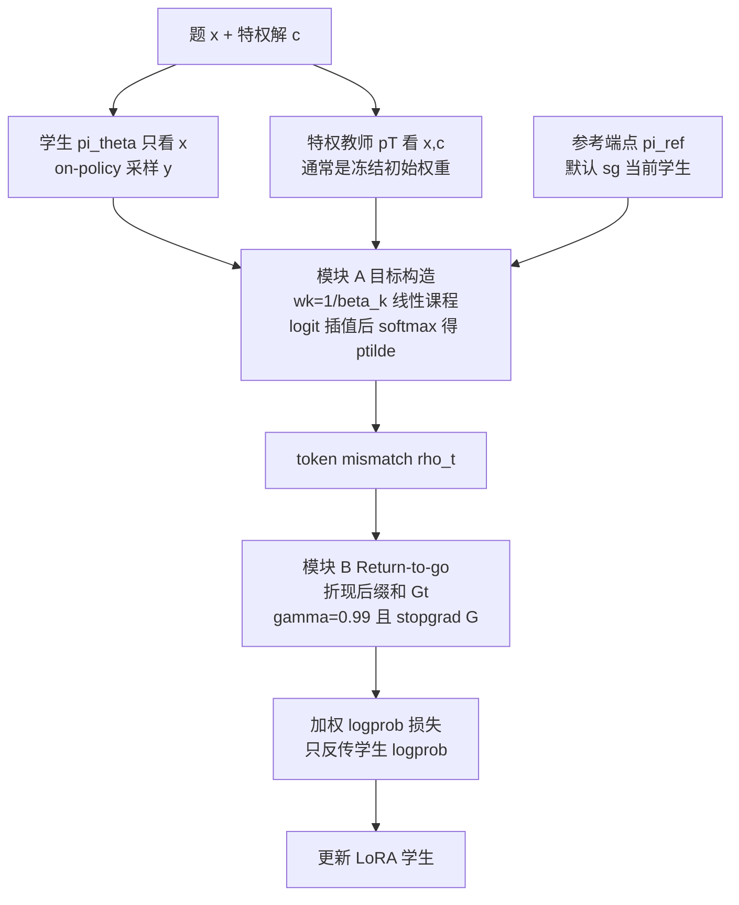

# 组会汇报：β-OPSD（Deriving with Policy Optimization, Training with Self-Distillation）

论文：Xu*, Liu*, Zhang, Goldstein, Huang. *β-OPSD: Deriving with Policy Optimization, Training with Self-Distillation*. arXiv:2607.28582v1, 2026-07-30.  
单位：University of Maryland, College Park（Xu / Liu 共同一作）  
宏包全称（`macro.tex`）：`\oursfull` = $\beta$-On Policy Self-Distillation；正文算法环境内部仍叫 *Smooth Target Distillation Toward Logit Interpolants*（`alg:slide`，旧名 SLIDE 残留）  
LaTeX 源码：`docs/beta_OPSD/`（`main.tex` + `sections/*.tex` + `tables/*.tex`）  
PDF：`docs/11_beta_OPSD.pdf`  
代码：`algorithm/beta-opsd/`；数据：`siyanzhao/Openthoughts_math_30k_opsd`  
汇报定位：博士后组会精讲（问题 → 树状方法 → 带公式走查 → 实验 → 复现清单）  
文中 **【注解】** 是组会追问的展开。本次已按 TeX 源码校对公式、表内数字与附录设定。

和组里已读材料的位置：这是 **特权上下文自蒸馏（OPSD）**，不是 TrOPD 那种外部大教师 OPD，也不是 AntiSD 那种“把自蒸馏优势反号”。Related work 已引用 AntiSD（`shen2026anti`）。它承认 vanilla OPSD 脆，但解法是 **把 OPSD 写成带 $\beta$ 的 KL 正则 RL，再用蒸馏去逼近闭式最优策略**。

**【注解 · 按 `docs/beta_OPSD` 校对后改了什么】**

| 点 | PDF 粗读时容易混 | TeX 源码口径 |
|---|---|---|
| 引言 “up to 9.16” | 听成三集平均 | 只是 1.7B **AIME 2024** 相对 vanilla OPSD；平均增益是 **+5.74**（`introduction.tex` / `tables/qwen1.7b_eval.tex`） |
| 特权 $c$ | 只有标准答案 | 引言列举 reference solutions / verified traces / external feedback；**实验只用 ground-truth solution**（`experiments.tex`） |
| 命题编号 | PDF 排版 | `prop:opsd_beta_one`、`prop:geometric_optimal_policy`（§2.1 / §2.2） |
| RTG 别名 | 只叫 return-to-go | related work / 附录也叫 **Look-Ahead** return |
| 默认插值两端 | “师生混合” | 主实验是 **D+F**：$\operatorname{sg}(\theta_k)$ 对学生前缀 + **$\theta_0$ 看 $(h_t,c)$**（`eq:dynamic_fixed_interpolant`） |
| 附录混合采样对照 | 和 Table 1 的 vanilla 同一 ckpt | Table 1 是 **step 100**；附录表 vanilla 是 **step 200**（AIME24 avg@12 已是 46.11，不是 44.17） |
| 4B AIME 2024 | 只说相对 OPSD −1.11 | 73.89 还 **低于 base 77.78** |
| 附录标题 | “Sampling from Logit Interpolants” | 公式 `eq:student_teacher_mixed_sampler` 是 **学生/教师概率算术混合**，不是从 $\tilde p$ 采样；目标侧仍用插值 mismatch $\rho^\tau$（$\tau$ 是旧记号残留） |
| 理论 $\pi_{\mathrm{ref}}$ | 闭式解里像 RLHF 那样钉死 | 默认 D+F 的参考端点是 **当前学生 stop-grad**；更像逐步 trust region，不是固定 $\theta_0$ 参考。F+F 才更接近固定参考，但实验更差 |

---

# 1. 任务、问题、动机、现有方法局限，以及一个例子

## 1.1 这篇 paper 在做什么

不是新网络，也不请更强外部教师。它做的是 **数学推理的 on-policy self-distillation 后训练**：

- 输入：数学题 $x$，以及训练期才有的特权上下文 $c$。实验里 $c$ 是 ground-truth solution；引言还列举 verified traces / external feedback，那些没有做。
- 学生 $\pi_\theta(\cdot\mid x)$ **只看题目**，自己采样推理轨迹 $y$。
- 教师 $p_T(\cdot\mid x,c)$ 与学生同架构；主实验教师端点冻结在 **初始权重 $\theta_0$**，但前向时吃 $(x,c)$。
- 目标：在 AIME 24/25、HMMT 2025 上，让 1.7B–8B 的 Qwen3 比 vanilla OPSD 更稳、更高。引言 “up to 9.16” 是 1.7B 的 **AIME 2024 单集**，不是三集平均。

一句话任务：**用政策优化把“该蒸向谁”推导成一条参考策略→特权教师的路径，再用便宜的 token 级蒸馏去逼近这条路径上的闭式解。**

## 1.2 要解决的问题

OPSD 的承诺很诱人：学生在自己采到的状态上学习，教师用只有训练期才有的 $c$ 给稠密 token 监督，既避开 offline KD 的 exposure bias，又不用另训 PRM、不用更强外部模型。

实践里它 **脆**：要对齐特权教师，工程负担大，小模型上甚至掉点。本文 Table 1 把这件事写死了——Qwen3-1.7B 上 vanilla OPSD 的平均 **31.02，低于 base 的 33.89**。

作者问的真正问题不是“再发明一个蒸馏 loss”，而是：

> 直接把特权教师当唯一目标，是不是 OPSD 唯一原则性的目标？$\beta=1$ 的隐式选择，是不是脆的结构原因？

## 1.3 Motivation

标准 KL 正则 RL：

$$
\max_\theta\ \mathbb{E}_{y\sim\pi_\theta(\cdot\mid x)}[R(y;x,c)]-\beta\,D_{\mathrm{KL}}\big(\pi_\theta(\cdot\mid x)\Vert\pi_{\mathrm{ref}}(\cdot\mid x)\big).
$$

把奖励取成教师相对参考策略的对数比

$$
R(y;x,c)=\log\frac{p_T(y\mid x,c)}{\pi_{\mathrm{ref}}(y\mid x)},
$$

就得到 **β-OPSD 族** $\mathcal{J}_\beta(\theta)$（`eq:beta_opsd_objective`）。当 $\beta=1$ 时，参考项相消，最大化 $\mathcal{J}_1$ **精确等于** 最小化序列级 reverse KL $D_{\mathrm{KL}}(\pi_\theta\Vert p_T)$（命题 `prop:opsd_beta_one`）。这就是 vanilla OPSD。

附录还给出等价分解（`eq:beta_opsd_decomposition`；展开式是 `eq:beta_opsd_expanded`）：

$$
\mathcal{J}_\beta=-D_{\mathrm{KL}}(\pi_\theta\Vert p_T)-(\beta-1)\,D_{\mathrm{KL}}(\pi_\theta\Vert\pi_{\mathrm{ref}}).
$$

于是 $\beta$ 从“被写死的 1”变成旋钮：$\beta=1$ 猛扑教师；$\beta>1$ 更保守、更靠近 $\pi_{\mathrm{ref}}$。脆的来源被解释成：**一上来就做教师端点投影，师生分布差太大。**

他们不直接用 RL 去最大化 $\mathcal{J}_\beta$（rollout、优势估计、方差都贵），而是求出闭式最优策略，再把它变成蒸馏目标。

## 1.4 现有方法的局限

| 路线 | 代表 | 局限 |
|---|---|---|
| Offline SeqKD / SFT | 模仿标准解 | exposure bias；本文 SFT 在 4B 上甚至从 57 掉到 18，说明硬模仿长思维链可以崩 |
| 外部教师 OPD | GKD、TrOPD 等 | 要更强模型；本文设定是 **self-distillation**，教师不是更大的模型 |
| Vanilla OPSD | Zhao et al. SDR 等 | 目标钉死在 $p_T$；小模型上可低于 base |
| 直接 KL 正则 RL | RLHF / PPO | 能控 $\beta$，但方差高、实现重；序列级归一化 $Z_\beta$ 不可算 |
| 启发式师生混合 | 混合采样、scheduled sampling | 往往只改采样或只改难度，没有“最优策略就是几何插值”这条推导 |
| 局部 token-KL | 标准 OPSD 实现 | 近视：不管当前 token 如何改变后续前缀上的师生 mismatch |

## 1.5 用一道题把动机讲清楚

题目：解 $2x+3=11$。特权 $c$ 是标准解 “Subtract 3: $2x=8$. Divide by 2: $x=4$.”

学生只看题，采到：

> I think we multiply both sides… so $x=7$.

看 token `multiply`：

- 学生很自信：$\pi_\theta(\texttt{multiply})=0.35$
- 看到答案的教师几乎不说：$p_T(\texttt{multiply})=0.01$

Vanilla OPSD（$\beta=1$）的逐步 mismatch

$$
\rho=\log\pi_\theta-\log p_T=\log\frac{0.35}{0.01}\approx 3.56
$$

会把学生这一步狠狠拉向教师。早期 token `I think` 如果只用逐步 $\rho$，看不到后面 `x=7` 还要错下去。

β-OPSD 早期若 $w=1/\beta=0.5$，目标不是 $p_T$，而是师生 logit 的插值 $\tilde p$。`multiply` 上的目标概率落在 $0.01$ 和 $0.35$ 之间，拉力变温和。Return-to-go 再把后面 `x=7` 的 mismatch 传回 `I think` / `multiply`。训练后期 $w$ 升到 $0.8$，再更靠近教师。

---

# 2. 他们为什么会想到这套工具：算法树

## 2.1 思想来源

1. **RLHF / DPO 的闭式最优。** KL 正则目标的最优策略是参考策略与奖励诱导分布的几何混合。这里把“奖励”换成 $\log(p_T/\pi_{\mathrm{ref}})$，最优策略就变成 $\pi_{\mathrm{ref}}$ 与 $p_T$ 的几何插值。
2. **Vanilla OPSD = $\beta=1$。** 一旦看清这一点，$\beta$ 就该被调度，而不是写死。
3. **序列级 $Z_\beta$ 不可算。** 轨迹空间求和做不了，所以在每个前缀上做 **局部 logit 插值 + 逐步 softmax**，当作可计算近似。
4. **蒸馏比直接 RL 便宜。** 最优策略已经写成目标分布，最小化 $D_{\mathrm{KL}}(\pi_\theta\Vert\tilde p_{\beta_k})$ 只需 token 级 logprob，不必另套 PPO。
5. **REINFORCE / Look-Ahead。** 逐步 token-KL 对序列级 KL 是近视的；$\gamma=1$ 的 suffix 和是无偏序列梯度（附录称 Look-Ahead），$\gamma<1$ 用来压长序列方差。Related work 同时引用了 AntiSD。

因果链：

**先把 OPSD 嵌进 $\mathcal{J}_\beta$ → 求出几何插值最优策略 → 用逐步 logit 插值实现它 → 调度 $w=1/\beta$ 当课程 → 用 RTG 对齐序列级目标。**

## 2.2 总览：三个模块怎么交接



节点对应公式：

$$
\begin{aligned}
w_k &= 1/\beta_k, \\
\tilde p &= \operatorname{softmax}\big((1-w)\,z_{\mathrm{ref}} + w\,z_T\big), \\
\rho_t &= \log\pi_\theta(y_t)-\log\tilde p(y_t), \\
G_t &= \sum_{s\ge t}\gamma^{s-t}\rho_s,\quad \gamma=0.99,\ \operatorname{sg}(G), \\
L &= \frac{1}{T}\sum_t \operatorname{sg}(G_t)\log\pi_\theta(y_t).
\end{aligned}
$$

可选附录支路（默认不用）：混合采样改变 $y$ 的提议分布，必须做重要性采样，vLLM 不好支持，作者自己也不当主方法。

三者分工：

- **A 决定蒸向谁**（参考→教师路径上的一个点）。
- **B 决定每个 token 扛多少未来 mismatch**。
- **采样仍是学生 on-policy**；A/B 都不改“从哪采样”，只改目标和 credit。

附录 `tab:notation` 里和组会最相关的几个符号：$\bar\theta=\operatorname{sg}(\theta)$，$w_k=1/\beta_k$，$s_k=k/(K-1)$，$\rho_t^{\beta_k}$ 是学生相对插值目标的 token 对数比，$G_{t,\gamma}^{\beta_k}$ 是折现 return-to-go。$\pi_{\mathrm{ref}}$ 在符号表里写“初始学生或当前学生的 stop-grad”，两种实现都合法，主实验走后者。

## 2.3 模块 A：β 族、闭式解、logit 插值、课程

**β 族目标（`eq:beta_opsd_objective`）。**

$$
\mathcal{J}_\beta(\theta)=\mathbb{E}_{y\sim\pi_\theta}\Big[\log\frac{p_T(y\mid x,c)}{\pi_{\mathrm{ref}}(y\mid x)}\Big]-\beta\,D_{\mathrm{KL}}(\pi_\theta\Vert\pi_{\mathrm{ref}}).
$$

等价分解（附录 `eq:beta_opsd_decomposition`）：

$$
\mathcal{J}_\beta=-D_{\mathrm{KL}}(\pi_\theta\Vert p_T)-(\beta-1)\,D_{\mathrm{KL}}(\pi_\theta\Vert\pi_{\mathrm{ref}}).
$$

$\beta=1$：只剩 reverse KL 到教师。$\beta>1$：额外锚在参考策略上。

**闭式最优（`prop:geometric_optimal_policy` / `eq:sequence_geometric_mixture`）。**

$$
\pi^\star_\beta(y\mid x,c)
=\frac{\pi_{\mathrm{ref}}(y\mid x)^{1-1/\beta}\,p_T(y\mid x,c)^{1/\beta}}{Z_\beta(x,c)}.
$$

$w=1/\beta\in[0,1]$（要求 $\beta\ge 1$）：$w=1$ 是教师端点，$w\to 0$（$\beta\to\infty$）是参考端点。$Z_\beta$ 要对全部轨迹求和，不能用。

**局部实现（`eq:local_logit_interpolant`，实验里写成 `eq:exp_interpolant_target`）。** 前缀 $h_t=(x,y_{<t})$ 上

$$
\tilde p_{\beta_k}(\cdot\mid h_t,c)=\mathrm{softmax}\big((1-w_k)\,z_{\mathrm{ref}}(\cdot\mid h_t)+w_k\,z_T(\cdot\mid h_t,c)\big).
$$

几何混合概率 $\Leftrightarrow$ 线性混合 logit。逐步归一化后的自回归分布，是对序列级最优的可计算近似，**不是** $Z_\beta$ 的精确实现。

**课程（`eq:bounded_beta_schedule` / `eq:exp_weight_schedule`）。** 默认线性

$$
w_k=w_{\mathrm{start}}+(w_{\mathrm{end}}-w_{\mathrm{start}})\frac{k}{K-1},\qquad K=200.
$$

主实验：$w_{\mathrm{start}}=0.5$，$w_{\mathrm{end}}=0.8$，即 $\beta:2\to 1.25$，**并不走到 $\beta=1$ 的纯教师端点**。

**参考端点（`eq:dynamic_fixed_interpolant`，默认 D+F）：**

$$
\tilde p_w^{\mathrm{DF}}(\cdot\mid h_t,c)
=\mathrm{softmax}\big((1-w)\,z_{\bar\theta_k}(\cdot\mid h_t)+w\,z_{\theta_0}(\cdot\mid h_t,c)\big).
$$

左边是 **当前学生 stop-grad、不看 $c$**；右边是 **初始权重、看 $c$**。F+F 两端都来自 $\theta_0$；D+D 两端都来自 $\bar\theta_k$（教师这边也看 $c$）。主实验选 D+F。

**【注解 · 理论 $\pi_{\mathrm{ref}}$ 和实现 $z_{\mathrm{ref}}$ 不是同一钉死对象】**

命题 2.2 的闭式解假定参考策略在这一步是固定的。若 $\pi_{\mathrm{ref}}=\pi_{\theta_0}$，那是标准 RLHF 锚。默认 D+F 却把参考端点换成 **活学生** $\bar\theta_k$，教师端点才钉在 $\theta_0$。于是每一步的几何目标其实是“别离 **现在的自己** 太远，同时朝冻结特权教师挪一点”，更像 trust region，而不是始终锚在初始化。`experiments.tex` 主实现写的是 $z_{\bar\theta}$ 与 $z_T$；D+F 消融才显式把 $z_T$ 写成 $z_{\theta_0}$。组会上应把“冻结教师”和“冻结参考”分开说。

## 2.4 模块 B：Return-to-go

逐步 mismatch

$$
\rho_t=\log\pi_\theta(y_t\mid x,y_{<t})-\log\tilde p_{\beta_k}(y_t\mid x,y_{<t},c).
$$

$\sum_t\rho_t$ 是序列 reverse KL 的无偏 MC 估计，但用逐步 $\rho_t$ 当权重是近视的。Return-to-go：

$$
G_{t,\gamma}=\sum_{s=t}^{T}\gamma^{s-t}\rho_s,\qquad \gamma\in[0,1].
$$

$\gamma=1$：对 $\nabla D_{\mathrm{KL}}(\pi_\theta\Vert\tilde p)$ 无偏（附录 `app:onpolicy-lookahead-gradient`）。实践 $\gamma=0.99$，此时只是折现近似，不再声称无偏。实用损失（`eq:slide_loss` / `eq:exp_beta_opsd_loss`）：

$$
L=\frac{1}{T}\sum_{t=1}^{T}\mathrm{sg}(G_{t,\gamma})\,\log\pi_\theta(y_t\mid x,y_{<t}).
$$

插值 logit 和 $G$ 全部 detach，只反传学生 logprob。

## 2.5 统一算法（论文 Algorithm 1）

对 $k=0,\ldots,K-1$（`alg:slide`）：采 batch $(x,c)$ → 学生采样 $y$ → $s_k=k/(K-1)$ → $w_k$ 按 `eq:exp_weight_schedule`，$\beta_k=1/w_k$ → $\bar\theta\leftarrow\operatorname{sg}(\theta)$ → 构造 $\tilde p$ → $\rho$、$G$ → 最小化 $\mathcal{L}$（`eq:exp_beta_opsd_loss`）→ 更新 $\theta$（LoRA）。

**【注解 · 论文公式 vs 官方代码的目标混合方式】**

印刷体是 **logit 几何插值**（全词表 softmax）。`beta_opsd_trainer.py` 的 Tinker/$K_1$ 路径走 `_mix_sampled_log_probs`：只在 **已采样 token** 上做

$$
\log\big((1-w)\,\pi_{\mathrm{ref}}(y_t)+w\,p_T(y_t)\big),
$$

这是 **概率的算术混合**，不是 $\mathrm{softmax}((1-w)z_{\mathrm{ref}}+w z_T)$。同文件里的 `_mix_log_probs` 才是论文公式，但主 Tinker loss 没用它。复现 Table 1 跟的是代码还是公式，必须先拍板。

另：仓库默认 `--tinker_use_reward_to_go=False`，主 recipe `recipes/paper/beta_opsd_mix_target_qwen3_4b.yaml` 也是 **固定 $w=0.5$、未开 RTG、未开线性课程**。这更接近消融里的 “Fixed 0.5 + 局部梯度”，**不是** 正文 Table 1 声称的 $0.5\to 0.8$ 且 $\gamma=0.99$。

---

# 3. 算法流程 + 带公式的例子走查

## 3.1 训练一步（对齐论文 §4.1 与附录 C）

1. 从 OpenThoughts 数学子集取 $(x,c)$。
2. vLLM colocate：学生只看 $x$，温度 1.1，top-$p=0.95$，top-$k=20$，最长 completion **1024**（总长上限 20000）。
3. $w_k=0.5+0.3\cdot k/199$（主文设定）。
4. 教师：冻结初始模型，看 $(x,c,y_{<t})$；参考：当前学生 stop-grad，只看 $(x,y_{<t})$。
5. 构造 $\tilde p_{w_k}$，算逐步 $\rho_t$，再 $G_t$（$\gamma=0.99$）。
6. 最小化 $L=\mathrm{mean}_t[\mathrm{sg}(G_t)\log\pi_\theta(y_t)]$，更新 LoRA。
7. $K=200$；主表报的是 **第 100 step** 的 checkpoint，不是最后一步。

有效 batch：1.7B 为 4 卡 × 1 × 8 accum = 32。lr $5\times 10^{-6}$，grad clip 0.1，bf16，FlashAttention-2，LoRA $r=64$，$\alpha=128$。

## 3.2 例子：三个量在同一 token 上差在哪

继续 $2x+3=11$。设当前位置学生采到 `multiply`：$\pi_\theta=0.35$，$p_T=0.01$。为把数字写清楚，下面把插值当成“概率几何混合”的示意（与 logit 混合同构到归一化）。

**Vanilla OPSD。** 目标就是 $p_T$，

$$
\rho^{\mathrm{OPSD}}=\log 0.35-\log 0.01\approx 3.56.
$$

逐步更新只看这一个 3.56。

**β-OPSD，$w=0.5$。** 印刷体是 **全词表 logit 混合再 softmax**，不是单独对 `multiply` 做 $\sqrt{\pi p_T}$。下面只是单 token、未归一化的数量级示意：$\propto \pi^{0.5}p_T^{0.5}$ 给出 $\sqrt{0.35\times 0.01}\approx 0.059$。真正的 $\tilde p(\texttt{multiply})$ 还取决于教师在 `subtract` 等词上的质量，归一化后会落在 $0.01$ 与 $0.35$ 之间。于是

$$
\rho^{\beta}\approx\log 0.35-\log 0.059\approx 1.78
$$

大约是 OPSD 的一半量级，目标更近、梯度更温和。默认 D+F 里 $z_{\mathrm{ref}}$ 是 **当前学生的 stop-grad**，不是另一份冻结学生。

**Return-to-go。** 设后面还有 `x=7` 的 $\rho_{t+3}=2.0$，则 $G_t\approx 1.78+0.99^3\cdot 2.0\approx 3.72$。早期胡写的 token 要为后面偏离目标负责；逐步 OPSD 不会把这笔账记到前面。

到 $w=0.8$ 时目标更靠近教师，$\rho$ 重新变大，但学生已经被拉近，分布差小于 step 0 时直接 $\beta=1$。

## 3.3 和 RLHF / DPO / 普通 OPSD 的关系

| | RLHF/PPO | DPO | Vanilla OPSD | β-OPSD |
|---|---|---|---|---|
| 最优策略形态 | $\pi_{\mathrm{ref}} e^{R/\beta}/Z$ | 同类闭式 | 教师 $p_T$ | $\pi_{\mathrm{ref}}^{1-w}p_T^{w}/Z$ |
| 实际优化 | 采样 + 优势 | 成对分类 | token reverse KL | 蒸馏逼近闭式目标 |
| $\beta$ | 显式 | 隐式温度 | 钉死 1 | 调度 $w=1/\beta$ |
| 教师 | 奖励模型 | 偏好数据 | 特权同模型 | 同左 |

它不是新 RL 算法，是 **用 RL 推导目标，用蒸馏训练**。

---

# 4. Baseline、数据集、训练成本

## 4.1 模型与数据

| 项 | 内容 |
|---|---|
| 学生 | Qwen3-1.7B / 4B / 8B instruct（thinking mode 评测） |
| 教师 | 同架构；默认冻结 step-0 权重 + 特权 $c$ |
| 训练数据 | OpenThoughts **数学子集**（`experiments.tex` 只写 subset，未写条数）；代码默认 `siyanzhao/Openthoughts_math_30k_opsd` |
| 评测 | AIME 2024、AIME 2025、HMMT 2025（HMMT 引 MathArena） |
| 扫 checkpoint | 附录明确扫 $\{50,75,100,200\}$；**正文 Table 1 只报 100** |

## 4.2 Baseline

| 名称 | 做法 |
|---|---|
| Base | 不后训练 |
| SFT | 标准解上的 next-token |
| Vanilla OPSD | 目标钉死 $p_T$，局部 token-KL，无插值课程、无 RTG |
| GRPO | 结果级 0/1，组内归一化；recipe 里 completion 最长 **16000**，和 OPSD 的 1024 **不对齐** |
| Teacher+RTG | 消融：仍蒸教师，但加 RTG |
| Local token gradient | 消融：插值目标，但不用 RTG |
| F+F / D+D / D+F | 消融插值两端 |
| Mixed sampling | 附录 `app:proposal_mixture`：改提议分布，不是主方法 |

## 4.3 超参与成本

| 项 | 论文附录 C / 正文 |
|---|---|
| steps | 200；主表用 **step 100** |
| 墙钟上限 | 1.7B：**8 小时** / 4×A6000 |
| 硬件 | 1.7B：4×RTX A6000；正文还提到 H200 |
| 有效 batch | 32（4×1×8） |
| lr / clip | $5\times 10^{-6}$ / 0.1 |
| LoRA | $r=64$，$\alpha=128$，QKV/O/MLP |
| 训练生成 | temp 1.1，top-$p$ 0.95，top-$k$ 20，**max completion 1024** |
| $w$ / $\gamma$ | $0.5\to 0.8$，$\gamma=0.99$ |
| 评测 | thinking；temp 0.6；top-$p$ 0.95；top-$k$ 50；$k=12$；`max_new_tokens=0`；默认最大 **40960** |
| 框架 | 附录写 accelerate + 每 rank colocate vLLM；仓库实现是 TRL + DeepSpeed ZeRO-2 + PEFT |

论文没报 GPU-hour 细账。1.7B 单次 ≤8 小时/4 卡。4B/8B 更贵。主表是 100-step，等于只用了一半优化步，却按 200-step 预算来调度 $w_k$。

**【注解 · 训练 1024 vs 评测 40K】**

训练 completion 截断在 1024，评测 thinking 可到 40960。这是“短链上蒸、长链上考”。和 GRPO recipe（训练 16K）也不公平。组会上应主动讲：涨点可能含“目标更稳”，也可能含“根本没在长 CoT 上对打”。

---

# 5. 实验、指标、以及它们实际支撑了什么

## 5.1 指标

| 指标 | 含义 | 角色 |
|---|---|---|
| avg@12 | 12 次采样的平均正确率（百分数） | **主指标** |
| pass@12 | 12 次里至少一次对 | 附录混合采样表才同时报；Table 1 只有 avg@12 |
| 主表 checkpoint | 默认 200 step 里的 **100** | 不是 last-ckpt |

没有 KL 曲线、没有接受率、没有 human eval。AIME/HMMT 题量小，12 次平均仍有噪声，论文无误差条。

## 5.2 实验清单

### E1. 主结果（Table `tab:qwen3_results`，avg@12，step 100）

`tables/qwen1.7b_eval.tex` 全表（括号是相对 **同尺度 vanilla OPSD**，不是相对 base）：

| 模型 | 方法 | AIME24 | AIME25 | HMMT | Average |
|---|---|---:|---:|---:|---:|
| 8B | Base | 73.06 | 67.78 | 29.72 | 56.85 |
| 8B | Vanilla OPSD | 75.83 | 66.67 | **33.06** | 58.52 |
| 8B | SFT | 72.78 | 64.72 | 30.83 | 56.11 |
| 8B | GRPO | 75.83 | 68.61 | 31.11 | 58.52 |
| 8B | **β-OPSD** | **78.33** (+2.50) | **70.28** (+3.61) | 31.94 (−1.12) | **60.18** (+1.66) |
| 4B | Base | **77.78** | 64.17 | 29.44 | 57.13 |
| 4B | Vanilla OPSD | 75.00 | 65.00 | 28.33 | 56.11 |
| 4B | SFT | 23.61 | 19.72 | 10.56 | 17.96 |
| 4B | GRPO | 76.39 | 64.17 | 30.28 | 56.95 |
| 4B | **β-OPSD** | 73.89 (−1.11) | **69.17** (+4.17) | **30.56** (+2.23) | **57.87** (+1.76) |
| 1.7B | Base | 50.00 | 37.22 | 14.44 | 33.89 |
| 1.7B | Vanilla OPSD | 44.17 | 35.56 | 13.33 | 31.02 |
| 1.7B | SFT | 37.50 | 29.17 | 12.22 | 26.30 |
| 1.7B | GRPO | 48.33 | 38.61 | 15.00 | 33.98 |
| 1.7B | **β-OPSD** | **53.33** (+9.16) | **40.83** (+5.27) | **16.11** (+2.78) | **36.76** (+5.74) |

加粗规则跟 TeX 一样：每列同尺度最高。引言 “up to 9.16” 对齐的是 **1.7B AIME24** 那一格。

**支撑：** 小模型上 vanilla OPSD 有害（31.02 < base 33.89），插值路径能救回来并超过 base/GRPO。尺度变大后优势缩小。平均赢、单集输必须报：

- 4B AIME24：73.89 低于 vanilla 75.00，也 **低于 base 77.78**，还低于 GRPO 76.39。
- 8B HMMT：31.94 < vanilla 的 **33.06**。

SFT 在 4B 崩到 17.96，当弱对照可以，不宜当成“SFT 不行”的强结论。8B 上 GRPO 与 vanilla OPSD 的 Average **碰巧都是 58.52**（AIME24 都是 75.83；AIME25 GRPO 更高，HMMT vanilla 更高）。结论里 “consistently outperforms … GRPO” 只在 **平均** 上成立。

### E2. 插值目标 vs 纯教师（Table 2，都用 RTG，1.7B）

| 目标 | AIME24 | AIME25 | HMMT |
|---|---:|---:|---:|
| Teacher + RTG | 47.30 | 35.53 | 14.44 |
| β-OPSD target $0.5\to 0.8$ | **53.33** | **40.83** | **16.11** |

**支撑：** 在同样 RTG 下，换目标本身有 **+6.03 / +5.30 / +1.67**（`experiments.tex` 原文）。模块 A 不是空话。

### E3. RTG vs 局部梯度（Table 3，同一插值，$w=0.5$ 固定）

| Credit | AIME24 | AIME25 | HMMT |
|---|---:|---:|---:|
| Local token | 49.44 | 32.78 | 13.06 |
| Return-to-go | **50.56** | **38.33** | **16.67** |

**支撑：** 模块 B 在 AIME25/HMMT 上贡献大（+5.55 / +3.61），AIME24 只有 +1.12。注意这里 $w$ 固定 0.5，不是主表课程。

### E4. 插值两端（Figure `fig:interpolant_reference_ablation`，$w=0.5$ + RTG）

TeX 没有把这三组做成表，数字在图里。按 PDF 读出：

| 构造 | 公式 | AIME24 | AIME25 | HMMT |
|---|---|---:|---:|---:|
| F+F | $(1-w)z_{\theta_0}(h_t)+w z_{\theta_0}(h_t,c)$ | 47.78 | 34.32 | 15.83 |
| D+D | $(1-w)z_{\bar\theta_k}(h_t)+w z_{\bar\theta_k}(h_t,c)$ | 48.31 | 37.50 | 15.56 |
| **D+F（默认）** | $(1-w)z_{\bar\theta_k}(h_t)+w z_{\theta_0}(h_t,c)$ | **50.56** | **38.33** | **16.67** |

HMMT 上 D+D（15.56）略低于 F+F（15.83），并不是三集都单调。默认仍选 D+F。

**支撑：** 目标要 **跟踪活学生、锚住死教师**。两端都冻或两端都动都弱于这个非对称选择。

### E5. 课程（Table 4）

| $w$ 日程 | AIME24 | AIME25 | HMMT |
|---|---:|---:|---:|
| Fixed 0.5 | 50.56 | 38.33 | **16.67** |
| $0.2\to 0.8$ | 51.39 | 37.50 | 16.39 |
| $0.8\to 0.2$ | 51.94 | 38.06 | 15.83 |
| **$0.5\to 0.8$** | 53.33 | **40.83** | 16.11 |
| $0.8\to 0.5$ | **54.72** | 38.61 | 15.83 |

**支撑：** 日程有影响，但 **没有单一日程统治三集**。$0.5\to 0.8$ 综合最好，才被选进主表；$0.8\to 0.5$ 的 AIME24 更高。作者自己写这是实践选择，不是理论最优。

### E6. 混合采样（附录 `app:proposal_mixture`，印刷标题却叫 *Sampling from Logit Interpolants*）

改的是 **提议分布**，不是主方法的目标分布。标题容易听成“从 logit 插值 $\tilde p$ 里采样”；公式不是：

$$
m_{\bar\theta,\eta}(\cdot\mid h_t,c)=(1-\eta)\,\pi_{\bar\theta}(\cdot\mid h_t)+\eta\,p_T(\cdot\mid h_t,c).
$$

这是 **概率算术混合**（和主方法的 logit 几何混合不是一回事）。目标仍写 $\rho_s^\tau$ 对插值 $\tilde p$（$\tau$ 与损失里的 $G^{\tau,\mathrm{mix}}$ 是旧记号；定义式写的是 $G^{\eta,\mathrm{mix}}$）。$y\sim m$，逐步重要性比（`eq:mixed_sampling_importance_ratio`）

$$
w_t(y)=\frac{\pi_\theta(y_t\mid h_t)}{m_{\bar\theta,\eta}(y_t\mid h_t,c)},\qquad W_t(y)=\prod_{i=1}^{t}w_i(y),
$$

再进入 Look-Ahead（`eq:mixed_sampling_lookahead_return`）

$$
G_{t,\gamma}^{\eta,\mathrm{mix}}(y)=\sum_{s=t}^{T}\gamma^{s-t}W_s(y)\,\rho_s^\tau(y).
$$

作者强调标准 vLLM **不支持** 逐步双模型采样，实现接近翻倍。附录还把需要 IS 的理由写成引用 vanilla 的 `eq:standard_opsd_kl`，和“$\rho$ 对插值目标”不完全咬合，属于源码笔误级缝。

对照必须用同一张表里的 vanilla：**step 200**（AIME24 avg@12 = **46.11**，不是 Table 1 的 44.17；HMMT 已是 **15.83**，不是 13.33）。文中最好增益 **+8.06 / +5.55 / +3.06** 是相对这个 200-step vanilla、跨所有 $\eta$ 与 checkpoint 取最大：

| 最好格 | 日程 | step | avg@12 |
|---|---|---:|---:|
| AIME24 54.17 | 固定 $\eta=0.5$ | 100 | +8.06 |
| AIME25 41.11 | 固定 $\eta=0.8$ 的 step 75，或 $\eta:0.2\to0.8$ 的 step 200 | — | +5.55 |
| HMMT 18.89 | $\eta:0.8\to0.2$ | 75 | +3.06 |

附录自己写：200-step 时每条日程在 **两个 AIME** 上都高于该表 vanilla；HMMT 并不如此（例如固定 $\eta=0.8$ 的 13.89 低于 15.83）。没有单一 $\eta$ 统治三集。代码 `--use_mixed_sampling` 还会 **强制改回固定教师目标**，和附录“插值目标 + 混合采样”不完全一致。

## 5.3 这些表能不能支撑核心观点

**比较实的：**

1. Vanilla OPSD 在 1.7B 上低于 base，脆是真的（至少在他们设定下）。
2. 换插值目标、加 RTG，各自都有对照。
3. D+F 优于 F+F / D+D，两端怎么选不是无所谓。
4. 1.7B 增益最大，符合“师生差越大越需要别直接投影到教师”。

**弱的、组会上自己讲：**

1. 主表挑 **step 100**，不是 200；可能是中途最好，不是收敛更好。
2. 无 seed、无误差条；AIME 30 题 × 12 次，1–2 分要谨慎。
3. 4B/8B 相对 OPSD 只有约 +1.7，且有单集为负；4B AIME24 还低于 **base**。
4. GRPO 训练长度：论文附录没写 GRPO 的 max completion；**仓库** `grpo_qwen3_1_7b.yaml` 是 16000，OPSD 是 1024。这是代码对照问题，不要说成 TeX 正文已经承认不对齐。
5. 公开主 recipe 没开课程、没开 RTG；Table 1 与“一键脚本”不是同一开关组合。
6. 代码算术混合 vs 论文几何混合。
7. 没做 AntiSD 对照：特权教师可能在奖励捷径、惩罚审议。β-OPSD 让目标更近，不解决极性问题。
8. 没有 $w_k$ 轨迹、$\rho$ 直方图、RTG 范数等动态统计。

---

# 6. 若要复现：数据 / 模型 / 硬件 / 代码 / 算法准备

组里已有完整实现：`algorithm/beta-opsd/`。不必另找 GitHub 也能跑。

## 6.1 建议阶梯

| 阶梯 | 目标 | 难度 |
|---|---|---|
| P0 | 1–2 step smoke：`scripts/smoke/beta_opsd_mix_target.sh` | 低 |
| P1 | 按 **正文** 开关复现 1.7B Table 1 趋势（4×48GB） | 中 |
| P2 | 对齐 Table 2–4 消融 | 中 |
| P3 | 4B/8B 主表 | 高 |

P1 不要只信 `recipes/paper/beta_opsd_mix_target_qwen3_4b.yaml` 的默认开关。

## 6.2 模型与数据

- `Qwen/Qwen3-1.7B`（再 4B/8B）
- `siyanzhao/Openthoughts_math_30k_opsd`
- 国内机器配 `HF_ENDPOINT=https://hf-mirror.com`
- 评测 jsonl 在 `algorithm/beta-opsd/eval/`

## 6.3 硬件与环境

- 对标 1.7B：4×A6000 48GB；DeepSpeed ZeRO-2 + CPU optimizer offload；每卡 colocate vLLM `gpu_memory_utilization=0.5`
- `conda env create -f algorithm/beta-opsd/environment.yml`，再装 `flash-attn==2.8.3`
- 钉死：Python 3.10，torch 2.8.0，trl 0.26.0，vllm 0.11.0，transformers 4.57.1
- 不能和组里 AntiSD/veRL 环境混装

## 6.4 要对齐 Table 1 的开关（正文，不是 yaml 默认）

```bash
--use_tinker_loss true \
--use_mixed_teacher_target true \
--mixed_teacher_target_reference_model current_student \
--fixed_teacher true \
--mixed_teacher_target_teacher_weight 0.5 \
--mixed_teacher_target_teacher_weight_linear_decay true \
--mixed_teacher_target_teacher_weight_final 0.8 \
--tinker_use_reward_to_go true \
--tinker_reward_to_go_discount 0.99 \
--max_steps 200 --max_completion_length 1024 \
--learning_rate 5e-6 --max_grad_norm 0.1 \
--use_peft true --lora_r 64 --lora_alpha 128 \
--use_vllm true --vllm_mode colocate
```

评测：thinking=1，temp 0.6，$K=12$，看 **checkpoint-100** 的 avg@12。同时记下 50/75/200，避免只报中途高峰。

## 6.5 算法上必须自己拍板

1. 目标混合用论文 logit 几何，还是代码 sampled 算术混合。
2. 公开 recipe 固定 $w=0.5$、关 RTG，与正文不一致。
3. `--use_mixed_sampling` 会关掉 mix-target，那是附录 `app:proposal_mixture`，不是主方法。
4. `jsd_token_clip: 0.05` 写在 recipe 里，正文没讲；Tinker 路径不一定用它。
5. 学生 / 教师 chat template：教师必须能吃到 $c$，学生不能。collator 错了等于没特权。
6. GRPO 对照若要用，应把 max completion 改成同一 1024，否则不算公平。

## 6.6 风险

- 1.7B 上 vanilla OPSD 掉点是他们最强叙事；若你的 OPSD 已经高于 base，β 的增益可能变小。
- 1024 completion 可能学不到完整竞赛推理。
- 特权 $c$ 的极性问题（AntiSD）这里没处理。
- LoRA 只改 adapter，评测时加载在原 base 上。

---

# 7. 组会可追问（预答）

**Q1. $\beta$ 到底是 RL 的 KL 系数还是插值权重？**  
理论里是 $\mathcal{J}_\beta$ 的 KL 系数。实现里调度的是 $w=1/\beta$，即教师 logit 权重。$w:0.5\to 0.8$ 对应 $\beta:2\to 1.25$。

**Q2. 和 TrOPD 什么关系？**  
TrOPD：外部大教师，按师生比把 token 分成可信域/异常域，RKL/FKL 分流。β-OPSD：同模型特权教师，不分流 token，而是把 **目标分布** 放在学生与教师之间。一个管“这个 token 的监督能不能信”，一个管“整体该蒸向路径上的哪一点”。

**Q3. 和 AntiSD 什么关系？**  
同一类特权自蒸馏。AntiSD 说 $\log p_T-\log\pi_S$ 极性错了（奖捷径、罚审议）。β-OPSD 把目标从 $p_T$ 拉近学生，减轻 mismatch，**不反号**。两篇可以同时对：β 治脆，AntiSD 治极性。

**Q4. 为什么不直接 PPO $\mathcal{J}_\beta$？**  
$Z_\beta$ 不可算；他们声称蒸馏逼近闭式解更稳、更便宜。没有“蒸馏 vs 真 RL 最大化 $\mathcal{J}_\beta$”的实验。

**Q5. 主表为什么报 step 100？**  
附录 `sec:eval_detail` 扫 $\{50,75,100,200\}$。`tables/qwen1.7b_eval.tex` 的 caption 写明 Table 1 是 100-step。复现必须四档都报。注意附录混合采样表的 vanilla 是 **200-step**，不能和 Table 1 横比。顺带：vanilla 从 100 走到 200，AIME24 44.17→46.11、HMMT 13.33→15.83，AIME25 仍是 35.56。挑中途 ckpt 会放大相对 vanilla 的账。

**Q6. Look-Ahead 和 return-to-go 是两个东西吗？**  
不是。方法节写 return-to-go，related work / 附录训练段写 Look-Ahead，都指 $G_{t,\gamma}$。算法环境 caption 仍是 *Smooth Target Distillation Toward Logit Interpolants*（`alg:slide`），旧名 SLIDE 残留。Related work 有一处把 vanilla 叫 **OPD** 而不是 OPSD。

**Q7. 值不值得在组里用？**  
若已有 OPSD 管道、特权 $c$、且小模型 OPSD 掉点：值得把 **D+F 插值 + 可选 RTG + $w$ 课程** 做成开关。不要用未改开关的 paper yaml 声称复现了 Table 1。若主线是 RLVR/AntiSD，这是旁路后训练，不是替代 GRPO。 AntiSD 的 bib 是 `shen2026anti`（arXiv:2605.11609），只被引用，没有对照实验。

---

# 8. 一页纸结论

β-OPSD 把 vanilla OPSD 认成 KL 正则政策优化的 $\beta=1$ 端点，从而把“该蒸向谁”从唯一教师改成 **参考策略与特权教师之间的几何路径**。训练仍是 on-policy 自蒸馏：局部 logit（代码里甚至是 sampled 概率）插值实现目标，return-to-go 对齐序列级 KL。1.7B 上这套东西把低于 base 的 OPSD 救到 +5.74 avg@12；4B/8B 只剩约 +1.7，且有单集为负。

它是 **OPSD 的目标课程 + 序列 credit 补丁**，不是新 RL 算法。精讲时主动讲四处缝：挑 step 100、训练 1024 vs 评测 40K、公开 recipe 没开课程/RTG、几何插值公式 vs 算术混合代码。组里复现从 `algorithm/beta-opsd` 的 smoke 起步，按 §6.4 把开关拧到正文，而不是拧到 yaml 默认值。
