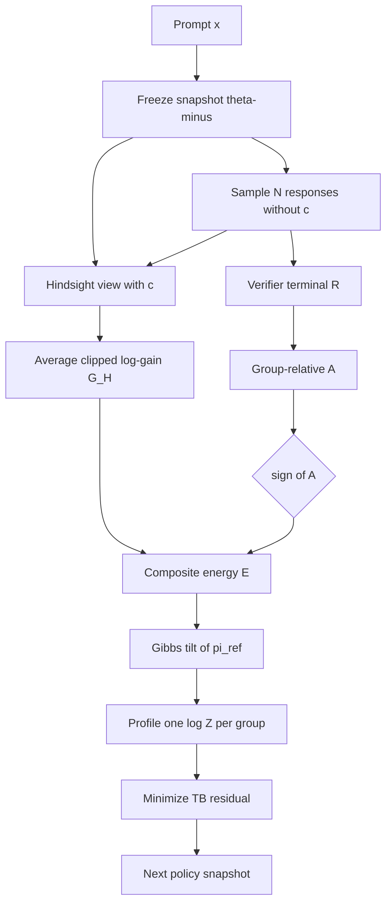
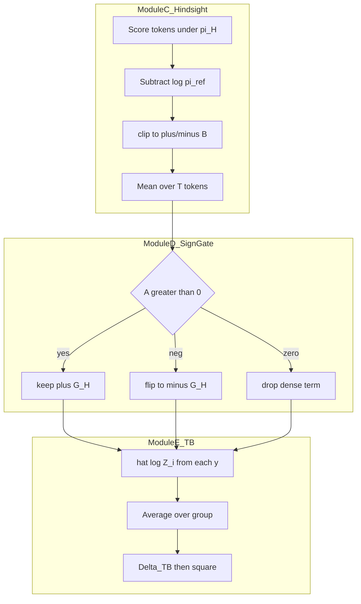
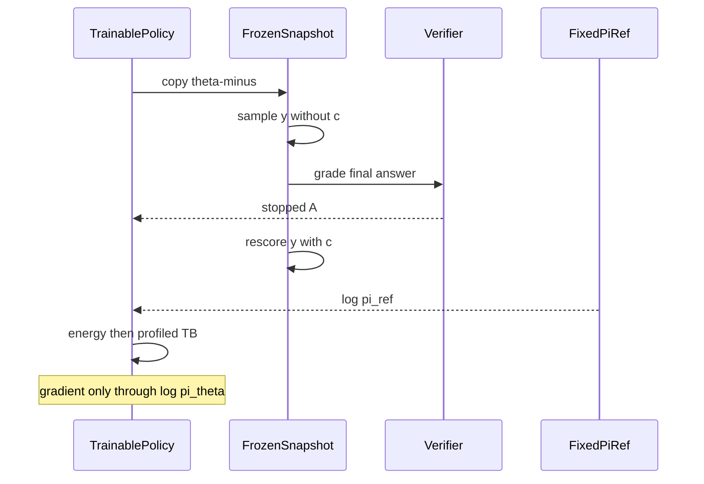

# 组会汇报：FlowBalance（Verifier-Grounded Self-Improvement）

论文：Huang, Panaganti, Mi, Liang. *FlowBalance: Verifier-Grounded Self-Improvement from On-Policy Reasoning Experience*. arXiv:2609.03241v1, 2026-09-03.  
PDF：`/home/liying/Downloads/9.5 FlowBalance.pdf`（仓库副本 `docs/9.5 FlowBalance.pdf`）。  
代码：本地 `algorithm/FlowBalance/`（[github.com/alexhuang13/FlowBalance](https://github.com/alexhuang13/FlowBalance)；历史路径叫 `FlowSD` / `recipe/flowsd/`）。框架：vendored `verl` + Ray + FSDP + vLLM。  
证据口径：arXiv HTML + GitHub README + 附录 D。不确定处标 `[估计]` / `[推断]`。

打开本文件用 **Preview**：公式应是排版，下面的 Mermaid 应是图。

---

## 0. 一句话贡献

RLVR 的终局验证器可靠但稀疏；同模型特权自蒸馏稠密但会把「自信的错」写进下一轮监督。FlowBalance **不另加 token 模仿损失**：把组内优势 $A$ 与特权后见得分 $G_{\mathrm{H}}$ 合成轨迹能量 $E=\eta_A A+\beta_G G_{\mathrm{H}}\operatorname{sgn}(A)$，再对参考策略做 Gibbs 重加权，用 **组内 profiled trajectory balance** 拟合归一化目标。方向由验证器定，稠密信号只在该方向上塑形。

---

## 1. 任务定义与动机剖析

### 1.1 任务是什么

后训练的 **on-policy 自改进内环**（不是外环课程/出题）：固定题库，当前策略自己采样完整推理轨迹，用训练时反馈更新下一轮策略。部署时只看见题面 $x$，看不见训练解 $c$。

- 输入：prompt $x$，训练专用上下文 $c$（参考解或任务反馈）
- 输出：更新后的策略 $\pi_\theta(\cdot\mid x)$
- 骨干：Qwen3-4B、Qwen3-8B
- 训练数据：DAPO 风格数学 parquet（代码入口 `train_dapo17k.parquet`）
- 验证器：规则化最终答案对错，终端奖励 $R\in\{0,1\}$ `[推断]` 与 GRPO 共享同一 verifier

### 1.2 在解决什么问题

自改进内环要同时做到三件事：把概率推向 **正确推理**、保留 **多种正确策略**、不要把一条局部好看的轨迹反复磨尖。现有管线在两头各摔一次。

### 1.3 Motivation

**稀疏可靠**：RLVR / GRPO 只在整段回复结束给一个正确性标量。几千 token 共用一个 $R$。FlowRL 把终端证据写成完整回复上的分布匹配，但能量仍是 outcome-only，吃不到轨迹内部结构。

**稠密不可靠**：把当前策略冻一份，条件在 $c$ 上给已采样 token 打 logprob（特权后见）。便宜、同模型、不必另找大教师。但 $c$ 在推理时不存在，这个视角会：

- 给「看起来像解、最终错」的轨迹打正分 → **self-confirmation**
- 缩短推理、压掉探索、把更新挤到一个局部 mode（直接 OPSD 的长度崩塌）

论文的分布性问题是：给定 on-policy 经验、稀疏验证结果、稠密但不完美的自指导，**下一轮策略该学哪一个归一化回复分布**？

### 1.4 现有方法局限

| 方法族 | 作用位置 | 为何不够（对上后文模块） |
|---|---|---|
| GRPO / RLVR | 组相对终端奖励 | 无轨迹内部塑形 → 需要模块 B 的 $G_{\mathrm{H}}$ |
| FlowRL | 终端能量 + trajectory balance | 能量不含稠密自指导 → 需要模块 C 的复合能量 |
| OPSD | 固定特权教师、token 级（前向）KL | 局部模仿可与验证器冲突、长度崩塌 → 需要模块 D 的 $\operatorname{sgn}(A)$ 门，且 **不要** 单独 token 损失 |
| RLSD | 验证器 + 同模型稠密项塞进 RL 目标 | 仍是局部优化信号，不是归一化完整回复分布 → 需要模块 E 的 $Z$ 与 TB |
| 无门自指导 | $+G_{\mathrm{H}}$ 不分对错 | 失败轨迹上的正 $G_{\mathrm{H}}$ 变成自我强化 → 模块 D |

### 1.5 例子（先看旧方法错）

同一 prompt 采两条回复。验证器：$y^+$ 对，$y^-$ 错。特权视角却觉得 $y^-$ 「更像参考解」，$G_{\mathrm{H}}(y^-)=0.5>0$。

无门能量用 $+G_{\mathrm{H}}$ 给失败轨迹加分，目标比 $p^\star(y^+)/p^\star(y^-)$ 被拉向失败侧。FlowBalance 对 $A<0$ 的轨迹改用 $-G_{\mathrm{H}}$。命题 4（论文 Eq. 28）：相对无门，符号门把成功/失败目标概率比乘上精确因子

$$
\exp\bigl(2\beta_G G_{\mathrm{H}}(y^-)/\tau\bigr).
$$

取 $\beta_G=1,\tau=1,G_{\mathrm{H}}(y^-)=0.5$，这个因子是 $e^{1}\approx 2.72$。稠密自信越大，校正越强，而不是越帮倒忙。附录四点诊断在 $G_-=0.5$ 时：FlowBalance 目标成功概率 $0.894$，reward-only $0.817$，无门 $0.807$。

---

## 2. 方法论树状拆解

**为什么是这些工具**：完整回复上的相对偏好需要一个 **归一化分布**（Gibbs + 配分函数），否则稠密分数会变成独立的局部损失。参考策略 $\pi_{\mathrm{ref}}$ 锁住 support、控制漂移。验证器只信终点，所以用组相对优势定 **符号**。稠密证据来自同模型特权评分，聚合成长度平均 $G_{\mathrm{H}}$，避免再采一条轨迹。拟合用 trajectory balance：把 $\tau\log Z+\tau\log(\pi_\theta/\pi_{\mathrm{ref}})-E=0$ 的残差平方，组内 profile 一个 $\log Z$，消掉公共偏移、保留 $N-1$ 个对比。

创新落在一级：**验证器校准的轨迹能量 + 归一化 TB 拟合**。二级是 $\operatorname{sgn}(A)$ 门和组内 profiled $Z$。三级是 clip、长度平均、stop-grad。PPO/GRPO 的采样组、FSDP 栈 **不是** 本文贡献。

```text
FlowBalance
|-- Module A  On-policy 经验（无 c）
|   |-- 二级：冻结快照 theta- 采样 N 条 y
|   `-- 三级：pi_ref = 初始 checkpoint 固定拷贝
|-- Module B  稀疏验证器方向
|   |-- 二级：R_i 终局对错；A_i 组均值/标准差（Eq.5）
|   `-- 三级：R、mu、sigma、A 全部 stop-grad
|-- Module C  特权后见稠密特征
|   |-- 二级：pi_H = 同一快照条件在 (x,c,y_<t)
|   |-- 三级：delta_t = clip(log pi_H - log pi_ref, -B, B)
|   `-- 三级：G_H = (1/T) sum delta_t；不重采样、无梯度
|-- Module D  符号门控能量
|   |-- 二级：E = eta_A A + beta_G G_H sgn(A)
|   `-- 三级：A>0 保留；A<0 反转；A=0 关掉稠密支
`-- Module E  Profiled trajectory balance
    |-- 二级：p* ∝ pi_ref exp(E/tau)
    |-- 三级：组内平均 hat log Z（Eq.22），stop-grad
    `-- 三级：L = (1/(2N)) sum Delta_TB^2；梯度只走 log pi_theta
```

模块交互：A 产出轨迹；B 产出标量 $A$（方向）；C 产出标量 $G_{\mathrm{H}}$（形状）；D 把二者合成 **一条** 能量，不是两路损失相加；E 把能量变成组内归一化目标。稠密支 **塑造学哪个分布**，不是另开 token CE。

顶层数据流：



对应能量（图中 Energy）：

$$
E_{\mathrm{FlowBalance}}(y\mid x,c)=\eta_A A(y)+\beta_G G_{\mathrm{H}}(y\mid x,c)\,\operatorname{sgn}\bigl(A(y)\bigr).
$$

模块内部展开：



训练一步时序：



---

## 3. 算法流程与公式细节推演

### 3.1 符号表

| 符号 | 含义 | 论文 |
|---|---|---|
| $\pi_{\theta^-}$ | 本 iter 冻结快照；负责采样 | §2.1 |
| $\pi_{\mathrm{ref}}$ | 初始 checkpoint 固定拷贝 | §2.1 |
| $\pi_{\mathrm{H}}$ | 同一快照，条件在 $(x,c,y_{<t})$ | Eq. 7 |
| $A_i$ | 组相对优势（均值/标准差） | Eq. 5 |
| $\delta_t^{\mathrm{H}}$ | clip 后的 token 后见增益 | Eq. 9 |
| $G_{\mathrm{H}}$ | $\delta$ 的长度平均 | Eq. 10 |
| $E$ | 符号门控轨迹能量 | Eq. 11 |
| $\tau$ | 能量温度 | Eq. 8 |
| $\widehat{\log Z}$ | 组内 profiled 配分 | Eq. 22 |
| $\Delta_{\mathrm{TB}}$ | trajectory-balance 残差 | Eq. 16 |

默认系数（完成的主实验）：$\eta_A=15$，$\beta_G=1$，clip $B=4$（代码 `FLOWSD_CLIP_B=4`）。$\tau$ 正文未单列数字；代码 `FLOWSD_RHO=1` `[推断]` 与残差尺度有关。

### 3.2 按一个 prompt、一组 rollout 走一遍

**Step 1 — 采样（无 $c$）。** $N$ 条 $y^{(i)}\sim\pi_{\theta^-}(\cdot\mid x)$。

**Step 2 — 验证器优势。**

$$
A_i=\frac{R_i-\mu_R(x)}{\sigma_R(x)+\epsilon}.
$$

**Step 3 — 特权打分。** 不重写 $y$，只对已采样 token：

$$
\delta_t^{\mathrm{H}}=\operatorname{clip}\bigl(\log\pi_{\mathrm{H}}(y_t\mid s_t,c)-\log\pi_{\mathrm{ref}}(y_t\mid s_t),-B,B\bigr),\qquad
G_{\mathrm{H}}=\frac1T\sum_{t=1}^T\delta_t^{\mathrm{H}}.
$$

**Step 4 — 能量与 Gibbs 目标（实现落在已采样组上）。**

$$
p^\star_{\mathcal G}(y^{(i)}\mid x,c)
=\frac{\pi_{\mathrm{ref}}(y^{(i)}\mid x)\exp(E_i/\tau)}{\sum_{j=1}^N \pi_{\mathrm{ref}}(y^{(j)}\mid x)\exp(E_j/\tau)}.
$$

**Step 5 — Profile $Z$，再最小化残差。**

$$
\widehat{\log Z}_i=\frac{E_i}{\tau}-\log\frac{\pi_\theta(y^{(i)}\mid x)}{\pi_{\mathrm{ref}}(y^{(i)}\mid x)},
\qquad
\widehat{\log Z}=\frac1N\sum_i\widehat{\log Z}_i
$$

（对 $\widehat{\log Z}$ stop-grad），

$$
\Delta_{\mathrm{TB}}^{(i)}=\tau\widehat{\log Z}+\tau\log\frac{\pi_\theta(y^{(i)}\mid x)}{\pi_{\mathrm{ref}}(y^{(i)}\mid x)}-E_i,
\qquad
\mathcal L=\frac1{2N}\sum_i\bigl(\Delta_{\mathrm{TB}}^{(i)}\bigr)^2.
$$

零残差时配分在成对比里消掉（Eq. 17）：能量只改组内相对偏好。

**可延后**：subtrajectory balance（Eq. 19–20）把 $A$ 放在最后 token、$G_{\mathrm{H}}$ 摊到每步。主实验用完整回复 TB。

### 3.3 手算：$N=2$，词级 logprob 已聚合

设 $\tau=1$，$\eta_A=2$，$\beta_G=1$。两条回复长度平均后的标量已经算好：

| | $R$ | $A$ | $G_{\mathrm{H}}$ | $\log\pi_{\mathrm{ref}}$ | 当前 $\log\pi_\theta$ |
|---|---|---|---|---|---|
| $y^+$ | 1 | $+1$ | $0.2$ | $-10$ | $-9.5$ |
| $y^-$ | 0 | $-1$ | $0.4$ | $-11$ | $-12$ |

组奖励均值 $0.5$、标准差 $0.5$，若 $\epsilon=0$ 则 $A=\pm 1$，与表一致。

能量：

$$
\begin{aligned}
E_+ &= 2\cdot(+1)+1\cdot 0.2\cdot(+1)=2.2,\\
E_- &= 2\cdot(-1)+1\cdot 0.4\cdot(-1)=-2.4.
\end{aligned}
$$

未归一化质量 $\pi_{\mathrm{ref}}\exp(E)$：

$$
w_+=e^{-10}\cdot e^{2.2}=e^{-7.8},\qquad w_-=e^{-11}\cdot e^{-2.4}=e^{-13.4}.
$$

目标比 $w_+/w_-=e^{5.6}\approx 270$，失败轨迹几乎分不到质量。若无符号门，$E_-$ 会变成 $-2+0.4=-1.6$，失败侧被抬高 $e^{0.8}\approx 2.2$ 倍。

Profiled $Z$（用当前 $\pi_\theta$）：

$$
\begin{aligned}
\widehat{\log Z}_+ &= 2.2-(-9.5-(-10))=1.7,\\
\widehat{\log Z}_- &= -2.4-(-12-(-11))=-3.4,\\
\widehat{\log Z} &= (1.7-3.4)/2=-0.85.
\end{aligned}
$$

残差：

$$
\begin{aligned}
\Delta_+ &= -0.85+(-9.5+10)-2.2=-2.55,\\
\Delta_- &= -0.85+(-12+11)-(-2.4)=0.55.
\end{aligned}
$$

损失 $\mathcal L=\tfrac12(2.55^2+0.55^2)\approx 3.40$。梯度只推 $\log\pi_\theta$：成功轨迹应再升高、失败轨迹应再降低，直到残差在 profiled $Z$ 下同时为零。

Trick：$\widehat{\log Z}$、能量、奖励全部 stop-grad，防止配分估计和特权视角被策略带着跑。$G_{\mathrm{H}}$ 先 clip 再对 $T$ 平均，长回复不会因为 token 多而主导能量。

### 3.4 四个目标性质（组会只需记结论）

1. **Profile 保留全部组内对比**（命题 1）：一个标量 $Z$ 只吃掉公共偏移，零损失 $\Leftrightarrow$ 全部 $N-1$ 个相对比匹配 Eq. 25。
2. **最小 reverse-KL 位移**（命题 2）：在达到该复合能量的组分布里，$p^\star$ 离 $\pi_{\mathrm{ref}}$ 最近。
3. **$\eta_A$ 单调提高目标期望奖励**（命题 3）：固定 $G_{\mathrm{H}}$ 时 $\partial_{\eta_A}\mathbb{E}_{p^\star}[R]=\mathrm{Var}_{p^\star}(R)/(\tau(\sigma_R+\epsilon))\ge 0$。
4. **符号门纠正假阳性**（命题 4）：见 §1.5。

这些是 **目标分布** 的性质，不是「一步 SGD 一定到达 $p^\star$」。

---

## 4. 实验设定与资源开销

| 方法 | 共享配方 | 训练数据 | 模型 | 硬件 | 步数 | 备注 |
|---|---|---|---|---|---|---|
| GRPO | 同 prompt、组大小、verifier、长度帽、评测脚本 | DAPO-17k parquet | Qwen3-4B/8B | README 论文风：4 节点 $\times$ 8 GPU | 主表 step 180；动态曲线到 400 | 无特权 $c$ |
| OPSD | 同上采样约束（目标允许时） | 同上 | 同上 | 同上 `[估计]` | 180 | 固定特权教师 + token 蒸馏；长度崩塌 |
| RLSD | 同上 | 同上 | 同上 | 同上 `[估计]` | 180 | 验证器 + 当前策略特权打分，仍是 RL 目标 |
| FlowRL | 同上 | 同上 | 同上 | 同上 `[估计]` | 180 | outcome-only TB |
| FlowBalance | 同上 | 同上 | 同上 | 4$\times$8，`N_RESP_PER_PROMPT=8`，prompt bs 256 | 180（五种子） | $\eta_A=15,\beta_G=1$ |

评测集 **不是** 训练集：AIME24 Pass@16；HMMT25 / Minerva / MATH500 / OlympiadBench Pass@1。Avg. = 五列未加权平均。墙钟未报；GPU 型号未写死。`[估计]` 完整复现需要多机 80GB 级卡。

代码映射：$\beta_G\leftrightarrow$ `FLOWSD_BETA_Q`，$\eta_A\leftrightarrow$ `FLOWSD_ETA_R`。

---

## 5. 实验结论的因果支撑

### 5.1 每一列指标是什么

| 列 | 物理含义 | 方向 | 采样 |
|---|---|---|---|
| AIME24@16 | 竞赛题是否至少一次做对 | ↑ | 16 样本 Pass@16 |
| HMMT25 / Minerva / MATH500 / Olympiad | 单次最终答案正确率 | ↑ | Pass@1 |
| Avg. | 五列均值 | ↑ | — |
| 到 0.5 AIME24 val 的 step | 优化速度 | ↓更好 | 与 GRPO 对齐预算 |
| 400-step 曲线 | 晚期是否掉点 | 稳住更好 | Qwen3-8B |
| 训练回复长度 | 是否抄短解 | 过短有害 | vs OPSD |
| Correct-only Simpson $D$ | 正确轨迹语义策略多样性 | ↑ | AIME24，1 seed $\times$ 16 |

Simpson：

$$
D_{\mathrm{Simpson}}=1-\sum_k p_k^2,
$$

$p_k$ 是正确轨迹落入策略簇 $k$ 的比例。至少两条正确才计入。GPT-5.5 两阶段抽取+匿名聚类，seed 0，1440 条轨迹。

### 5.2 主表（step 180，五种子 mean $\pm$ 样本标准差）

**Qwen3-4B**

| Method | AIME24@16 | HMMT25 | Minerva | MATH500 | Olympiad | Avg. |
|---|---|---|---|---|---|---|
| GRPO | $78.00\pm 1.83$ | $26.67\pm 2.36$ | $51.18\pm 1.36$ | $92.04\pm 0.98$ | $63.68\pm 0.58$ | $62.31$ |
| OPSD | $65.33\pm 3.80$ | $14.67\pm 2.98$ | $47.28\pm 0.56$ | $87.56\pm 1.34$ | $55.76\pm 1.47$ | $54.12$ |
| RLSD | $73.33\pm 2.36$ | $21.33\pm 3.80$ | $50.29\pm 0.88$ | $91.44\pm 0.52$ | $61.36\pm 0.66$ | $59.55$ |
| FlowRL | $75.33\pm 1.83$ | $30.67\pm 4.94$ | $\mathbf{51.99\pm 1.51}$ | $92.84\pm 0.62$ | $65.25\pm 0.49$ | $63.22$ |
| FlowBalance | $\mathbf{80.00\pm 0.00}$ | $\mathbf{32.00\pm 2.98}$ | $50.51\pm 0.56$ | $\mathbf{93.28\pm 0.59}$ | $\mathbf{65.49\pm 0.92}$ | $\mathbf{64.26}$ |

**Qwen3-8B**

| Method | AIME24@16 | HMMT25 | Minerva | MATH500 | Olympiad | Avg. |
|---|---|---|---|---|---|---|
| GRPO | $85.33\pm 1.83$ | $31.33\pm 7.67$ | $52.87\pm 1.02$ | $93.16\pm 0.83$ | $64.78\pm 0.62$ | $65.49$ |
| OPSD | $48.67\pm 3.80$ | $4.00\pm 3.65$ | $38.46\pm 3.85$ | $74.56\pm 4.81$ | $40.09\pm 3.57$ | $41.16$ |
| RLSD | $82.67\pm 3.65$ | $28.00\pm 1.83$ | $52.94\pm 1.38$ | $93.44\pm 0.17$ | $63.56\pm 1.19$ | $64.12$ |
| FlowRL | $86.67\pm 0.00$ | $30.67\pm 4.35$ | $52.79\pm 1.37$ | $92.92\pm 0.50$ | $66.20\pm 1.05$ | $65.85$ |
| FlowBalance | $\mathbf{89.33\pm 1.49}$ | $\mathbf{34.67\pm 9.89}$ | $\mathbf{53.68\pm 0.78}$ | $\mathbf{93.52\pm 0.30}$ | $\mathbf{66.85\pm 0.46}$ | $\mathbf{67.61}$ |

四核（AIME24+HMMT25+MATH500+Olympiad）平均：FlowBalance vs GRPO 为 $67.69$ vs $65.10$（4B，$+2.60$）和 $71.09$ vs $68.65$（8B，$+2.44$）。

### 5.3 因果链

**实验 A → 8B 五基准全胜、Avg $+2.12$ vs GRPO、$+1.76$ vs FlowRL ⇒ 模块 D+E 的校准自指导有效（强支撑相对 FlowRL；强支撑相对 GRPO 的聚合）。**  
同属 TB 家族，只多了符号门控 $G_{\mathrm{H}}$。4B 上 FlowRL 仍赢 Minerva（$51.99$ vs $50.51$），说明稠密支不是万能。

**实验 B → OPSD Avg 4B $54.12$、8B $41.16$，且长度迅速塌缩 ⇒ 无门 token 模仿有害（强支撑模块 D「不要单独 imitation」）。**  
作者解释：解条件特权教师会压掉 epistemic 口头化。这是机制叙事，长度曲线是直接证据。

**实验 C → RLSD 全面低于 FlowBalance（4B Avg $-4.71$，8B $-3.49$）⇒ 「RL 目标里塞稠密项」$\neq$ 归一化轨迹分布（中强支撑模块 E）。**  
RLSD 已用同类特权打分，差在更新对象。

**实验 D → 到 0.5 AIME24 val：$\sim 100$ vs GRPO $\sim 143$ step（$1.43\times$）；400 step 仍靠近峰值而 GRPO 在 $\sim 180$ 后掉点 ⇒ TB 目标更稳（中等支撑速度；中强支撑稳定性）。**  
未证明命题 2 的优化器收敛，只是动态一致。

**实验 E → $\eta_A\in\{5,10,15\}$ 的 Avg：$65.65,65.41,67.61$；默认 $15$ 最好 ⇒ 验证器权重要够大（中等支撑命题 3）。**  
$5\to 10$ 几乎平，不是严格单调的经验曲线；命题 3 固定 $G_{\mathrm{H}}$ 对 **目标** 求导，有限步训练不必单调。

**实验 F → $\beta_G\in\{1,2,3\}$：Avg $67.61\to 66.48\to 65.95$；AIME24 $89.33\to 86.00$，HMMT $34.67\to 30.00$ ⇒ 稠密支不是越强越好（强支撑「校准」叙事）。**

**实验 G → Simpson：$0.2194$（FlowBalance）vs $0.1017$（GRPO）vs $0.1456$（RLSD）⇒ 正确策略更散（弱到中等：单 seed、LLM judge）。**  
AIME24 Problem 23：GRPO 走 Cayley–Menger，FlowBalance 认出 $41=4^2+5^2$ 等藏着 $4\times 5\times 8$ 盒子，答案同为 $104$。

### 5.4 不能过度解读

- 多样性诊断：1 个 seed、GPT-5.5、只含正确轨迹。
- $\eta_A$、$\beta_G$ 是一维扫描不是网格；没有 $\beta_G=0$（纯 FlowRL 能量）的同表消融（FlowRL 是近邻但能量定义仍可能不同）。
- 4B Minerva 输给 FlowRL。
- HMMT 标准差很大（8B FlowBalance $\pm 9.89$）。
- 需要特权 $c$；开放生成/无参考解未覆盖。
- 主实验不用 subtrajectory TB。

---

## 6. 复现前置准备清单

- [ ] **数据**：`TRAIN_FILE=.../rl/train_dapo17k.parquet`，`TEST_FILE=.../rl/aime24_30_boxed.parquet`；题面风格 parquet + verifier 可解析的 GT
- [ ] **模型**：Qwen3-4B 或 Qwen3-8B；`pi_ref` 为初始权重固定拷贝
- [ ] **硬件**：论文风 4 节点 $\times$ 8 GPU，`SP_SIZE=8`，`TRAIN_PROMPT_BSZ=256`，`N_RESP_PER_PROMPT=8`，`MAX_RESPONSE_LENGTH=8192`。`[估计]` 冒烟：README 的 `TOTAL_TRAINING_STEPS=1` 仍写 `NNODES=4`，单机需改脚本
- [ ] **代码**：`pip install -e ./verl`；入口 `bash recipe/flowsd/run_math_flowsd.sh`；评测 `recipe/flowsd/submit_step180_val.sh`
- [ ] **算法必做**：Eq. 11 符号门、Eq. 18 TB、Eq. 22 组内 $Z$、特权打分无梯度、采样路径看不到 $c$
- [ ] **可延后**：subtrajectory TB、多样性 judge、$\eta_A/\beta_G$ sweep 脚本
- [ ] **Sanity**：$\beta_G=0$ 应接近 FlowRL 族；$\eta_A=0$ 且组内 $A$ 有正负时只剩符号门控 $G_{\mathrm{H}}$（一般更差）；全组 $R$ 相同 $\Rightarrow A=0$ ⇒ 稠密支关闭；历史 checkpoint 名 `FlowSD` 就是 FlowBalance

建议顺序：1-step smoke → 短步 GRPO 对齐数据管线 → FlowBalance $\eta_A=15,\beta_G=1$ 到 step 180 → 再扫 $\beta_G$。

---

## 7. Paper 与代码缺口 / 组会追问

- 代码仍叫 `flowsd`；README 已声明兼容名。
- 正文组大小/长度帽写 pending release，README 给出 8 / 8192。
- $\tau$ 的精确默认值要以代码为准。
- 无「关掉 $\operatorname{sgn}$、只加 $G_{\mathrm{H}}$」的 LLM 主表（合成诊断有）。

组会可追问：

1. 4B Minerva 为何 FlowRL 更好？是 $G_{\mathrm{H}}$ 在知识题上引入解风格偏置吗？
2. 若把符号门换成「$A<0$ 则丢弃 $G_{\mathrm{H}}$」（不反转），命题 4 的 $2\beta_G G_{\mathrm{H}}(y^-)$ 还在吗？
3. 多样性增益会不会只是回复更长？作者说簇按数学对象、不按长度，但只有 1 seed。
