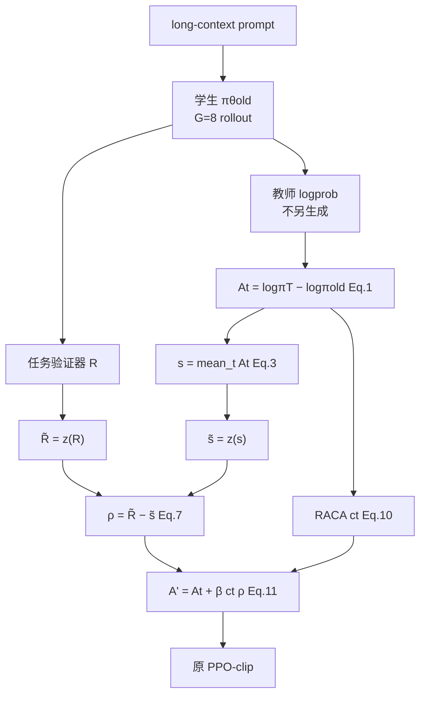
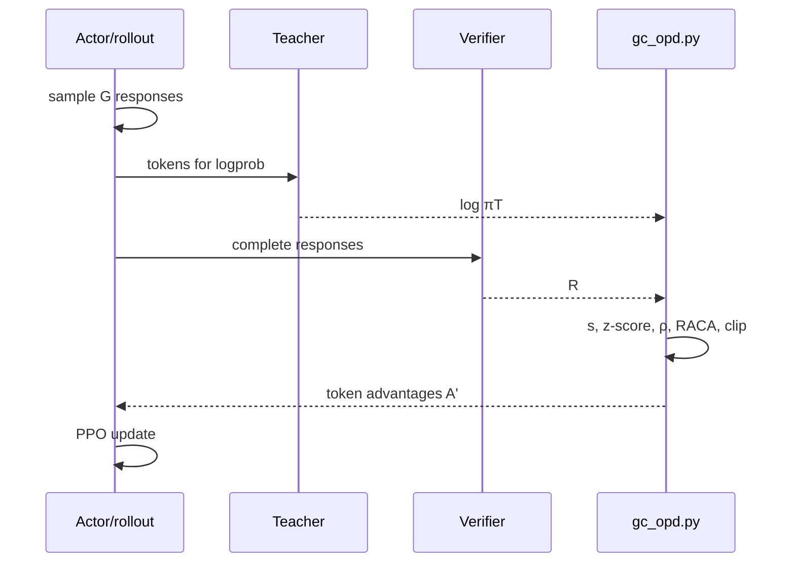
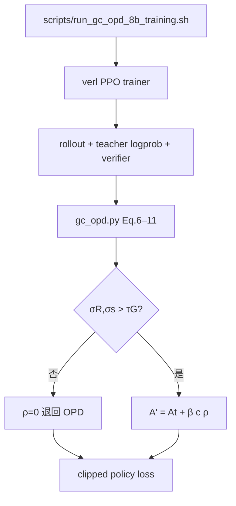

# CODE_PAPER_MAP — GC-OPD

论文：arXiv:2608.19181。代码：https://github.com/SolereZhang/GC-OPD  
本地 PDF：`docs/3_GC-OPD.pdf`。

## 论文模块 ↔ 代码

| 论文 | Eq. / Alg. | 代码 |
|---|---|---|
| Token OPD 优势 $A_t$ | Eq.1 | vanilla OPD log-ratio；`beta=0` 入口 |
| 轨迹分 $s$ | Eq.3 | `verl/verl/trainer/ppo/gc_opd.py` |
| 组 z-score 与 $\rho$ | Eq.6–7, 附录 (14) | 同上 |
| RACA $u_t,c_t$ | Eq.9–10, 附录 (15–16) | 同上 |
| $A'=A+\beta c\rho$ | Eq.11 | GC-OPD 入口 `beta=0.10` |
| 数据 32K 过滤 | §5.1 | `scripts/prepare_golongrl_32k.py` |
| 训练启动 | Table 6 | `scripts/run_gc_opd_{4b,8b}_training.sh` |
| 五基准评测 | §5.1 | `evaluation/run_main_table_evaluation.sh` |
| 冻结 rollout 诊断 | Fig.1 | `verl/examples/gc_opd/analyze_gc_opd_frozen_replay.py` |

OPD 对照：同一实现 `beta=0`。

## 架构图

## 训练时序

## 调用流

仓库无独立「论文方法推理」路径：推理即 Qwen3 generate；方法只改变训练优势。
