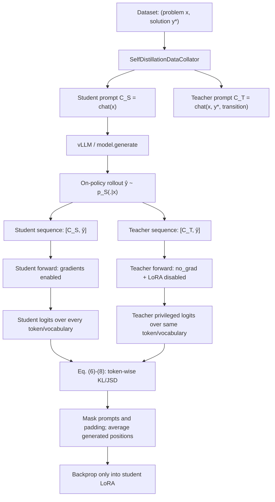

# OPSD 论文理论 ↔ 本地代码逐项映射

> 论文：*Self-Distilled Reasoner: On-Policy Self-Distillation for Large Language Models*（arXiv:2601.18734v3）  
> 代码范围：`algorithm/OPSD`（当前仓库登记的官方子模块；远程训练核心代码与此版本一致）  
> 重点：privileged information 如何进入教师、学生与教师如何在同一轨迹上对齐、梯度到底更新谁。  
> 证据：论文 §3 / Algorithm 1 / Eq. (1)、(6)–(9)，以及本地代码。分析日期：2026-09-10。

## 0. 一句话结论

OPSD 不是“教师先写一份答案，再让学生模仿答案”，而是：

1. 学生只看题目 \(x\)，采样自己的回答 \(\hat y\)；
2. 把同一条 \(\hat y\) 分别接到学生上下文 \(x\) 和教师特权上下文 \((x,y^\star)\) 后；
3. 对每个生成位置 \(n\)，比较两侧对“下一个 token”的完整词表分布；
4. 教师侧仅提供无梯度 soft target，学生侧通过 LoRA 更新；
5. 推理时完全移除 \(y^\star\)，只保留已经内化了教师分布信息的学生。

因此，privileged information 的整合路径是：

```text
reference solution y*
  → 仅编码进 teacher prompt
  → 改变 teacher hidden states / next-token distribution
  → token-wise KL/JSD
  → student-side gradient
  → LoRA 参数
```

它不会被复制进学生 prompt，也不会在推理时出现。

---

## 1. 论文对象与代码对象

### 1.1 数据与两种条件分布

论文使用问题—参考解答数据：

\[
\mathcal S=\{(x_i,y_i^\star)\}_{i=1}^N.
\]

同一个基础语言模型在不同上下文下形成两种 policy：

\[
p_S(\cdot\mid x),\qquad
p_T(\cdot\mid x,y^\star).
\]

代码对应：

- `opsd_train.py:269-288`：加载包含 `problem`、`solution` 的训练数据；
- `data_collator.py:60-64`：取出 `problem → x`、`solution → y^\star`；
- `data_collator.py:66-73`：学生 prompt 只包含题目；
- `data_collator.py:94-110`：教师 prompt 包含题目、参考解答和 transition instruction；
- `opsd_train.py:248`：明确说明无需单独的 teacher model。

### 1.2 “同一个模型”在当前主配置里的精确含义

论文的概念表达是“同一模型、不同条件上下文”。当前代码支持三种教师权重策略：

1. **Dynamic teacher**：教师与学生使用当前权重；
2. **Fixed teacher**：教师禁用 LoRA，使用初始 base model；
3. **EMA teacher**：教师临时换成学生可训练参数的指数滑动平均。

本仓主脚本使用 `--fixed_teacher`：

- `scripts/run_opsd_1b.sh:35`：启用 fixed teacher；
- `opsd_trainer.py:194-200`：fixed teacher 必须配合 PEFT；
- `opsd_trainer.py:674-680`：teacher forward 时调用 `disable_adapter()`；
- `opsd_train.py:167-171`：入口再次校验 fixed teacher + PEFT。

所以主实验更准确地写成：

\[
p_S=p_{\theta_0+\Delta_\phi}(\cdot\mid x),\qquad
p_T=p_{\theta_0}(\cdot\mid x,y^\star),
\]

其中 \(\theta_0\) 是冻结的基础权重，\(\Delta_\phi\) 是正在学习的 LoRA adapter。它们共用一份 base model 内存和架构，但 teacher 不使用学生正在变化的 adapter。

这与论文 §4.1 的实现说明一致：固定 teacher 为 initial policy，以提高稳定性并限制学生偏离初始 policy。

---

## 2. Privileged information 到底如何整合

### 2.1 普通主路径：直接条件化，不做额外编码器或融合层

当 `reason_first=False`（当前默认和主启动脚本实际路径）时，collator 构造：

```text
Student context C_S:
  Problem: x
  Please reason step by step ... \boxed{}

Teacher context C_T:
  Problem: x
  Here is a reference solution:
  === Reference Solution Begin ===
  y*
  === Reference Solution End ===
  [理解参考解答、独立推导同一答案的 transition prompt]
```

对应 `data_collator.py:66-73` 和 `data_collator.py:94-110`。

这里没有：

- 单独的 privileged encoder；
- cross-attention 融合模块；
- reward model；
- 把 \(y^\star\) 作为 labels 做 SFT；
- 把参考答案 token 直接拼进学生序列。

整合完全依赖 decoder-only Transformer 的普通自注意力：\(y^\star\) 作为教师前缀 token 改变教师 hidden states，进而改变教师在学生轨迹每个位置上的 next-token distribution。

### 2.2 为什么 reference solution 不是训练 target

真正用于比较的 continuation 不是 \(y^\star\)，而是学生自己采样的 \(\hat y\)：

\[
\hat y\sim p_S(\cdot\mid x).
\]

代码证据：

- `opsd_trainer.py:1365-1386`：只从 `student_prompts` 生成 on-policy completion；
- `opsd_trainer.py:1392-1396`：学生序列为 `[student_prompt][generation]`；
- `opsd_trainer.py:1397-1400`：教师序列为 `[teacher_prompt][同一个 generation]`。

关键语句在逻辑上是：

```python
generation_ids = generated_ids[:, student_prompt_len:]
student_input_ids = generated_ids
teacher_full_ids = cat([teacher_prompts, generation_ids], dim=1)
```

这确保两侧都在回答同一个问题：

> 在已经走到学生前缀 \(\hat y_{<n}\) 的状态下，下一个 token 应该如何分布？

差别只在于教师额外知道 \(y^\star\)。

### 2.3 `reason_first=True` 的增强路径

代码还提供一个可选的显式 rationalization 阶段：

1. 教师先看到 \(x+y^\star\)；
2. 生成一段“分析参考解答为什么成立”的 reasoning；
3. 将该 reasoning 与 transition tokens 拼回教师上下文；
4. 再在学生 rollout 上进行分布对齐。

对应：

- `data_collator.py:76-90`：构造 teacher reasoning prompt；
- `data_collator.py:140-175`：输出 reasoning prompt 与 transition tokens；
- `opsd_trainer.py:1307-1363`：先生成 reasoning，再重建 teacher prompt。

要注意：本仓 `scripts/run_opsd_1b.sh` 没有传 `--reason_first`，所以当前主训练不是这条显式两阶段路径。主路径已经在 teacher prompt 内要求“理解参考解答后独立推导”；`reason_first` 则额外把“理解过程”先显式生成出来。

### 2.4 Privileged information 的边界

训练时：

\[
y^\star \rightarrow C_T \rightarrow p_T
\rightarrow D(p_T\|p_S)\rightarrow\nabla_\phi.
\]

推理时：

\[
x\rightarrow p_{\theta_0+\Delta_\phi}(\cdot\mid x).
\]

因此它属于 **learning using privileged information (LUPI) / context distillation**：特权信息只在训练教师条件中存在，其效果通过概率分布与梯度被压缩到学生参数中。

---

## 3. 一次训练 step 的完整数据流



按代码调用顺序：

1. `SelfDistillationDataCollator.__call__` 产生两个 prompt；
2. `OPSDTrainer.training_step` 从学生 prompt 采样 \(\hat y\)；
3. 构造 `[C_S,\hat y]` 与 `[C_T,\hat y]`；
4. `SFTTrainer.training_step` 调用覆写的 `compute_loss`；
5. `compute_loss` 做 student forward；
6. `torch.no_grad()` 下做 teacher forward；
7. 截取相同数量、相同语义位置的 logits；
8. `generalized_jsd_loss` 计算 divergence；
9. 只更新 student LoRA。

---

## 4. 学生与教师如何对齐

### 4.1 不是按绝对 position id 对齐，而是按 continuation 的相对 token 位置对齐

教师 prompt 比学生 prompt 长，因为多了 \(y^\star\)。因此两边相同生成 token 的绝对序列位置不同：

```text
student: [ C_S (Ls tokens) ][ ŷ1 ][ ŷ2 ] ... [ ŷL ]
teacher: [ C_T (Lt tokens) ][ ŷ1 ][ ŷ2 ] ... [ ŷL ]
                               Lt > Ls
```

`compute_loss` 分别用各自 prompt 长度切 logits：

- `opsd_trainer.py:632-636`：读取 `student_prompt_len`、`teacher_prompt_len`；
- `opsd_trainer.py:645`：
  `student_logits[:, student_prompt_len - 1 : -1, :]`；
- `opsd_trainer.py:688`：
  `teacher_logits[:, teacher_prompt_len - 1 : -1, :]`。

自回归 logits 在位置 \(k\) 预测 token \(k+1\)，所以从 `prompt_len - 1` 开始，恰好取得：

```text
predict ŷ1, predict ŷ2, ..., predict ŷL
```

两侧得到相同 shape：

\[
[B,L,V],
\]

其中 \(B\) 是 batch size，\(L\) 是 student completion 长度，\(V\) 是词表大小。

### 4.2 对齐的是完整词表分布，不只是学生实际采样 token

默认主路径没有开启 `use_tinker_loss`，所以保留两侧完整 logits `[B,L,V]`，送进 `generalized_jsd_loss`：

- `opsd_trainer.py:654-657`：保留 student full-vocabulary logits；
- `opsd_trainer.py:695-698`：保留 teacher full-vocabulary logits；
- `opsd_trainer.py:734-745`：调用 generalized JSD。

这对应论文 Eq. (6)：

\[
D(p_T\|p_S)(\hat y\mid x)
=\frac1{|\hat y|}\sum_n
D\left(
p_T(\cdot\mid x,y^\star,\hat y_{<n})
\;\|\;
p_S(\cdot\mid x,\hat y_{<n})
\right).
\]

“相同学生前缀”是对齐成立的核心。如果教师改为评估自己的生成轨迹，两边访问的状态不同，就重新引入 off-policy mismatch。

### 4.3 Prompt 与 padding 不参与 loss

`training_step` 构造 labels 时：

- `opsd_trainer.py:1409-1417`：学生 prompt token 设为 `-100`，padding 也设为 `-100`；
- `opsd_trainer.py:465-468`：JSD 仅保留 `labels != -100` 的位置；
- `opsd_trainer.py:471-474`：除以有效生成 token 数。

所以参考解答和两种 prompt 都只影响条件分布，本身不会作为待预测 token 进入 loss。

---

## 5. 损失函数逐项对应

### 5.1 论文 Eq. (7)：Generalized JSD

\[
\operatorname{JSD}_\beta(p_T\|p_S)
=\beta D_{\mathrm{KL}}(p_T\|m)
+(1-\beta)D_{\mathrm{KL}}(p_S\|m),
\quad
m=\beta p_T+(1-\beta)p_S.
\]

代码 `opsd_trainer.py:380-477`：

- `421-428`：temperature scaling；
- `437-439`：计算 student / teacher log-probability；
- `447-452`：在 log space 用 `logsumexp` 构造 mixture，避免直接概率求和的数值问题；
- `455-460`：计算两个 KL 分量；
- `465-477`：mask 与 reduction。

### 5.2 当前主配置 `beta=0` 实际是 forward KL

`scripts/run_opsd_1b.sh:22` 设置 `--beta 0`。代码在 `opsd_trainer.py:441-442` 走：

\[
D_{\mathrm{KL}}(p_T\|p_S).
\]

直觉上，它强迫学生覆盖教师认为可能的 token；如果教师对某个正确分支有较大概率，而学生几乎不给概率，会受到较强惩罚。

`beta=1` 则对应 \(D_{\mathrm{KL}}(p_S\|p_T)\)；中间值才是真正的 generalized JSD mixture。

### 5.3 Point-wise KL/JSD clipping

代码 `opsd_trainer.py:462-464`：

```python
jsd = jsd.clamp(max=token_clip)
```

此时 `jsd` 尚为 `[B,L,V]`，因此 clipping 是对“每个 token 位置 × 每个 vocabulary 项”的 divergence summand 做上界裁剪，再跨词表和序列求和，而不是对最终 scalar loss 裁剪。

目的：论文/README 指出 `wait`、`think` 等风格 token 的 KL 可比数学 token 高 6–15 倍，若不裁剪，训练方向容易被风格差异支配。

重要细节：KL 的逐词表 summand 可以为负；代码只裁上界，不裁下界。因此裁掉大的正项后，求和结果可能为负。这不意味着整体 KL 理论为负，而是 clipped surrogate 已不再是严格的 KL。

### 5.4 梯度只经过学生

- student forward：`opsd_trainer.py:638-642`，保留计算图；
- teacher forward：`opsd_trainer.py:682-687`，位于 `torch.no_grad()`；
- fixed teacher：同一 context 中额外 `disable_adapter()`；
- loss 的 student logits 未 detach，teacher logits 无计算图。

因此：

\[
\nabla_\phi\mathcal L
=\frac{\partial\mathcal L}{\partial z_S}
\frac{\partial z_S}{\partial\phi},
\qquad
\frac{\partial\mathcal L}{\partial z_T}=0.
\]

### 5.5 论文 Eq. (9) 的 sampled-token 备选路径

传入 `--use_tinker_loss` 时，代码不保存完整 `[B,L,V]` 分布，而只 gather 实际采样 token 的 log-prob：

\[
A_n=\log p_T(\hat y_n|\cdots)-\log p_S(\hat y_n|\cdots),
\]

\[
\mathcal L=-\frac1L\sum_n
\operatorname{stopgrad}(A_n)\log p_S(\hat y_n|\cdots).
\]

对应 `opsd_trainer.py:648-653`、`690-695`、`702-727`。`advantage.detach()` 精确实现论文 Eq. (9) 中“不对 advantage 求导”。

论文实验表明 full-vocabulary 版本更强，但 sampled-token 版本显存复杂度更低。

---

## 6. 极小数值例子：privileged signal 如何变成学生梯度

设：

- \(B=1\)；
- 学生 rollout 只有两个 token：\(\hat y=[a,b]\)；
- 词表只有 \(\{a,b,c\}\)；
- 使用当前主配置 `beta=0`，即 \(D_{KL}(p_T\|p_S)\)。

在第一个生成位置，学生只看题目，教师还看过正确解答：

\[
p_S=[0.60,0.30,0.10],\qquad
p_T=[0.15,0.75,0.10].
\]

该位置 loss：

\[
D_{KL}(p_T\|p_S)
=0.15\ln\frac{0.15}{0.60}
+0.75\ln\frac{0.75}{0.30}
+0.10\ln\frac{0.10}{0.10}
\approx0.479.
\]

虽然学生实际采样的是 token \(a\)，full-vocabulary distillation 仍然告诉学生：

- 降低 \(a\) 的概率；
- 显著提高 \(b\) 的概率；
- \(c\) 基本不变。

这就是 privileged solution 的价值：它不只给“这个采样 token 好/坏”的标量，而是在学生真实访问到的每个 reasoning state 上，给出整个词表的纠偏方向。

若使用 sampled-token 路径，则只看到：

\[
A_1=\ln0.15-\ln0.60=-1.386,
\]

信息明显更少，无法直接得知应该把概率质量主要转移给 \(b\) 还是 \(c\)。

---

## 7. 论文 Algorithm 1 ↔ 代码调用映射

1. **定义 student policy \(p_S(\cdot|x)\)**  
   `data_collator.py:66-73` 创建 student prompt。

2. **定义 privileged teacher \(p_T(\cdot|x,y^\star)\)**  
   `data_collator.py:94-110` 创建 teacher prompt。

3. **采样 minibatch**  
   Hugging Face `Trainer` dataloader + `SelfDistillationDataCollator`。

4. **采样 \(\hat y\sim p_S\)**  
   `opsd_trainer.py:1365-1386`；vLLM 路径具体在 `854-1040`。

5. **让两侧评估同一 \(\hat y\)**  
   `opsd_trainer.py:1392-1407` 拼接两条 full sequence。

6. **分别取得 token-wise logits**  
   `opsd_trainer.py:638-698`。

7. **计算 Eq. (6)–(8)**  
   `opsd_trainer.py:380-477`、`734-745`。

8. **只更新 student**  
   teacher 在 `no_grad` 下；student LoRA 经 Trainer/Accelerate/DeepSpeed 反向传播。

9. **将更新后 student 同步给 rollout engine**  
   `opsd_trainer.py:96-116` 的 callback 触发 `_move_model_to_vllm`；  
   `opsd_trainer.py:1175-1244` 临时 merge LoRA、加载到 vLLM、再 unmerge。

这最后一步很重要：否则“训练中的 student”与“采样轨迹的 rollout policy”会滞后，严格意义上不再完全 on-policy。

---

## 8. Teacher / Student / vLLM 三个角色不要混淆

### Student scorer

- Hugging Face 训练模型；
- base + 当前 LoRA；
- 对 `[C_S,\hat y]` 前向；
- 保留梯度。

### Privileged teacher scorer

- 仍是同一个 Hugging Face 模型对象；
- 主配置中临时关闭 LoRA，等价于 initial base policy；
- 对 `[C_T,\hat y]` 前向；
- `torch.no_grad()`。

### Rollout generator

- colocated vLLM engine；
- 只接收 student prompt；
- 用同步后的 base + LoRA merged 权重采样 \(\hat y\)；
- 不参与 backprop。

所以“一个模型自蒸馏”不等于“训练时只有一次 forward”。每个 batch 至少包含：

1. student rollout generation；
2. student scoring forward；
3. privileged teacher scoring forward。

---

## 9. Thinking 与 privileged context 是两个不同维度

`data_collator.py` 支持：

- `student_thinking=False`；
- `teacher_thinking=True`。

对应 `opsd_train.py:97-110` 和 `data_collator.py:70-72, 106-109`。

这表示：

- privileged：教师是否看到 \(y^\star\)；
- thinking mode：chat template 是否启用模型自身的 thinking 行为。

两者不能混为一谈。教师即使 `enable_thinking=False`，只要 prompt 中仍有 \(y^\star\)，依然是 privileged teacher；学生即使开启 thinking，也仍看不到 \(y^\star\)。

当前启动脚本未显式覆盖这两个参数，因此采用代码默认值：student non-thinking、teacher thinking。评测脚本则按 thinking-mode 设置执行。比较训练与论文表格时应核对具体版本与解码设置，避免将 thinking/non-thinking 两组结果混用。

---

## 10. 论文理论与当前代码的差异 / 注意事项

### 10.1 “same parameters \(\theta\)”是概念定义，主实现是 fixed initial teacher

论文方法定义写 \(p_T=p_\theta(\cdot|x,y^\star)\)、\(p_S=p_\theta(\cdot|x)\)，但实验细节固定 teacher 为 initial policy。主代码通过禁用 LoRA 实现后者。

因此训练中 teacher 并不会随着 student adapter 一起更新。称“共享 base parameters、学生另有可训练 adapter”比“完全相同参数”更精确。

### 10.2 `reason_first` 是可选扩展，不是主脚本默认路径

论文 Figure 2 使用 “rationalize and generate its own solution” 的语言；当前普通路径通过一段 transition prompt 实现“读完参考解答后独立推导”，但不先显式生成 rationalization。只有 `--reason_first` 才执行独立 reasoning generation phase。

### 10.3 论文更新版超参数与仓库示例可能不完全一致

论文 Appendix Table 6 给出 8×A100、effective batch 32、LR \(2\times10^{-5}\)、completion 2048；本地 `run_opsd_1b.sh` 示例是 4 processes、LR \(5\times10^{-6}\)、completion 1024、temperature 1.1。复现实验时必须以具体脚本与日志为准，不能只引用论文表格。

### 10.4 Clipped objective 不再是严格 divergence

逐 vocabulary summand 截断后，scalar 可能为负。它是稳定训练的 surrogate，不应把日志中的负 loss 误判成实现错误。

### 10.5 Privileged teacher 不保证永远正确

它看到正确解答，但仍需有足够模型能力去理解解答，并对学生当前前缀给出有意义的 next-token distribution。论文的 scale ablation 正是在验证这一前提；过难问题或过小模型可能产生低质量教师信号。

### 10.6 `lmbda` / `seq_kd` 在当前 OPSD 主路径中没有参与 loss

`opsd_trainer.py:181,185` 会保存 `args.lmbda` 与 `args.seq_kd`，启动脚本也传入
`--lmbda 1`；但在当前文件中它们之后没有进入 `training_step`、`compute_loss` 或
`generalized_jsd_loss`。同时 `training_step` 固定 `on_policy=True`。

因此，对这份代码而言，真正决定主损失的是 `beta`、`temperature`、
`top_k_loss` 和 `jsd_token_clip`；不要把 `lmbda` 解读为论文公式中仍然生效的
on/off-policy 混合系数。这是从 GOLD 基类接口保留下来的配置痕迹。

---

## 11. 最简心智模型

把 OPSD 想成“开卷老师纠正闭卷学生的草稿”：

1. 闭卷学生先写自己的草稿 \(\hat y\)；
2. 开卷老师拿着标准解答 \(y^\star\)，但不重写一份标准答案；
3. 老师沿着学生草稿逐字阅读，在每个位置给出“下一字应该怎么分配概率”；
4. 学生在自己真正会走到的状态上学习这些 dense corrections；
5. 考试时标准解答被拿走，学生依靠已经更新的参数独立作答。

---

## 12. 推荐阅读顺序

1. 先看 `data_collator.py:60-110`：理解两种上下文；
2. 再看 `opsd_trainer.py:1287-1440`：理解 rollout 与同轨迹拼接；
3. 再看 `opsd_trainer.py:625-751`：理解双 forward 与梯度边界；
4. 最后看 `opsd_trainer.py:380-477`：理解 KL/JSD、mask、clipping；
5. 对照论文 Algorithm 1、Eq. (6)–(9)。

---

## 13. 三个容易混淆的点：reason_first、transition tokens、Loss 很快过零

### 13.1 `reason_first` 生成的那一段 reasoning 是什么

先强调：**当前 1.7B / 4B 正式训练没有开 `--reason_first`。** 主路径是把参考解答直接放进教师 prompt，让模型在一次 forward 里“默读” \(y^\star\)。`reason_first=True` 才会额外生成一段分析文字。

用一道极小例题说明。

```text
x  = 一个袋子里有 3 个红球、2 个蓝球。随机抽 1 个，抽到红球的概率是多少？
y* = 总共 5 个球，红球 3 个，所以概率是 3/5。
```

学生 prompt 永远只有题目：

```text
Problem: ...红球的概率是多少？
Please reason step by step, and put your final answer within \boxed{}.
```

学生可能采样出错误草稿 \(\hat y\)：

```text
一共 3+2=5。红球更多，所以答案是 3。
\boxed{3}
```

若开启 `reason_first`，教师**先不看学生草稿**，而是单独生成一段“为什么这份参考解答成立”的分析。对应 `data_collator.py:30-35` 的指令：

> 参考推理已经得到正确答案。请分析这份解答的关键步骤和策略。不要用 `<think>`。不要自己重新推一遍。只解释上面的参考解答。

教师可能生成：

```text
关键点有两个：分母是全部球的数量 3+2=5，分子是红球数量 3。
这是古典概型，每球等可能。因此概率是 3/5，不是 3。
```

这段文字**不是最终答案，也不是学生要模仿的 target sequence**。它只是把 \(y^\star\) 翻译成教师自己的内部理解，然后拼回教师前缀。之后教师仍然沿着**学生草稿** \(\hat y\) 逐 token 打分。

所以它的作用是：

```text
y*  --显式说出来-->  teacher analysis
                     ↓
              再去看学生的 ŷ
                     ↓
              给出 p_T(next token | x, y*, analysis, ŷ_<n)
```

主路径（未开 `reason_first`）把“理解 y*”压缩成一次前向，不把分析写出来。论文说的 *rationalization is done implicitly through one forward pass* 指的就是这条主路径。

### 13.2 这和 Thinking 模式不是一回事

| 维度 | 控制开关 | 作用 |
|---|---|---|
| Privileged | teacher prompt 里有没有 \(y^\star\) | 教师是否开卷 |
| Thinking | `student_thinking` / `teacher_thinking` → `enable_thinking` | chat template 是否允许 Qwen3 的 `<think>` |
| reason_first | `--reason_first` | 是否先**额外生成**一段对 \(y^\star\) 的分析 |

三者正交：

- Thinking 开：模型按 Qwen3 模板进入思考块，可能输出 `<think>...</think>`。
- `reason_first` 的分析指令写明 **Do NOT use `<think>` tags**，它要的是一段普通说明文，不是 thinking 块。
- 教师即使 `teacher_thinking=False`，只要 prompt 里有 \(y^\star\)，仍是 privileged teacher。
- 学生即使 `student_thinking=True`，也看不到 \(y^\star\)。

当前主脚本默认是：**student non-thinking，teacher thinking，reason_first 关闭**。评测脚本按 thinking-mode 跑 AIME。比较分数时不要把 non-thinking 表和 thinking 表混在一起。

### 13.3 `transition tokens` 是什么

它既不是题目 context，也不是 \(y^\star\)，更不是学生答案。它是一段**角色切换指令**，告诉教师：

> 参考解答已经读完了。现在不要抄它，用自己的话去面对后面那条学生轨迹。

原文在 `data_collator.py:37-43`。`reason_first=True` 时，这段话被单独 tokenize，成为 `teacher_transition_tokens`（`data_collator.py:160-175`），再拼到分析文字后面：

```text
[分析 y* 的 prompt]  [生成出来的 analysis]  [transition tokens]  [学生的 ŷ]
       ↑                      ↑                    ↑                 ↑
   题目+参考解答           显式理解过程         切换到教学/评分      被对齐的草稿
```

对应拼接代码：`opsd_trainer.py:1345-1352`。

主路径没有单独的 `teacher_transition_tokens` 张量，但**同一段 transition 文本已经写进教师 user message**（`data_collator.py:97-103`）：

```text
[Problem x]
[Reference Solution y*]
[transition 指令]
[Please reason step by step ... \boxed{}]
[学生的 ŷ]
```

可以把它想成考试里监考老师说的那句：

> 标准答案你已经看过了。现在合上，对着学生这份草稿，逐句判断下一步该怎么写。

没有这段话，教师容易继续“复述 y*”；有了它，教师被推到“评价/纠正学生轨迹”的条件分布上。Loss 只加在最后的 \(\hat y\) 上，transition 本身被 mask 掉。

### 13.4 为什么 Loss 大约在 step 8 就过零

这**不表示 8 步已经训完**。1.7B 的 AIME24 仍从 Base 49.44% 升到 checkpoint-100 的 54.17%；Loss 过零后还继续下降到约 `-0.0077`。

三个叠加原因：

1. **起跑点就已经很接近。**  
   `--fixed_teacher` 下，教师是初始 base，学生是 base + 刚初始化、接近零的 LoRA。两边几乎是同一个模型，只是上下文不同，所以 step 2 的 loss 只有 `0.0048 / 0.0052`，不是 SFT 那种从 2.0 往下降。

2. **记录的不是严格 KL，而是逐词表 clip 后的 surrogate。**  
   `beta=0` 时每项是 \(p_T(v)\log\frac{p_T(v)}{p_S(v)}\)。学生低估教师的 token，这项为正；学生高估的 token，这项为负。`jsd.clamp(max=0.05)` 只裁正项、不裁负项。风格词（wait / think）的大正项被砍掉后，负项相对更显眼，总和可以过零变负。

3. **过零只说明“被 clip 后的平均残差变号”，不说明分布已经对齐完。**  
   真正还在学的是那些没被 clip 掉的、较小的数学相关差异。所以曲线在 step 8 过零后仍缓慢变负，直到 step 100。

读这张图时：看的是**clipped surrogate 的趋势**（先快降、后饱和），不要把“穿过 0”读成“已经最优”。

### 13.5 负 Loss 的公式、代码与三词表示例

主配置 `--beta 0`，论文 Eq. (7) 退化成 forward KL：

\[
D_{\mathrm{KL}}(p_T\|p_S)
=\sum_{v\in\mathcal V}
p_T(v)\,\ln\frac{p_T(v)}{p_S(v)}.
\]

理论 KL 对完整词表求和后 **一定非负**。但代码算的不是先求和再 clip，而是先对每个词表项 clip。

`opsd_trainer.py:441-442`：

```python
jsd = F.kl_div(student_log_probs, teacher_log_probs, reduction="none", log_target=True)
```

`F.kl_div(input, target, log_target=True)` 的逐元素结果是：

\[
p_T(v)\,(\ln p_T(v)-\ln p_S(v))
=p_T(v)\,\ln\frac{p_T(v)}{p_S(v)}.
\]

shape 为 `[B, L, V]`。随后 `opsd_trainer.py:462-464`：

```python
jsd = jsd.clamp(max=token_clip)   # token_clip = 0.05
```

README 写明：clip 作用在 **point-wise / 每个 vocabulary 项**，不是作用在 \(\sum_v\) 之后的 token KL 上。

单项目 \(p_T\ln(p_T/p_S)\) 在 \(p_T<p_S\) 时本来就是负数。真正的 KL 靠大正项把它们抵消成 \(\ge 0\)。把大正项封顶到 \(0.05\)、负项原样保留，求和就可以变负。最后 `jsd.sum() / mask.sum()` 是对 token 数求平均，不是对 \(N\times V\) 求平均，因此记录值就是「平均每个生成位置的 clipped 词表求和」。

**三词表示例**（一个生成位置，词表 \(\{3,\,5,\,\texttt{wait}\}\)）：

| token | \(p_S\) | \(p_T\) | 未 clip 的 \(p_T\ln(p_T/p_S)\) | clip 后 |
|---|---:|---:|---:|---:|
| `3` | 0.60 | 0.05 | \(0.05\ln(0.05/0.60)\approx -0.124\) | **-0.124** |
| `5` | 0.35 | 0.55 | \(0.55\ln(0.55/0.35)\approx 0.249\) | **0.050** |
| `wait` | 0.05 | 0.40 | \(0.40\ln(0.40/0.05)\approx 0.832\) | **0.050** |
| 求和 | 1 | 1 | **KL ≈ 0.957 > 0** | **surrogate ≈ -0.024 < 0** |

`wait` 是风格词：教师 thinking 模式下很爱用，学生非 thinking 几乎不用，这一项单独就能到 0.83，是数学词 `5` 的三倍以上。clip 之后风格项和数学项被压成同样的 0.05，负项 `-0.124` 却不动，总和变负。

这就是曲线从 `0.005` 降到 `-0.0077` 的机制：不是 logger 写错符号，而是 **clipped forward-KL surrogate**。未 clip 的真实 \(D_{\mathrm{KL}}(p_T\|p_S)\) 不会为负，但代码没有把那个量记进 trainer_state。

