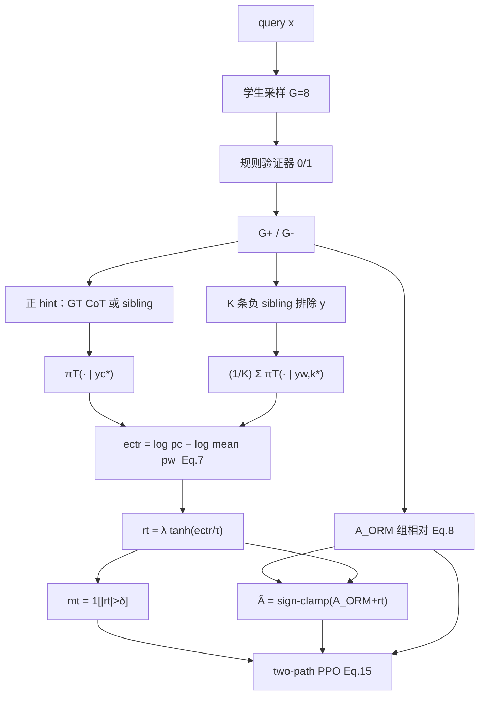
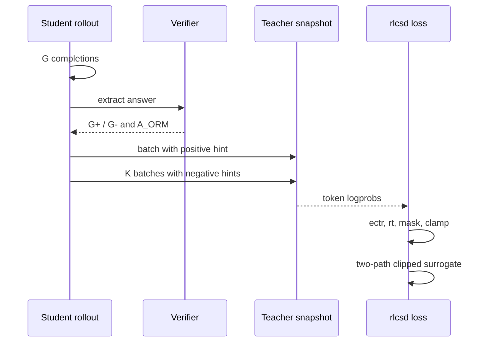
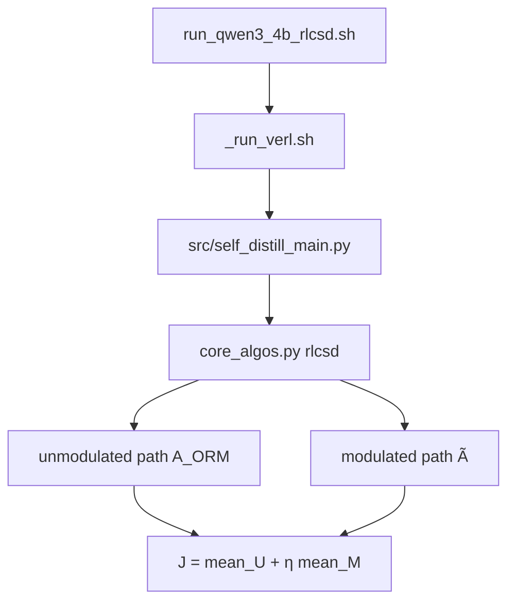

# CODE_PAPER_MAP — RLCSD

论文：arXiv:2606.11709。代码：https://github.com/THU-BPM/RLCSD  
本地 PDF：`docs/9.4_RLCSD.pdf`。

## 论文模块 ↔ 代码

| 论文 | Eq. | 代码 |
|---|---|---|
| 特权模板 | §3.3 | `src/opsd_format.py` |
| 正/负 hint 数据路径 | Eq.7 | `src/self_distill_main.py` |
| $e_{\mathrm{ctr}}$ 与 two-path 损失 | Eq.7, 9–17 | `third_party/verl/verl/trainer/ppo/core_algos.py` `@register_policy_loss("rlcsd")` |
| 验证器奖励 | §3.3 | `src/verl_reward.py` |
| YAML 方法选择 | `method: rlcsd` | `configs/math_deepmath/`、`configs/logic_kk/` |
| 启动 | — | `scripts/_run_verl.sh`；`scripts/math_deepmath/run_qwen3_4b_rlcsd.sh` |
| 插件 OPSD/RLSD+contrast | Eq.18–19 | `opsd_ectr` / `rlsd_ectr` |
| 数据下载 | — | `scripts/download_data.py` → `Leyiii/RLCSD` |

## 架构图

## 训练时序

## 调用流

## Paper ↔ Code gaps

核对 YAML，不要混用 PDF 与 README：

- 教师：PDF snapshot 每 10 step；README 写 fixed
- $\tau,\eta$：PDF $0.02,1.0$；README $1.3,0.5$
- 主表数字两套

推理：方法是训练损失；部署即原模型 generate。
