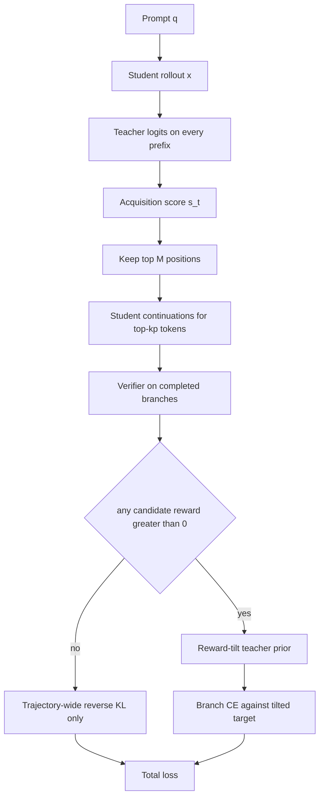
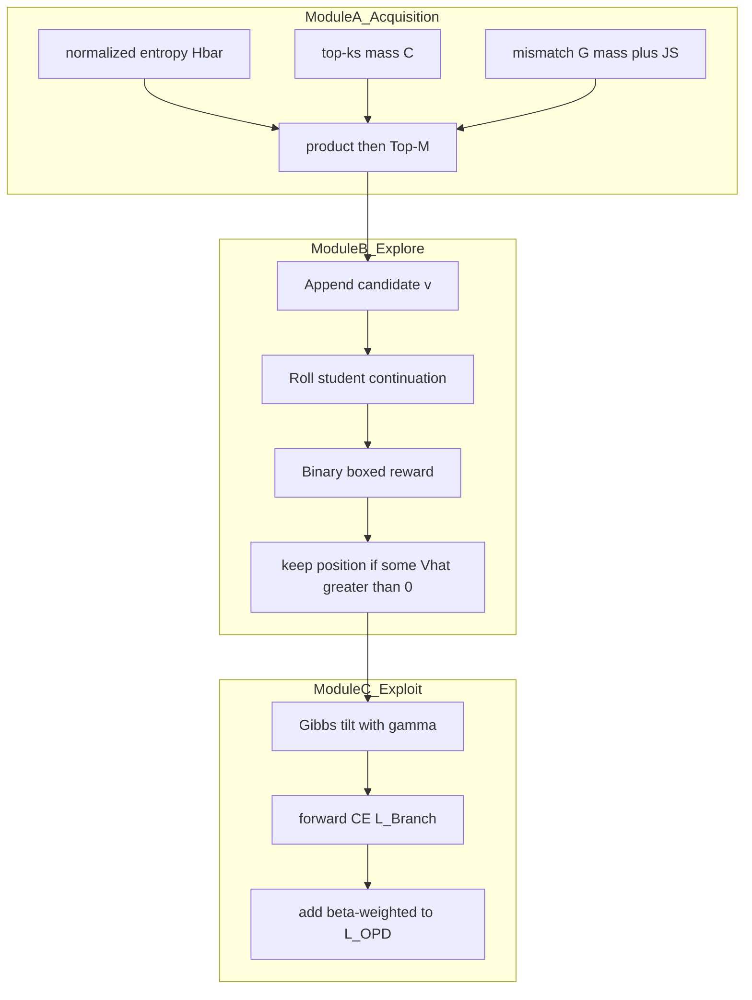

# 组会汇报：SPOT（Sparse Probing and Outcome-Calibrated OPD）

论文：Qu et al. *SPOT: Sparse Probing and Outcome Calibration for On-Policy Distillation*. arXiv:2608.04419v1, 2026-08-05.  
PDF：`/home/liying/Downloads/9.8 SPOT.pdf`（仓库副本 `docs/9.8 SPOT.pdf`）。  
代码：本地 `algorithm/SPOT/`（[github.com/QuZikun/SPOT](https://github.com/QuZikun/SPOT)，verl fork）。框架：verl + SGLang 异步 rollout + FSDP2。  
证据口径：arXiv HTML + 附录 B–C。不确定处标 `[估计]`。

打开本文件用 **Preview**：公式应是排版，下面的 Mermaid 应是图。

---

## 0. 一句话贡献

Vanilla OPD 的 reverse-KL 会把质量压到教师主续写上；EOPD 只用教师熵开门，分不清「几个靠谱候选」还是「长尾糊」，也不看学生会不会已经覆盖，更不看哪个 token 能让 **学生自己** 续写出正确答案。SPOT 用 $s_t=\bar H_T\cdot C^{k_s}\cdot G^{k_s}$ 把有限探测预算分到 $M$ 个位置，对学生续写做验证器打分，再用 KL 信赖域里的闭式 reward-tilt 当局部目标。只在至少有一个正奖励候选的位置加 branch 损失。

---

## 1. 任务定义与动机剖析

### 1.1 任务是什么

后训练 **On-Policy Distillation**：学生 $\pi_\theta$ 自己生成轨迹；冻结教师 $\pi_T$ 在学生前缀上给 token 级监督。部署时只有学生在生成。

- 教师：Qwen3-8B（thinking 关闭）
- 学生：Qwen3-0.6B-Base、1.7B-Base（MATH 7500 题）；Qwen3-4B-Base（DAPO-Math-14k）；附录还有 Llama-3.2-3B-Instruct 学生 + Llama-3.1-8B-Instruct 教师
- 验证器：规则化 boxed 答案匹配（训练探测与评测都用 Math-Verify 一类符号等价）

### 1.2 在解决什么问题

OPD 已经解决了 off-policy 蒸馏的 exposure bias，但 reverse-KL 是 mode-seeking：教师一不确定，学生仍被推到教师最喜欢的那一个续写，**Pass@k 覆盖不足**。问题拆成两个耦合决策：**在哪探测**（预算）、**蒸什么**（局部目标）。

### 1.3 Motivation

EOPD 在高熵位置加 top-$k$ 前向 KL，覆盖变好，但熵是标量：

- 分不清质量集中在几个 token，还是摊在长尾
- 不看学生是否已经覆盖/同序这些候选
- 教师局部 $\pi_T(v\mid c_t)$ **不保证** 学生接上 $v$ 之后能做对

探测一个候选 = 追加该 token + 学生续写 + 验证器，贵。所以要用轻量分数把预算花在「教师有几个靠谱选项、学生还没学会、且事后验证器能分出胜负」的位置。

### 1.4 现有方法局限

| 方法族 | 作用位置 | 为何不够（对上后文模块） |
|---|---|---|
| KD / 序列蒸馏 | 教师轨迹上的 FKL/CE | 前缀分布不是学生的 → 不是本文设定 |
| Vanilla OPD | 全位置 reverse-KL | 欠覆盖其他可行续写 → 需要模块 C 的 branch 目标 |
| EOPD | 熵阈值 + 教师 prior 的 FKL | 熵$\neq$紧凑候选；prior$\neq$下游对错 → 需要模块 A 的 $C,G$ 和模块 B 的 $\hat V$ |
| GRPO | 轨迹级组相对奖励 | 无 token 级教师、无局部覆盖 → 对照而非替代 |
| TGOPD | prompt 级教师门 | 整题开关，不在 token 上校准续写 |
| FlowBalance | 同模型特权能量 + TB | 无外部教师、不探测学生分支 |

### 1.5 例子（先看旧方法错）

前缀停在「所以选」。教师：

$$
\pi_T(\text{substitution})=0.45,\quad
\pi_T(\text{induction})=0.40,\quad
\text{其余长尾}=0.15.
$$

熵可以很高。学生已经把 $0.85$ 的质量都放在这两个词上且排序相同 → 再蒸 FKL 浪费探测。若学生几乎只敢说 substitution，而 induction 才是当前学生能走通的路：教师 prior 仍偏向 substitution。SPOT：位置分数因 $C^{k_s}$ 大、$G^{k_s}$ 大而入选；各采 1 条续写，induction 对、substitution 错；tilt 后局部目标把质量拨向 induction，但仍按教师组内相对比保留形状（附录命题 A.7，二值验证器时整组 KL 只花在对/错两团之间）。

---

## 2. 方法论树状拆解

**为什么是这些工具**：探测预算是 $M\times k_p\times N_p$ 条续写，必须先 **acquisition**。三项相乘是软合取：任一因子接近 0 则不探。下游价值用学生自己的 continuation 估计，因为部署时是学生在写。目标在单纯形 $\Delta(S^{k_p})$ 上最大化 $\mathbb{E}[\hat V]$ 且 KL 不离开教师 prior，对偶给出 Gibbs tilt，闭式、无额外网络。$B^+$ 门：全错则不加监督，避免在不可行分叉上硬蒸。

创新落在一级：**acquisition–exploration–exploitation 拆开 where / what**。二级是乘积分数和 reward-tilt。三级是 $M=2$、$k_s=16$、$k_p=4$、$N_p=1$、mask 空白/标点。PPO clip 与 verl 栈共享，**不是** 贡献。

```text
SPOT
|-- Module A  Acquisition：where to probe
|   |-- 二级：st = Hbar_T * C_ks * G_ks
|   |-- 三级：C = 教师 top-ks 质量；G = 质量缺口 + JS 形状
|   `-- 三级：mask 特殊/pad/空白/标点；B = Top-M
|-- Module B  Exploration：学生续写估 V
|   |-- 二级：对 Skp 每个 v，采样 Np 条 y ~ pi_old(.|ct,v)
|   `-- 三级：Vhat_t(v)=E[R]；保留 B+ = 至少一正奖励的位置
`-- Module C  Exploitation：蒸什么
    |-- 二级：rho* ∝ piT_bar * exp(gamma Vhat)（Eq.10）
    `-- 三级：L = mean L_OPD + (beta / |B+|) sum L_Branch
```

模块交互：A 只决定探测集合 $B$，不改损失。B 产出 $\hat V$ 和门 $B^+\subseteq B$。C 在 $B^+$ 上把教师 prior 扭成 $\tilde\pi_T$，与全序列 OPD **相加**（不是互斥路由）。$B^+=\emptyset$ 时退回 Vanilla OPD。

顶层数据流：



对应分数（图中 Score）：

$$
s_t=\bar H_T(c_t)\cdot C_t^{k_s}\cdot G_t^{k_s}.
$$

模块内部展开：



训练一步时序：

```mermaid
sequenceDiagram
  participant Stu as StudentFrozen
  participant Tch as Teacher
  participant Ver as Verifier
  participant Opt as TrainableStudent
  Stu->>Stu: sample full x
  loop every prefix
    Tch-->>Stu: pi_T and entropy
  end
  Stu->>Stu: score s_t and pick B
  loop each t in B and v in top-kp
    Stu->>Stu: continue from prefix plus v
    Stu->>Ver: grade boxed answer
  end
  Ver-->>Opt: Vhat and B-plus
  Opt->>Opt: OPD plus tilted branch CE
```

---

## 3. 算法流程与公式细节推演

### 3.1 符号表

| 符号 | 含义 | 论文 |
|---|---|---|
| $\mathcal L_t^{\mathrm{OPD}}$ | $D_{\mathrm{KL}}(\pi_\theta(\cdot\mid c_t)\|\pi_T(\cdot\mid c_t))$ | Eq. 1 |
| $\bar H_T$ | $H_T/\log|\mathcal V|\in[0,1]$ | Eq. 2 |
| $S_t^{k}$ | 教师 top-$k$ 集合 | §2 |
| $C_t^{k_s}$ | 该集合上教师质量之和 | Eq. 5 |
| $A_t^{k_s}$ | 学生在该集合上的质量之和 | Eq. 6 |
| $G_t^{k_s}$ | 质量缺口 + 归一化 JS | Eq. 6 |
| $s_t$ | 探测优先级 | Eq. 7 |
| $\hat V_t(v)$ | 候选 $v$ 的学生续写期望奖励 | Eq. 8 |
| $\mathcal B^+$ | 至少一正 $\hat V$ 的位置 | §3.2 |
| $\tilde\pi_T$ | reward-tilt 后的局部目标 | Eq. 10 |
| $\gamma$ | 逆温度（KL 对偶） | Eq. 9–10 |
| $\beta$ | branch 损失权重 | Eq. 12 |

默认（附录 Table 7）：$M=2$，$k_s=16$，$k_p=4$，$\lambda_{\mathrm{mass}}=\lambda_{\mathrm{shape}}=0.5$，$\gamma=1$，$\beta=0.1$，$N_p=1$。

### 3.2 按一条学生轨迹走一遍

**Step 1 — 学生 rollout。** $x\sim\pi_{\theta_{\mathrm{old}}}(\cdot\mid q)$。蒸馏设定每 prompt **1** 条（GRPO 对照是 8 条）。

**Step 2 — 教师打分。** 每个前缀 $c_t=(q,x_{<t})$ 取 $\pi_T$、熵、top-$k_s$ / top-$k_p$。

**Step 3 — Acquisition。**

$$
C_t^{k_s}=\sum_{v\in S_t^{k_s}}\pi_T(v\mid c_t),
\qquad
G_t^{k_s}=\lambda_{\mathrm{mass}}(1-A_t^{k_s})+\lambda_{\mathrm{shape}} D_{\mathrm{JS}}(\bar\pi_T^{k_s}\|\bar\pi_{\theta_{\mathrm{old}}}^{k_s}),
$$

$D_{\mathrm{JS}}$ 已缩放到 $[0,1]$。$\bar\pi^{k}$ 是限制在 $S^{k}$ 上再归一化的形状。mask 后 $B=\mathrm{Top}\text{-}M(\{s_t\})$。

**Step 4 — Exploration。** 对 $t\in B$、$v\in S_t^{k_p}$，接上 $v$ 再采 $N_p$ 条学生续写，得 $\hat V_t(v)$。只留 $B^+$。

**Step 5 — Exploitation。**

$$
\tilde\pi_T(v\mid c_t)
=\frac{\bar\pi_T^{k_p}(v\mid c_t)\exp\bigl(\gamma\hat V_t(v)\bigr)}{\sum_{u\in S_t^{k_p}}\bar\pi_T^{k_p}(u\mid c_t)\exp\bigl(\gamma\hat V_t(u)\bigr)}.
$$

成对比（Eq. 11）：教师提供先验 log-odds，验证器提供 $\gamma(\hat V(v)-\hat V(u))$。$\gamma\to 0$ 回到教师 prior；$\gamma\to\infty$ 把质量堆到最大 $\hat V$ 的候选上，但若并列最大则 **保留它们的教师相对比**。

**Step 6 — 损失。**

$$
\mathcal L=\frac1T\sum_{t=1}^T\mathcal L_t^{\mathrm{OPD}}
+\frac{\beta}{\max\bigl(1,|\mathcal{B}^+|\bigr)}\sum_{t\in\mathcal{B}^+}\mathcal L_t^{\mathrm{Branch}},
\qquad
\mathcal L_t^{\mathrm{Branch}}=-\sum_{v\in S_t^{k_p}}\tilde\pi_T(v\mid c_t)\log\pi_\theta(v\mid c_t).
$$

$\mathcal L^{\mathrm{OPD}}$ 仍是全词表 reverse-KL；branch 只在 $k_p$ 支撑上对 $\tilde\pi_T$ 做 CE（实现上即局部前向 KL 的交叉熵部分）。

### 3.3 手算：一个位置、两个候选、二值验证器

设 $k_p=2$，$\gamma=1$。教师 prior（已在 $S$ 上归一化）与探测结果：

| $v$ | $\bar\pi_T(v)$ | $\hat V$ |
|---|---|---|
| sub | $0.7$ | $0$ |
| ind | $0.3$ | $1$ |

$$
Z=0.7\cdot e^{0}+0.3\cdot e^{1}=0.7+0.3e\approx 1.516,
\qquad
\tilde\pi(\mathrm{sub})=\frac{0.7}{Z}\approx 0.462,
\qquad
\tilde\pi(\mathrm{ind})=\frac{0.3e}{Z}\approx 0.538.
$$

教师本来 $7:3$ 偏向 sub；tilt 后 ind 略占优。附录命题 A.7：成功团先验质量 $P_+=0.3$，tilt 后

$$
Q_+=\frac{e^\gamma P_+}{1-P_++e^\gamma P_+}=\frac{0.3e}{0.7+0.3e}\approx 0.538,
\qquad
\frac{Q_+}{1-Q_+}=e^\gamma\frac{P_+}{1-P_+}.
$$

整段 KL$(\tilde\pi\|\bar\pi_T)$ 等于这两个 Bernoulli 之间的 KL，**团内相对比不变**（这里每团只有一个 token）。

若两次探测都是 $0$，位置被 $B^+$ 丢掉，不加 $\mathcal L^{\mathrm{Branch}}$。

位置分数直觉：$\bar H_T=0.4$，$C=0.85$，$A^{k_s}=0.2$（学生几乎没覆盖 top 集），$\lambda=0.5$，设 JS$=0.6$，则 $G=0.5\cdot 0.8+0.5\cdot 0.6=0.7$，$s=0.4\cdot 0.85\cdot 0.7=0.238$。若学生已经 $A^{k_s}=0.9$ 且 JS$=0$，则 $G=0.05$，$s$ 掉一个数量级，轮不到探测。

Trick：乘积分数；$B^+$ 绝对可行性门 + $\gamma$ 相对偏好；均匀平移所有 $\hat V$ 不改目标；有限 $\gamma$ 不把教师 top-$k_p$ 支撑蒸没（推论 A.5）。

---

## 4. 实验设定与资源开销

| 方法 | 共享配方 | 数据 | 模型 | 硬件 | 进度 | 备注 |
|---|---|---|---|---|---|---|
| KD | DistillKit，教师 1 条/题 | 同学生训练集 | 同左学生；教师 Qwen3-8B | `[估计]` 小于 on-policy | 3 epoch，bs 128，cutoff 4096 | FKL 0.5 + CE 0.5，lr $1\times 10^{-5}$ |
| GRPO | verl 异步 SGLang | 同上 | 同上 | 4$\times$A800，FSDP2，bf16 | 见表下 iterations | 每 prompt 8 样本；无教师 |
| OPD | 同 SPOT 优化器 | 同上 | 同上 | 同上 | 同上 | 每 prompt 1 样本；reverse-KL |
| EOPD | 同 OPD + 熵门 FKL | 同上 | 同上 | 同上 | 同上 | $H_T\ge 0.8$，top-16 FKL，权重 1 |
| SPOT | 同 OPD + 探测 | 同上 | 同上 | 同上 | 同上 | Table 7 超参 |

规模（附录 Table 6）：

| 学生 | 训练集 | 题数 | Epoch | Rollout iterations |
|---|---|---|---|---|
| Qwen3-0.6B-Base | MATH | 7500 | 3 | 174 |
| Qwen3-1.7B-Base | MATH | 7500 | 3 | 174 |
| Qwen3-4B-Base | DAPO-Math | 14116 | 2 | 220 |

On-policy 共同超参：AdamW，lr $3\times 10^{-6}$，cosine，bs 128，mini-bs 32，max prompt 1024，max response **训练** 4096，clip 0.2。评测：vLLM，8 样本，T$=1.0$，top-$p=0.8$，max 8192。墙钟未报。探测上界每轨迹 $M\cdot k_p\cdot N_p=2\cdot 4\cdot 1=8$ 条额外续写。

Chat 模板：蒸馏方法用 Qwen3-8B 非 thinking（空 `<think>` 块）；GRPO 用 Qwen3-Base 默认、无该空块。对照时注意模板不一致。

---

## 5. 实验结论的因果支撑

### 5.1 每一列指标是什么

| 列 | 物理含义 | 方向 | 采样 |
|---|---|---|---|
| Avg@8 | 单次尝试平均正确率 | ↑ | 8 样本均值 |
| Pass@8 | 8 次里是否至少一次对 | ↑ | 覆盖 |
| Macro Avg. | 六基准未加权平均（先平均再四舍五入） | ↑ | MATH500 / AMC23 / Minerva / HMMT / AIME24 / AIME25 |
| Pass@$k$ 曲线 | $k\in\{4,8,16,32,64\}$ 覆盖是否还在 | ↑ | 竞赛三集 |
| GPQA / MMLU-Pro / AlpacaEval | OOD | ↑ | 附录 Table 9 |

主叙事：**Pass@8 增益明显大于 Avg@8** = 覆盖变好且不牺牲单次质量。

### 5.2 主表 Table 1（节选 Macro）

完整六列见论文 Table 1。Macro：

| 学生 / 数据 | 指标 | KD | GRPO | OPD | EOPD | SPOT |
|---|---|---|---|---|---|---|
| 0.6B / MATH | Avg@8 | 14.78 | **17.39** | 15.83 | 16.86 | 17.31 |
| | Pass@8 | 28.00 | 30.91 | 30.05 | 31.41 | **34.60** |
| 1.7B / MATH | Avg@8 | 23.79 | 24.96 | 24.96 | 25.98 | **26.27** |
| | Pass@8 | 39.72 | 41.33 | 40.31 | 42.74 | **45.59** |
| 4B / DAPO-14k | Avg@8 | 30.87 | 33.73 | 35.66 | 35.45 | **36.13** |
| | Pass@8 | 47.83 | 47.87 | 49.57 | 51.81 | **54.30** |

相对 OPD：macro Avg@8 $+0.47$–$1.48$，Pass@8 $+4.55$–$5.28$。相对 EOPD：Avg@8 $+0.29$–$0.68$，Pass@8 $+2.49$–$3.19$。0.6B 上 GRPO 的 Avg@8（17.39）略高于 SPOT（17.31），但 Pass@8 落后 3.69。

### 5.3 因果链

**实验 A → 三档学生 macro Pass@8 全第一 ⇒ 模块 A+B+C 整体有效（强支撑覆盖；Avg@8 为中强，因 0.6B 输 GRPO 0.08）。**

**实验 B → Table 2 乘积分数消融（0.6B，四基准 macro Avg/Pass）：Full $21.51/41.60$ vs 仅熵 $19.40/35.72$；去掉 $C$ 的 HG 全面低于 Full；去掉 $G$ 的 HC 也低；HC-Mass $20.47/37.91$ 仍低于 Full ⇒ 三项合取有效（强支撑模块 A）。**  
HC 的 AIME25 Pass@8 掉到 $0.00$，说明「有熵有质量、不问学生缺口」会探错位置。

**实验 C → Table 3（1.7B）：去掉 verifier tilt/门，仍用 Full acquisition + branch CE 蒸 **未校准** 教师 prior。Macro $28.57/47.49$ → Full $31.78/54.87$（$+3.21/+7.38$）；AIME24 Pass@8 $+13.33$；MATH500 Avg@8 几乎不动（$+0.13$）而 Pass@8 $+2.00$ ⇒ 模块 C 主要抬覆盖（强支撑）。**

**实验 D → Pass@$k$：$k=4$ 各方法接近；$k\ge 8$ SPOT 领先或并列；$k=64$ 相对 OPD 仍有 $12.50$–$16.67$ 点 ⇒ 不是 Pass@8 协议过拟合（中强支撑）。**

**实验 E → $\beta\in\{0.05,0.1,0.5,1.0\}$，主配置 $0.1$ 在三道竞赛 Pass@8 最好；$1.0$ 竞赛均值最低 ⇒ branch 是校正不是主损失（中等支撑）。**

**实验 F → MATH 训练后 GPQA-Diamond Pass@8 $80.81$ vs EOPD $69.19$；MMLU-Pro 略输 EOPD（$42.26$ vs $42.90$）；AlpacaEval 长度控制后排序会翻 ⇒ OOD 主要帮审慎推理，不是万能（中等支撑迁移；弱支撑「通用对齐」）。**

**实验 G → Llama 家族 macro Pass@8 $34.05$ vs EOPD $31.51$；Avg@8 与 GRPO 持平（$17.53$ vs $17.45$）⇒ 覆盖故事可迁移（中等支撑；设置与 Qwen 不可比）。**

### 5.4 不能过度解读

- 主表无多种子误差条。
- GRPO 与蒸馏 **chat 模板不同**、每 prompt 样本数不同（8 vs 1），不是纯算法对比。
- $N_p=1$、二值 $V\in\{0,1\}$，价值估计方差大。
- 没有把探测预算扫成主结果（$M,k_p$ 固定）。
- 训练 max length 4096、评测 8192。
- 必须有 boxed 验证器。

---

## 6. 复现前置准备清单

- [ ] **数据**：MATH 7500（0.6B/1.7B）；DAPO-Math 14116（4B）；评测 MATH-500(500)、AMC23(40)、Minerva(272)、HMMT 2025 Feb+Nov(60)、AIME24/25(各 30)
- [ ] **模型**：学生 Qwen3-*-Base；教师 Qwen3-8B thinking off。Llama 线：3.2-3B-Instruct 学生 + 3.1-8B-Instruct 教师
- [ ] **硬件**：论文 4$\times$A800。环境快照在仓内 `environments/`。`[估计]` 冒烟 1$\times$80GB 只能短序列
- [ ] **代码**：`python -m pip install -e . --no-deps`；关键文件 `verl/trainer/ppo/on_policy_distill_trainer.py`（SPOT trainer + branch 目标）、`core_algos.py`（OPD + branch loss）、`experimental/agent_loop/`（异步分支 rollout）
- [ ] **算法必做**：Eq. 7 分数、Top-$M$、学生续写 $\hat V$、$B^+$、Eq. 10 tilt、Eq. 12 加权
- [ ] **可延后**：Llama、OOD、Pass@$k$ 大 $k$、$\beta$ sweep
- [ ] **Sanity**：$\beta=0$ 或 $B^+\equiv\emptyset$ → OPD；$\gamma=0$ → branch 目标退回教师 prior（近似 EOPD 的「蒸 prior」但选位仍不同）；关掉 $C$ 应复现 Table 2 的 HG 变差

建议顺序：对齐 OPD 基线 → 只加 Full acquisition 但蒸未 tilt 的 prior（Table 3 左列）→ 再开 tilt 与 $B^+$ → 最后扫 $\beta$。

---

## 7. Paper 与代码缺口 / 组会追问

- README 主体仍是上游 verl 文档；SPOT 增量集中在 Installation / Code Structure。
- 超参在附录 Table 5–7，正文算法框未写默认 $M,k_p$。
- 无官方「探测墙钟 vs EOPD」表；成本要用 $8$ 条额外续写/轨迹自行估。

组会可追问：

1. $N_p=1$ 时 $\hat V$ 噪声很大，$\gamma=1$ 会不会把一次侥幸对的 token 抬过头？命题 A.7 在 $P_+$ 估计很差时有多脆？
2. 与 TGOPD：一个是 prompt 门、一个是 token 分支。门关的题上再跑 SPOT 探测，预算会不会浪费在教师本就不可靠的前缀上？
3. 0.6B Avg@8 输给 GRPO，是否说明小模型上 reverse-KL 主项仍在伤害单次准确率、SPOT 只靠 Pass@k 翻盘？
