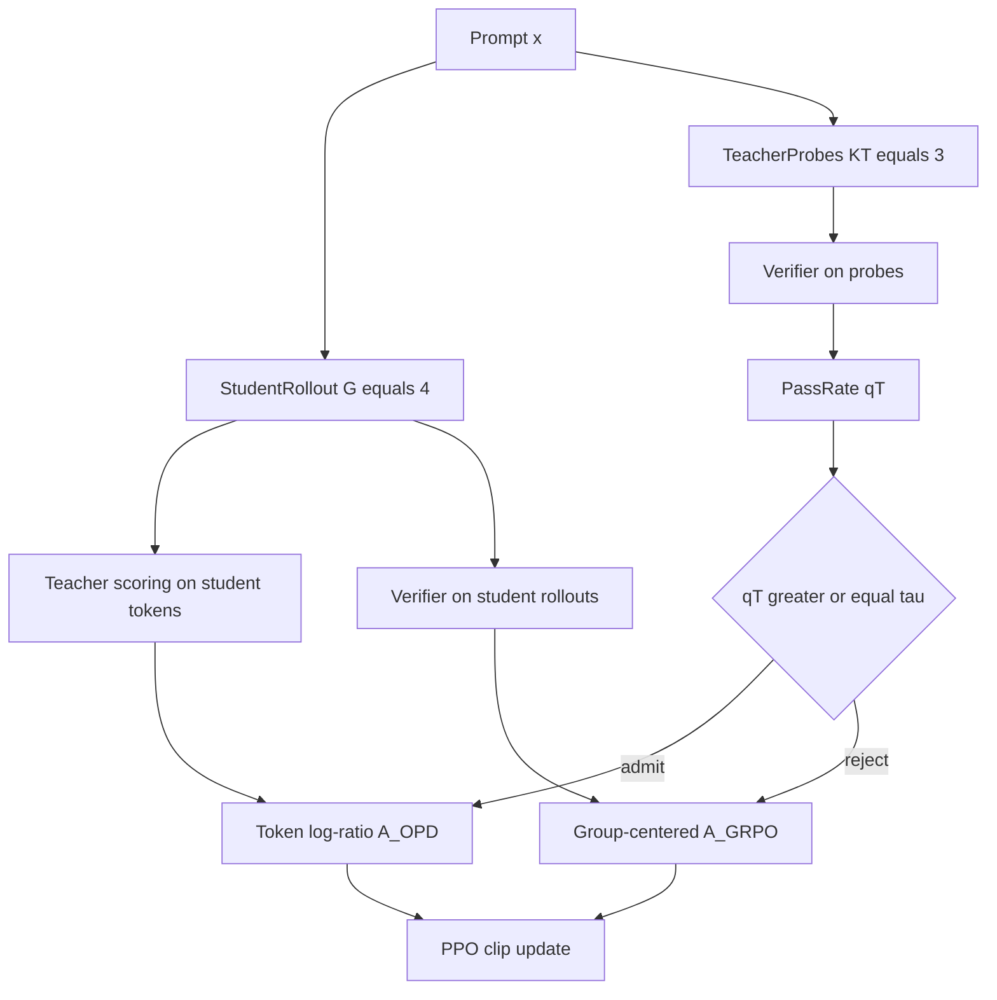
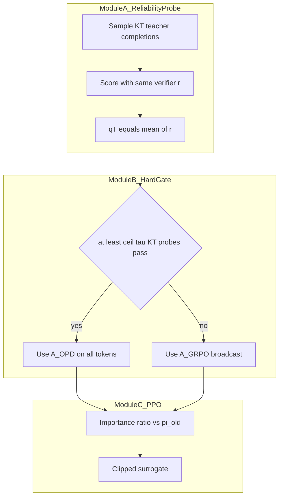
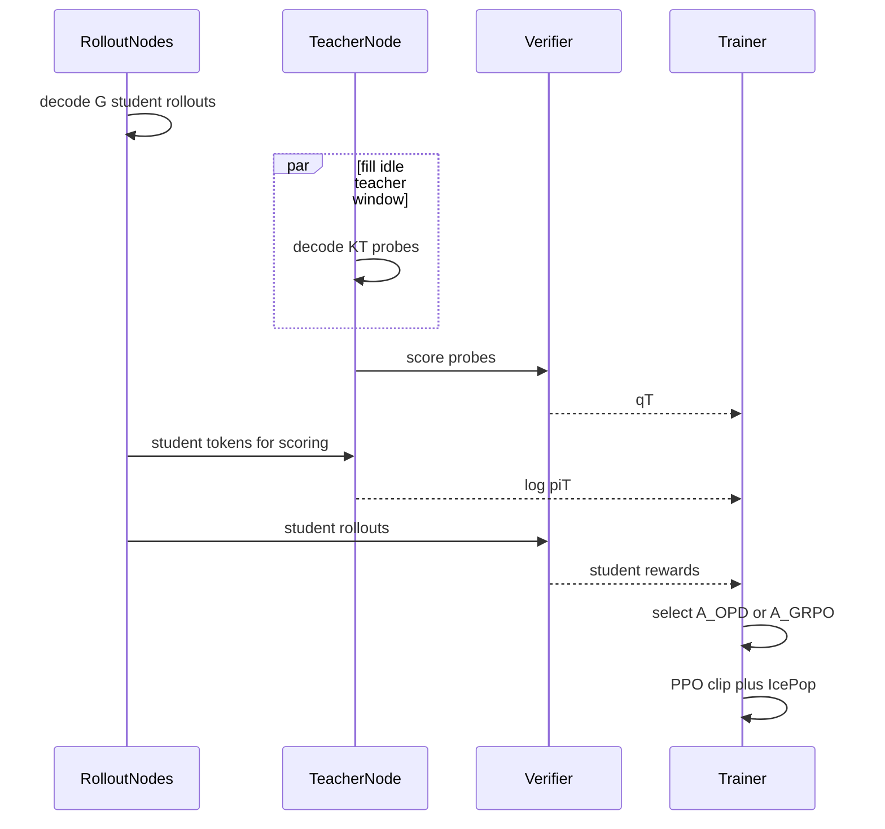

# 组会汇报：TGOPD（Verify Before You Distill）

> 可选 LaTeX：`BRIEFING.tex` → `bash compile_briefing.sh` → `BRIEFING.pdf`。组会主交付物仍是本 Markdown（Preview 渲染公式与 Mermaid）。

论文：AllSpark Team. *Verify Before You Distill: Prompt-Level Teacher Gating for On-Policy Distillation*. arXiv:2609.02998v1, 2026-09-02.  
状态：Public Technical Report（2026-08-28）  
贡献者：Zhiwei Zhang, Zechen Sun, Fei Zhao, Kang Peng, Bin Liang, Huayu Deng, Yao Hu, Kam-Fai Wong, Mu Chuan  
PDF：`docs/7_TGOPD.pdf`  
框架：`slime` 异步 rollout–update（THUDM/slime）  
代码：截至组会整理时 **未见官方开源仓**；实现细节以 PDF 附录 B–D 为准。  
和组里已读材料的位置：这是 **外部冻结教师 OPD** 的 *prompt 级准入门*，不是 TrOPD 那种 token 级信任区，也不是 TOP-D 那种奖励有界化。它直接引用了 TrOPD、RG-OPD、RLSD、EOPD、REOPOLD。

文中 **【注解】** 是组会追问的展开；**【源码核验】** 表示该细节可在 PDF 正文/附录定位（本文无独立 TeX 仓）。

打开本文件用 **Preview**：公式应是排版，下面的 Mermaid 应是图。

---

## 0. 一句话贡献

Vanilla OPD 对每个 prompt 无条件使用教师 token 级 reverse-KL；TGOPD 先用 **$K_T=3$ 次教师探针 + 验证器 pass rate** 做 prompt 级可靠性审计：通过则走稠密 OPD，否则撤回教师、改走验证器 grounding 的 GRPO。门是硬路由而不是插值。

---

## 1. 任务定义与动机剖析

### 1.1 本 paper 的任务是什么

后训练里的 **On-Policy Distillation**：学生 $\pi_\theta$ 自己采样 rollout，冻结的更强教师 $\pi_T$ 在学生轨迹上给 token 级 reverse-KL 监督。实验覆盖：

- 学生：Qwen3.5-4B（dense）与 Qwen3.6-35B-A3B（MoE，3B active）
- 三域：数学、代码、指令遵循（IF）
- 教师：对同一基座做 GRPO 得到的 **域专家冻结教师**
- 另有一条 MOPD 线：一个学生同时学三域，prompt 先路由到对应域教师，再套 TGOPD 门

一句话任务：**在承认 OPD 样本效率的前提下，先验证“这个 prompt 上教师值不值得信”，再决定放不放稠密监督。**

### 1.2 要解决的问题

Vanilla OPD 把教师监督 **均匀施加到所有 prompt**。Reverse KL 是 mode-seeking：教师一旦在某题上自信地错，学生会被强推到那个错误模式。分布侧代理（熵、师生 likelihood 一致）测的是不确定/一致性，**不是对错**。

异步部署还叠了一个系统问题：教师节点只做已生成 token 的 scoring forward，必须等学生 decode 完才能开始，因此大部分时间空转。4B 单域测量：教师节点均值利用率 **9.8%**，59% 的时间低于 5%。

### 1.3 Motivation

作者把空闲算力与可靠性缺口绑在一起：

> 教师反正在等学生 decode，不如用这段空窗生成少量教师探针，用验证器打分，得到 prompt 级可靠性 $q_T(x)$，再决定是否准入稠密 OPD。

Figure 2 是动机的硬证据（离线诊断，每 prompt 10 条教师样本，$q_T^{(10)}$ 是 pass rate，与训练时 $K_T=3$ 的在线估计量不同但测同一件事）：

- 代码域：教师自信几乎分不开高/低可靠性 prompt（AUROC **0.51**）；数学稍好（**0.73**）
- 低可靠性区（$q_T^{(10)}<0.5$）：教师最高自信样本仍错，代码 **84%**、数学 **61%**

所以“自信”不能当可靠性。

### 1.4 现有方法局限

| 方法族 | 作用位置 | 局限 |
|---|---|---|
| Vanilla OPD | 全体 prompt 的 token reverse-KL | 不检查教师对不对 |
| EOPD / TrOPD / REOPOLD | 分布侧：熵、token 信任区、likelihood clip | 不确定 ≠ 错误 |
| RG-OPD | 轨迹级：验证器与师生 gap 一致才保留蒸馏 | 仍是局部轨迹筛选，不是 prompt 级准入 |
| RLSD | 验证器定方向、蒸馏调幅度 | 对所有 prompt 都削弱教师角色 |
| SPOT | token 分支 + 学生续写验证 | 粒度更细、代价更高 |
| 多教师 MOPD | 按域路由教师 | 选到域专家后仍无条件用其稠密奖励 |

TGOPD 的切口是：**在稠密监督被 admit 之前**，用重复的完整教师 rollout 结果做 prompt 级硬门。

### 1.5 具象化例子

设一道代码题 $x$。教师三次探针：两次编译失败、一次通过，则

$$
q_T(x)=\frac{0+0+1}{3}=\frac13,\qquad \tau=\frac23,\qquad g(x)=\mathbf{1}[q_T\ge\tau]=0.
$$

门关闭。即使教师对某个错误 token 的 $\log\pi_T$ 很高，reverse-KL 也不会进梯度。若学生 4 条 rollout 里 1 对 3 错，GRPO 组内中心化仍给对的那条正优势、错的负优势。

对照：若三次探针 2 过 1 不过，$q_T=2/3$，门打开，该 prompt **整段**走 OPD，验证器奖励不进梯度。作者刻意不做 $0.7\cdot A^{\mathrm{OPD}}+0.3\cdot A^{\mathrm{GRPO}}$ 这种混合——两种信号密度和来源不同，插值权重任意。

---

## 2. 方法论树状拆解

**为什么是这些工具**：可靠性没有闭式，所以用 $K_T$ 次 i.i.d. 教师样本的验证器均值（无偏 binomial）；决策要在「放行稠密教师」和「撤回教师」之间，所以用硬阈值而不是 soft mix；空窗在学生 decode 期间，所以探针与学生采样并发。PPO-clip 和 IcePop 是共享训练栈，**不是本文创新**。

创新落在一级：**prompt 级硬路由**。二级是无偏探针估计。三级是异步空窗重叠。

```text
TGOPD
|-- Module A  教师可靠性探针（填空窗）
|   |-- 二级：RT(x)=E[r]；qT = KT 次 pass 均值
|   `-- 三级：KT=3 次完整教师 decode；与学生同一验证器
|-- Module B  硬门 g=1[qT >= tau]
|   |-- 开：整 prompt 用 token A_OPD（论文 Eq.1）
|   `-- 关：整 prompt 用轨迹 A_GRPO（Eq.2，组均值中心化、无 std）
`-- Module C  PPO-clip 更新（Eq.7）
    |-- 优势在更新内冻结
    `-- IcePop/TIS：异步 mismatch 修正，所有对照方法共享
```

模块交互：A 只产出标量 $q_T$；B 用它 **二选一** 选优势张量（互斥，从不把两路相加）；C 不改 surrogate。教师 logprob 与学生验证器奖励两边都算（pipeline 规整），但梯度里只留一门。组内奖励全相同且门关时，GRPO 优势为 $0$，该 prompt 本 step 无更新。

顶层数据流：



对应公式（图中 Gate 打开当且仅当 $g(x)=1$）：

$$
\hat A^{\mathrm{TGOPD}}_{i,t}
= g(x)\,\hat A^{\mathrm{OPD}}_{i,t}
+ \bigl(1-g(x)\bigr)\,\hat A^{\mathrm{GRPO}}_{i,t}.
$$

模块内部展开：



一个异步 cycle 的时序（探针填教师空窗）：



Vanilla OPD 与纯 GRPO 是 $g\equiv 1$ 与 $g\equiv 0$ 的两端。

---

## 3. 算法流程与公式细节推演

### 3.1 符号表

| 符号 | 含义 | 论文 |
|---|---|---|
| $\pi_\theta,\pi_{\mathrm{old}},\pi_T$ | 当前学生、冻结 rollout 快照、冻结教师 | §2 |
| $G$ | 每 prompt 学生 rollout 数，主实验 $G=4$ | 附录 B |
| $r(x,y)\in\{0,1\}$ | 验证器：代码单测；数学/IF 规则裁判 | §2 |
| $K_T,q_T,\tau,g$ | 探针数、通过率、阈值、硬门 | Eq.4–5 |
| $\beta$ | OPD 优势尺度（Eq.1 出现；主表未扫） | Eq.1 |

### 3.2 两条候选优势

OPD（与验证器无关，论文 Eq.1）：

$$
\hat A^{\mathrm{OPD}}_{i,t}
=\beta\,\mathrm{sg}\Big[\log\pi_T(y_i^t\mid x,y_i^{<t})
-\log\pi_\theta(y_i^t\mid x,y_i^{<t})\Big].
$$

GRPO（无标准差归一，论文 Eq.2；广播到该轨迹所有 token）：

$$
\hat A^{\mathrm{GRPO}}_i
=r(x,y_i)-\frac1G\sum_{j=1}^G r(x,y_j),\qquad
\hat A^{\mathrm{GRPO}}_{i,t}=\hat A^{\mathrm{GRPO}}_i.
$$

可靠性（论文 Eq.3–5）。$K_T q_T\sim\mathrm{Binomial}(K_T,R_T)$，故 $q_T$ 对任意探针预算无偏。主实验 $K_T=3$、$\tau=2/3$，即至少两票通过。

门控选择（Eq.6，选择器不是插值）后进入标准 PPO-clip（Eq.7）。IcePop/TIS 的 importance-ratio clip 为 $2.0$，是异步栈修正。

Trick：scoring **无条件**对所有 prompt 做（避免数据依赖分支）；真正多出来的是 $K_T$ 次探针 decode。GRPO 省略 std 归一，避免 fallback 被组内标准差放大——作者写成实现约定，未做归一对照。

### 3.3 手算（$G=4,K_T=3,\tau=2/3,\beta=1$）

**Prompt A，门开。** 探针奖励 $(1,1,0)$ → $q_T=2/3$ → $g=1$。某 token $\log\pi_T=-0.2$，$\log\pi_S=-1.0$，则

$$
\hat A^{\mathrm{OPD}}=-0.2-(-1.0)=0.8.
$$

整条序列每个 token 用各自 log-ratio；验证器不进梯度。

**Prompt B，门关。** 探针 $(0,0,1)$ → $q_T=1/3$ → $g=0$。学生奖励 $(1,0,0,0)$，组均值 $0.25$，四条优势为 $+0.75,-0.25,-0.25,-0.25$，**广播到该轨迹所有 token**。

**Prompt C，门关且全错。** 学生全 $0$，中心化后全 $0$，本 step 对参数无贡献。这是 fallback 的惰性区。

### 3.4 一个 cycle（Algorithm 1）

1. 对 batch 里每个 $x$：学生节点采 $G$ 条；教师节点并发采 $K_T$ 探针。
2. 验证器打探针得 $q_T$；教师对学生轨迹 scoring；验证器打学生奖励。
3. $q_T\ge\tau$ 则 $A\leftarrow A^{\mathrm{OPD}}$，否则 $A\leftarrow A^{\mathrm{GRPO}}$。
4. 用 $\pi_\theta/\pi_{\mathrm{old}}$ 的重要性比做 PPO-clip 更新。

若 $K_T$ 次探针 decode 在学生 batch 完成前结束，理论上不加墙钟。实测 35B CodeIO 对齐 500 cycle：平均 step time **$+5.9\%$**，decode 吞吐变化 $<0.1\%$。**【注解】** 空闲填满 $\neq$ 零开销。

---

## 4. 实验设定与资源开销

对照与主方法 **共享** 学生初始化、冻结域教师、语料、slime 异步管线、IcePop。

| 方法 | 共享配方 | 监督规则 |
|---|---|---|
| Vanilla OPD | 是 | 每题 $A^{\mathrm{OPD}}$ |
| TrOPD | 是 | token 信任区 RKL/FKL + 教师前缀 |
| RG-OPD | 是 | 验证器与师生 gap 一致才保留轨迹蒸馏 |
| RLSD-style | 是 | 验证器定方向，**外部冻结教师**缩放幅度（不是原 RLSD 自蒸馏） |
| TGOPD | 是 | Eq.6 硬路由 |
| Teacher 行 | — | 域教师自身分数，兼 GRPO-only 参考 |

| 域 | 训练数据 | 评测 |
|---|---|---|
| 数学 | DAPO-Math-17K | AIME 2025/2026 avg@64；HMMT-Feb 2025 avg@32 |
| 代码 | CodeI/O 的 I/O 预测 | LiveCodeBench 代码生成 pass@1 avg@6；OJBench C++/Python 总体 |
| IF | Nemotron-Cascade 2 过滤 | IFBench / IFEval，各 1 run，accuracy |

超参（附录 Table 6，两尺度共用优化）：rollout batch $64$ prompt/cycle，$G=4$，update batch $128$，每 cycle 2 次更新；Adam $\beta_1=0.9,\beta_2=0.98$；lr $1\times 10^{-6}$ 恒定；wd $0.1$；PPO $\epsilon=0.2$；IcePop/TIS ratio clip $2.0$；数学最大回复 $16384$，代码/IF $8192$。MOPD 报告固定 **199 step**。单域总 step 正文未统一写死。

| 设定 | 硬件 | 成本数字 |
|---|---|---|
| 4B | 5 节点 $\times$ 8 GPU $=40$ GPU（2 train + 2 rollout + 1 teacher） | 教师利用率 $9.8\%\to 78.9\%$；集群 $51.5\%\to 69.5\%$ |
| 35B | 7 节点 $\times$ 8 GPU $=56$ GPU（4 train + 2 rollout + 1 teacher） | 教师 $8.8\%\to 82.8\%$（SOPD） |
| 墙钟 | 35B CodeIO，500 cycle 对齐 | TGOPD 相对 OPD **mean step time $+5.9\%$** |
| GPU 型号 | 正文未写死 | `[估计]` 80GB 级训练卡 |

4B 16K：SGLang static memory fraction $0.60$；max running requests 与 teacher concurrency 均 64。

---

## 5. 实验结论的因果支撑

### 5.1 每一列指标是什么

| 列 | 物理含义 | 方向 | 采样 |
|---|---|---|---|
| AIME 2025/2026 | 竞赛题正确率 | ↑ | avg@64 |
| HMMT-Feb | 竞赛题正确率 | ↑ | avg@32 |
| LiveCodeBench | 代码生成 pass@1 | ↑ | avg@6 |
| OJBench overall | C++/Python 聚合 | ↑ | 1 run |
| IFBench / IFEval | 指令遵循准确率 | ↑ | 1 run |
| MOPD Avg | 上述七列未加权平均 | ↑ | — |
| Teacher GPU util / idle | 空窗是否被探针填满 | util↑ idle↓ | 1h、15s 采样 |
| mean step time | 端到端是否免费 | ↓更好 | 500 cycle |

### 5.2 因果链

**实验 A → 六个单域设定 TGOPD 全部超过 Vanilla OPD ⇒ 模块 B 的 prompt 门有效（强支撑）。**  
代码增益最大（4B 平均 $+3.0$，35B $+2.9$），与「代码自信最不能预测对错」一致。35B LCB：OPD $-0.8$、TrOPD $-2.5$、RG-OPD $-3.5$、RLSD-style $-4.1$（相对 base，负迁移）；仅 TGOPD $+3.0$ 并超过教师（LCB $+1.3$，OJBench $+1.1$）。

**实验 B → RLSD-style 在 14 列中 8 列低于 base ⇒ 均匀削弱教师有害（强支撑）。**  
TGOPD 只在审计失败时撤教师，多数 prompt 保留完整 OPD 方向与幅度。

**实验 C → MOPD+TGOPD：4B Avg $53.40\to 54.54$；35B $60.99\to 61.94$ ⇒ 门可无改动接到多教师（中强支撑）。**  
少数列小幅回退（4B LCB $-0.48$ 等），作者称在早期 checkpoint 方差内。无多种子，回退可能是噪声。

**实验 D → $K_T=5$ 的 $\tau$ sweep 呈倒 U，峰在 $3/5$ ⇒ 多数票够用（中等支撑）。**  
过松放进错误教师，过严丢掉有用 OPD。主实验 $\tau=2/3$ 靠近该峰。固定 4B 数学、99 step。

**实验 E → 关门后 Mask vs GRPO：约 $90\%$ 增益来自挡住坏教师（强支撑）；fallback 额外一点（弱到中等）。**  
四组设定 masking 相对 ungated 平均 $+1.08$，完整 fallback $+1.20$。作者选 fallback 作默认是因其一致性而非幅度。4B MOPD 上 mask 反而更好。

**实验 F → 利用率：四种拓扑教师 idle $57$–$78\%$ 降到 $0$–$2\%$ ⇒ 模块 A 确实吃空窗（强支撑利用率；墙钟是弱支撑「免费」）。**  
$+5.9\%$ step time 说明重叠大量但不完全。

### 5.3 不能过度解读

- 无多种子误差条；MOPD 固定 199 step 的个别回退可能是噪声。
- RLSD-style 不是原论文自蒸馏设定，只能说明「均匀削弱外部教师」不好。
- 必须有自动验证器；开放生成未覆盖。
- 门是二值的，没有软门消融。
- $\beta$ 未扫。

---

## 6. 复现前置准备清单

- [ ] **数据**：DAPO-Math-17K；CodeI/O I/O 预测题；Nemotron-Cascade 2 过滤 IF（过滤脚本未给）
- [ ] **模型**：学生 Qwen3.5-4B 或 Qwen3.6-35B-A3B；三域 GRPO 教师需 **自己先训再冻**（权重未随论文释放）
- [ ] **硬件**：完整 4B SOPD 约 $40$ 张 80GB 级卡；单机 8 卡只能做短回复算法冒烟。`[估计]` 冒烟最低 1–8$\times$80GB
- [ ] **代码**：无官方仓。底座 `[估计]` THUDM/slime + SGLang。必做：探针 $q_T$、硬门、OPD/GRPO 互斥、GRPO 不做 std 归一
- [ ] **算法可延后**：IcePop、多教师分区、利用率 tracing
- [ ] **Sanity**：$g\equiv 1$ 应接近 Vanilla OPD；门关且组内奖励常数 → 梯度为 0；探针必须与学生用同一验证器；$q_T\in\{0,1/3,2/3,1\}$ 当 $K_T=3$

建议顺序：数学 4B Vanilla OPD → 加探针与 mask-only 关门 → 再加 GRPO fallback → 扫 $\tau\in\{1/3,2/3,1\}$ → 最后上代码域（最能暴露自信错误）。

---

## 7. Paper 与代码缺口 / 组会追问

- 无官方仓、无 TeX 源、无教师权重、单域总 step 未统一披露、GPU 型号未写死。
- IcePop 不要算进 TGOPD 贡献（与门正交）。
- 开放：软门；无验证器任务；关门策略是否应按域切换（4B MOPD 上 mask 反而更好）。

组会可追问：

1. 35B 代码超过教师，是门挖出了学生相对优势，还是评测方差？
2. 门开的 prompt 上再叠 TrOPD token 信任区，会不会双计数可靠性？
3. $K_T=3$ 在 $R_T\approx 0.5$ 时 binomial 方差最大，误开/误关有多频繁？论文没报混淆矩阵。
