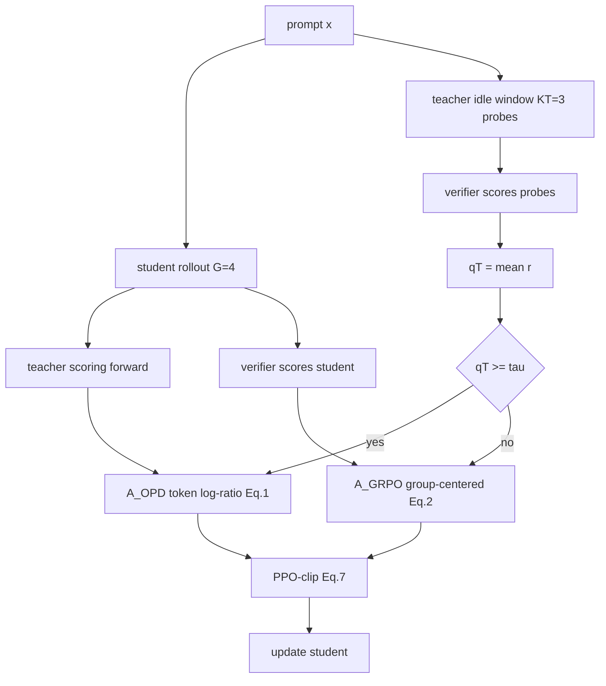
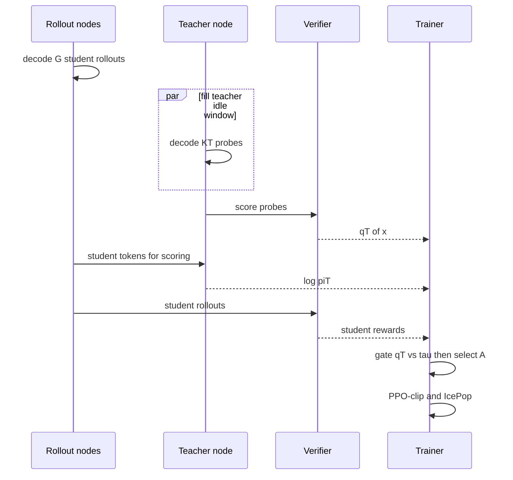
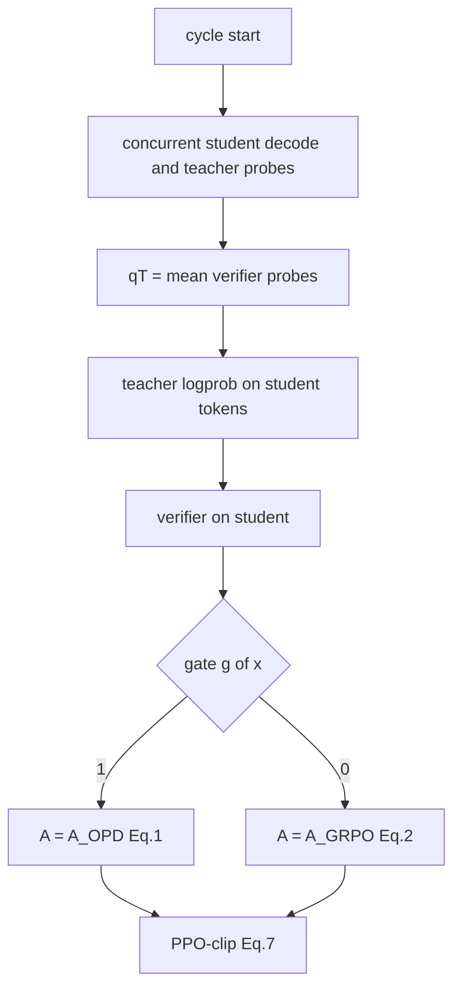

# CODE_PAPER_MAP — TGOPD

论文：arXiv:2609.02998。本地 PDF：`docs/7_TGOPD.pdf`。  
官方实现：**未见公开仓库**。下表把论文模块映射到 **应实现的接口**，并标出可借用的开源底座。

## 论文模块 ↔ 实现落点

| 论文 | 符号 / Eq. | 建议落点 | 状态 |
|---|---|---|---|
| 学生 on-policy rollout | $G$ 条，$G=4$ | slime rollout worker | 论文用 slime；可参考 THUDM/slime |
| 教师 scoring | $\log\pi_T(y_t\mid h_t)$ | 冻结教师 forward | 无条件对所有 prompt |
| 可靠性探针 | Eq.3–4，$K_T=3$ | 教师 decode $K_T$ 条完整回答 | **本文新增** |
| 验证器 | $r\in\{0,1\}$ | math-verify / 单测 / IF 规则 | 师生共用 |
| 硬门 | Eq.5–6 | `g = (q_t >= tau)` 选优势 | **本文新增** |
| OPD 优势 | Eq.1 | `beta * (logp_T - logp_S)` | 标准 OPD |
| GRPO 优势 | Eq.2，无 std | `r - mean(r)` 广播 | 实现约定 |
| PPO-clip | Eq.7 | 标准 clipped surrogate | 共享 |
| IcePop/TIS | 附录 B | 异步 IS clip 2.0 | **不是门的一部分** |

## 架构图

## 一时序：一个异步 cycle

门控对应 $g(x)=1[q_T(x)\ge\tau]$，选 $A_{\mathrm{OPD}}$ 或 $A_{\mathrm{GRPO}}$。

## 调用流（应实现）

## Paper ↔ Code gaps

- 无官方代码；教师 GRPO 权重未释放。
- 总训练 step 除 MOPD=199 外未统一披露。
- GPU 型号未写死。
- 训练路径存在，推理不是论文贡献；评测即标准 generate + 基准脚本。
