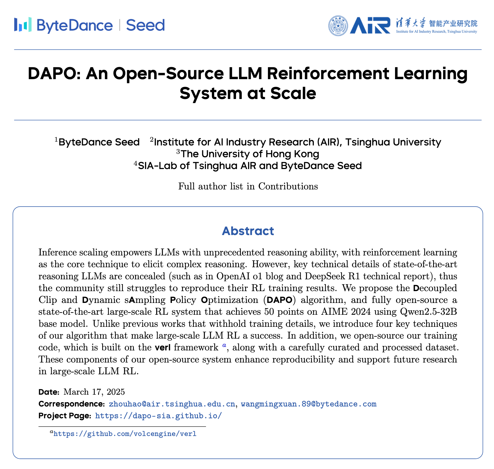

# 接下来我将复现 10 篇强化学习算法：第 6 篇，我被 DAPO 害惨了

> 想跳过正文直接运行？请查看 [快速启动指南](./start.md)：准备数据 → 训练 → 评测。


<div align="center">
  <a href="https://www.zhihu.com/people/feng-qi-xia-pian" target="_blank"></a>
  <a href="https://www.xiaohongshu.com/user/profile/63c2055e000000002502c58c" target="_blank"></a>
  <a href="https://github.com/KMnO4-zx/agentic-rl-lab"></a>
</div>

> **代码与复现资源**
>
> - 本文完整代码：[KMnO4-zx/agentic-rl-lab/06-dapo](https://github.com/KMnO4-zx/agentic-rl-lab/tree/main/06-dapo)
> - 统一训练入口：[06-dapo/train.py](https://github.com/KMnO4-zx/agentic-rl-lab/blob/main/06-dapo/train.py)
> - DAPO 论文：[DAPO: An Open-Source LLM Reinforcement Learning System at Scale](https://arxiv.org/abs/2503.14476)
> - 官方项目页：[dapo-sia.github.io](https://dapo-sia.github.io/)
> - 官方实现：[BytedTsinghua-SIA/DAPO](https://github.com/BytedTsinghua-SIA/DAPO)
> - PyTRIO 文档：[https://docs.pytrio.com/docs](https://docs.pytrio.com/docs)

这是“接下来我将复现 10 篇强化学习算法”系列的第六篇。

前面几篇分别讲了：

- [第 0 篇：强化学习基础——损失函数](https://github.com/KMnO4-zx/agentic-rl-lab/blob/main/00-loss-function/readme.md)
- [第 1 篇：GRPO](https://github.com/KMnO4-zx/agentic-rl-lab/blob/main/01-grpo/readme.md)
- [第 2 篇：OPD](https://github.com/KMnO4-zx/agentic-rl-lab/blob/main/02-opd/readme.md)
- [第 3 篇：一杯喜茶，搞定 Search-R1](https://github.com/KMnO4-zx/agentic-rl-lab/blob/main/03-search-r1/readme.md)
- [第 4 篇：一顿疯狂星期四，搞定 OPSD](https://github.com/KMnO4-zx/agentic-rl-lab/blob/main/04-opsd/readme.md)
- [第 5 篇：两杯瑞幸，搞定 ReTool](https://github.com/KMnO4-zx/agentic-rl-lab/blob/main/05-retool/readme.md)

这篇一开始也准备按熟悉的路线写：介绍算法、跑完训练，再整理结果。

但真正跑起来以后，我先得到的不是一条漂亮的 reward 曲线，而是一系列很真实的问题：

> **Dynamic Sampling 确实能把更多有效 group 填进训练 batch，但它把数据质量的成本转移到了 rollout 上；当 batch 只差最后一个有效 group 时，补采会变成反复等待的同步屏障。**

所以这次，我想完整记录和讲述三件事：

1. DAPO 到底在 GRPO 上改了什么；
2. 仓库里的 DAPO 和 GRPO 代码应该怎么读、怎么跑；
3. Dynamic Sampling 在真实训练里为什么会慢，以及它为什么会削弱异步 RL 本来想获得的时间效率。



## 结论放在前面

仓库里同时提供了 DAPO 和 GRPO 两个算法入口，大家可以对照代码理解两个算法开关，再来运行。本文不展示训练曲线，也不据此比较两个算法的优劣。

我实际跑 DAPO 时，训练到第 35 step 已经用了约 4.17 小时。继续跑完的时间成本明显超出预期，所以我手动关闭了这次训练，并把默认配置缩小。

这次真正值得记录的是一个在代码里就能看见的问题：Dynamic Sampling 会丢弃全对或全错的 group，再继续补采。被丢弃的 completion 虽然不进入 PPO loss，却已经消耗了生成 token 和等待时间；当 batch 只差最后一个有效 group 时，这种补采还会形成连续的等待屏障。

## DAPO 是什么？

DAPO 的全名是 **Decoupled Clip and Dynamic sAmpling Policy Optimization**。它不是把 GRPO 整套推翻重做，而是一套面向 long CoT 强化学习的改进 recipe。

官方总结了四个关键改动：

1. **Clip-Higher**：把正 advantage 一侧的 PPO clip 上界放宽，让低概率但有价值的 token 有更大的提升空间；
2. **Dynamic Sampling**：过滤组内全对或全错、无法提供有效相对信号的 prompt，并持续补采；
3. **Token-level Policy Gradient Loss**：所有 completion token 等权，而不是先对每条回答求均值；
4. **Soft Overlong Punishment**：在长度上限前逐步增加惩罚，减少被硬截断带来的 reward noise。

这四个改动和 GRPO 的差别可以先看这张总览：


这次实现没有写一份“看起来像 DAPO”的独立训练脚本，而是在同一个 [`train.py`](https://github.com/KMnO4-zx/agentic-rl-lab/blob/main/06-dapo/train.py) 中保留两个 preset：

| 项目 | GRPO | DAPO |
| --- | --- | --- |
| PPO clip | `[0.8, 1.2]` | `[0.8, 1.28]` |
| Loss reduction | sample mean | token mean |
| Dynamic Sampling | 关闭 | 开启 |
| Soft Overlong Punishment | 关闭 | 开启 |

两个 preset 共用模型、数据、rollout 和训练骨架，方便大家直接阅读算法差异。

## 四个改动分别解决什么问题？

### 1. Dynamic Sampling：只训练有相对信号的 group

GRPO 会对同一道题采样一组回答，再在组内做相对 advantage：

```text
8 条全答对  → reward 方差为 0 → correctness 信号退化
8 条全答错  → reward 方差为 0 → correctness 信号退化
有对有错    → 可以比较哪些轨迹应该提高概率、哪些应该降低
```

DAPO 的做法是：如果一组回答全对或全错，就把它从训练 batch 里剔除，再换一道题补采。[原论文 3.2 节](https://arxiv.org/pdf/2503.14476#page=5)要求在训练前持续采样，直到整个 batch 都由 `accuracy ∈ (0, 1)` 的有效 group 填满。


论文里的出发点很合理。固定 batch 中如果大量题目已经太简单或太难，实际能产生梯度的样本就会越来越少。Dynamic Sampling 相当于在线做了一次难度筛选，让当前策略更多地训练“正好处在能力边界上”的题。

这份实现额外加了一层工程保护：

```text
目标有效 group 数：B
最大候选 group 数：B × max_candidate_multiplier
当前默认 multiplier：2
```

候选预算耗尽后，不会无限补采，而是用已经收集到的有效 group 训练；如果一个有效 group 都没有，就跳过这一步更新。这个 `2×` 上限和 partial batch 行为是本文实现的改动，不属于原始 DAPO 的严格 full-batch 语义。

这里还要说清一个实现细节：Dynamic Sampling 的筛选依据是**原始正确性**，即组内必须同时出现正确和错误回答；真正计算 advantage 时使用的是加入长度惩罚后的 shaped reward。因此文中说的“无 advantage group”，更准确地说是“原始正确性信号退化的 group”。

### 2. Clip-Higher：给正向 token 多一点更新空间

PPO 会限制新旧策略的概率比，避免一步更新过大。GRPO 常用对称区间：

```text
clip_low  = 0.8
clip_high = 1.2
```

DAPO 把上界放宽到 `1.28`，下界仍然是 `0.8`。直觉上说：错误 token 仍然谨慎地下调，但对于正 advantage、原本概率又很低的 token，允许更积极地提高概率。

这项改动主要针对训练中的 entropy collapse。它不是把所有好回答都无条件放大，PPO 的 clipped surrogate 和 advantage 符号仍然共同决定每个 token 的梯度。

### 3. Token Mean：长回答按 token 数获得更大权重

GRPO 的 sample mean 是：

```text
每条回答先对 token loss 求均值 → 再对所有回答求均值
```

因此一条 100 token 的回答和一条 4,000 token 的回答，在 batch 最外层权重相同。

DAPO 的 token mean 是：

```text
把所有 completion token 合并 → 对全部 token 直接求均值
```

这样每个 token 等权，长 reasoning 会自然贡献更多梯度。对 long CoT 来说，这可以避免长轨迹被 sequence-level averaging 稀释；代价是长回答也会占据更大的优化权重，所以它需要和长度 shaping 一起看。


### 4. Soft Overlong Punishment：不要等截断后才突然判错

如果 completion 在最大 token 上限处被硬截断，它通常来不及输出最终 `\boxed{}`，最终 reward 会突然从可能正确变成错误。DAPO 在长度接近上限时加入线性惩罚：

```text
penalty_start = max_tokens - overlong_cache

length <= penalty_start:  penalty = 0
penalty_start < length <= max_tokens:
                         penalty = -(length - penalty_start) / overlong_cache
length > max_tokens:      penalty = -1

shaped_reward = correctness_reward + length_penalty
```


图中使用的是最初训练配置：`max_tokens=8192`、`overlong_cache=2048`，因此惩罚从 6,144 token 开始，在 8,192 token 达到 −1。

现在仓库里的默认配置已经缩小为 `max_tokens=4096`、`overlong_cache=1024`，对应的惩罚区间是：

```text
0 ～ 3,072 tokens：不惩罚
3,584 tokens：     -0.5
4,096 tokens：     -1.0
```

长度惩罚不是一个独立 reward。当前实现仍然先判答案正确性，对 +1、错 −1，再叠加这项 penalty。

## 我们是怎么复现的？

### 先把代码跑起来

本篇的全部代码都在仓库的 `06-dapo/` 目录下。

项目要求 Python `>=3.13`。模型采样和 LoRA 训练通过 PyTRIO 执行，因此安装依赖后还需要登录 PyTRIO。

先把项目拉到本地并进入 DAPO 目录：

```bash
git clone https://github.com/KMnO4-zx/agentic-rl-lab.git
cd agentic-rl-lab

uv sync
trio login
swanlab login
cd 06-dapo
```

下载并整理训练数据：

```bash
uv run python prepare_data.py
```

训练文件会写入当前目录下的 `datasets/train.jsonl` 和 `datasets/dev.jsonl`。

然后就可以启动当前缩小后的 DAPO 配置：

```bash
uv run python train.py \
    --algorithm dapo \
    --max-steps 10 \
    --groups-per-step 4 \
    --group-size 8 \
    --max-candidate-multiplier 2 \
    --max-prompt-tokens 512 \
    --max-tokens 4096 \
    --overlong-cache 1024 \
    --swanlab-mode disabled
```

仓库也提供了 GRPO 入口。想结合代码理解两者的开关差异，可以把算法改成 `grpo`：

```bash
uv run python train.py \
    --algorithm grpo \
    --max-steps 10 \
    --groups-per-step 4 \
    --group-size 8 \
    --max-prompt-tokens 512 \
    --max-tokens 4096 \
    --overlong-cache 1024 \
    --swanlab-mode disabled
```

代码跑起来以后，再来看这套复现具体是怎么拆的。

### 代码结构

整套复现主要拆成四个文件：

- [`prepare_data.py`](https://github.com/KMnO4-zx/agentic-rl-lab/blob/main/06-dapo/prepare_data.py)：下载、清洗和固定版本的数据；
- [`rollout.py`](https://github.com/KMnO4-zx/agentic-rl-lab/blob/main/06-dapo/rollout.py)：group rollout、组内 advantage 和 Dynamic Sampling；
- [`reward.py`](https://github.com/KMnO4-zx/agentic-rl-lab/blob/main/06-dapo/reward.py)：数学答案判定和 Soft Overlong Punishment；
- [`train.py`](https://github.com/KMnO4-zx/agentic-rl-lab/blob/main/06-dapo/train.py)：统一的 GRPO/DAPO PPO 更新。

### 数据

训练集使用官方的 [`BytedTsinghua-SIA/DAPO-Math-17k`](https://huggingface.co/datasets/BytedTsinghua-SIA/DAPO-Math-17k)。

官方 parquet 中存在大量重复行，所以准备脚本没有直接把原始数据全部喂给训练，而是：

1. 剥掉原数据自带的 `Answer:` 外层模板，避免和本文要求的 `\boxed{}` 冲突；
2. 规范化 question 后去重；
3. 同题 ground truth 冲突时删除整组；
4. 用固定 seed 切出 50 条 dev，其余作为 train。

当前整理结果是：

```text
train.jsonl：17,126 道题
dev.jsonl：      50 道题
```

数据集 revision 已写死在脚本中，避免上游数据更新后，同一个命令悄悄得到另一份训练集。

### Reward 与 advantage

每条 completion 最后 300 个字符中提取最后一个 `\boxed{}`，再用 `math_verify` 判断数学等价：

```text
正确：+1
错误或格式非法：-1
DAPO：再叠加 Soft Overlong Punishment
```

同一道题的 8 条 completion 使用 shaped reward 做组内标准化：

```text
A_i = (r_i - mean(r)) / (std(r) + epsilon)
```

prompt token 全部 mask 掉，只有模型自己生成的 completion token 进入 PPO loss。

### 最初的 DAPO 配置

最我在运行 DAPO 时使用的是下面这组配置：

| 项目 | 配置 |
| --- | --- |
| Base Model | `Qwen/Qwen3.5-4B` |
| 训练方式 | LoRA rank 32 |
| 每步目标题组 | 4 |
| 每题 completion | 8 |
| 每步目标 completion | 32 |
| prompt 上限 | 1,024 tokens |
| completion 上限 | 8,192 tokens |
| Soft Overlong 区间 | 最后 2,048 tokens |
| DAPO 最大候选 | 目标 batch 的 2× |
| rollout concurrency | 16 |
| optimizer | Adam，lr `4e-5`，β `(0.9, 0.95)` |
| seed | 42 |

这组配置把算法链路跑了起来，也暴露了时间和单步 token 波动问题。为了让后续读者能更轻量地学习和试跑代码，当前默认值已经改为：

```text
max_prompt_tokens：1,024 → 512
max_tokens：       8,192 → 4,096
overlong_cache：   2,048 → 1,024
groups_per_step：  4（保持不变）
group_size：       8（保持不变）
candidate cap：    2×（保持不变）
```

这套配置规模小于论文实验，主要用于观察算法机制和复现过程中暴露的问题。

## 真正的问题：最后一个有效 group 把训练重新拖回等待

Dynamic Sampling 最容易被一句“过滤无效样本，补到 batch 满”为止带过。但真正跑起来以后，最慢的恰恰是“补到 batch 满”这半句话。

假设每步需要 `B=4` 个有效 group：

```text
第一轮并发采 4 组
├── 第 1 组：有效
├── 第 2 组：有效
├── 第 3 组：有效
└── 第 4 组：全对或全错，被丢弃
```

这时 batch 只差最后 1 组。当前实现不会再并发采完整的 4 组，而是补采 1 组：

```text
补采第 5 组 → 无效 → 再等
补采第 6 组 → 无效 → 再等
补采第 7 组 → 无效 → 再等
补采第 8 组 → 仍可能无效，候选预算耗尽
```

虽然**每一轮内部**使用了 `asyncio.gather` 和并发 semaphore，但下一轮要采多少，必须等上一轮的 completion 全部返回、完成 reward 判定后才能知道。因此，接近填满时，Dynamic Sampling 会形成一串串行的 refill barrier。

对于目标 batch `B`、候选倍率 `M`：

```text
最多采样的 group 数 = M × B
候选 token 计算量上限约为正常 batch 的 M 倍

如果第一轮只差 1 个有效 group：
最多经历的 rollout wave 数 = 1 + (M - 1) × B
```

以当前 `B=4、M=2` 为例，最坏不是简单的两轮，而是：

```text
1 轮初始 batch + 4 轮单 group 补采 = 5 个等待 wave
```

如果倍率改成 `3×`，最坏可以变成 `1 + 2×4 = 9` 个 wave。每个 wave 又可能碰到一条接近 8,192 token 的长尾 completion，所以 wall-clock 的放大甚至不一定严格受 `2×/3×` 限制。

这就是我认为 Dynamic Sampling 与异步 RL 存在结构性冲突的地方：

- 异步 RL 想让 rollout 持续流动，让先完成的数据先进入下一阶段；
- 严格 Dynamic Sampling 要求当前 step 先凑齐 `B` 个有效 group；
- learner 能不能更新，被最晚补到的那一组卡住；
- 越接近 batch 填满，并发宽度反而越小，最后一个有效 group 很容易成为拖慢整批更新的尾部任务。

> [DAPO 原论文 3.2 节](https://arxiv.org/pdf/2503.14476#page=5)：“Before training, we keep sampling until the batch is fully filled with samples whose accuracy is neither 0 nor 1.”

原始 DAPO 必须先凑齐一整批有效样本，才能进行这一步参数更新。即使只差最后一组，整个训练流程也必须停下来等待。论文同时指出，在同步且生成阶段没有流水化的系统里，生成时间通常由长尾样本主导，因此 Dynamic Sampling 不一定会降低训练效率。

但事实并没有论文描述得那么理想。至少在本文实现的同步训练循环中，只有等一组 completion 全部结束并计算完 reward，才能知道是否需要补采。后续补采无法与上一轮的长尾生成重叠；每增加一轮补采，当前训练 step 就会多一次完整等待。当 batch 只差最后一个有效 group 时，这个问题尤其明显。Dynamic Sampling 的额外开销没有被长尾等待掩盖，反而成为训练时间明显增加的主要原因。

## Dynamic Sampling 是否值得，要同时看质量和预算

但一条被筛掉的 completion 不是“没用，所以没成本”。它已经经历了：

```text
prefill → autoregressive sampling → reward parsing → correctness verification
```

只是最后没有进入 PPO loss。

因此大家自己运行时，至少要同时看四类指标：

| 维度 | 代码记录的指标 | 回答的问题 |
| --- | --- | --- |
| 数据质量 | `rollout/effective_fill_ratio` | 目标 batch 实际填满了多少 |
| 筛选代价 | `rollout/oversample_ratio` | 为这些有效组多采了多少题 |
| token 利用率 | `train_completion_tokens / completion_tokens` | 生成的 token 有多少真正进入训练 |
| 时间效率 | `time/step_seconds` | 一个参数更新实际等了多久 |

这里最重要的是建立正确的观察方式：即使有效 batch 更满，也要继续检查多采了多少候选、浪费了多少 rollout token，以及一次更新究竟等待了多久。

## 另一个真实问题：长序列、动态 batch 的成本峰值很难控制

从训练形态看，时间预算很难提前估准：

- completion 上限是 8,192，且每一步都出现到达上限的长回答；
- DAPO 的候选 group 数、有效 group 数和 train token 数都会随补采结果变化；
- 只差最后一个有效 group 时，补采轮次会被长尾回答继续拉长。

所以把当前默认 completion 上限缩到 4,096，不只是让一次实验更快，也是为了降低单步 token 和 wall-clock 的波动。后续如果重新跑长上下文版本，应该同时限制**单步时间预算**、**候选 token 总预算**和**训练 token 总预算**，而不只限制 group 数量。

仓库同时提供了 DAPO 和 GRPO 代码，大家可以结合上面的机制说明继续学习和试跑。本文讨论的是 Dynamic Sampling 的代码行为与工程问题，不把这次未完成的 DAPO run 当作效果对比。

## 自己运行时应该重点看什么？

这次最重要的不是只盯着 `reward`，而是把训练收益和采样成本放在一起看：

```text
time/step_seconds

rollout/candidate_groups
rollout/effective_groups
rollout/effective_group_ratio
rollout/effective_fill_ratio
rollout/oversample_ratio

rollout/completion_tokens
rollout/train_completion_tokens
rollout/max_completion_tokens

train/update_skipped

reward/accuracy
reward/length_penalty_mean
reward/shaped_mean

ppo/clip_fraction
ppo/lower_clip_fraction
ppo/upper_clip_fraction
ppo/gradient_active_tokens
```

特别是下面三组关系：

```text
effective_groups / candidate_groups  → 数据筛选效率
train tokens / rollout tokens        → token 利用率
effective_groups / step_seconds      → 真正的 wall-clock 产出
```

只看 `effective_fill_ratio`，无法判断 Dynamic Sampling 是否值得；还要结合最后一项，确认这些有效 group 实际花了多少时间。

## 小结

DAPO 的四个改动不是为了做一套更复杂的 GRPO，而是在解决 long CoT RL 里非常真实的问题：entropy collapse、无效 group、长轨迹权重和截断 reward noise。

其中最有吸引力的 Dynamic Sampling，也恰好暴露了最明显的工程代价：

```text
它让每次更新看到更多有效 group，
但为了等到最后一个有效 group，
rollout 会反复补采、反复等待，
最终把动态筛选的成本完整付在 wall-clock 上。
```

## 感受

> ***所有命运馈赠的礼物，早已在暗中标好了价格***

在全手搓实现 DAPO 的时候，我有很大的感触。之前在用 transformers 或者是 verl 训练模型的时候，假如说这次训练得很慢，我只会怀疑是不是我的卡不够好，或者说是我的 verl 哪里配置得不对，我绝对不会怀疑是算法的原因，因为 transformers 的 trainer 和 verl 的配置对我来说它是一个黑盒。但是这一次 dapo 的全部代码是我一行一行 review 过的，所以我很清楚 dapo 发生了什么事情，我也很清楚 dapo 为什么会这么慢。所以，这就是用 PyTrio 的魅力吧，因为我可以从0~1地完成核心算法代码，不必去关注框架、配置、什么训推一体呀，我不需要考虑这些事情，我只需要考虑核心算法到底有没有正确的实现。

## 参考资料

### 论文与官方实现

1. Qiying Yu et al. [DAPO: An Open-Source LLM Reinforcement Learning System at Scale](https://arxiv.org/abs/2503.14476), 2025.
2. [DAPO 官方项目页](https://dapo-sia.github.io/)
3. [BytedTsinghua-SIA/DAPO 官方实现](https://github.com/BytedTsinghua-SIA/DAPO)

### 数据与模型

1. [BytedTsinghua-SIA/DAPO-Math-17k](https://huggingface.co/datasets/BytedTsinghua-SIA/DAPO-Math-17k)
2. [Qwen/Qwen3.5-4B](https://huggingface.co/Qwen/Qwen3.5-4B)

### 本文实现与实验

1. [DAPO PyTRIO 完整代码](https://github.com/KMnO4-zx/agentic-rl-lab/tree/main/06-dapo)
2. [PyTRIO 文档](https://docs.pytrio.com/docs)
