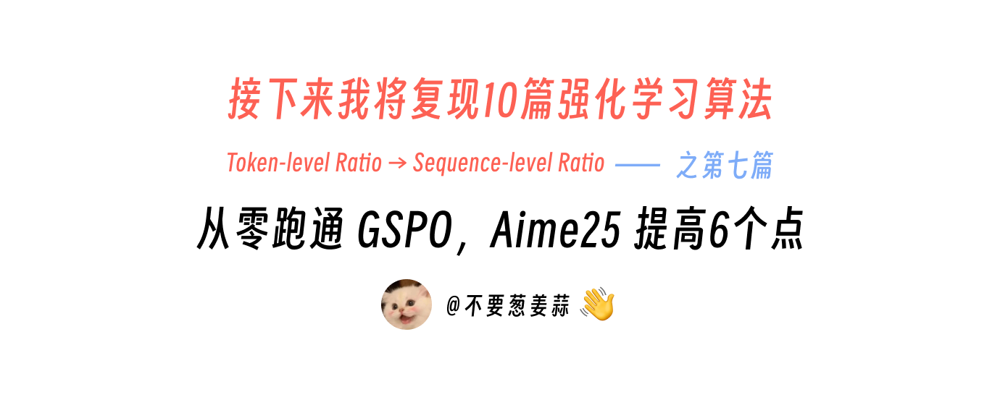
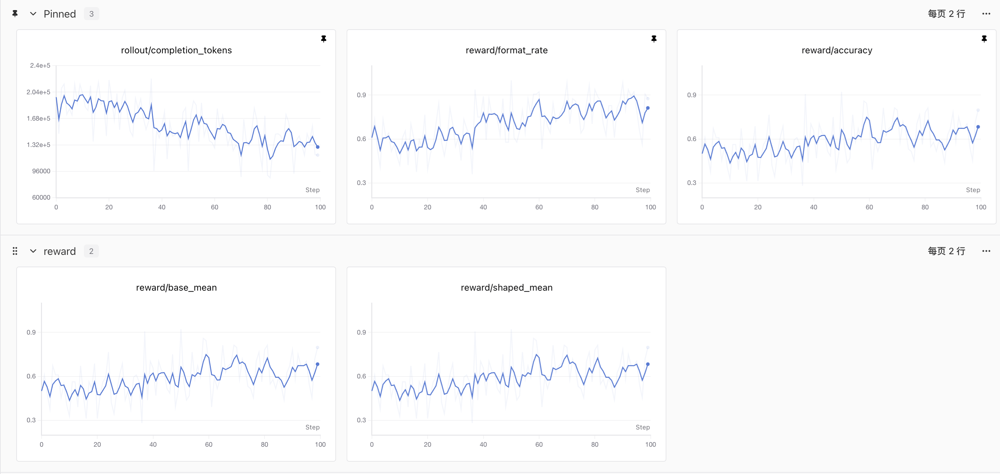
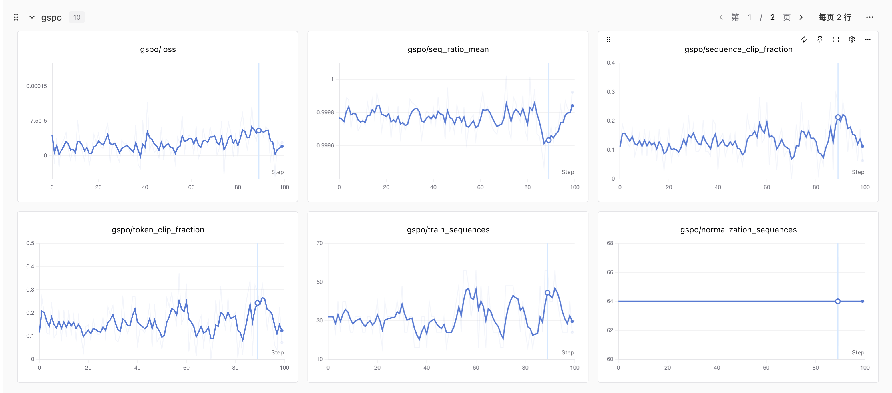
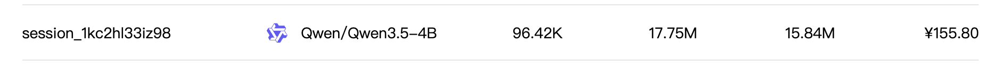
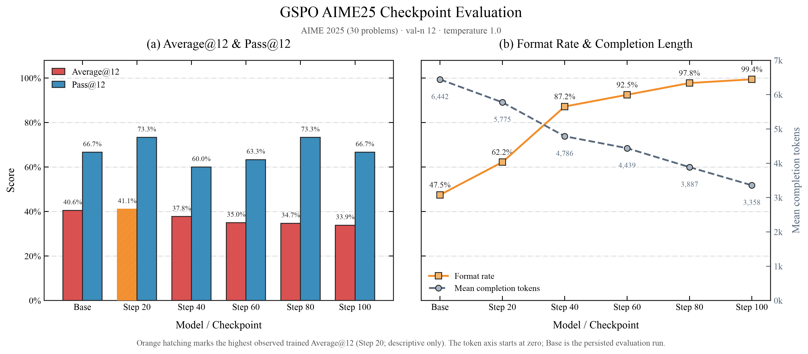

# 接下来我将复现 10 篇强化学习算法：第 7 篇，从零跑通GSPO，Aime25 提高6个点

> 想跳过正文直接运行？请查看 [快速启动指南](./start.md)：准备数据 → 训练 → 评测。



<div align="center">
  <a href="https://www.zhihu.com/people/feng-qi-xia-pian" target="_blank"></a>
  <a href="https://www.xiaohongshu.com/user/profile/63c2055e000000002502c58c" target="_blank"></a>
  <a href="https://github.com/KMnO4-zx/agentic-rl-lab"></a>
</div>

> **代码与复现资源**
>
> - 本文完整代码：[KMnO4-zx/agentic-rl-lab/07-gspo](https://github.com/KMnO4-zx/agentic-rl-lab/tree/main/07-gspo)  
> - GSPO 论文：[Group Sequence Policy Optimization](https://arxiv.org/abs/2507.18071)
> - SwanLab：[100-step 完整训练记录](https://swanlab.cn/@kmno4/llm-agent-rl-lab-gspo/runs/o83z2ghp/chart)
> - PyTRIO 文档：[https://docs.pytrio.com/docs](https://docs.pytrio.com/docs)

这是“接下来我将复现 10 篇强化学习算法”系列的第七篇。

前面复现 DAPO 时，我们在 GRPO 的骨架上加入了 Dynamic Sampling、Clip-Higher、Token Mean 和 Soft Overlong Punishment。GSPO 的改动更集中：**沿用 group rollout、reward 和 group-relative advantage，只把 policy loss 里的重要性比率与裁剪从 token 级提升到 sequence 级。**

这次我用 [PyTRIO](https://pytrio.com/) 在 `Qwen/Qwen3.5-4B` 上完成了 100 steps LoRA 训练，并评测 Base Model 与 Step 20、40、60、80、100 五个 checkpoint。先来看算法，再看结果。


## GSPO 是什么？

GSPO 的全称是 **Group Sequence Policy Optimization**，由 Qwen 团队在 2025 年提出。它对同一道题采样一组回答，用组内 reward 的相对高低计算 advantage，从而省掉单独的 value model。GSPO 保留了这套 group-relative advantage，核心变化落在 loss：


> **GRPO：一条回答有 T 个 ratio、T 次 clipping；GSPO：一条回答只有 1 个 ratio、1 次 clipping。**

| 环节 | GRPO | GSPO |
| --- | --- | --- |
| Group rollout | 同一个 prompt 采样 $G$ 条回答 | 相同 |
| Reward | 每条完整回答得到一个 reward | 相同 |
| Advantage | 组内标准化，每条回答一个 $\hat A_i$ | 相同 |
| 重要性比率 | 每个 token 一个 $w_{i,t}$ | 每条回答一个 $s_i$ |
| Clipping | 逐 token 判断 keep / clip | 整条回答只判断一次 |
| Loss | 先聚合 token objective | 直接聚合 sequence objective |

GRPO 对回答中的每个 token 分别计算新旧策略概率比：

```math
w_{i,t}(\theta)=
\frac{
  \pi_\theta\left(y_{i,t}\mid x,y_{i,\lt t}\right)
}{
  \pi_{\theta_{\mathrm{old}}}\left(y_{i,t}\mid x,y_{i,\lt t}\right)
}
```

一条包含 $T$ 个 token 的回答会产生 $T$ 个 ratio，也会做 $T$ 次 clipping 判断。

GSPO 先把整条回答的 token log-ratio 求均值，再取指数：

```math
s_i(\theta)=
\exp\left(
\frac{1}{|y_i|}
\sum_{t=1}^{|y_i|}
\log
\frac{
  \pi_\theta\left(y_{i,t}\mid x,y_{i,\lt t}\right)
}{
  \pi_{\theta_{\mathrm{old}}}\left(y_{i,t}\mid x,y_{i,\lt t}\right)
}
\right)
```

这里的 $1/|y_i|$ 是长度归一化。它让不同长度回答的 ratio 落在相近的数值范围内。随后，整条回答共享同一个 ratio 和 clipping 结果：

```math
\mathcal{J}_{\mathrm{GSPO}}(\theta)
=
\frac{1}{G}\sum_{i=1}^{G}
\min\left(
s_i\hat{A}_i,\,
\mathrm{clip}\left(
  s_i,\,
  1-\varepsilon_{\mathrm{low}},\,
  1+\varepsilon_{\mathrm{high}}
\right)\hat{A}_i
\right)
```

论文给出的 GSPO 裁剪范围是：

```text
epsilon_low  = 3e-4
epsilon_high = 4e-4
```

这个范围看起来比常见的 GRPO clip 小很多，因为两者约束的量不同。GRPO 约束单个 token 的概率比，GSPO 约束经过长度归一化的整条 sequence ratio。

论文认为，reward 本来就是按完整回答给出的，sequence-level ratio 可以让 reward、重要性采样和优化目标处在同一个粒度上，并减少长序列里逐 token ratio 带来的高方差噪声。

本项目的数学 reward 使用 `math_verify` 判定最终答案，正确为 `1`、错误为 `0`。同组 reward 会进一步标准化为：

```math
\hat{A}_i =
\frac{
  r_i-\mathrm{mean}(r)
}{
  \mathrm{std}(r)+10^{-8}
}
```

组内全对或全错时，所有 advantage 都是 0。本文按 GSPO 的基础目标实现，没有再叠加 Dynamic Sampling，也不会补采新题；训练侧跳过这些没有梯度的序列，同时把它们的零目标保留在原始 loss 分母中。

## 复现结果

正式训练使用下面这组配置：

| 项目 | 配置 |
| --- | --- |
| Base Model | `Qwen/Qwen3.5-4B` |
| LoRA rank | 32 |
| 训练数据 | DAPO-Math，清洗后 17,126 道训练题 |
| 训练步数 | 100 steps |
| 每个 step | 8 个 prompt groups |
| 每个 group | 8 条 completions |
| 单步 rollout | 64 条 completions |
| 最大 prompt / completion | 2,048 / 4,096 tokens |
| Sampling | temperature 1.0 / top-p 1.0 / top-k -1 |
| Optimizer | Adam，lr `4e-5`，β `(0.9, 0.95)` |
| Checkpoint | 每 20 steps 保存一次 |

这次正式训练在 SwanLab 上记录了完整 100 steps，平均每步约 85 秒，总时长约 2 小时 22 分钟。下面两张图分别是 rollout/reward 和 GSPO loss 指标：





训练过程中，`normalization_sequences` 固定为每步原始的 64 条回答，`train_sequences` 会随退化组数量变化。100 steps 的平均 sequence clip fraction 为 13.11%，最后一步为 6.25%。完整配置和每一步曲线可以直接在 [SwanLab 训练记录](https://swanlab.cn/@kmno4/llm-agent-rl-lab-gspo/runs/o83z2ghp/chart) 中查看。

这次 100-step 训练对应的 PyTRIO session 记录为 `¥155.80`：



### AIME25 评测

Base Model 和所有 checkpoint 都使用相同的评测配置：

```text
30 道 AIME25
每题采样 12 次，共 360 条 generations
temperature = 1.0
top_p = 1.0
top_k = -1
max_tokens = 8192
```

其中：

- **Average@12**：360 条 generation 中答对的比例；
- **Pass@12**：30 道题中，至少有一次采样答对的题目比例；
- **Format**：回答中成功提取到 `\boxed{}` 的比例。

完整结果如下：

| Checkpoint | Average@12 | Pass@12 | Format | 正确回答 | 通过题目 | 平均 completion tokens |
| --- | ---: | ---: | ---: | ---: | ---: | ---: |
| Base (Run 1) | 41.11% | 56.67% | 46.67% | 148/360 | 17/30 | 6489.8 |
| Base (Run 2) | 40.56% | 66.67% | 47.50% | 146/360 | 20/30 | 6442.5 |
| Step 20 | 41.11% | 73.33% | 62.22% | 148/360 | 22/30 | 5775.4 |
| Step 40 | 37.78% | 60.00% | 87.22% | 136/360 | 18/30 | 4785.8 |
| Step 60 | 35.00% | 63.33% | 92.50% | 126/360 | 19/30 | 4438.7 |
| Step 80 | 34.72% | 73.33% | 97.78% | 125/360 | 22/30 | 3886.9 |
| Step 100 | 33.89% | 66.67% | 99.44% | 122/360 | 20/30 | 3358.1 |



封面里的“AIME25 提高 6 个点”，具体指 **Step 20 的 Pass@12 相比 Base Run 2 从 66.67% 提升到 73.33%，增加 6.66 个百分点**。

这组结果还能看到三个更重要的现象：

1. Step 20 的 Average@12 为 41.11%，落在两次 Base 评测的波动范围内；正确回答数也和 Base Run 1 相同，都是 148/360。
2. 两次独立 Base 的 Pass@12 相差 10 个百分点。AIME25 只有 30 道题，单次 Pass@12 很容易受采样波动影响，因此 +6.66 个百分点还需要更多重复评测和随机种子确认。
3. Format 从 47.50% 持续上升到 99.44%，平均 completion tokens 从 6442.5 持续下降到 3358.1，缩短约 48%。Step 20 以后 Average@12 则逐步下降。

所以，这次实验最扎实的结论是：**GSPO 训练明显改变了模型的输出行为，格式遵循率大幅提高，回答长度持续缩短；当前数据还不能证明数学准确率获得了稳定提升。** 不同指标对应的最佳 checkpoint 也不同：Step 20 的 Average@12 最好，Step 20 和 Step 80 的 Pass@12 最高，Step 100 的格式率最高。

这里还缺少一组同模型、同数据、同训练预算的 GRPO 对照实验，因此本文也不拿这组结果证明 GSPO 优于 GRPO。

> **复现边界**
>
> GSPO 原论文使用从 `Qwen3-30B-A3B-Base` 微调得到的冷启动模型，并把一个 rollout batch 切成 4 个 optimizer mini-batch；论文报告的是 AIME 2024、LiveCodeBench 和 CodeForces。本文使用 Qwen3.5-4B LoRA、每个 rollout batch 一次更新和 AIME25，复现的是 GSPO 的核心 loss 与训练链路，不等同于论文规模实验，也没有验证论文中的 MoE 稳定性结论。仅复现论文核心算法思路和训练链路，评测结果仅供参考。

## 如何启动训练

项目要求 Python `>=3.13`。先安装依赖并登录 PyTRIO、SwanLab：

```bash
git clone https://github.com/KMnO4-zx/agentic-rl-lab.git
cd agentic-rl-lab
uv sync
trio login
swanlab login
```

准备 DAPO-Math 训练集和 AIME25：

```bash
uv run python 07-gspo/prepare_data.py
```

启动与本文正式实验相同的 100-step 训练：

```bash
cd 07-gspo

uv run python train.py \
    --max-steps 100 \
    --groups-per-step 8 \
    --group-size 8 \
    --max-prompt-tokens 2048 \
    --max-tokens 4096
```

模型采样、LoRA 前向与反向、优化器更新和 checkpoint 存储都由 PyTRIO 服务执行，本地机器负责数据、reward、GSPO loss 和训练流程控制。

## 我们是怎么复现的？

整条训练链路可以先看这张图。图里用当前默认的 4 个 prompt groups 做示意；上面的正式实验通过命令行把它改成了 8。


### 1. 准备并固定数学数据

[`prepare_data.py`](https://github.com/KMnO4-zx/agentic-rl-lab/blob/main/07-gspo/prepare_data.py) 下载固定 revision 的 DAPO-Math-17K，清洗 prompt、去重并切分 train/dev，同时单独下载并校验 30 道 AIME25。

[`data.py`](https://github.com/KMnO4-zx/agentic-rl-lab/blob/main/07-gspo/data.py) 负责读取训练 JSONL、按 seed 打乱，以及用可回绕的 `ExampleCursor` 按 step 取题。当前实现没有 Dynamic Sampling，所以每个 step 固定取一批 prompt，一次采齐。

### 2. Group rollout、0/1 reward 与 advantage

[`rollout.py`](https://github.com/KMnO4-zx/agentic-rl-lab/blob/main/07-gspo/rollout.py) 先用 Qwen chat template 构造 prompt，再通过当前 LoRA 权重对应的 PyTRIO sampler 为每道题并发采样 8 条回答。每条回答都会保存：

```text
completion tokens
sampling logprobs
decoded text
reward
advantage
```

token 与 sampling logprob 的长度会被严格校验，因为它们稍后需要逐 token 对齐计算 sequence ratio。

[`reward.py`](https://github.com/KMnO4-zx/agentic-rl-lab/blob/main/07-gspo/reward.py) 从回答中提取最后一个完整的 `\boxed{}`，再用 `math_verify` 判断它与参考答案是否等价。答对得 1，答错或格式缺失得 0。它没有长度惩罚，也没有额外的 format reward。

rollout 完成后，同一道题的 8 个 reward 会计算组内均值和样本标准差，得到每条回答共享的 sequence advantage。全对或全错的组 advantage 为 0，不会发到远端做无效计算。

### 3. 构造 Datum，并在本地计算 GSPO loss

[`loss.py`](https://github.com/KMnO4-zx/agentic-rl-lab/blob/main/07-gspo/loss.py) 是这次复现的核心。

`build_datum()` 把 prompt 和 completion 做自回归右移：

```text
model_input   = prompt_tokens + completion_tokens[:-1]
target_tokens = [0] * (len(prompt_tokens) - 1) + completion_tokens
```

PyTRIO 的 `Datum.loss_fn_inputs` 保存 `target_tokens`，本地 `GSPOMeta` 保存 rollout 时的 `sampling_logprobs`、sequence advantage 和 completion 长度。

随后，`forward_backward_custom()` 返回当前策略在这些 target token 上的可求导 logprob。`make_gspo_loss_fn()` 取出 completion 区间，完成三步计算：

```text
current logprobs - sampling logprobs
        ↓
mean token log-ratio → exp → one sequence ratio
        ↓
one sequence-level clipping decision
```

每条 sequence 等权求和，再除以原始 rollout 的 sequence 数。退化组虽然没有发到远端计算，它们原本为 0 的 objective 仍然留在分母里，因此过滤只节省计算，不会放大剩余样本的 loss。

### 4. 一个 rollout batch 对应一次更新

[`train.py`](https://github.com/KMnO4-zx/agentic-rl-lab/blob/main/07-gspo/train.py) 把上面的模块串起来：

```text
加载并打乱数据
→ 创建 LoRA TrainingClient，并在训练开始时获取一次 tokenizer
→ 每 step 用最新 LoRA 权重创建 sampler
→ 并发 group rollout
→ 过滤 advantage 为 0 的退化组
→ forward_backward_custom
→ optim_step
→ 记录 SwanLab，并按周期保存 checkpoint
```

应用侧没有再拆 mini-batch。一个 rollout batch 只调用一次 backward 和一次 `optim_step`，PyTRIO 服务负责后端模型计算、物理分片与梯度累积。

### 5. 评测并生成结果图

[`eval.py`](https://github.com/KMnO4-zx/agentic-rl-lab/blob/main/07-gspo/eval.py) 可以评测 Base Model，也可以读取 `trio://` sampler weights 评测任意 checkpoint。它会保存每道题的 12 条完整回答，并聚合 Average@12、Pass@12、Format 和平均 completion tokens。

[`analyse.py`](https://github.com/KMnO4-zx/agentic-rl-lab/blob/main/07-gspo/analyse.py) 自动读取 `eval-results/` 中的 summary，按 checkpoint 排序，生成本文使用的 1×2 AIME25 结果图。

八个代码文件的职责可以汇总为：

| 文件 | 模块职责 |
| --- | --- |
| [`prepare_data.py`](https://github.com/KMnO4-zx/agentic-rl-lab/blob/main/07-gspo/prepare_data.py) | 下载、清洗、去重并固定 DAPO-Math 与 AIME25 |
| [`data.py`](https://github.com/KMnO4-zx/agentic-rl-lab/blob/main/07-gspo/data.py) | 读取训练题、固定 seed 打乱、循环取样 |
| [`reward.py`](https://github.com/KMnO4-zx/agentic-rl-lab/blob/main/07-gspo/reward.py) | 提取 `\boxed{}`、数学等价判断、0/1 reward |
| [`rollout.py`](https://github.com/KMnO4-zx/agentic-rl-lab/blob/main/07-gspo/rollout.py) | Prompt、并发 group rollout、token/logprob 对齐、advantage |
| [`loss.py`](https://github.com/KMnO4-zx/agentic-rl-lab/blob/main/07-gspo/loss.py) | Datum、GSPO 元数据、sequence ratio 与 clipping loss |
| [`train.py`](https://github.com/KMnO4-zx/agentic-rl-lab/blob/main/07-gspo/train.py) | 训练主循环、PyTRIO 调用、SwanLab 与 checkpoint |
| [`eval.py`](https://github.com/KMnO4-zx/agentic-rl-lab/blob/main/07-gspo/eval.py) | Base/LoRA AIME25 评测与 JSONL 结果 |
| [`analyse.py`](https://github.com/KMnO4-zx/agentic-rl-lab/blob/main/07-gspo/analyse.py) | 汇总 checkpoint 指标并绘制结果图 |

## 总结

GSPO 的思路很直接：保留 GRPO 的 group rollout、reward 和 relative advantage，把重要性比率与 clipping 的单位从 token 改成完整 sequence。我们用 PyTRIO 跑通了这条 custom loss 训练链路，也完成了 Base + 5 个 checkpoint 的 AIME25 评测。Step 20 的单次 Pass@12 提高了 6.66 个百分点，格式遵循率和回答长度的变化更加稳定；数学准确率是否能持续提升，还需要 matched GRPO、更多随机种子和重复评测来回答。
