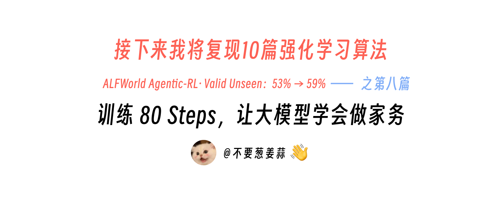
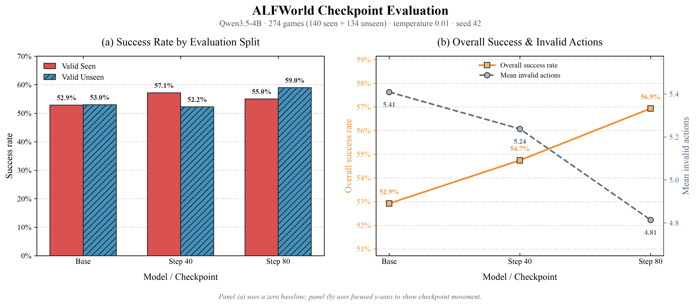
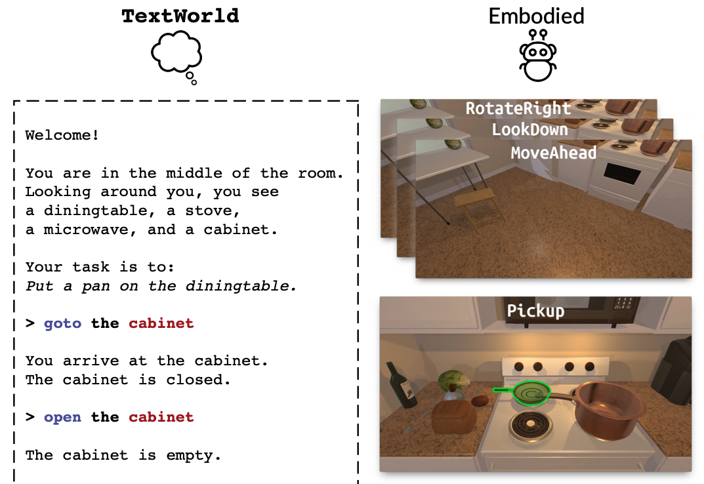
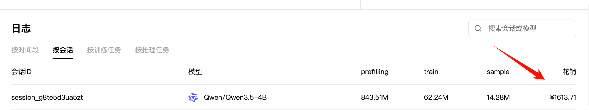
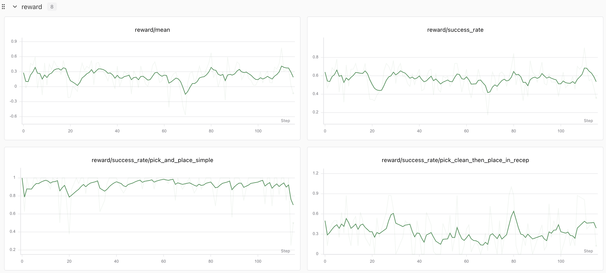
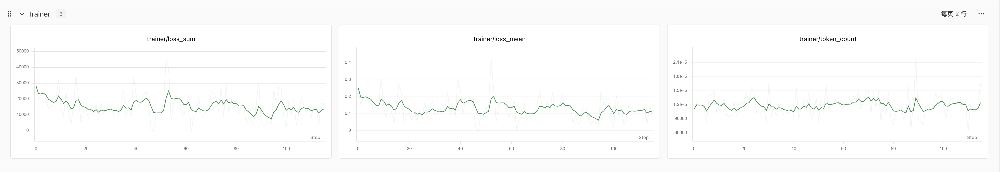

# 接下来我将复现 10 篇强化学习算法：第 8 篇，训练 80 Steps，让大模型学会做家务

> 想跳过正文直接运行？请查看 [快速启动指南](./start.md)：安装环境 → 下载数据 → 训练 → 评测。



<div align="center">
  <a href="https://www.zhihu.com/people/feng-qi-xia-pian" target="_blank"></a>
  <a href="https://www.xiaohongshu.com/user/profile/63c2055e000000002502c58c" target="_blank"></a>
  <a href="https://github.com/KMnO4-zx/agentic-rl-lab"></a>
</div>

> **代码与复现资源**
>
> - 本文完整代码：[KMnO4-zx/agentic-rl-lab/08-alfworld](https://github.com/KMnO4-zx/agentic-rl-lab/tree/main/08-alfworld)
> - ALFWorld 论文：[ALFWorld: Aligning Text and Embodied Environments for Interactive Learning](https://arxiv.org/abs/2010.03768)
> - ALFWorld 官方实现：[alfworld/alfworld](https://github.com/alfworld/alfworld)
> - SwanLab：[ALFWorld 完整训练记录](https://swanlab.cn/@kmno4/llm-agent-rl-lab-alfworld/runs)
> - PyTRIO 文档：[https://docs.pytrio.com/docs](https://docs.pytrio.com/docs)

这是“接下来我将复现 10 篇强化学习算法”系列的第八篇。

前面做 Search-R1 时，模型学会了什么时候搜索；做 ReTool 时，模型学会了什么时候写 Python。到了这一篇，我想把 Agentic RL 再往前推一步：**给模型一间真实维护状态的文字厨房，让它自己找东西、开柜门、拿起物品、加热、清洗，再把东西放到正确的位置。**

这次实验和前几篇很不一样。

- 一条轨迹最多与环境交互 **50 次**；
- 评测中的平均轨迹长度已经达到 **21～23 步**；
- 每次工具调用都会**真正改变 TextWorld / PDDL 环境状态**；
- 模型下一步能看到**从任务开始到当前时刻的完整工具历史**；
- 单条完整训练序列的上限从过去常见的 4K～8K 提高到了 **12K tokens**；
- 每个训练 update 包含 **8 个游戏**，每个游戏采样 **8 条独立轨迹**，一共 **64 条长轨迹**。

代价也很直接。前几篇还能拿一杯奶茶、两杯瑞幸来算成本，这次 PyTRIO 的正式训练账单达到了 **¥1613.71**。

好消息是，这笔钱确实换来了可见的提升。先看结果：80 steps 之后，固定 274 个游戏上的总体成功率从 `52.92%` 提高到 `56.93%`，Valid Unseen 从 `52.99%` 提高到 `58.96%`，同时平均非法动作数从 `5.41` 降到了 `4.81`。



这篇 Blog 会依次讲清楚：ALFWorld 是什么、怎样把它包装成一个工具、怎样借用 GRPO 的 group-relative 思想做长轨迹 Agentic RL，以及整套代码是如何组织起来的。

## 0. ALFWorld 是什么？

ALFWorld 是 Mohit Shridhar 等人在 ICLR 2021 论文 [*ALFWorld: Aligning Text and Embodied Environments for Interactive Learning*](https://openreview.net/forum?id=0IOX0YcCdTn) 中提出的交互式环境。它把两套原本距离很远的世界对齐了起来：

- **TextWorld**：Agent 通过文字 observation 和文字 action 完成任务，环境内部用 PDDL 维护状态；
- **ALFRED / AI2-THOR**：Agent 在三维房间中接收视觉输入，再通过导航和物体操作完成具身任务。



*同一类任务的两种视角：左侧是本文使用的 TextWorld 文本交互，右侧是 AI2-THOR 中的具身厨房与底层动作。图片来源：[ALFWorld 官方项目](https://github.com/alfworld/alfworld/blob/master/media/alfworld_teaser.png)。*

原论文希望 Agent 先在抽象的文字世界里学习高层策略，再把这些策略对应到视觉环境中的具体动作。比如下面这个任务：

```text
Put a heated apple in the fridge.
```

人看到这句话，很自然地会拆出一串步骤：

```text
找到苹果
→ 拿起苹果
→ 找到微波炉
→ 打开微波炉
→ 放入并加热苹果
→ 取出苹果
→ 找到冰箱
→ 打开冰箱
→ 把苹果放进去
```

可以把 ALFWorld 理解成一个文字版的家务模拟器：模型每说一句“拿起苹果”或“打开冰箱”，模拟器都会先检查这件事现在能不能做。动作执行后，模拟器会记住苹果被拿走了、冰箱被打开了等变化，再把新的房间情况告诉模型，让它继续决定下一步。

本文只使用 ALFWorld 的 **text-only 模式**。模型看不到厨房图片，但它面对的依然是一个真正维护状态、会检查动作前置条件、能够判断任务是否完成的交互环境。

### 六类家务任务

当前代码使用六种 ALFWorld 任务：

| 任务类型 | 模型需要完成什么 |
| --- | --- |
| `pick_and_place_simple` | 拿起一个物体并放入指定容器 |
| `look_at_obj_in_light` | 拿起物体并在灯光下查看 |
| `pick_clean_then_place_in_recep` | 清洗物体后放入指定容器 |
| `pick_heat_then_place_in_recep` | 加热物体后放入指定容器 |
| `pick_cool_then_place_in_recep` | 冷却物体后放入指定容器 |
| `pick_two_obj_and_place` | 找到两个同类物体并放入指定容器 |

按照 [`data.py`](https://github.com/KMnO4-zx/agentic-rl-lab/blob/main/08-alfworld/data.py) 的实际筛选规则，只保留 `solvable=true`、属于上述六类任务的 `game.tw-pddl`。本地下载的数据可以发现：

| Split | 可用游戏数 | 含义 |
| --- | ---: | --- |
| `train` | 3,553 | 用于训练的游戏 |
| `valid_seen` | 140 | 房间场景在训练阶段出现过，具体任务实例不同 |
| `valid_unseen` | 134 | 房间场景没有在训练阶段出现过，更关注环境泛化 |

`valid_seen` 和 `valid_unseen` 的区别落在场景是否出现过。两边仍然共享相同的六类任务，因此 `valid_unseen` 更适合观察 Agent 能否把学到的行动策略迁移到新房间。

### 这次复现的边界

这里需要把 ALFWorld 原论文与本文的训练方法分开。

ALFWorld 原论文的主要贡献是文字环境与具身环境的对齐，官方 Agent 训练以 [DAgger](https://proceedings.mlr.press/v15/ross11a.html) 等方法为主。本文使用它提供的 text-only 环境，自行加入 **[GRPO-style group rollout 与组相对 advantage](https://arxiv.org/abs/2402.03300)**，再通过 **[PPO](https://arxiv.org/abs/1707.06347)** 在线更新。

因此，本文复现范围限定为一套“基于 ALFWorld 的 LLM Agentic RL recipe”。ALFWorld 原论文的训练算法与视觉 BUTLER 系统不在本次范围内。

明确了环境与复现边界后，下一步就是把这套文字交互接进 LLM 能够稳定调用的工具协议。

## 1. 把做家务变成一个工具调用

我们只给模型一个工具：

```python
alfworld_step(action: str)
```

`action` 直接使用 ALFWorld 的文字命令，例如：

```text
go to countertop 1
open fridge 1
take apple 1 from countertop 1
heat apple 1 with microwave 1
move apple 1 to fridge 1
```

这里的 `apple 1`、`fridge 1` 都是环境里的完整实例名。数字后缀用于区分同一场景中的多个苹果、冰箱或台面，模型必须原样复制。

一轮交互可以写成：

```text
任务 + 当前 observation + 可执行动作
                ↓
模型调用 alfworld_step(action)
                ↓
TextWorld / PDDL 执行动作并更新状态
                ↓
返回新的 observation + 可执行动作 + done / won
                ↓
把本轮 assistant tool call 和 tool result 追加到完整历史
```

完整流程如下：


我们没有让模型自己宣布“任务完成”。终止信号由环境给出：

- `won=True`：任务条件已经全部满足；
- `done=True, won=False`：环境结束或达到最大交互步数；
- 轨迹达到 12K tokens：提前截断，避免超过单序列预算。

下一轮 prompt 保留从任务开始到当前时刻的完整记录。假设一条轨迹交互了 30 次，第 31 次生成时，模型仍能看到前 30 次真实的 assistant tool call 和 tool observation。

这点很重要。做家务是一个强状态依赖任务：模型需要记得自己开过哪个柜门、苹果现在拿在手里还是已经放进微波炉、加热完成后又把它放到了哪里。丢掉早期历史，很容易让 Agent 重复搜索、拿错物体或忘记已经完成的中间步骤。

知道一条轨迹如何产生后，我们先把整套系统真正跑起来，再回到训练算法内部看 reward 和 advantage 如何作用于这些轨迹。

## 2. 如何启动训练和评估

项目要求 Python `>=3.13`。ALFWorld 通过可选依赖安装，因此其他子项目执行普通 `uv sync` 时不需要下载 TextWorld 环境。

### 安装依赖并下载 ALFWorld 数据

```bash
git clone https://github.com/KMnO4-zx/agentic-rl-lab.git
cd agentic-rl-lab

uv sync --extra alfworld
trio login
swanlab login

cd 08-alfworld
uv run --extra alfworld alfworld-download \
    --data-dir "$PWD/datasets/alfworld"
```

数据默认保存在 `08-alfworld/datasets/alfworld`，训练和评测无需再传 `--data-root`。

### 启动 80-step 训练

```bash
uv run --extra alfworld python train.py \
    --base-model Qwen/Qwen3.5-4B \
    --max-steps 80 \
    --games-per-batch 8 \
    --group-size 8 \
    --max-episode-steps 50 \
    --max-trajectory-tokens 12000 \
    --max-assistant-tokens 2048 \
    --temperature 1.0 \
    --learning-rate 1e-6 \
    --save-every 20 \
    --swanlab-mode online
```

训练期间每 20 updates 会同时保存：

- `state`：保留完整训练状态；
- `sampler weights`：供 `eval.py` 加载并评测 checkpoint。

### 评测 Base Model

```bash
uv run --extra alfworld python eval.py \
    --base-model Qwen/Qwen3.5-4B \
    --split all \
    --games-per-batch 16 \
    --temperature 0.01 \
    --output eval_results/base-qwen35-4b-eval.jsonl \
    --swanlab-mode disabled
```

### 评测 Step 80 checkpoint

下面使用的是本文正式实验保存的 sampler weights。训练自己的模型时，把 `--model-path` 换成终端打印的 `Saved sampler weights:` 路径即可。

```bash
uv run --extra alfworld python eval.py \
    --base-model Qwen/Qwen3.5-4B \
    --model-path 'trio://run_se1v45e6nrxd/sampler_weights/alfworld-agent-rl-qwen35-4b-update-80-weights' \
    --split all \
    --games-per-batch 16 \
    --temperature 0.01 \
    --output eval_results/checkpoint-80steps.jsonl \
    --swanlab-mode disabled
```

评测会把每一局的完整 messages、动作、环境反馈、终止原因和最终 summary 写入 JSONL。如果输出文件已经存在，换一个文件名，或显式增加 `--overwrite-output`。

生成本文的 checkpoint 对比图：

```bash
cd ..
uv run python 08-alfworld/analysis.py
```

这些命令负责把实验跑起来；要理解模型究竟从 64 条长轨迹中学到了什么，还要继续拆开每个 rollout batch 里的 reward、advantage 与 PPO 更新。

## 3. 我们怎样加入 GRPO 的思想？

GRPO 最有用的思想之一，是对同一个问题采样一组回答，再用组内相对 reward 计算 advantage。

ALFWorld 没有“同一道数学题的 8 个答案”，所以我们把分组单位换成了 **同一个游戏、同一个初始状态下的 8 条独立环境轨迹**。

```text
同一个 game.tw-pddl
        ↓
创建 8 个相互独立的 TextWorld 环境
        ↓
Qwen3.5-4B 分别完成 8 条完整工具轨迹
        ↓
环境给出每条轨迹的终局结果
        ↓
在这 8 条轨迹内部计算相对 advantage
```

完整训练闭环如下：


### 1. 每条轨迹只计算一个 episode return

成功基础分为 `1`，失败基础分为 `0`。每出现一次非法工具格式或环境不可执行的 action，再扣 `0.1`：

```text
reward[i] = (1 if won[i] else 0) - 0.1 * invalid_action_count[i]
```

例如：

```text
成功，并出现 2 次非法动作：reward = 1 - 0.2 = 0.8
失败，并出现 3 次非法动作：reward = 0 - 0.3 = -0.3
```

代码不计算 step reward、step return、step advantage 或额外的 action advantage。环境原生 `score` 只写入评测轨迹，训练 reward 由上面的公式统一决定。

### 2. 同游戏组内只减均值

同一个游戏的 8 条轨迹结束后，计算：

```text
advantage[i] = reward[i] - mean(reward_of_same_game)
```

这里没有再除以标准差。

组内表现高于平均水平的轨迹得到正 advantage，低于平均水平的轨迹得到负 advantage。如果 8 条轨迹的 reward 完全相同，整组 advantage 都是 0，本组跳过远端 backward。

### 3. Advantage 只分给模型生成的 token

一条训练序列里同时存在四类内容：

```text
system / user prompt
assistant reasoning + tool call
tool observation
下一轮 assistant reasoning + tool call
...
```

真正参与优化的只有 assistant 自己生成的 completion token：

```text
assistant completion token → trajectory advantage
system / user / tool token  → 0
```

tool observation 必须留在模型上下文中，因为后续动作依赖环境反馈；它由环境生成，不应该被当成模型动作训练。

### 4. 使用 PPO 更新 LoRA

每条完整轨迹构造成一个 PyTRIO `Datum`，保留 rollout 时的 old logprob，再调用内置 PPO loss：

```python
training_client.forward_backward(
    datums,
    loss_fn="ppo",
    loss_fn_config={
        "clip_low_threshold": 0.8,
        "clip_high_threshold": 1.2,
    },
).result()
```

所以更准确的描述是：

> **我们使用 GRPO-style 的同游戏 group rollout 和 group-relative advantage，再用 PPO loss 更新 Qwen3.5-4B 的 LoRA。**

算法闭环到这里已经完整，而这些 advantage 对应的是一串会持续改变世界的决策，这正是本次实验与前几篇最大的不同。

## 4. 这一次，Agentic RL 更像真的 Agent

这次实验最让我兴奋的地方，是 Agentic RL 终于扩展到了连续多轮、真实改变环境状态的决策过程。

模型的每个 action 都会改变未来：

- 没打开冰箱就不能把苹果放进去；
- 手里已经拿着物体时，可能无法再拿第二个；
- 苹果加热后放错位置，任务仍然不会成功；
- 一次错误导航会让后续 observation 和可执行动作全部改变；
- 轨迹结束时只看当前环境状态，前面写得再像正确计划也没有用。

评测中，一局平均需要约 22 次环境交互。每次生成前，模型都会接收不断增长的完整历史。这种长时序信用分配，比只调用一两次工具更接近真实 Agent 的工作方式。

Text-only 也让实验保持了可运行性。TextWorld / PDDL 负责精确状态转移，PyTRIO 负责远端模型采样和训练，本地 Python 则专注于环境编排、reward、advantage 与轨迹记录。

更长的决策链带来了更真实的 Agent 行为，也直接把上下文长度、采样量和训练成本推到了新的量级。

## 5. 训练配置与成本

正式实验使用下面这组配置：

| 项目 | 配置 |
| --- | --- |
| Base Model | `Qwen/Qwen3.5-4B` |
| LoRA rank | 32 |
| 训练步数 | 80 updates |
| 每个 update | 8 个游戏 |
| 每个游戏 | 8 条独立轨迹 |
| 单步 rollout | 64 条轨迹 |
| 总 rollout 数 | 5,120 条轨迹 |
| 最大环境交互 | 50 steps / trajectory |
| 最大完整轨迹 | 12,000 tokens |
| 单轮 assistant 上限 | 2,048 tokens |
| Sampling | temperature 1.0 / top-p 1.0 |
| Reward | `1[won] - 0.1 × invalid_actions` |
| Advantage | 同游戏组内 `reward - mean(reward)` |
| Loss | PPO，clip `0.8 / 1.2` |
| Optimizer | Adam，lr `1e-6`，β `(0.9, 0.95)` |
| Checkpoint | 每 20 updates 保存 state 和 sampler weights |

### 这次为什么这么贵？

这次 PyTRIO 会话一共花了 **¥1613.71**：



账单里的 token 构成非常说明问题：

```text
prefilling: 843.51M
train:       62.24M
sample:      14.28M
```

prefilling 远高于 train 和 sample。原因就藏在 Agent 循环里：每执行一次工具，下一轮采样都要带上更长的任务描述、历史 tool call 和环境 observation。一条轨迹走到二三十步时，同一段早期上下文已经参与了很多轮 prefix 计算。

这也是长上下文 Agentic RL 最真实的成本之一。训练 token 只是账单的一部分，反复读取不断增长的环境历史同样会消耗大量算力。

完整训练过程记录在 [SwanLab](https://swanlab.cn/@kmno4/llm-agent-rl-lab-alfworld/runs)。下面分别是 reward 与 trainer 指标：





在线 rollout 的任务类型和难度会随 batch 变化，因此训练 success rate 与 reward 有明显波动。trainer 侧的 loss 和 token count 则保持在可控范围内。最终能力变化仍然需要放到固定游戏、固定温度的独立评测中判断。

## 6. 评测结果

Base、Step 40 和 Step 80 使用完全相同的评测设置：

```text
Base Model: Qwen/Qwen3.5-4B
valid_seen: 140 games
valid_unseen: 134 games
total: 274 games
temperature: 0.01
top_p: 1.0
seed: 42
max environment steps: 50
```

再看一次完整结果图：


| 模型 | Valid Seen | Valid Unseen | 总成功率 | 成功游戏 | 平均 Reward | 平均非法动作数 |
| --- | ---: | ---: | ---: | ---: | ---: | ---: |
| Base | 52.86% | 52.99% | 52.92% | 145 / 274 | -0.0117 | 5.41 |
| Checkpoint 40 | **57.14%** | 52.24% | 54.74% | 150 / 274 | 0.0237 | 5.24 |
| Checkpoint 80 | 55.00% | **58.96%** | **56.93%** | **156 / 274** | **0.0880** | **4.81** |

Checkpoint 80 相比 Base：

```text
总体成功率:       52.92% → 56.93%   +4.01 pp
Valid Unseen:    52.99% → 58.96%   +5.97 pp
成功游戏数:       145 → 156          +11 games
平均非法动作数:    5.41 → 4.81        -0.60
```

这里能看到几个有意思的现象。

第一，提升主要来自 `valid_unseen`。模型在没有见过的房间场景中进步接近 6 个百分点，说明训练信号确实影响了环境交互策略，并迁移到了训练阶段未出现的房间。

第二，Checkpoint 40 的 `valid_seen` 最好，Checkpoint 80 的 `valid_unseen` 和总体成功率最好。训练收益没有沿所有维度单调增长，选择 checkpoint 时需要看目标 split。

第三，非法动作数量下降。reward 里每次非法动作都会扣 `0.1`，模型除了提高完成率，也开始减少格式错误和环境中不可执行的动作。

六类任务的提升分布很不均匀：


`valid_unseen` 中，Heat then place 提升 `26.1 pp`，Clean then place 提升 `9.7 pp`；Pick two & place 则下降 `11.8 pp`。`valid_seen` 中 Pick two & place 提升 `16.7 pp`，Look under light 和 Heat then place 出现回退。

这组结果来自一次训练和单个评测 seed。它足够说明当前代码跑通了在线 Agentic RL 闭环，并给出了明确的正向信号；稳定结论还需要补充多 seed 训练、重复评测和更长的 checkpoint 曲线。

这些结果回答了“训练有没有带来提升”，而它们究竟如何从环境交互一路变成可复核的 JSONL 与图表，还需要回到代码结构中逐层展开。

## 7. 我们是怎么写代码的？

整套实现一共八个 Python 文件。训练链路可以先概括成：

```text
发现并选择游戏
→ 为每个游戏创建 8 个独立环境
→ 并发采样完整工具轨迹
→ 计算 episode reward
→ 同游戏组内计算 advantage
→ 构造带 token mask 的 PyTRIO Datum
→ PPO backward + optimizer
→ 保存 checkpoint 与 SwanLab 指标
```

### 1. `data.py`：发现并固定游戏顺序

[`data.py`](https://github.com/KMnO4-zx/agentic-rl-lab/blob/main/08-alfworld/data.py) 从项目内的 `datasets/alfworld/json_2.1.1` 发现 `game.tw-pddl`，读取相邻的 `traj_data.json`，过滤任务类型与 `solvable` 状态，再构造 `GameExample`。

训练前按固定 seed 打乱游戏。`take_batch()` 支持循环取样，所以 `--max-steps` 超过一轮数据后也能继续训练。

关键入口：[`discover_games()`](https://github.com/KMnO4-zx/agentic-rl-lab/blob/main/08-alfworld/data.py#L80)。

### 2. `protocol.py`：一个工具与完整多轮上下文

[`protocol.py`](https://github.com/KMnO4-zx/agentic-rl-lab/blob/main/08-alfworld/protocol.py) 定义唯一工具 `alfworld_step(action)`、system prompt、工具调用解析和环境 observation 格式。

这里最关键的是 [`build_next_prompt()`](https://github.com/KMnO4-zx/agentic-rl-lab/blob/main/08-alfworld/protocol.py#L263)。它直接在上一轮真实 prompt token 和 sampler 返回的 completion token 后追加 assistant 闭合符与 tool observation，不会重新 tokenize 历史 assistant 文本。

这样可以同时保证两件事：

1. 下一轮 prompt 是上一轮真实 token 序列的严格前缀扩展；
2. rollout old logprob 与训练时的 assistant token 始终一一对齐。

工具调用解析入口：[`parse_assistant()`](https://github.com/KMnO4-zx/agentic-rl-lab/blob/main/08-alfworld/protocol.py#L100)。

### 3. `environment.py`：同一游戏的 K 个独立环境

[`environment.py`](https://github.com/KMnO4-zx/agentic-rl-lab/blob/main/08-alfworld/environment.py) 用同一个 `game.tw-pddl` 创建 K 个独立 TextWorld 实例。`reset()` 会检查 K 条分支的初始 observation 和游戏文件完全一致，确保 group advantage 比较的确实是同一个任务。

`step()` 接收 K 个 action，一次推进整组环境，并返回：

```text
observation
score
done / won
action 是否 admissible
下一步 admissible actions
```

这个文件还包含 CPython 3.13+ 对 TextWorld 1.7.0 动态变量作用域的兼容处理，以及异步 worker 的安全关闭逻辑，因此当前项目可以直接在 Python 3.14 环境中运行。

核心环境类：[`ALFWorldGroup`](https://github.com/KMnO4-zx/agentic-rl-lab/blob/main/08-alfworld/environment.py#L168)。

### 4. `rollout.py`：并发推进长轨迹

[`rollout.py`](https://github.com/KMnO4-zx/agentic-rl-lab/blob/main/08-alfworld/rollout.py) 是整个 Agent 状态机。

第一轮中，同游戏的 K 条轨迹共享完全相同的 prompt，因此只提交一个 `num_samples=K` 的采样请求。第一步之后，环境状态开始分叉；每条未结束轨迹各提交一个候选，不同轨迹之间通过 `sample_async` 并发，同一轨迹内部继续保持严格的先后顺序。

每一步都会保存：

```text
prompt tokens
assistant completion tokens
rollout old logprobs
assistant text 与解析后的 action
tool observation
admissible / done / won
```

所有轨迹结束后，`rollout_batch()` 统计非法动作、计算 episode reward，并调用 advantage 模块。

核心入口：[`rollout_batch()`](https://github.com/KMnO4-zx/agentic-rl-lab/blob/main/08-alfworld/rollout.py#L469)。

### 5. `advantages.py`：组相对轨迹 advantage

[`advantages.py`](https://github.com/KMnO4-zx/agentic-rl-lab/blob/main/08-alfworld/advantages.py) 只有一个核心任务：按照 `group_id` 聚合同游戏轨迹，再执行 `reward - group_mean`。

它同时统计 reward 全同的退化组。退化组中的所有轨迹 advantage 都为 0，后续不会提交无效 backward。

核心入口：[`assign_advantages()`](https://github.com/KMnO4-zx/agentic-rl-lab/blob/main/08-alfworld/advantages.py#L18)。

### 6. `train.py`：Datum、PPO 与 checkpoint

[`train.py`](https://github.com/KMnO4-zx/agentic-rl-lab/blob/main/08-alfworld/train.py) 把 rollout 与 PyTRIO 串起来。

[`build_trajectory_datum()`](https://github.com/KMnO4-zx/agentic-rl-lab/blob/main/08-alfworld/train.py#L249) 将完整多轮轨迹统一做一次自回归右移：

```text
model_input   = full_tokens[:-1]
target_tokens = full_tokens[1:]
```

随后构造逐 token 的 old logprob 和 advantage：

```text
环境与工具 token: old_logprob = 0, advantage = 0
assistant token:  使用 rollout old_logprob 与 trajectory advantage
```

[`main()`](https://github.com/KMnO4-zx/agentic-rl-lab/blob/main/08-alfworld/train.py#L489) 每个 update 获取最新 LoRA sampler、执行 rollout、过滤零 advantage 轨迹、调用一次 PPO backward 和一次 optimizer step，再记录 SwanLab 指标。

保存 checkpoint 时，`save_checkpoint()` 会同时保存 state 和 sampler weights。训练轨迹只保留在当前进程内存中，不额外写入磁盘。

### 7. `eval.py`：并发评测并保存完整轨迹

[`eval.py`](https://github.com/KMnO4-zx/agentic-rl-lab/blob/main/08-alfworld/eval.py) 与训练共用相同的 prompt、工具协议、环境和 rollout 实现。

Base Model 的 `model_path` 留空；checkpoint 通过 `trio://.../sampler_weights/...` 加载。评测以 `games-per-batch` 为单位并发执行，每个游戏只采样一条轨迹，最后分别统计 `valid_seen` 与 `valid_unseen` 的：

```text
success rate
reward mean
平均交互步数
truncated rate
工具格式正确率
admissible action rate
平均非法动作数
六类任务成功率
```

训练阶段不保存轨迹，评测阶段会通过 [`trajectory_record()`](https://github.com/KMnO4-zx/agentic-rl-lab/blob/main/08-alfworld/rollout.py#L585) 把每一局完整写入 JSONL，方便后续人工 review。

### 8. `analysis.py`：从 JSONL 生成结果图

[`analysis.py`](https://github.com/KMnO4-zx/agentic-rl-lab/blob/main/08-alfworld/analysis.py) 读取三份评测 JSONL 最后的 `type=summary` 记录，校验模型名和游戏数量一致，再生成本文反复使用的 1×2 checkpoint 图。

左图比较 `valid_seen / valid_unseen` 成功率，右图同时展示总体成功率与平均非法动作数。

八个文件的职责可以汇总为：

| 文件 | 作用 |
| --- | --- |
| [`data.py`](https://github.com/KMnO4-zx/agentic-rl-lab/blob/main/08-alfworld/data.py) | 发现、过滤、打乱并循环读取 ALFWorld 游戏 |
| [`protocol.py`](https://github.com/KMnO4-zx/agentic-rl-lab/blob/main/08-alfworld/protocol.py) | 单工具协议、完整消息历史、工具调用解析与 token 前缀扩展 |
| [`environment.py`](https://github.com/KMnO4-zx/agentic-rl-lab/blob/main/08-alfworld/environment.py) | 同游戏 K 环境、状态推进、TextWorld 兼容与资源清理 |
| [`rollout.py`](https://github.com/KMnO4-zx/agentic-rl-lab/blob/main/08-alfworld/rollout.py) | 异步采样、环境交互、轨迹状态、reward 与 JSONL 记录 |
| [`advantages.py`](https://github.com/KMnO4-zx/agentic-rl-lab/blob/main/08-alfworld/advantages.py) | 同游戏组内的轨迹级 relative advantage |
| [`train.py`](https://github.com/KMnO4-zx/agentic-rl-lab/blob/main/08-alfworld/train.py) | Datum、token mask、PPO、优化器、SwanLab 与 checkpoint |
| [`eval.py`](https://github.com/KMnO4-zx/agentic-rl-lab/blob/main/08-alfworld/eval.py) | Base/checkpoint 评测、指标聚合和逐轨迹 JSONL |
| [`analysis.py`](https://github.com/KMnO4-zx/agentic-rl-lab/blob/main/08-alfworld/analysis.py) | 读取评测 summary 并绘制 checkpoint 对比图 |

八个文件串起来后，整个实验就形成了从游戏发现、在线交互、组内信用分配到独立评测的完整闭环，最后可以回到最初的问题：这次长轨迹 Agentic RL 到底验证了什么？

## 8. 总结

这是目前整个系列里轨迹最长、工具调用最多、环境状态最复杂的一次 Agentic RL 实验。

我们让 Qwen3.5-4B 在同一个 ALFWorld 游戏中采样 8 条独立轨迹，用终局成功与非法动作次数计算 episode reward，再通过同游戏组内的 relative advantage 和 PPO 更新 LoRA。模型需要在最多 50 次环境交互、12K 完整上下文中持续记住自己做过什么，并让最终 PDDL 状态真正满足任务条件。

这也为后续把 Agentic RL 推向更长轨迹、更多工具和更复杂环境留下了清晰的起点。
