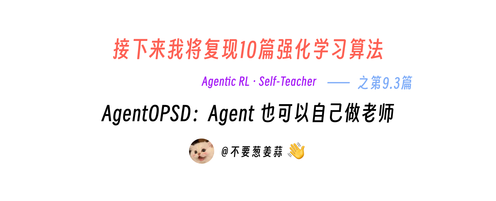
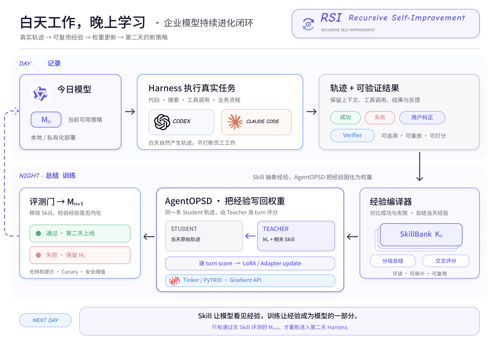
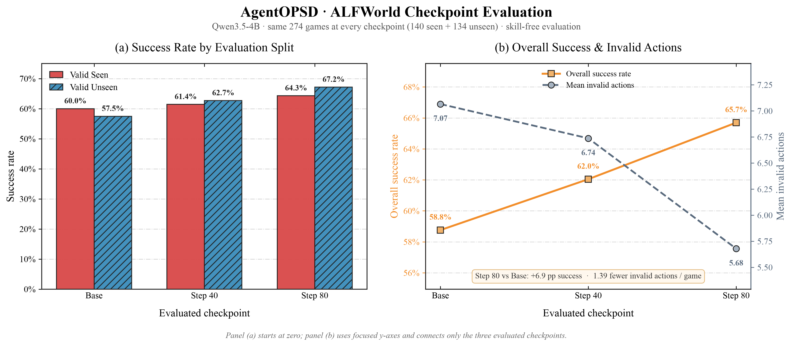
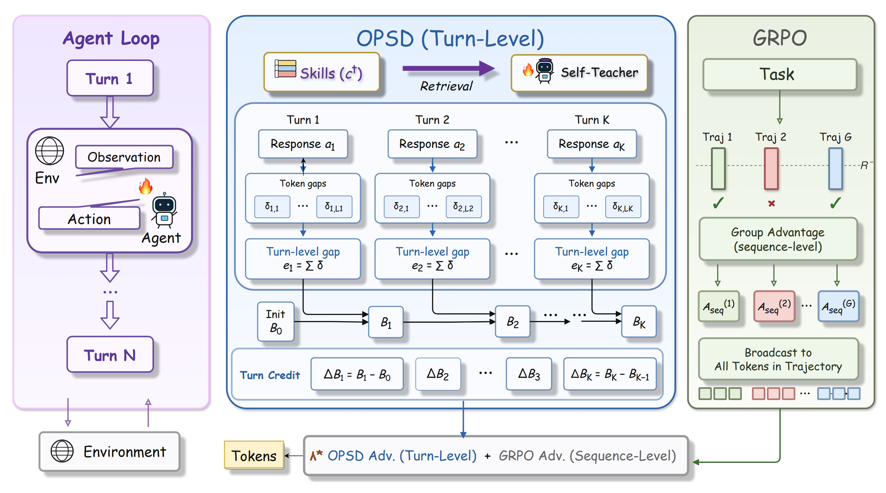
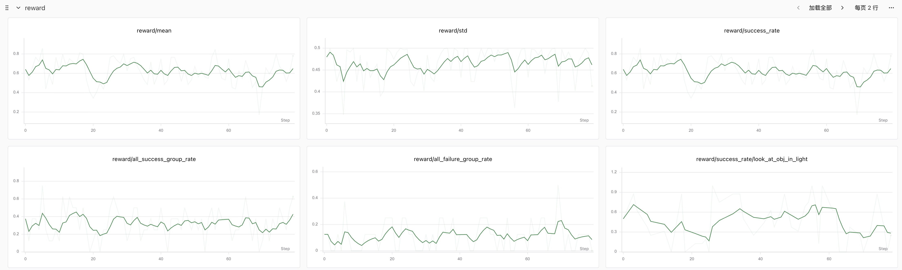
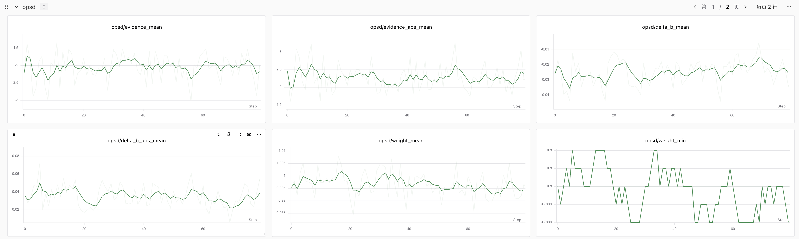
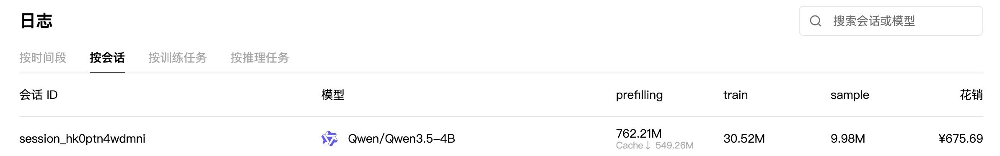

# 接下来我将复现 10 篇强化学习算法：第 9.3 篇，AgentOPSD：Agent 也可以自己做老师

> **快速启动：** 安装依赖、运行 smoke、正式训练、评测 checkpoint 与生成结果图的完整命令，见 [start.md](./start.md)。

<div align="center">
  
</div>

<div align="center">
  <a href="https://github.com/KMnO4-zx/agentic-rl-lab/tree/main/09-AgentOPSD"></a>
  <a href="https://arxiv.org/abs/2608.05987"></a>
  <a href="https://arxiv.org/abs/2010.03768"></a>
  <a href="https://docs.pytrio.com/docs"></a>
  <a href="https://www.zhihu.com/people/feng-qi-xia-pian" target="_blank"></a>
  <a href="https://www.xiaohongshu.com/user/profile/63c2055e000000002502c58c" target="_blank"></a>
  <a href="https://github.com/KMnO4-zx/agentic-rl-lab"></a>
</div>

> **代码与复现资源**
>
> - 完整代码：[KMnO4-zx/agentic-rl-lab/09-AgentOPSD](https://github.com/KMnO4-zx/agentic-rl-lab/tree/main/09-AgentOPSD)
> - AgentOPSD 论文：[Fine-Grained Agentic Reinforcement Learning via On-Policy Self-Distillation](https://arxiv.org/abs/2608.05987)
> - 上游实现：[ZethWang/AgentOPSD](https://github.com/ZethWang/AgentOPSD/tree/0c478b2d7cdc201d9b1f076ec5b3dec7e88a161b)
> - ALFWorld：[论文](https://arxiv.org/abs/2010.03768) / [官方仓库](https://github.com/alfworld/alfworld)
> - PyTRIO 文档：[docs.pytrio.com](https://docs.pytrio.com/docs)

这是“接下来我将复现 10 篇强化学习算法”系列的第 9.3 篇。第 9 篇现在展开成了一个 9.x 小系列：[9.1 Vision GRPO](../09-vision-grpo/readme.md) 让模型看图做几何题，[9.2 TEMPO](../09-tempo/readme.md) 把长轨迹切成 macro-step；这一篇则继续处理长轨迹中最棘手的信用分配问题：Agent 最终虽然成功了，中间几十个动作里，究竟哪些才真正关键？AgentOPSD 的答案很漂亮。当前 Agent 先在无技能条件下完成真实 rollout，再由同一个参数快照带着技能复评其中的每个 turn，整个过程无需额外训练 Critic，也无需 Teacher 重写一条“标准轨迹”。最终奖励决定整条轨迹应该被鼓励还是惩罚，Self-Teacher 只负责找出其中更关键的动作。这次我们使用 Qwen3.5-4B、PyTRIO 和 text-only ALFWorld 完成了 80 个训练 step。

但我更愿意把 AgentOPSD 放进一个更大的图景里：它可能已经提供了一种 RSI（Recursive Self-Improvement，递归式自我改进）的雏形。一个本地或私有化部署的模型，白天通过 Codex、Claude Code 这样的 Harness 完成真实任务并留下轨迹；晚上再总结当天的成功、失败与用户纠正，形成类似 Skill 的可复用经验，随后由同一个模型带着这些经验重新审视原始轨迹，通过 AgentOPSD 给每个 turn 分配信用，并借助 PyTRIO、Tinker 这样的训练基础设施把经验真正写回权重。经过无 Skill 的回归评测后，新模型再进入第二天继续工作。Skill 只是让模型能够看见经验，只有训练才能让经验成为模型能力的一部分。

*它距离完整意义上的 RSI 仍有一段路，但在真正成熟的持续学习范式出现之前，我认为这是目前最优雅、也最具工程可行性的 RSI 实现路径。*



*白天通过 Harness 产生真实轨迹，晚上总结 Skill、执行 AgentOPSD 训练并通过无 Skill 评测门，形成下一天的新模型。*

## 0. 先看结果：整体成功率 58.8% → 65.7%

Base、Step 40 和 Step 80 使用完全相同的 274 个游戏：`valid_seen` 140 局，`valid_unseen` 134 局。评测时不向模型注入任何 Skill；`analysis.py` 还会逐一校验三个 JSONL 中的 `(split, game_id)` 是否一致，避免 checkpoint 之间偷偷换题。



| 模型 / Checkpoint | Valid Seen | Valid Unseen | 整体成功率 | 平均无效动作 |
| --- | ---: | ---: | ---: | ---: |
| Qwen3.5-4B Base | 60.0% | 57.5% | 58.8% | 7.07 |
| AgentOPSD Step 40 | 61.4% | 62.7% | 62.0% | 6.74 |
| **AgentOPSD Step 80** | **64.3%** | **67.2%** | **65.7%** | **5.68** |

Step 80 相比 Base：

- 整体成功率提高 `6.9` 个百分点，成功游戏从 `161 / 274` 增加到 `180 / 274`；
- `valid_unseen` 提高 `9.7` 个百分点，比 seen split 的提升更明显；
- 每局平均无效动作从 `7.07` 降到 `5.68`，少了 `1.39` 次；
- Step 40 已经出现正向变化，Step 80 又继续向前走了一段。

## 1. AgentOPSD 是什么？

普通 GRPO 看的是整条轨迹。

同一个任务采样一组 rollout，成功的轨迹拿正 advantage，失败的轨迹拿负 advantage。这个方向没有问题，但一条轨迹里所有 action token 通常会继承同一个序列级信号。

放进 ALFWorld 就很直观了。Agent 可能先开错两个柜门，绕了十几步，最后才找到苹果并成功放进冰箱。GRPO 只知道“这局最终成功”，于是前面的绕路和最后的关键动作一起被鼓励。轨迹越长，这种粗粒度 credit assignment 越明显。

AgentOPSD 在 GRPO 的轨迹方向上，又加了一层 OPSD 的局部判断：



*图中间是带 Skill 的 Self-Teacher：它沿着 Student 已经执行的每个 turn 计算 token gap，再递推为 turn credit；右侧的 GRPO 仍然提供整条轨迹的最终方向。图片来源：[AgentOPSD 论文](https://arxiv.org/abs/2608.05987)。*

整个闭环包含三个角色，其中 Student 与 Self-Teacher 都由**当前模型**承担：

- **Student**：看不到技能，像真正部署时一样与环境交互；
- **Self-Teacher**：与 Student 来自同一个当前参数快照，但额外看到 SkillBank 中的任务技能；
- **Verifier**：只看环境最终是否成功，给整条轨迹一个 0/1 结果。

最关键的是，Teacher **不会生成另一条更好的轨迹**。Student 做了什么，Teacher 就沿着同一条轨迹、同一组 action token 重新计算概率。两种上下文对同一个 token 的 log-prob 差异，就是“如果提前知道这个技能，我会不会更认可这一步”的局部证据。

它和本系列[第 4 篇的普通 OPSD](../04-opsd/readme.md)也不完全相同：

| 方法 | 主要监督来源 | 信号粒度 | Teacher 看到什么 |
| --- | --- | --- | --- |
| GRPO | 同题多条轨迹的终局 reward | 整条轨迹 | 没有 Teacher |
| OPSD | 同模型对 Student completion 的复评 | 推理 token | 题目参考解答 |
| AgentOPSD | 终局 GRPO + Self-Teacher 局部证据 | Agent turn | 与任务对应的技能 |

一句话概括：

> **最终奖励决定往哪学，Self-Teacher 决定一条长轨迹里哪几个 turn 应该多学一点、哪几个少学一点。**

## 2. 整个训练流程是怎样的？

我们把论文机制简化成了下面这张中文图。看懂这张图，基本就看懂了整个实现。


### 2.1 Student 先无技能执行

每个训练 step 先冻结当前权重快照。对同一个 ALFWorld 游戏创建 8 个彼此独立的 TextWorld 环境，让 Student 从相同任务和初始状态出发，采样 8 条不同轨迹。

Student prompt 里只有任务、历史 observation、当前允许执行的动作和 `alfworld_step` 工具协议。它从头到尾都看不到 SkillBank，这样训练时访问的状态分布与最终无技能评测保持一致。

每条轨迹最多交互 50 个 turn。环境最后只返回成功或失败，训练 reward 也是纯 0/1，没有另外加入无效动作惩罚。

### 2.2 同一个模型带着 Skill 复评同一条轨迹

Student rollout 结束后，模型还没有做 optimizer step。代码仍使用刚才那个冻结的 sampling snapshot，只把初始 prompt 换成 Teacher 版本，并加入：

- 一份所有 ALFWorld 任务共享的 general skill；
- 一份与任务类型对应的技能，例如 clean、heat、cool 或 pick-and-place。

然后 Teacher 对 Student 的完整轨迹调用一次 `compute_logprobs`。它不改动作、不重跑环境，只精确复评 Student 已经生成的 assistant action token。

本地实现根据 ALFWorld 的 `task_type` 确定性映射到固定技能文件，跳过了模糊的语义检索。这样更容易审计，也不会把 reward 或未来 observation 泄漏给 Teacher。

### 2.3 Token gap 汇总成 turn evidence

对每个 action token，我们比较“Teacher 带技能”和“Student 无技能”两种上下文下的 log-prob。Teacher 更认可的 token 得到正 gap，更不认可的得到负 gap；同一个 turn 内的 token gap 相加，得到这一轮的 evidence。

这里必须保存真实 action span。system、user、环境 observation 和聊天模板 token 都只是上下文，不能混进 Teacher evidence，更不能进入策略梯度。

### 2.4 证据按时间递推，找出关键 turn

AgentOPSD 按真实时间顺序递推一条“当前轨迹会成功”的相对 belief，让各轮 evidence 通过同一条 belief 关联起来。每个 turn 让 belief 改变了多少，也就是图里的 `ΔB`，用来表示这一轮的局部关键性。

较早的证据会按 `gamma=0.95` 逐渐衰减，因此后续决策仍然能受到历史影响，又不会让第一步永远支配整条轨迹。

这个 belief 表示相对支持度，并未经过成功概率校准。训练真正使用的是相邻 turn 之间的变化，绝对数值本身不参与关键性判断。

### 2.5 终局结果定方向，Teacher 只做有界微调

同游戏 8 条轨迹先按终局 0/1 reward 计算标准 GRPO sequence advantage。成功轨迹的方向为正，失败轨迹的方向为负；如果整组全成功或全失败，advantage 全为 0，该组就不产生策略梯度。

随后再用 `ΔB` 调整各个 turn 的强度。我们的配置里 turn weight 被限制在 `[0.8, 1.2]`，同时 `reshape_lambda=0.5`，所以最终 advantage 只会落在原始 GRPO advantage 的 `0.9～1.1` 倍。

也就是说，Self-Teacher 最多只把某个 turn 多强调或少强调 10%，绝不会把成功轨迹改成负优势，也不会让局部判断推翻最终环境结果。

### 2.6 只更新 assistant action token

最后把每条完整多轮轨迹构造成 PyTRIO PPO Datum。assistant action token 使用所在 turn 的重塑 advantage；环境 observation、system 和 user token 的 advantage 全部为 0。

PyTRIO 远端负责 Qwen3.5-4B LoRA 的 forward、backward 和 optimizer，本地代码负责 ALFWorld 环境、Student rollout、Skill 选择、Teacher 对齐、turn credit 和 batch 边界。一次 PPO 更新结束后，才进入下一个参数快照。

## 3. 我们是怎么复现的？

这次复现先锁定论文的核心不变量，再把它接到第 8 篇已经验证过的 ALFWorld 长轨迹基建上，省去了对上游 Trainer 的逐行翻译。

### 3.1 先复用可靠的 Agent 环境层

我们从 [08-alfworld](../08-alfworld/readme.md) 复用了三个最重要的基础：同游戏多分支的独立环境、严格递增的真实 token prefix，以及 action → environment step → observation → next action 的因果顺序。

这一步看起来和算法没关系，却决定了后面的 Teacher log-prob 是否真的能对齐。只要中途重新渲染历史、静默截断上下文，Teacher 就不再是在复评 Student 当时见过的同一条轨迹。

### 3.2 固定 SkillBank 和任务映射

ALFWorld Skill 资产来自 AgentOPSD 上游仓库的固定 commit。我们保留 general skill 和五类任务技能，再通过显式的 `task_type → skill` 映射处理六类 ALFWorld 任务。

Skill 只在训练期进入 Teacher prompt。Student rollout、Base 评测和所有 checkpoint 评测都不注入 Skill，避免把开卷能力误当成模型真正学会的能力。

### 3.3 在 rollout 阶段保存对齐证据

rollout 阶段就保存每个 turn 的 action token、起止 span、Student old log-prob 和 policy snapshot ID。Teacher 把 Skill 加入初始前缀后，使用相对 offset 重建 action span，再检查 token 数量和位置完全一致。

因为 ALFWorld 后续 turn 始终是前一段真实 token 的严格扩展，所以每条轨迹只需要一次完整 Teacher 请求，不必按几十个 turn 重复打分。

### 3.4 用内置 PPO先验证核心机制

AgentOPSD 的核心变化发生在 loss 之前：我们先在本地把 Teacher gap 变成每轮 advantage，再交给 PyTRIO 内置 PPO。PPO ratio 裁剪范围为 `[0.8, 1.24]`，一次 rollout 只做一个 PPO epoch，尽量守住 on-policy 边界。

论文里的 full-vocabulary entropy、全参数训练和部分 paper-close reduction 没有原样复刻。这一版定位是**算法级复现**：优先验证同快照 Self-Teacher、turn-level credit、action-only mask 和无技能评测组成的完整闭环。

正式实验配置如下：

| 项目 | 配置 |
| --- | --- |
| Base Model | `Qwen/Qwen3.5-4B` |
| 训练步数 | 80 updates |
| 每步任务数 | 16 个 ALFWorld 游戏 |
| 每任务轨迹数 | 8 条，共 128 条轨迹 / update |
| 最大交互轮数 | 50 turns |
| Student 轨迹上限 | 14,336 tokens，另为 Teacher Skill 前缀预留 2,048 |
| LoRA rank / learning rate | 32 / `4e-6` |
| Turn credit | `gamma=0.95`，`lambda=0.5`，`weight_bound=0.2` |
| PPO clip | `[0.8, 1.24]` |
| Checkpoint | Step 40、Step 80 |
| 固定评测 | 140 seen + 134 unseen，temperature `0.01`，seed `42`，全程无 Skill |

## 4. 快速开始

下面所有命令都从仓库根目录运行。项目要求 Python `>=3.13`；本地负责数据、环境和训练编排，模型采样与 LoRA 训练由 PyTRIO 远端执行。

### 4.1 安装依赖并下载 ALFWorld

```bash
git clone https://github.com/KMnO4-zx/agentic-rl-lab.git
cd agentic-rl-lab

uv sync --extra alfworld
trio login
swanlab login

uv run --extra alfworld alfworld-download \
    --data-dir "$PWD/09-AgentOPSD/datasets/alfworld"
```

### 4.2 先跑一个最小 smoke

这个命令会产生远端调用费用，但规模很小，适合先确认环境、Student rollout、Teacher 打分、PPO 和 checkpoint 能完整走通：

```bash
uv run --extra alfworld python 09-AgentOPSD/train.py \
    --max-steps 1 \
    --tasks-per-update 1 \
    --group-size 4 \
    --max-turns 20 \
    --save-every 1 \
    --seed 3 \
    --swanlab-mode disabled
```

单个游戏的 4 条轨迹可能刚好全成功或全失败，此时 sequence advantage 全为 0，脚本会保留 rollout 指标但跳过 backward。想稳定验证参数更新，可以适当增加 `--tasks-per-update`。

### 4.3 运行 80-step 正式训练

```bash
uv run --extra alfworld python 09-AgentOPSD/train.py \
    --base-model Qwen/Qwen3.5-4B \
    --max-steps 80 \
    --tasks-per-update 16 \
    --group-size 8 \
    --max-turns 50 \
    --max-trajectory-tokens 14336 \
    --max-action-tokens 512 \
    --temperature 1.0 \
    --top-p 1.0 \
    --teacher-concurrency 16 \
    --gamma 0.95 \
    --reshape-lambda 0.5 \
    --weight-bound 0.2 \
    --ppo-clip-low 0.8 \
    --ppo-clip-high 1.24 \
    --lora-rank 32 \
    --learning-rate 4e-6 \
    --save-every 40 \
    --swanlab-mode online
```

Step 40、Step 80 以及训练结束时都会保存两类路径：

- `state`：包含 optimizer 状态，用于断点续训；
- `sampler weights`：用于采样和 `eval.py` 评测。

### 4.4 评测 Base Model

```bash
uv run --extra alfworld python 09-AgentOPSD/eval.py \
    --base-model Qwen/Qwen3.5-4B \
    --split all \
    --games-per-batch 16 \
    --temperature 0.01 \
    --seed 42 \
    --output 09-AgentOPSD/eval_results/base-qwen35-4b-eval.jsonl \
    --swanlab-mode disabled
```

### 4.5 评测 Step 40 与 Step 80

下面使用本文正式实验保存的 sampler weights。训练自己的模型时，换成终端打印的 `Saved sampler weights:` 路径即可。

```bash
uv run --extra alfworld python 09-AgentOPSD/eval.py \
    --base-model Qwen/Qwen3.5-4B \
    --model-path 'trio://run_sschmbprfwg0/sampler_weights/agentopsd-alfworld-qwen35-4b-step-40-weights' \
    --split all \
    --games-per-batch 16 \
    --temperature 0.01 \
    --seed 42 \
    --output 09-AgentOPSD/eval_results/checkpoint-eval-step40.jsonl \
    --swanlab-mode disabled

uv run --extra alfworld python 09-AgentOPSD/eval.py \
    --base-model Qwen/Qwen3.5-4B \
    --model-path 'trio://run_sschmbprfwg0/sampler_weights/agentopsd-alfworld-qwen35-4b-step-80-weights' \
    --split all \
    --games-per-batch 16 \
    --temperature 0.01 \
    --seed 42 \
    --output 09-AgentOPSD/eval_results/checkpoint-eval-step80.jsonl \
    --swanlab-mode disabled
```

每个 JSONL 会保存 274 条完整轨迹，并在最后写入一条统一 summary。输出文件已经存在时不要直接覆盖；换文件名，或确认后显式增加 `--overwrite-output`。

### 4.6 生成 checkpoint 对比图

```bash
uv run python 09-AgentOPSD/analysis.py
```

脚本会读取 Base、Step 40 和 Step 80 的 summary，校验三个文件中的游戏 ID 完全一致，再生成：

```text
09-AgentOPSD/images/agentopsd_checkpoint_evaluation.png
```

## 5. 训练过程中发生了什么？

固定评测告诉我们 checkpoint 最终有没有变好，SwanLab 曲线则用来确认 AgentOPSD 的中间信号有没有真的进入训练。

### 5.1 Online reward 很吵，不能代替固定评测



`reward/mean` 和 `reward/success_rate` 在 80 个 step 里持续波动，没有一条教科书式的单调上升曲线。这很正常：每个 update 都在抽不同的 ALFWorld 游戏，任务难度会变；同一个 batch 里还可能出现全成功组或全失败组，它们没有 group-relative gradient。

所以这张图适合检查 rollout 是否健康、成功与失败样本是否都存在，不适合直接回答模型是否变强。能力变化仍然要回到开头那组固定 274-game 评测。

### 5.2 Turn-level credit 确实没有“挂空挡”



这组曲线是 AgentOPSD 专属的诊断指标：

- `evidence_abs_mean` 持续非零，说明带 Skill 的 Teacher 与无 Skill Student 对同一动作确实给出了不同判断；
- `delta_b_abs_mean` 持续非零，说明这些差异经过时间递推后，真的产生了 turn-level belief change；
- `weight_mean` 基本围绕 1.0，说明重塑没有整体抬高或压低所有轨迹；
- `weight_min` 多次触到 0.8 下界，说明有些 turn 确实被主动降权，各轮最终 advantage 也有了明确区分。

这些指标证明 turn credit 链路在工作，但它们只能作为训练诊断，无法直接衡量能力。`evidence` 大、`ΔB` 大，不代表游戏一定做得更好；真正的结果证据仍是无 Skill checkpoint 评测。

### 5.3 真正贵的是长前缀和 Teacher 复评



这次 80-step 正式训练会话记录的用量是：

| 项目 | 用量 |
| --- | ---: |
| Prefilling | 762.21M tokens，其中 Cache 549.26M |
| Train | 30.52M tokens |
| Sample | 9.98M tokens |
| **花销** | **¥675.69** |

训练用量里最扎眼的是 `762.21M` 的 prefilling。ALFWorld 每轮都要带上越来越长的完整历史，Student rollout 之后，Self-Teacher 还要在带 Skill 的上下文里复评整条轨迹；这个用量结构与长轨迹 + 同轨迹 Teacher scoring 的设计是吻合的。

缓存命中了 549.26M tokens，已经省下了相当一部分重复前缀成本，但这次账单还是比前面那些短回答任务肉疼得多。Agentic RL 的成本，很多时候主要来自模型为了走到这些 action 而反复读取的历史；最终参与 loss 的 action token 只占较小部分。

## 6. 这次结果应该怎么理解？

我认为这次复现给出了三层强度不同的证据。

第一层最确定：**工程闭环成立。** 同一个 snapshot 完成无 Skill rollout 和有 Skill 复评，action span 能对齐，turn credit 能进入 action-only PPO，checkpoint 也能在无 Skill 条件下独立评测。

第二层是当前单次实验的正向结果：Step 40 和 Step 80 的固定评测都超过 Base，Step 80 整体多完成 19 个游戏，同时减少无效动作；而且 unseen split 的提升更大。这说明改进已经写进保存后的无 Skill policy，效果没有停留在训练时借 Skill 开卷。

第三层仍需对照实验回答：**这些提升中，AgentOPSD 的 turn-level credit 与同预算 PPO/GRPO 训练本身各贡献了多少。** 下一步需要在相同游戏顺序、seed、rollout 数和 token budget 下补一条 `reshape_lambda=0` 的 GRPO 对照，并对 Base、GRPO、AgentOPSD 做多 seed 固定评测。

另外，这一版与论文还有明确差异：论文使用的模型和全参数训练栈不同；我们使用 Qwen3.5-4B LoRA 和 PyTRIO 内置 PPO；full-vocabulary entropy 等 paper-close 细节没有原样实现。因此本文始终定位为 **AgentOPSD 在 PyTRIO + ALFWorld 上的算法级复现**，不追求复刻论文榜单数字。

## 7. 总结

如果只用一句话总结 AgentOPSD，我会说：

> **带技能的自己回头审视刚才走过的原路，指出其中最关键的转弯。**

GRPO 仍然掌握最终方向：成功轨迹往上推，失败轨迹往下压；Self-Teacher 只在这个方向内做有界的 turn-level 调整。这样既保留了环境 verifier 的最终权威，又把一个稀疏的终局奖励拆成了更细的长轨迹信用分配。

这次我们用 80 个 step、10,240 条训练 rollout 跑通了完整链路。固定 274-game 评测上，整体成功率从 58.8% 提高到 65.7%，平均无效动作从 7.07 降到 5.68。结果是正的，成本也是真肉疼；更重要的是，它给后面的严格 GRPO 对照和多 seed 实验留下了一条已经可运行、可审计、可评测的起点。

## 8. 代码文件分别做什么？

| 文件 | 一句话职责 |
| --- | --- |
| [`data.py`](./data.py) | 发现 ALFWorld 游戏，固定 split、任务类型与采样顺序 |
| [`protocol.py`](./protocol.py) | 定义 `alfworld_step`、多轮消息和严格 token prefix |
| [`environment.py`](./environment.py) | 为同一个游戏创建彼此隔离的 TextWorld 环境 |
| [`skills.py`](./skills.py) | 加载固定 SkillBank，并做 `task_type → skill` 映射 |
| [`rollout.py`](./rollout.py) | 并发执行 Student 轨迹，保存 action span 与 old log-prob |
| [`teacher.py`](./teacher.py) | 给同一轨迹加入 Skill，整轨迹复评并切回每个 turn |
| [`advantages.py`](./advantages.py) | 计算 GRPO sequence advantage 和 AgentOPSD turn credit |
| [`loss.py`](./loss.py) | 构造只训练 assistant action token 的 PPO Datum |
| [`train.py`](./train.py) | 串起 snapshot → rollout → Teacher → credit → PPO → checkpoint |
| [`eval.py`](./eval.py) | 无 Skill 评测 Base/checkpoint，并保存完整 JSONL |
| [`analysis.py`](./analysis.py) | 校验三次评测口径并绘制 checkpoint 对比图 |
| [`skills/alfworld/`](./skills/alfworld/) | 固定版本的 general 与任务专属 Skill 资产 |

推荐阅读顺序：先看 `train.py` 的主循环，再依次跟进 `rollout.py → teacher.py → advantages.py → loss.py`。这一条链正好对应“一批 Student 轨迹如何变成一次参数更新”。
