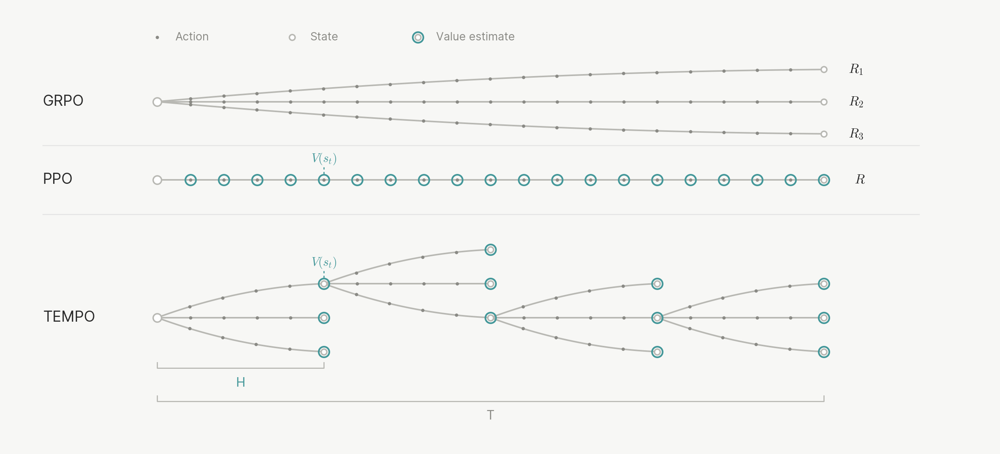
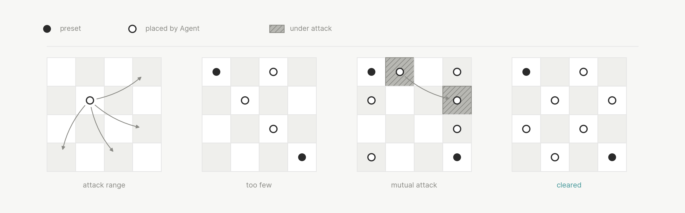
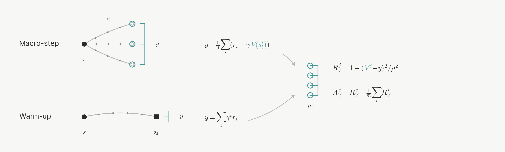
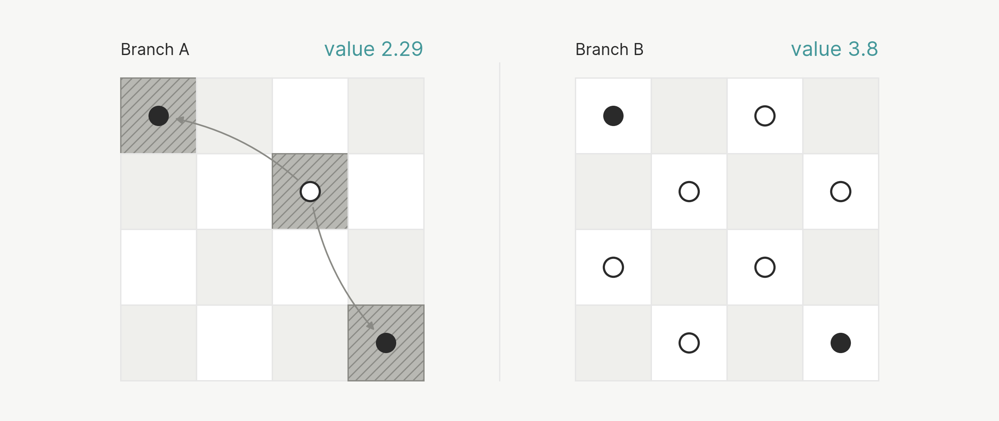
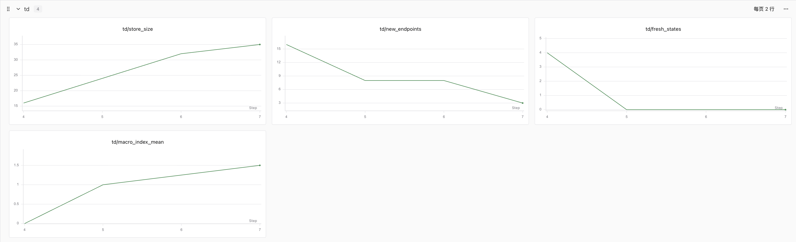
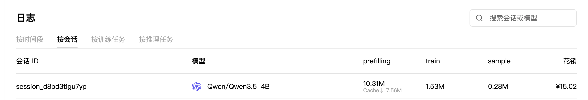
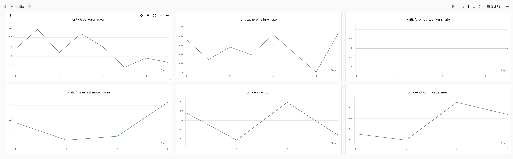

# 接下来我将复现 10 篇强化学习算法：第 9.2 篇，TEMPO 把长轨迹切成小段，训一个会推理的 Critic

<div align="center">
  
</div>

<div align="center">
  <a href="https://github.com/KMnO4-zx/agentic-rl-lab/tree/main/09-tempo"></a>
  <a href="https://arxiv.org/abs/2010.03768"></a>
  <a href="https://studio.dots.ai/dots/tempo-blog.html"></a>
  <a href="https://docs.pytrio.com/docs"></a>
  <a href="https://www.zhihu.com/people/feng-qi-xia-pian" target="_blank"></a>
  <a href="https://www.xiaohongshu.com/user/profile/63c2055e000000002502c58c" target="_blank"></a>
  <a href="https://github.com/KMnO4-zx/agentic-rl-lab"></a>
</div>

> **代码与复现资源**
>
> - 完整代码：[KMnO4-zx/agentic-rl-lab/09-tempo](https://github.com/KMnO4-zx/agentic-rl-lab/tree/main/09-tempo)
> - 算法来源：[TEMPO: Test-Time-Scaled Value Estimation with Macro-Step Policy Optimization](https://studio.dots.ai/dots/tempo-blog.html)（小红书 Dots 团队博客）
> - PyTRIO 文档：[docs.pytrio.com](https://docs.pytrio.com/docs)

这是"接下来我将复现 10 篇强化学习算法"系列的第 9.2 篇。

先交代一下编号。原本的第 10 篇计划留给我们自己的 Harness-RL，在它就绪之前，第 9 篇会以 9.x 子系列的形式过渡：9.1 是 [Vision GRPO](../09-vision-grpo/readme.md)，本篇 9.2 复现 TEMPO。

这一篇和前面九篇的打开方式都不太一样：**TEMPO 的论文还没发布**，目前只有 Dots 团队的一篇技术博客。博客把方法机制讲得很清楚，但超参数、训练曲线、消融实验全都欠奉。所以我给自己定的目标是**算法级复现**——把 TEMPO 区别于普通 GRPO 的每一个机制都在代码里跑通、在真实环境里验证，暂时不去追任何榜单数字。环境上我用 ALFWorld 替代原文的 ARC-AGI-3（后者是付费 API，而且服务端状态恢复并不开放），基建直接复用了第 8 篇的整套交互封装。

先看 TEMPO 到底在解决什么问题。

## 0. 长程任务的两个死结

前面几篇的 Agentic RL 有一个共同的隐含前提：轨迹够短。Search-R1 检索几轮就出答案，ReTool 写几段代码就到终局，ALFWorld 五十步内见分晓。可一旦 agent 开始承担以小时、天计的任务，GRPO 这套范式会立刻撞上两堵墙。

**第一堵墙：反馈周期过长。** 结果导向的奖励要等轨迹彻底结束才能观测。一次 rollout 跑八个小时，那训练信号的产生周期下限就是八小时——大部分算力都花在"等结果"上。

**第二堵墙：信用分配。** 轨迹拉长到几百轮之后，开局第三个动作和最终成败之间隔着几百步。组内一减均值，信号被稀释得只剩噪声，模型根本无从知道当初哪个决定是对的。

教科书式的解法是 PPO 那套：训一个 value head，在每个中间状态上预测未来回报，让没走完的轨迹也能产生训练信号。但 scalar value head 有一个先天短板——**一次前向、固定计算量**。长程任务里"这个状态值多少"本身就是一道推理题：actor 的假设对不对？当前搜索方向还可行吗？哪些障碍还没解决？一个只够算一次乘加的小脑袋，回答不了这种问题。

TEMPO 的名字就来自它的答案：Test-Time-Scaled Value Estimation with Macro-Step Policy Optimization。拆开看，正好对应它的三个核心设计。

## 1. TEMPO 的三个核心设计

### 1.1 macro-step：把优化单位从"整局"降到"一段"

TEMPO 把连续 H 轮模型-环境交互定义为**一个 macro-step**，用它替代完整轨迹，作为 rollout 和优化的基本单位。每次更新时，actor 从此前保存的某个中间状态继续执行，环境恢复到对应状态，向前走 H 轮就停。



*GRPO 每条 rollout 都要执行完整 T 轮交互才能拿到终局回报；PPO 同样 rollout 到 T，沿途用 scalar value head 估计 V(s)；TEMPO 每次只执行长度为 H 的 macro-step，段末调用生成式 critic，部分段末状态被保存为后续 rollout 的起点。图片来源：[TEMPO 博客](https://studio.dots.ai/dots/tempo-blog.html)。*

这里有个容易被忽略的数学保证：博客附录里推导过，在校正历史前缀的分布差异后，**只优化当前 macro-step 的期望梯度，等价于完整长程轨迹的策略梯度**。直观理解：固定切分规则下，完整轨迹的策略梯度可以拆成 M 个 macro-step 的梯度之和；均匀抽一段、只算这段、乘上 M，期望不变。前提是段的前缀和段本身都来自当前策略——前缀过期时用重要性采样修正（这也是我们初版唯一省略的部分，后面细说）。

### 1.2 生成式 critic：估值本身是个推理问题

TEMPO 抛弃了 scalar value head，把价值估计建模成生成任务：critic 读取当前状态和此前的完整交互记录，分析 actor 已经掌握的环境规律、正在尝试的方案、尚未解决的障碍，推理之后再给出一个数值估计。面对更难的状态，critic 可以延长推理、多做反思——**actor 能靠 test-time scaling 变强，评价 actor 的 critic 也应该有同样的权利**。

博客里有个非常漂亮的例子，"放置骑士"：



*actor 不知道规则，需要通过交互推断隐藏约束：在两枚预置棋子的基础上继续放六枚，任意两枚之间都不能形成马步攻击。图片来源：[TEMPO 博客](https://studio.dots.ai/dots/tempo-blog.html)。*

从同一个起点采两条 64 轮的轨迹，环境奖励完全相同（都是 0），但处境已经天差地别：



*分支 A 把"存在攻击关系"当成了任务目标（方向弄反了），此后枚举的所有候选布局都要求存在攻击关系——正确答案已经被整体排除在搜索空间外，critic 对照游戏源码判定 V̂=2.6；分支 B 回读历史推翻了错误假设，还发现了"同色格上的棋子互不攻击"的规律，给出了一个可行解，critic 判定 V̂=4.6。价值差 2.0，环境奖励差 0。图片来源：[TEMPO 博客](https://studio.dots.ai/dots/tempo-blog.html)。*

这个例子同时解释了另一个设计：critic 可以访问**特权信息**——环境内部状态、隐藏规则、游戏源码。这些信息对 actor 保密，只作为评价侧的核验证据。分支 A 的死刑判决，正是 critic 对照源码做出来的。

至于为什么只在 macro-step 边界估值：生成式 critic 单次调用要生成一整段推理，成本远高于 value head 的一次前向，没法在每个 token 后密集运行。H 轮一次，是反馈粒度和计算成本的平衡点。

### 1.3 actor 兼任自己的 critic：两套角色，一套 GRPO

价值估计变成生成任务之后，TEMPO 干脆**只维护一份参数**：交互时模型是 actor，走到 macro-step 边界就切到 critic prompt 估值。两种角色靠 prompt、上下文和奖励区分，共用同一个采样器和同一次权重更新。

这带来一个很舒服的副产品：actor 和 critic 统一进同一套 GRPO 训练框架。两者的 loss 形态完全一样，区别只在 reward 从哪来——actor 吃环境奖励，critic 吃估值误差。在 PyTRIO 里这意味着两者可以合并成一个 `forward_backward` batch，甚至共享同一个 LoRA。

## 2. 训练信号：四个公式和一次热身

整套算法的数学核心就四个信号。设同一起点状态采 N 条分支，每条走 H 轮：

```text
① 分支 return       Rₙ = rₙ(段内环境奖励) + V̂(终点状态)      # 截断的尾部由 critic 补齐
② TD target         G   = mean(R₁ .. Rₙ)                    # "这个起点值多少"
③ actor advantage   Aₙ  = Rₙ − mean(R)                       # 标准 GRPO 组内减均值
④ critic reward     rₖ  = −|V̂ₖ − G| / R_max                 # 同一状态 K 次独立估值，谁准谁得分
```

③ 更新 actor 这 H 轮的行为；④ 在组内中心化后更新 critic 的推理过程。② 就是 TD（时序差分）目标：一段真实奖励，加一步 bootstrap。误差按当前状态的剩余回报跨度 R_max 归一，让不同状态的训练信号在同一个尺度上可比。



*上半部分：TD target 来自多条 macro-step 分支的段内奖励和终点估值；下半部分：warm-up target 来自完整离线轨迹的 Monte Carlo return。得到 G 之后，两种方式都按估值误差构造奖励、用 GRPO 更新 critic。图片来源：[TEMPO 博客](https://studio.dots.ai/dots/tempo-blog.html)。*

直接进 TD 阶段有个隐患：训练初期 critic 自己都在瞎估，拿它的输出当 bootstrap 目标，误差会沿着 macro-step 一路向更早的状态传播。所以 TEMPO 先做 **value warm-up**：离线跑一批完整轨迹，用真实结局（Monte Carlo return）当 G，先把 critic 拉到"至少会看局面"的水平，再进 TD。落到我们的训练循环里就是两个阶段：warm-up 只训 critic，TD 阶段 actor 和 critic 合并更新、终点入库循环消费。

## 3. 我们的复现策略：算法级

论文没发布，博客里 H、N、K 和实验数字全部脱敏，"复现实验结果"无从谈起，也没必要。我把目标定成：**TEMPO 区别于普通 GRPO 的每一个机制，都要在代码里存在、在真实环境里跑通**。具体取舍如下：

| TEMPO 原设定 | 我们的落地 | 说明 |
|---|---|---|
| 环境：ARC-AGI-3，25 个游戏 | ALFWorld train split（3553 局） | ARC-AGI-3 是付费 API，服务端状态无法恢复；ALFWorld 本地、免费、第 8 篇基建现成 |
| 超长程（小时/天级） | T=50 轮，H=10，每局 M=5 段 | 验证机制够用；上下文长度也友好 |
| 生成式 critic + 特权信息 | 同一模型换 critic prompt，特权信息用 game.tw-pddl 自带的 walkthrough | 对应原文"critic 可见游戏源码" |
| critic 特权信息对 actor 保密 | actor prompt 只含任务与交互历史 | |
| TD target + 误差奖励 + GRPO | 完整实现（N=4 分支，K=4 估值，R_max=1） | 纯 0/1 成败奖励，剩余回报跨度恒为 1 |
| value warm-up | 完整轨迹 MC return 先训 critic | |
| 前缀分布偏移的重要性采样修正 | 初版省略 | 附录证明前缀 on-policy 时等价；终点状态下一轮立即消费时偏差有限，留作下一步 |
| 奖励 | 纯 0/1（won 信号） | 没沿用第 8 篇的非法动作惩罚，为了保住 R_max=1 的严格性 |

一个对复现非常关键的事实：ALFWorld 的 `game.tw-pddl` 文件里自带 `walkthrough` 字段——每个游戏的专家动作序列。它天然就是"actor 看不到、critic 能看"的特权信息，一行代码就能读出来，简直是给 TEMPO 定制的。

## 4. 最硬的工程问题：给环境做"存档读档"

macro-step 训练有个绕不开的前提：**把一个中间状态完整地存下来，过几个训练轮次之后再恢复**。这在我们 repo 里是从零新建的层（第 8 篇的 `EnvironmentState` 只是 reset 后的初始快照）。

一个状态要同时存两份快照：

```text
环境侧：action_history   —— 按顺序重放即可恢复游戏内部状态
token 侧：token_prefix   —— 续跑用的真实 token 前缀，保证下一轮 prompt
                            仍然是历史真实 token 序列的严格前缀扩展
外加：messages（chat 历史）、round_index、environment_seed、当前 observation
```

恢复的可行性靠 TextWorld 的确定性：同一 game file、同一动作序列，必然落在同一状态。所以"读档" = 新开一组环境 + reset + 逐条重放动作历史，然后用**保存时的 observation 做逐字校验**——对得上才算恢复成功，对不上直接抛异常拒绝训练。

这套机制我们在真实环境里单独压测过：3 个游戏各走 5~6 步 walkthrough，用全新环境重放，observation 逐字一致；恢复后再往前走一步，两个独立恢复的环境行为也完全一致。这是整条链路里我最担心的一环，实测通过之后心里才踏实。

至于"存哪些状态"：每个 macro-step 结束后，所有停在边界上的分支终点连同它的历史一起入库存档（`StateStore`，容量 256、先进先出），下一轮训练再从仓库里均匀抽样消费。同一局游戏就这样跨多个训练轮次逐步向后推进，每次只付 10 轮交互的成本。

## 5. 训练怎么跑

数据独立下载在本目录（和第 8 篇一样，互相不引用）：

```bash
uv run --extra alfworld alfworld-download --data-dir "$PWD/datasets/alfworld"
```

冒烟测试（几块钱以内，验证链路）：

```bash
uv run --extra alfworld python train.py \
    --warmup-updates 4 --td-updates 4 \
    --warmup-games-per-batch 4 --states-per-batch 4 \
    --branches 4 --critic-samples 4 --endpoint-samples 1 \
    --swanlab-mode online
```

正式的算法验证规模把 `--td-updates` 拉到 40。参数语义速查：

| 参数 | 默认 | 一句话 |
|---|---|---|
| `--macro-rounds` | 10 | H，一个 macro-step 走几轮 |
| `--branches` | 4 | N，每个起点分几条分支（actor 的 group 大小） |
| `--critic-samples` | 4 | K，同一状态估几次值（critic 的 group 大小） |
| `--states-per-batch` | 4 | 每次 TD 更新取几个起点；每步 Datum 数 = states × (N + K) |
| `--warmup-updates` / `--td-updates` | 4 / 40 | 两阶段各自的步数，加起来就是总进度条 |
| `--endpoint-samples` | 2 | 每个终点估几次取均值（拼 return 用，并非训练 group） |

## 6. 运行观察

冒烟运行的第一个 warm-up update 就能看到链路全部活了：

```text
warmup=1 critic/abs_error_mean=0.606 warmup/boundary_states=22
         warmup/steps_mean=19.688 warmup/success_rate=0.750 loss=0.0513
```

- 16 条轨迹平均 19.7 轮终局，收集到 22 个边界状态（平均轨迹长度不足两段，属于正常）；
- `abs_error_mean=0.606`：未训练的 critic 基本没在预测成败，这正是 warm-up 要压下去的数字；
- `success_rate=0.75`：prompt 里带可用动作列表时 4B 模型的起点比想象中高。

判断"算法成立"，我们盯四个指标：

| 指标 | 期望 |
|---|---|
| `critic/abs_error_mean` | 随 warm-up 下降 |
| `critic/value_corr` | V̂ 与实际成败的相关性上升 |
| `actor/value_gap_zero_reward` | 段内奖励相同的分支之间，critic 能拉开 V̂ 差距（"放置骑士"的 ALFWorld 版） |
| `td/fresh_states` 第 2 次 TD 起变小 | 状态仓库开始供弹、重放恢复生效——非终局段在产生梯度，TEMPO 的核心主张 |

冒烟跑 8 次 update（4 warm-up + 4 TD）的 actor 侧观察：



*前 4 个 step 是 warm-up，后 4 个是 TD。`actor/segment_reward_mean` 从 0.62 爬到 0.85；最有讲头的是 `actor/degenerate_group_rate` 从 0.19 一路归零——初期约五分之一的起点组 return 完全相同、没有任何训练信号只能跳过，TD 第 4 步起归零，说明 V̂ 真的在组内拉开了 return 差异，每组都有梯度可吃。这正是 critic 给 actor 供能的实证。*



*总开销 15.02 元。对照第 8 篇完整训练的四位数账单，算法级复现的成本确实友好。*

critic 侧的曲线是这一篇真正的验收图：



*五张子图依次是 `critic/abs_error_mean`、`critic/value_target_mean`、`critic/value_target_std`、`critic/value_corr`、`critic/parse_failure_rate`。估值误差从 0.674 一路降到 0.315——warm-up 三步就压掉了四成，TD 阶段继续向下，"生成式 critic 在学估值"这件事算是直接坐实了。`critic/value_corr` 在 warm-up 阶段从 0.60 爬到 0.72，V̂ 和实际成败的相关性在起来。最右边的解析失败率从 7.3% 掉到 1% 一线，`<value>` 输出模板也站稳了。*

对照着 actor 侧那张图看会更有意思：`abs_error` 每往下压一格，actor 侧的 `degenerate_group_rate` 就同步向零收敛——critic 估得越准，actor 的每组分支之间越有区分度，两套角色在一份参数上互相供能。

## 7. 代码是怎么组织的

| 文件 | 职责 |
|---|---|
| `protocol.py` | ALFWorld 单工具协议与多轮 token 前缀（复用第 8 篇） |
| `environment.py` | 同游戏多分支环境封装（复用第 8 篇） |
| `data.py` | 游戏发现 + `load_walkthrough` 读取特权信息 |
| `states.py` | **新增**：MacroState 双快照、StateStore、边界/终点状态提取 |
| `critic.py` | **新增**：critic prompt、K 次估值采样、`<value>` 严格解析与兜底 |
| `rollout.py` | **新增**：重放恢复 + 一个 macro-step 内 N 分支并发 rollout |
| `tempo.py` | **新增**：Rₙ/G/误差奖励/advantage 拼装与训练 Datum |
| `train.py` | **新增**：warm-up → TD 两阶段训练闭环 |

一轮 TD 更新的数据流，照着 `train.py` 读会很顺：

```text
① 取起点   StateStore 均匀抽样，不足用新游戏开局补
② 恢复环境 新开环境 → reset → 重放 action_history → observation 逐字校验
③ 跑一段   N 分支并发走 H 轮，停在 macro_boundary
④ 估终点   每个非终局分支的终点 → critic prompt → V̂（终局分支恒为 0）
⑤ 拼信号   Rₙ = rₙ + V̂ₙ → G = mean(R) → 双方各自组内中心化
⑥ 更新     actor + critic 的 Datum 合并 forward_backward（importance_sampling）
⑦ 入库     边界终点连同历史写回 StateStore，供后续轮次续跑
```

服务端没有任何自定义 loss——TEMPO 的全部新东西（return 拼装、G 的构造、误差奖励、masking）都发生在本地构造 `Datum.loss_fn_inputs` 之前，这正是 actor 与 critic 能共用一套 GRPO loss 的原因。

训练序列的形态值得单独一提：一个 actor 分支的 Datum 是"保存的前缀 + 段内各轮"拼成的完整序列，环境 observation 的 token 只做上下文（logprob/advantage 填 0），段内 assistant 生成的 token 才携带该分支的 advantage。critic 的 Datum 同理：估值 prompt 是上下文，整段"推理 + `<value>`"携带自己的 advantage。

## 8. 边界与下一步

诚实列出这次复现没做的事：

1. **前缀重要性采样修正**。起点前缀可能来自旧版 actor，严格的等价性需要按前缀概率比给 advantage 加权。附录证明了前缀 on-policy 时无需修正，而我们的终点状态下一轮就被消费，偏差有限。实现路径已经想好：保存状态时顺带累积 assistant token 的旧 logprob 之和，每轮对每个起点调一次 `compute_logprobs` 算当前值，比值乘进 advantage。
2. **ARC-AGI-3 上的对照**。等论文正式发布、超参公开后，值得把环境层换掉再跑一次。
3. **更长的 horizon**。T=50 只是机制验证；把 T 拉到 100+ 需要面对上下文长度这个真正的硬约束。

## 总结

TEMPO 把"长程任务的 RL"拆成了三件互相咬合的小事：优化单位降到 macro-step，让训练信号提前产生；截断尾部交给会推理的生成式 critic，让信用分配落在该落的地方；actor 和 critic 共享参数、共用一套 GRPO，让两份能力互相迁移。复现下来最大的感受是——它的"算法创新"几乎全部落在本地编排层（状态存取、信号拼装），服务端自始至终只需要标准的 sample / logprob / forward_backward。**当一个方法的核心机制全部长在训练循环里，它离工程落地就很近了。**

这一篇的账单是 **15.02 元**——对照第 8 篇完整训练的四位数，算法级复现的成本确实友好。等论文正式发布、超参公开，9.x 系列大概率还会有它的续集。
