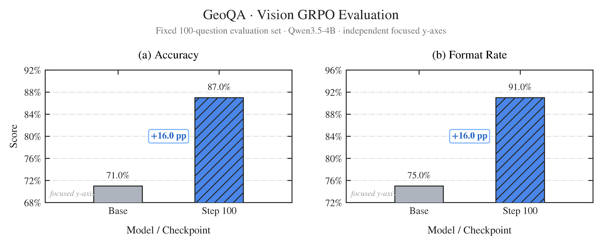
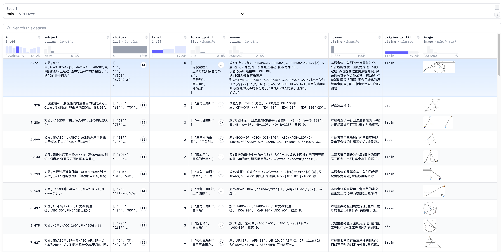
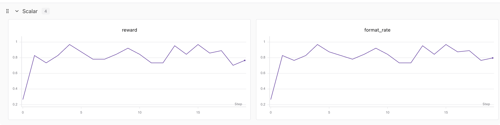
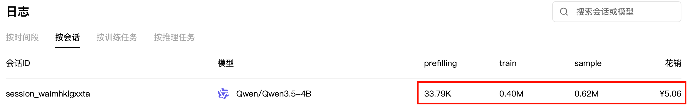

# Vision GRPO：让 Qwen3.5-4B 学会看图做几何题

<div align="center">
  
</div>

<div align="center">
  <a href="https://github.com/KMnO4-zx/agentic-rl-lab/tree/main/09-vision-grpo"></a>
  <a href="https://huggingface.co/datasets/hz2475/geoQA"></a>
  <a href="https://docs.pytrio.com/docs"></a>
  <a href="https://www.xiaohongshu.com/user/profile/63c2055e000000002502c58c" target="_blank"></a>
  <a href="https://github.com/KMnO4-zx/agentic-rl-lab"></a>
</div>

> **代码与复现资源**
>
> - 完整代码：[`09-vision-grpo`](https://github.com/KMnO4-zx/agentic-rl-lab/tree/main/09-vision-grpo)
> - 快速启动：[`start.md`](./start.md)
> - 数据集：[`hz2475/geoQA`](https://huggingface.co/datasets/hz2475/geoQA)
> - GRPO 来源：[DeepSeekMath](https://arxiv.org/abs/2402.03300)
> - PyTRIO 文档：[docs.pytrio.com](https://docs.pytrio.com/docs)

这是“接下来我将复现 10 篇强化学习算法”系列的第九篇。

前八篇里的 prompt 都以文本为主。这次我想把整条 RL 链路推进到多模态：模型先看一张几何图，再读取题目和四个选项，同一道题并发生成一组回答，最后靠可验证的选项奖励完成在线更新。

这套实验最初在单独的实验目录里完成，现在整理成了 `agentic-rl-lab` 的独立章节。数据下载、训练、单模型评测和结果绘图都拆成了单独脚本，读代码时可以沿着一条很清楚的链路往下走。

先看最终结果。在固定的 100 条 GeoQA test 样本上，Qwen3.5-4B 经过 100 steps 的 Vision GRPO 后：

| 模型 | Accuracy | Format rate |
| --- | ---: | ---: |
| Base | 71.0% | 75.0% |
| GRPO step 100 | 87.0% | 91.0% |
| 提升 | **+16.0 pp** | **+16.0 pp** |



这里的结果边界很明确：测试集是脚本从原始 GeoQA test 中固定抽取的 100 条，不能直接当作完整 759 条 test 的 benchmark 结果。仓库保留了评测方法和汇总图，没有提交逐样本 JSON 与远端 checkpoint。

## 0. 这次到底训练了什么？

GeoQA 是一个中文几何问答数据集。每条样本都包含几何图片、题目、四个候选项、正确选项标签，以及数据集自带的解析等字段。



源数据共有 5,010 条：

| 原始 split | 数量 | 本章用途 |
| --- | ---: | --- |
| train | 3,503 | 全部用于训练 |
| test | 759 | 固定抽取 100 条用于评测 |
| dev | 748 | 本次实验不使用 |

`download-dataset.py` 会保留完整 train，并对原始 test 使用 `seed=42` 打乱，取最后 100 条写入 `datasets/test.parquet`。训练和评测读取两个独立文件：

```text
09-vision-grpo/datasets/
├── train.parquet
└── test.parquet
```

模型看到的输入只有图片、题目和选项。训练 reward 使用 `label` 生成正确选项，`answer` 中的原始解析不会作为监督文本送给模型。

本章使用的核心配置如下：

| 项目 | 配置 |
| --- | --- |
| Base 模型 | `Qwen/Qwen3.5-4B` |
| 训练方式 | LoRA，rank 32 |
| 优化方法 | group-relative advantage + `importance_sampling` |
| 正式训练 | 100 steps |
| 每 step 题目数 | 8 |
| 每题 rollout 数 | 8 |
| 最大生成长度 | 1,024 tokens |
| 学习率 | `4e-5` |
| 图文模板 | `enable_thinking=False` |

## 1. 一张图片怎样进入 PyTRIO？

这部分是 Vision GRPO 和纯文本 GRPO 差异最大的地方。

训练脚本先使用模型自己的 chat template 格式化消息。消息里同时放入文本与图片占位符：

```python
messages = [
    {
        "role": "user",
        "content": [
            {"type": "text", "text": format_question(subject, choices)},
            {"type": "image", "image": "geoqa"},
        ],
    }
]
```

模板渲染时显式传入 `enable_thinking=False`。这会关闭模型模板自带的 thinking 模式，prompt 仍然要求模型先做简短推理，再把最终选项写成 `\boxed{A}` 到 `\boxed{D}`。

渲染后的 prompt 会沿 `<|image_pad|>` 拆成三个 chunk：

```text
EncodedTextChunk
        +
ImageChunk
        +
EncodedTextChunk
```

GeoQA 图片在送入服务前还会经过两步处理：

1. 把 RGBA 图片合成到白色背景并转成 RGB，避免透明区域变黑；
2. 使用模型的 image processor 计算视觉 patch 数，再写入 `ImageChunk.expected_tokens`。

最终得到的 `ModelInput` 同时包含真实图片字节与本地可计算的序列长度。采样完成后，代码会检查：

```python
response.input_tokens == len(prompt)
```

一旦本地视觉 token 估计与远端结果不一致，训练会立即报错。这个检查很重要，因为后面的 `target_tokens`、old logprobs 和 advantages 都依赖同一个位置坐标系。

## 2. Vision GRPO 的训练闭环

整条数据流可以压缩成下面这条线：

```text
GeoQA 图文题目
    ↓
当前 LoRA 权重生成 sampler
    ↓
同题并发采样 8 条 completion
    ↓
解析最后一个 \boxed{A-D}
    ↓
规则 reward：正确为 1，其余为 0
    ↓
组内计算 relative advantage
    ↓
构造多模态 Datum 并更新 LoRA
```

### 2.1 同一道题采样一组回答

设一组共有 `G` 条 completion。第 `i` 条回答的 reward 为：

$$
r_i =
\begin{cases}
1, & \text{最后一个 boxed 选项与标签一致} \\
0, & \text{其他情况}
\end{cases}
$$

这里会解析回答中的最后一个 `\boxed{}`。这样可以容忍推理正文里出现临时候选项，同时要求模型在结尾给出明确答案。没有可解析 boxed 选项的回答也会得到 0 分。

### 2.2 只在同题内部比较

每条回答的 advantage 为：

$$
A_i = r_i - \frac{1}{G}\sum_{j=1}^{G}r_j
$$

假设同一道题的 8 条回答里有 6 条正确、2 条错误：

- 正确回答的 advantage 为 `1 - 0.75 = 0.25`；
- 错误回答的 advantage 为 `0 - 0.75 = -0.75`。

模型会提高正确轨迹的相对概率，并压低错误轨迹的相对概率。

如果一组回答全部正确或全部错误，所有 advantage 都等于 0。代码会把这种题记为 degenerate group，并跳过该组，避免把没有相对训练信号的 completion 送入 backward。

### 2.3 图文 prompt 只提供上下文

`importance_sampling` 所需字段必须与 `model_input` 严格对齐：

| 字段 | prompt / image 区间 | completion 区间 |
| --- | --- | --- |
| `model_input` | 完整图文 chunks | `completion[:-1]` |
| `target_tokens` | `0` 占位 | 完整 completion tokens |
| `logprobs` | `0.0` 占位 | rollout 时返回的 old logprobs |
| `advantages` | `0.0` 占位 | 当前 completion 的组相对 advantage |

prompt 文本和图片负责提供上下文，策略梯度只作用于模型生成的 completion token。old logprobs 必须来自当前 step 采样时的 sampler，模型更新后重新计算的 logprob 不能替代它。

对应的核心代码很短：

```python
model_input = trio.ModelInput(
    chunks=[
        *group.prompt_chunks,
        trio.types.EncodedTextChunk(tokens=sample.tokens[:-1]),
    ]
)

datum = trio.Datum(
    model_input=model_input,
    loss_fn_inputs={
        "target_tokens": np.asarray(
            [0] * observation_length + sample.tokens,
            dtype=np.int64,
        ),
        "logprobs": np.asarray(
            [0.0] * observation_length + sample.logprobs,
            dtype=np.float32,
        ),
        "advantages": np.asarray(
            [0.0] * observation_length
            + [sample.advantage] * len(sample.tokens),
            dtype=np.float32,
        ),
    },
)
```

## 3. 如何启动训练？

所有命令都从仓库根目录运行。项目要求 Python 3.13 及以上，并锁定 `pytrio==0.2.7`。

### 3.1 安装与登录

```bash
uv sync
trio login
swanlab login
```

### 3.2 下载 GeoQA

```bash
uv run python 09-vision-grpo/download-dataset.py
```

默认输出 `3,503` 条训练数据和固定 `100` 条测试数据。严格复现实验时，可以通过 `--revision` 指定同一个 Hugging Face 数据集 revision，避免未来 `main` 更新带来漂移。

### 3.3 先跑 1 step

这个命令会调用远端采样与训练服务并产生费用。建议先用一个很小的 batch 检查图像、token 对齐、reward 和异步 API：

```bash
uv run python 09-vision-grpo/train.py \
  --steps 1 \
  --batch-size 1 \
  --group-size 4 \
  --max-tokens 256 \
  --save-every 0 \
  --no-save-weights \
  --show-samples \
  --swanlab-mode disabled
```

单题的 4 条回答可能刚好全部同分，此时脚本会正常完成 rollout，但该 step 没有 backward。需要验证完整更新链路时，可以适当增加 `batch-size` 或 `group-size`。

### 3.4 复现 100-step 配置

```bash
uv run python 09-vision-grpo/train.py \
  --base-model Qwen/Qwen3.5-4B \
  --lora-rank 32 \
  --steps 100 \
  --batch-size 8 \
  --group-size 8 \
  --max-tokens 1024 \
  --temperature 1.0 \
  --top-p 1.0 \
  --learning-rate 4e-5 \
  --save-every 25 \
  --swanlab-mode online
```

每次保存会打印两种路径：

```text
Sampler 权重：trio://.../sampler_weights/...-sampler
State 权重：trio://.../training_state/...-state
```

`sampler_weights` 用于推理和评测，`training_state` 用于恢复训练。

更紧凑的命令清单见 [快速启动文档](./start.md)。

## 4. 训练时应该看哪些指标？

下面是一次 20-step 小规模试跑的 SwanLab 曲线。



脚本默认记录：

| 指标 | 含义 |
| --- | --- |
| `reward` | 当前 batch 内每道题的平均规则奖励 |
| `format_rate` | 能解析出 `\boxed{A-D}` 的 completion 比例 |
| `degenerate_fraction` | 同题所有 reward 相同、没有相对信号的题目比例 |
| `train_datums` | 实际进入训练的 completion 数 |
| `rollout/completion_tokens_mean` | 当前 batch 的平均生成长度 |
| `trainer/*` | PyTRIO 服务端返回的训练指标 |

同一次 20-step 会话记录了 33.79K prefill tokens、0.40M train tokens 和 0.62M sample tokens，当时页面显示花销为 ¥5.06。



这张截图只对应当次会话。100-step 正式实验的成本不能用 ¥5.06 直接倍乘得到；模型输出长度、退化组比例、batch 配置和服务价格都会影响最终消耗。

在线 batch 的 reward 曲线也会受到题目难度影响。最终结论仍然要来自固定测试集。

## 5. 如何评测 Base 与 checkpoint？

`eval.py` 一次只创建一个 sampler。不传 `--model-path` 时评测 Base，传入 sampler weights 路径时评测该 checkpoint。

评测 Base：

```bash
uv run python 09-vision-grpo/eval.py \
  --output 09-vision-grpo/eval-results-base.json
```

评测训练后的 checkpoint：

```bash
uv run python 09-vision-grpo/eval.py \
  --model-path 'trio://RUN_ID/sampler_weights/WEIGHTS_NAME' \
  --output 09-vision-grpo/eval-results-step-100.json
```

两次评测都使用同一份 `datasets/test.parquet`，默认配置为：

| 项目 | 配置 |
| --- | --- |
| 测试数量 | 100 |
| seed | 42 |
| temperature | 0.0 |
| max tokens | 1,024 |
| 并发方式 | 同一个 sampler 上并发 `sample_async()` |

评测结果如下：

| 模型 | Accuracy | Format rate | 采样速度 | 总耗时 |
| --- | ---: | ---: | ---: | ---: |
| Base | 71.0% | 75.0% | 2.20 sample/s | 48.65s |
| GRPO step 100 | 87.0% | 91.0% | 2.35 sample/s | 49.45s |

表中的速度与耗时依赖当时的服务环境，只用于记录这次实验。Accuracy 和 Format rate 的变化更值得关注。

### 结果里最有意思的一点

Base 的 75 条格式正确回答里有 71 条答对，条件准确率为 `71 / 75 = 94.7%`。step 100 的 91 条格式正确回答里有 87 条答对，条件准确率为 `87 / 91 = 95.6%`。

这次 +16 个百分点的总体准确率提升，主要来自模型更稳定地完成最终 boxed 答案。已经成功输出 boxed 选项的样本，正确率只提高了 0.9 个百分点。

训练后仍有 9 条回答无法解析。这 9 条都生成到了 1,024-token 上限，并在推理过程中被截断。其余 91 条格式正确回答的平均输出长度为 278.8 tokens。继续训练时需要同时观察 reward、format rate 和 completion length，避免模型把越来越长的推理当成完成任务的捷径。

重新生成本文的对比图：

```bash
uv run python 09-vision-grpo/analysis.py
```

`analysis.py` 使用本文记录的 Base 与 step-100 汇总值绘图，不会读取新生成的评测 JSON。完成新实验后，请先更新脚本中的 `BASE_RESULTS` 与 `GRPO_RESULTS`。

## 6. 关键实现边界

- `enable_thinking=False` 关闭 chat template 自带的 thinking 模式，prompt 仍然要求简短逻辑推理。
- reward 只检查最终选项是否与 `label` 一致，不评价中间推理是否正确。
- 无法解析 boxed 选项的回答得到 0 分，因此结果同时包含答题能力和格式遵循能力。
- 图片的 `expected_tokens` 必须与远端视觉 token 计数一致。
- prompt 和图片位置的 target、old logprob 与 advantage 都填 0。
- 同组 reward 全相同时，本组没有相对优势信号，代码会跳过更新。
- `sample_async()` 一次 `await` 直接返回采样结果；`forward_backward_async()` 和 `optim_step_async()` 返回的远端 future 还要继续 `await`。
- 本章报告的是一个固定 100 题子集上的单次 Base-versus-checkpoint 对比，尚未覆盖完整 test、多个 seed 或其他视觉模型。
- 数据文件、SwanLab 本地日志、评测 JSON 和 Python 缓存都属于运行产物，不进入 Git。

## 7. 文件结构

```text
09-vision-grpo/
├── download-dataset.py   # 下载 GeoQA，生成 train/test parquet
├── train.py              # 多模态 group rollout 与 GRPO 更新
├── eval.py               # 异步评测一个 Base 或 checkpoint
├── analysis.py           # 生成本文的固定结果对比图
├── start.md              # 从零开始的命令清单
├── readme.md             # 原理、实验结果与边界
└── images/               # 数据、训练、消费与评测图片
```

如果你只想快速跑通一次，直接从 [`start.md`](./start.md) 开始；如果要改数据集或视觉模型，建议先看 `train.py` 里的 `encode_image()`、`build_prompt_chunks()` 和 `build_grpo_datum()`。
